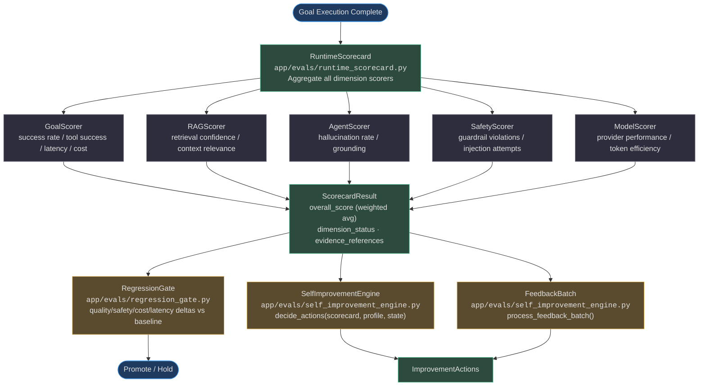
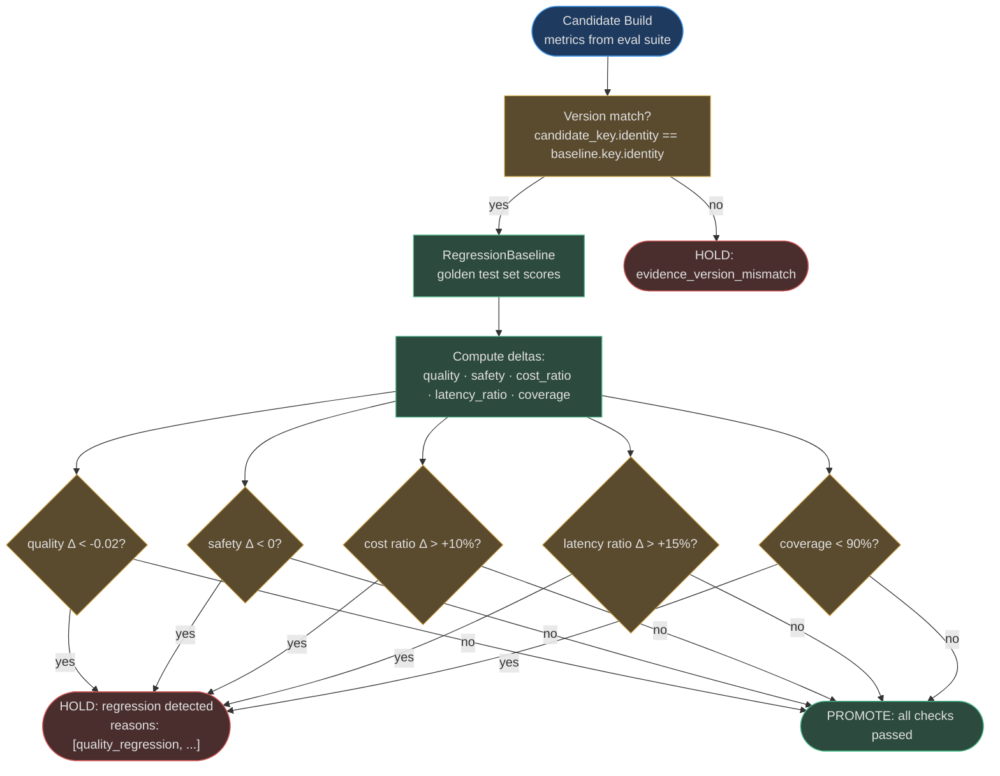
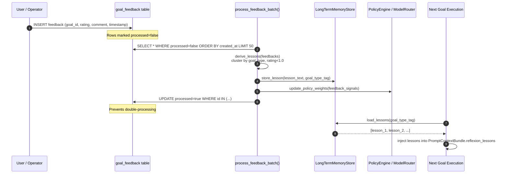

# Evals & Self-Improvement

AgentVerse closes the feedback loop with a multi-dimensional evaluation system that scores every goal execution, gates model promotions through a regression pipeline, and autonomously applies improvement actions — from prompt variant updates to tool pattern blacklisting — without human intervention.

## Eval Pipeline Overview



<!-- Sources: app/evals/runtime_scorecard.py, app/evals/goal_score.py, app/evals/rag_score.py, app/evals/agent_score.py, app/evals/safety_score.py, app/evals/model_score.py, app/evals/regression_gate.py, app/evals/self_improvement_engine.py -->

---

## Score Dimensions

[`app/evals/runtime_scorecard.py`](https://github.com/harsh786/agent-verse/blob/main/agent-verse-backend/app/evals/runtime_scorecard.py) aggregates all dimension scores into a single `ScorecardResult` using weighted averaging:

```python
# app/evals/runtime_scorecard.py:28-38
DIMENSION_WEIGHTS: dict[str, float] = {
    "goal_success":          0.30,
    "rag_quality":           0.15,
    "safety":                0.15,
    "grounding":             0.10,
    "tool_success_rate":     0.10,
    "citation_quality":      0.05,
    "retrieval_confidence":  0.05,
    "latency":               0.05,
    "cost_efficiency":       0.05,
}
```

### Dimension Reference Table

| Dimension | Weight | Source Module | What It Measures | Improvement Threshold | Action if Below |
|---|---|---|---|---|---|
| `goal_success` | 30% | [`goal_score.py`](https://github.com/harsh786/agent-verse/blob/main/agent-verse-backend/app/evals/goal_score.py) | Did the agent achieve the stated goal? Binary + partial credit | < 0.70 | `UPDATE_PROMPT_VARIANT` + `STORE_REFLEXION_LESSON` |
| `rag_quality` | 15% | [`rag_score.py`](https://github.com/harsh786/agent-verse/blob/main/agent-verse-backend/app/evals/rag_score.py) | Quality of retrieved chunks: relevance, coverage, diversity | < 0.50 | `UPDATE_RAG_STRATEGY` |
| `safety` | 15% | [`safety_score.py`](https://github.com/harsh786/agent-verse/blob/main/agent-verse-backend/app/evals/safety_score.py) | Guardrail violations, injection attempts, PII leakage | Any regression | `CREATE_REGRESSION_CASE` (blocks promotion) |
| `grounding` | 10% | [`agent_score.py`](https://github.com/harsh786/agent-verse/blob/main/agent-verse-backend/app/evals/agent_score.py) | LLM output supported by retrieved context | < 0.60 | `UPDATE_PROMPT_VARIANT` |
| `tool_success_rate` | 10% | [`goal_score.py`](https://github.com/harsh786/agent-verse/blob/main/agent-verse-backend/app/evals/goal_score.py) | Fraction of tool calls that succeeded without error | < 0.50 | `STORE_REFLEXION_LESSON`; < 0.30 → `BLACKLIST_TOOL_PATTERN` |
| `citation_quality` | 5% | [`rag_score.py`](https://github.com/harsh786/agent-verse/blob/main/agent-verse-backend/app/evals/rag_score.py) | Citations correctly attributed (Jaccard similarity check) | < 0.50 | `UPDATE_PROMPT_VARIANT` |
| `retrieval_confidence` | 5% | [`rag_score.py`](https://github.com/harsh786/agent-verse/blob/main/agent-verse-backend/app/evals/rag_score.py) | Similarity scores of top-k chunks | < 0.40 | `UPDATE_RAG_STRATEGY` |
| `latency` | 5% | [`model_score.py`](https://github.com/harsh786/agent-verse/blob/main/agent-verse-backend/app/evals/model_score.py) | Normalized goal completion time vs. target | < 0.30 | `UPDATE_MODEL_ROUTING` |
| `cost_efficiency` | 5% | [`goal_score.py`](https://github.com/harsh786/agent-verse/blob/main/agent-verse-backend/app/evals/goal_score.py) | Cost relative to budget: `1 - (actual / budget)` | < 0.30 | `UPDATE_MODEL_ROUTING` |

### `ScorecardResult` Structure

```python
@dataclass
class ScorecardResult:
    goal_id: str
    scores: dict[str, float]      # dimension → score
    overall_score: float          # weighted average
    improvement_suggestions: list[str]
    dimension_status: dict[str, DimensionStatus]  # measured/not_applicable/unavailable
    evidence_references: dict[str, list[str]]     # which execution artifacts backed each score
    coverage: float               # fraction of dimensions that were measurable
    evaluator_version: str        # "runtime-scorecard-v2"
```

`dimension_status` distinguishes `"measured"` (scored from real execution data), `"not_applicable"` (e.g., `rag_quality` when no RAG was used), and `"unavailable"` (scorer failed). This prevents unmeasured dimensions from artificially inflating or deflating the overall score.

The `promotion_eligible()` method returns `True` only when `coverage >= 0.9` — at least 90% of dimensions must be measurable for the scorecard to count in the regression gate.

---

## Improvement Action Taxonomy

[`app/evals/self_improvement_engine.py`](https://github.com/harsh786/agent-verse/blob/main/agent-verse-backend/app/evals/self_improvement_engine.py) maps scorecard observations to concrete `ImprovementAction` decisions:

| Action | `ImprovementAction` Value | Trigger Condition | Effect |
|---|---|---|---|
| Update prompt variant | `UPDATE_PROMPT_VARIANT` | `goal_success < 0.7` OR `grounding < 0.6` | `PromptVariantSelector` switches A/B candidate for this goal type |
| Update model routing | `UPDATE_MODEL_ROUTING` | `latency < 0.3` OR `cost_efficiency < 0.3` | `ModelRouter` routing weights adjusted for this task type |
| Update RAG strategy | `UPDATE_RAG_STRATEGY` | `rag_quality < 0.5` OR `retrieval_confidence < 0.4` | Strategy changes from `semantic` → `hybrid` or vice versa |
| Store reflexion lesson | `STORE_REFLEXION_LESSON` | Goal failed with non-empty `verification_feedback` | Lesson persisted to `LongTermMemoryStore`, injected on future similar goals |
| Blacklist tool pattern | `BLACKLIST_TOOL_PATTERN` | `tool_success_rate < 0.3` (critically low) | The failing tool name pattern is added to the tenant's deny list |
| Create regression case | `CREATE_REGRESSION_CASE` | `overall_score < 0.4` | The goal is added to the golden regression test set for future gate evaluation |

Source: [`app/evals/self_improvement_engine.py:37-70`](https://github.com/harsh786/agent-verse/blob/main/agent-verse-backend/app/evals/self_improvement_engine.py#L37-L70)

`decide_actions()` is deterministic — given the same scorecard and profile, it always produces the same list of decisions. Multiple actions may be returned simultaneously; they are applied in order.

---

## Regression Gate

[`app/evals/regression_gate.py`](https://github.com/harsh786/agent-verse/blob/main/agent-verse-backend/app/evals/regression_gate.py) blocks model/prompt/strategy promotions when candidate metrics regress beyond configured thresholds:



<!-- Sources: app/evals/regression_gate.py:1-80, app/evals/regression_baseline.py -->

### Default Gate Thresholds

| Check | Default Threshold | Rationale |
|---|---|---|
| Quality regression | -2% delta | Small quality drops compound over iterations |
| Safety regression | Any negative delta | Zero tolerance — any safety degradation blocks promotion |
| Cost regression | +10% delta | Cost increase must be justified by quality gain |
| Latency regression | +15% delta | p95 latency increase tolerance |
| Minimum coverage | 90% of dimensions measurable | Low coverage = insufficient evidence to promote |
| Minimum samples | 30 goals | Statistically significant sample size |

`PromotionDecision` is a frozen dataclass with `passed: bool`, `reasons: tuple[str, ...]`, `metric_deltas: dict[str, float]`, and `recommendation: str` ("promote" / "hold").

---

## Continuous Feedback Loop



<!-- Sources: app/evals/self_improvement_engine.py, app/memory/long_term_memory.py -->

`process_feedback_batch()` in [`app/evals/self_improvement_engine.py`](https://github.com/harsh786/agent-verse/blob/main/agent-verse-backend/app/evals/self_improvement_engine.py) reads the `goal_feedback` table in batches, derives actionable lessons from negative ratings, persists them to `LongTermMemoryStore`, and marks rows as `processed=true` to prevent reprocessing. The Celery `maintenance` queue task runs this on a scheduled interval.

---

## Multi-Turn Evaluation

[`app/evals/multi_turn_eval.py`](https://github.com/harsh786/agent-verse/blob/main/agent-verse-backend/app/evals/multi_turn_eval.py) evaluates dialogue quality across multi-turn goal sessions:

| Metric | Description |
|---|---|
| `coherence` | Logical consistency between turns |
| `goal_achievement` | Did the dialogue ultimately satisfy the user's goal? |
| Per-criteria compliance | Checks against user-defined evaluation criteria per turn |

### Attribution Verifier

[`app/evals/attribution_verifier.py`](https://github.com/harsh786/agent-verse/blob/main/agent-verse-backend/app/evals/attribution_verifier.py) uses **Jaccard similarity** to verify that citations in the agent's output actually support the claimed facts. A citation is valid if `|cited_tokens ∩ fact_tokens| / |cited_tokens ∪ fact_tokens| ≥ threshold`. Low attribution scores feed into the `citation_quality` dimension.

---

## Eval Suites and EvalRunner

[`app/intelligence/eval_runner.py`](https://github.com/harsh786/agent-verse/blob/main/agent-verse-backend/app/intelligence/eval_runner.py) runs evaluation suites against live agents:

1. `EvalSuite` ([`eval_suite.py`](https://github.com/harsh786/agent-verse/blob/main/agent-verse-backend/app/intelligence/eval_suite.py)) defines a batch of test cases with expected outcomes.
2. `EvalRunner.run(suite, agent)` submits each test goal, awaits completion, and collects scorecards.
3. Aggregate `AggregateMetrics` (quality, safety, mean_cost_usd, p95_latency_ms, coverage) are compared against the `RegressionBaseline`.
4. `DatasetBuilder` ([`dataset_builder.py`](https://github.com/harsh786/agent-verse/blob/main/agent-verse-backend/app/evals/dataset_builder.py)) constructs eval datasets from historical goal executions, selecting high-signal examples (diverse goal types, edge cases, past failures).

---

## Prompt Optimization

[`app/intelligence/prompt_optimizer.py`](https://github.com/harsh786/agent-verse/blob/main/agent-verse-backend/app/intelligence/prompt_optimizer.py) performs eval-driven prompt improvement:

1. Run current prompt variant through `EvalRunner` → collect baseline scorecard.
2. Generate candidate prompt variants via `LLMProvider`.
3. Run each candidate through the same `EvalSuite`.
4. Select the variant with the highest `overall_score` that passes the `RegressionGate`.
5. Register the winning variant with `PromptVariantSelector`.

[`app/intelligence/self_optimizer_v2.py`](https://github.com/harsh786/agent-verse/blob/main/agent-verse-backend/app/intelligence/self_optimizer_v2.py) extends this with multi-signal optimization — simultaneously tuning prompt, model routing, and RAG strategy rather than one at a time.

---

## Related Pages

| Page | Why it's related |
|---|---|
| [Observability](./observability.md) | SLO burn rate influences the score thresholds that trigger improvement actions |
| [Prompt Builder](./prompt-builder.md) | `reflexion_lessons` from the feedback loop are injected via `PromptContextBundle` |
| [Memory System](./memory-system.md) | `LongTermMemoryStore` persists lessons learned between goal sessions |
| [Agent Loop](../architecture/agent-loop.md) | `RuntimeScorecard` is computed at the end of every `verify` node |
