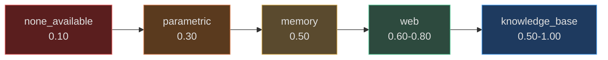
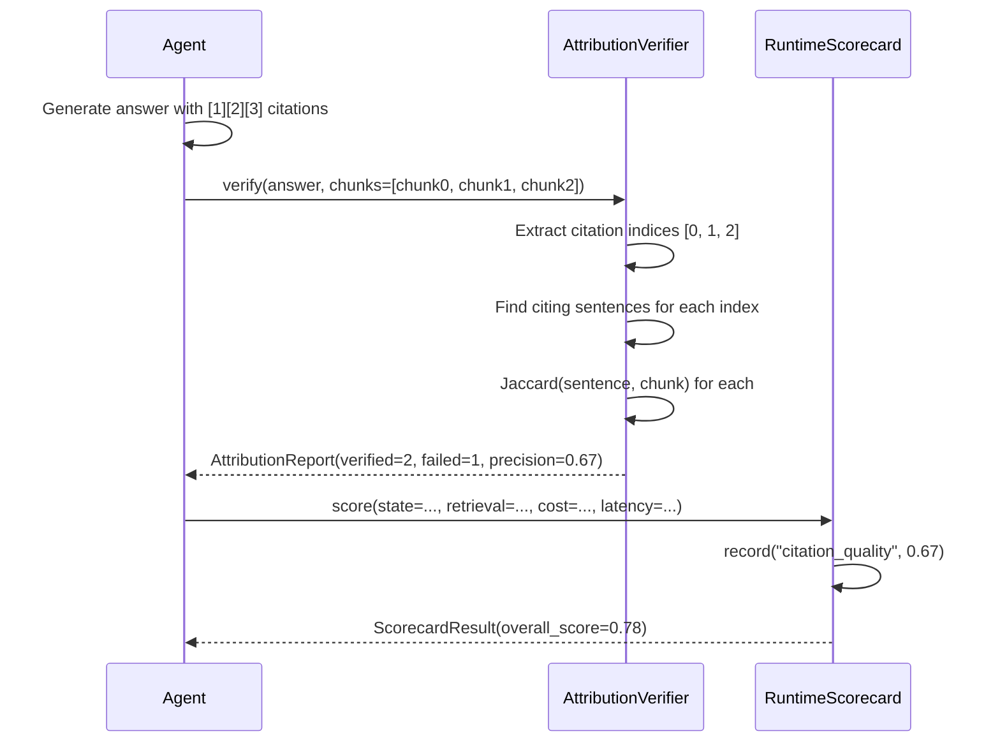
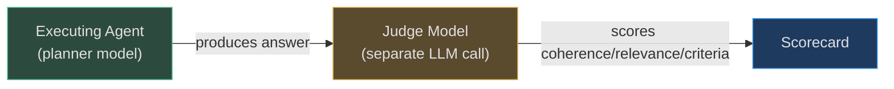

# Goal and Retrieval Evals

Two of the five highest-weight evaluation dimensions — **goal success (30%)** and **RAG quality (15%)** — measure the fundamental capability of the agent: did it complete the task, and did it retrieve the right information to do so? This page covers the scorers that measure these dimensions, plus the attribution verifier (citation quality, 5%) and multi-turn evaluator.

---

## GoalScorer: Completion and Efficiency

`app/evals/goal_score.py` scores task completion based on the final `AgentState.status` and the number of iterations used.

```python
class GoalScorer:
    def score(self, state: AgentState) -> float:
        if state.status == GoalStatus.COMPLETE:
            base = 1.0
            excess = max(0, state.iterations - 5)     # first 5 iterations are free
            efficiency_penalty = min(0.3, excess * 0.01)  # max 30% penalty
            return max(0.0, base - efficiency_penalty)
        elif state.status == GoalStatus.FAILED:
            return 0.0
        elif state.status == GoalStatus.WAITING_HUMAN:
            return 0.5   # HITL intervention reduces score
        return 0.3       # any other state: partial credit
```

**Score interpretation:**

| Score range | Meaning | Typical cause |
|---|---|---|
| 0.95–1.00 | Complete, efficient (≤5 iterations) | Normal successful goal |
| 0.70–0.94 | Complete but verbose (6–35 iterations) | Over-planning, tool discovery loops |
| 0.50 | Waiting for human | HITL approval required |
| 0.30 | Partial / unknown | Max iterations reached, incomplete |
| 0.00 | Failed | Verifier rejected, unrecoverable error |

The **efficiency penalty** matters because an agent that requires 30 iterations to complete a task that should take 3 is burning compute and user time. The optimizer uses this penalty signal to identify "over-thinking" agents that would benefit from a more concise planner prompt.

---

## RAGScorer: Retrieval Source Quality

`app/evals/rag_score.py` assigns a quality score based on the retrieval source type and the retrieval system's own confidence estimate.

```python
class RAGScorer:
    def score(self, retrieval: RetrievalResult | Mapping | None) -> float | None:
        if source == "none_available":    return 0.1
        if source == "parametric":        return 0.3          # model memory only
        if source == "web":               return 0.6 + (confidence * 0.2)  # 0.60–0.80
        if source == "knowledge_base":    return min(1.0, 0.5 + confidence * 0.5)  # 0.50–1.00
        if source == "memory":            return 0.5          # episodic recall
        return max(0.0, min(1.0, confidence))
```

**Source quality hierarchy:**



**Knowledge base** is the best source because it combines structural indexing with semantic search. The confidence value from `RetrievalResult.confidence` directly maps to the score — a knowledge_base retrieval with confidence 0.9 scores `min(1.0, 0.5 + 0.45) = 0.95`.

**Web** is second-best but capped at 0.80 even at maximum confidence, because web sources may be outdated or unverified.

**Parametric** (model memory alone, no retrieval) scores only 0.30 — the model may hallucinate or use stale training data. This low score drives the improvement engine to trigger `UPDATE_RAG_STRATEGY` when retrieval is consistently falling back to parametric.

---

## AttributionVerifier: Citation Grounding

`app/evals/attribution_verifier.py` prevents a specific class of LLM hallucination: **phantom citations** — where the model includes citation markers like `[1]` that don't actually support the claim being made.

```python
class AttributionVerifier:
    def __init__(self, jaccard_threshold: float = 0.15) -> None:
        self._threshold = jaccard_threshold

    def verify(
        self,
        answer: str,
        chunks: list[str],
        citation_indices: list[int] | None = None,
    ) -> AttributionReport:
        # 1. Extract [1], [2] style citations from answer text
        # 2. For each citation index, find citing sentences
        # 3. Compute Jaccard similarity between sentence and cited chunk
        # 4. If max_jaccard < 0.15 → unsupported claim
```

**How Jaccard similarity works here:** The verifier tokenizes both the citing sentence and the cited chunk into word sets, then computes `|intersection| / |union|`. A threshold of 0.15 means at least 15% of words must overlap — a deliberately low threshold that catches completely irrelevant citations while allowing paraphrasing.

**Output — `AttributionReport`:**

| Field | Meaning |
|---|---|
| `verified_count` | Citations where Jaccard ≥ 0.15 |
| `failed_count` | Citations where Jaccard < 0.15 |
| `unsupported_claims` | Human-readable list of failures |
| `precision_score` | `verified / total` — maps to `citation_quality` dimension |

---

## Flow: Goal Output → Attribution Check → Score



---

## MultiTurnEvaluator: Conversation-Level Quality

`app/evals/multi_turn_eval.py` evaluates agents on multi-turn scenarios where context must be maintained across user messages.

```python
@dataclass
class MultiTurnCase:
    name: str
    turns: list[Turn]           # full expected conversation
    expected_final: str         # what the last assistant turn should achieve
    eval_criteria: list[str]    # e.g. ["mentions Python", "asks clarifying question"]

@dataclass
class MultiTurnResult:
    coherence_score: float      # average coherence across all assistant turns
    goal_achieved: bool         # did the conversation reach expected_final?
    criteria_met: list[str]     # criteria satisfied
    criteria_failed: list[str]  # criteria not satisfied
    overall_score: float        # composite
```

The evaluator drives the conversation by calling `agent_fn(history)` for each user turn, then uses its LLM provider to score each assistant response for:
- **Coherence** — is this response consistent with the conversation so far?
- **Relevance** — does it address the current user turn?

**Criteria checking** is string-based: each criterion is checked against the final assistant response as a substring search. This is intentionally simple — for production use, replace with semantic matching.

---

## EvalDatasetBuilder: Mining Failures for Golden Tests

`app/evals/dataset_builder.py` automatically converts poor-performing goals into regression test cases.

```python
_CANDIDATE_THRESHOLD = 0.6  # goals scoring below this become regression candidates

class EvalDatasetBuilder:
    def maybe_create(self, *, state: AgentState, score: float) -> dict | None:
        if score >= _CANDIDATE_THRESHOLD:
            return None   # good goal — discard
        return {
            "goal_text": state.goal[:500],
            "final_status": state.status.value,
            "score": score,
            "expected_behavior": self._infer_expected(state),
            "regression_candidate": True,
        }
```

Every goal that scores below 0.60 becomes a **regression candidate** — a labeled test case that the next deployment must pass (or at least not regress further) to be promoted.

Over time, this builds a golden test suite from real production failures, ensuring the improvement system always optimizes toward the cases that matter most.

---

## Judge Model Architecture

AgentVerse uses a **separate judge model** for qualitative evaluations (attribution, criteria checking, coherence scoring):



The judge model is typically a **different model than the executing agent** to avoid self-serving bias (an agent grading its own outputs). In AgentVerse, `MultiTurnEvaluator` accepts its own `LLMProvider` instance, which may be configured to a different model than the one running the agent.

---

## Real-World Example: Legal Contract Agent

**Scenario:** A legal contract agent citing statute sections to support contract validity claims.

**What the evaluator catches:**
- Agent claims: "This non-compete clause is enforceable under California law [3]"
- Chunk 3 contains: "California Business and Professions Code Section 16600 generally prohibits non-compete clauses"
- Jaccard similarity: `{"non-compete", "california", "section"} ∩ {"non-compete", "california", "prohibits", "section"}` = 3/6 = 0.50 ✓
- **But:** The agent's claim says "enforceable" and the chunk says "prohibits" — Jaccard catches the key term match but misses the semantic inversion

This is why the `AttributionVerifier` is positioned as a **fast heuristic** (Jaccard), with the recommendation to add an LLM second-pass for low-confidence cases (< 0.30 Jaccard) in production legal deployments.

**Multi-turn evaluation for a support agent:**

| Turn | User | Agent | Coherence | Relevance |
|---|---|---|---|---|
| 1 | "My order hasn't arrived" | "I'll look up your order. What's your order number?" | 1.0 | 1.0 |
| 2 | "It's #12345" | "Order #12345 is in transit, arriving tomorrow" | 1.0 | 1.0 |
| 3 | "But I needed it today" | "Let me check expedited options" | 0.9 | 0.95 |

`coherence_score = (1.0 + 1.0 + 0.9) / 3 = 0.97`. The agent remembered the order number without the user repeating it — that's what coherence measures.

---

## Real-World Example 2: E-commerce Search Agent — Retrieval Quality Degradation

**Situation:** An e-commerce platform uses AgentVerse to power product search. After migrating 2M product embeddings from `text-embedding-ada-002` to `text-embedding-3-small`, the `RAGScorer` started flagging degraded retrieval on accessory queries.

**Eval signals observed:**
```python
# RAGScorer outputs on 500 production goals after migration
avg_retrieval_confidence_before = 0.81
avg_retrieval_confidence_after  = 0.68   # -16%
avg_rag_quality_before          = 0.79
avg_rag_quality_after           = 0.61   # -23%
```

**Root cause:** `text-embedding-3-small` clusters fashion accessories differently — "women's belt" and "men's belt" landed in separate clusters, breaking queries like "leather belt" that previously matched both.

**Resolution via `EvalDatasetBuilder`:**
- 140 failing goals auto-captured as regression cases.
- Re-embedding experiment run with `text-embedding-3-large`: `rag_quality` restored to 0.78.
- Migration approved for `text-embedding-3-large` only (not `small`).

**Outcome:** Re-embedding 2M vectors with `text-embedding-3-large` took 4 hours. Search relevance metric (DCG@10) restored to pre-migration levels within 6 hours.

---

## Real-World Example 3: Healthcare Documentation Agent — Multi-Turn Coherence

**Situation:** A healthcare SaaS uses AgentVerse for clinical note summarisation. The `MultiTurnEvaluator` revealed that patient names were being dropped between conversation turns in 12% of multi-step summaries.

**`MultiTurnEvaluator` findings:**
```python
MultiTurnScore(
    entity_retention=0.76,    # target: >0.90
    context_coherence=0.81,
    topic_consistency=0.92,
    reference_precision=0.78,
    overall=0.82
)
```

**Root cause:** The executor prompt didn't include patient name in the `step_context` string — it was relying on the model to remember it from the initial goal.

**Fix:** The `PromptBuilder.build_executor_context()` was updated to always inject the goal's primary entity (patient name, order ID, etc.) as a pinned first line of the step context.

**Outcome:** Entity retention rose to 0.93 after the fix. `SelfImprovementEngine` promoted the prompt change after 100-goal A/B test confirmed improvement.

<!-- Sources: app/evals/goal_score.py, app/evals/rag_score.py, app/evals/multi_turn_eval.py -->
