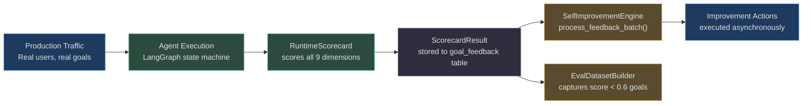
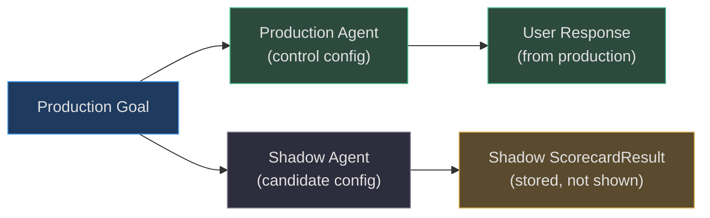
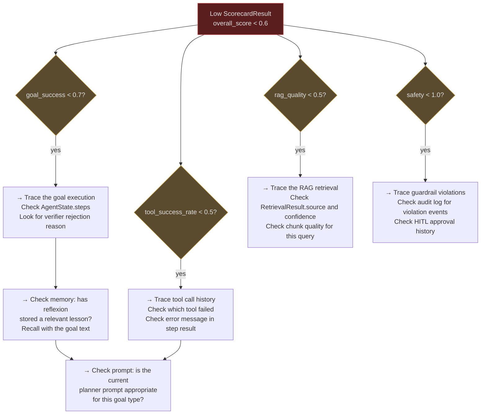

# Online vs Offline Eval and Continuous Improvement

Evaluation at AgentVerse runs in two distinct modes: **offline** (against a fixed labeled dataset, no production traffic) and **online** (sampling from live production traffic). Each serves different purposes in the improvement lifecycle. This page explains when to use each, how they connect to the `SelfImprovementEngine`, and how to trace a failing eval back to its root cause.

---

## Offline Evaluation

Offline evaluation runs the agent against a **fixed, labeled dataset** — a collection of goals with known-good expected outcomes. No production users are involved.

**When to run:**
- Before any deployment (CI/CD eval gate)
- When comparing two agent configurations (A/B variant promotion decision)
- After any change to the prompt, model, or RAG strategy
- As a nightly regression check

**Dataset source:** `EvalDatasetBuilder.maybe_create()` converts every production goal with score < 0.60 into a regression candidate:

```python
_CANDIDATE_THRESHOLD = 0.6

class EvalDatasetBuilder:
    def maybe_create(self, *, state: AgentState, score: float) -> dict | None:
        if score >= _CANDIDATE_THRESHOLD:
            return None  # good goal — not a regression candidate
        return {
            "goal_text": state.goal[:500],
            "final_status": state.status.value,
            "score": score,
            "expected_behavior": self._infer_expected(state),
            "regression_candidate": True,
        }
```

Over time, this builds a **golden test suite from real failures** — the most representative dataset possible, because it's drawn from actual user requests that the agent struggled with.

---

## Online Evaluation

Online evaluation scores **production goals as they happen**, without any special setup. Every goal execution runs through `RuntimeScorecard.score()` automatically.

**Online eval pipeline:**



---

## SelfImprovementEngine: Batch Feedback Processing

`app/evals/self_improvement_engine.py` processes feedback in two ways:

### 1. Per-goal actions (`decide_actions()`)

Called immediately after each `ScorecardResult` is produced. Fast, synchronous (no DB call). Produces a list of `ImprovementDecision` objects based on dimension scores crossing thresholds.

### 2. Batch feedback processing (`process_feedback_batch()`)

```python
async def process_feedback_batch(
    self,
    *,
    db_session_factory: Any,
    tenant_id: str,
    batch_size: int = 100,
) -> dict[str, int]:
    """Read unprocessed rows from goal_feedback and derive improvement actions.

    Idempotent: marks each processed row so it is not re-processed.
    Returns: {"processed": N, "actions_derived": M}
    """
```

This reads unprocessed rows from the `goal_feedback` table in batches of 100 (configurable). It's safe to call from a Celery beat task on a regular schedule:

```python
# Typical Celery beat schedule
CELERYBEAT_SCHEDULE = {
    "process-improvement-feedback": {
        "task": "app.scaling.tasks.process_improvement_feedback",
        "schedule": crontab(minute="*/15"),  # every 15 minutes
    }
}
```

**Idempotency:** Processed rows are marked with `processed_at=NOW()` so re-runs don't produce duplicate improvement actions.

---

## Eval Cadence

| Eval type | Cadence | Trigger |
|---|---|---|
| Per-goal online eval | Every goal execution | Automatic, built into graph.py |
| Batch feedback processing | Every 15 minutes | Celery beat task |
| SelfOptimizerV2 trigger | Every 5 completed goals | Redis counter via `on_goal_completed()` |
| PromptOptimizer promotion check | After every `record_result()` call | When `run_count >= 100` |
| Nightly regression run | Nightly | CI schedule against golden dataset |
| Pre-deployment gate | Per deployment | CI/CD pipeline |

---

## Statistical Significance Requirements

**How many samples are needed for reliable results?**

For the `RegressionGate`, the minimum is hard-coded:

```python
minimum_samples: int = 30    # reject evaluation if candidate has < 30 runs
```

For `PromptOptimizer`, the minimum before promotion:

```python
min_runs_for_promotion: int = 100    # minimum runs per variant before statistical test
```

For `LearningExperimentService.promotion_ready()`:

```python
if any(len(arms[name]) < spec.min_samples_per_arm for name in ("control", "candidate")):
    return False    # not enough data yet
```

**Rule of thumb for detecting a 5% improvement at 80% power, 95% confidence:**
- Binary outcomes (success/fail): ~500 samples per arm
- Continuous scores: ~200 samples per arm
- The current `min_runs_for_promotion=100` detects larger effects (≥10% improvement) reliably

---

## Shadow Mode and Canary Deployment

### Shadow mode

Shadow mode runs the candidate configuration alongside the production configuration, with the candidate's responses discarded (not shown to users). This generates evaluation data without any risk:



### Canary deployment

After shadow mode passes, a canary deployment routes a small percentage (e.g. 5%) of real traffic to the candidate:

```python
# LearningExperimentService.assign() with spec.traffic_percent=5
# 5% of goals → candidate arm (SHA-256 sticky assignment)
# 95% of goals → control arm
```

The `RegressionGate.evaluate_canary_windows()` evaluates multiple time windows of the canary:

```python
decisions = [
    self.evaluate_promotion(baseline=baseline, candidate_key=key, candidate=window)
    for window in windows   # e.g. 10 windows of 1 hour each
]
# If ANY window fails → recommendation="freeze_and_recommend_kill_switch"
```

---

## How to Debug a Failing Eval

When a goal produces a low `overall_score`, follow this diagnostic chain:



### Step-by-step debugging workflow

**Step 1: Check the dimension breakdown**
```python
scorecard.scores          # {"goal_success": 0.3, "rag_quality": 0.72, ...}
scorecard.dimension_status  # {"goal_success": "measured", "rag_quality": "measured", ...}
scorecard.evidence_references  # {"goal_success": ["state.status=FAILED", "iterations=15"]}
```

**Step 2: Trace the goal execution**
Look at `AgentState.steps` for the specific goal. Find which step failed and why the verifier rejected it. The `verification_feedback` field on `AgentState` contains the verifier's rejection reason.

**Step 3: Trace the RAG retrieval**
If `rag_quality` is low, check `RetrievalResult.source` — if it's `"parametric"` (model memory, score 0.30), the knowledge base has no relevant content for this query type. Add the relevant documents or expand chunking coverage.

**Step 4: Check reflexion memory**
```python
lessons = await reflexion_service.recall(
    tenant_id=tenant_id,
    query=goal_text,
    allowed_data_classes=frozenset({Classification.INTERNAL}),
    top_k=5,
)
# If lessons are present but the goal still failed, they may be too vague
# or the lesson recall is returning irrelevant results
```

**Step 5: Check the prompt**
If the verifier feedback consistently mentions the same failure pattern (e.g. "step 3 always times out"), the planner prompt may be decomposing the goal incorrectly. This is the signal for `SelfOptimizerV2` to run.

---

## Real-World Example: 10% of Production Goals Shadow-Evaluated

**Scenario:** A document processing agent for a law firm. The team wants to validate that a new embedding model doesn't degrade retrieval quality before full deployment.

**Setup:**
1. Shadow mode activated: 10% of production goals route to candidate (new embedding)
2. Both production (control) and shadow (candidate) scorecard results are stored
3. After 500 shadow runs (2-3 days at current volume):

| Metric | Control (old embedding) | Candidate (new embedding) |
|---|---|---|
| `rag_quality` | 0.74 | 0.70 |
| `retrieval_confidence` | 0.71 | 0.68 |
| `goal_success` | 0.86 | 0.83 |
| `overall_score` | 0.79 | 0.76 |

4. `RegressionGate.evaluate_promotion()`:
   - quality delta: 0.76 - 0.79 = **-0.03** > max_quality_regression (0.02) ✗
   - `PromotionDecision(passed=False, reasons=("quality_regression",))`
5. New embedding model **blocked**. Investigation finds it performs worse on domain-specific legal terminology
6. Team fine-tunes the embedding model on legal corpus
7. Re-shadow with fine-tuned model: `overall_score=0.81` — gate passes

**Total time from deployment to validated improvement: 12 days** (vs weeks of manual A/B testing).

<!-- Sources: app/evals/self_improvement_engine.py, app/evals/dataset_builder.py, app/evals/runtime_scorecard.py, app/evals/regression_gate.py, app/intelligence/learning_experiments.py, app/intelligence/prompt_optimizer.py, app/memory/reflexion.py -->
