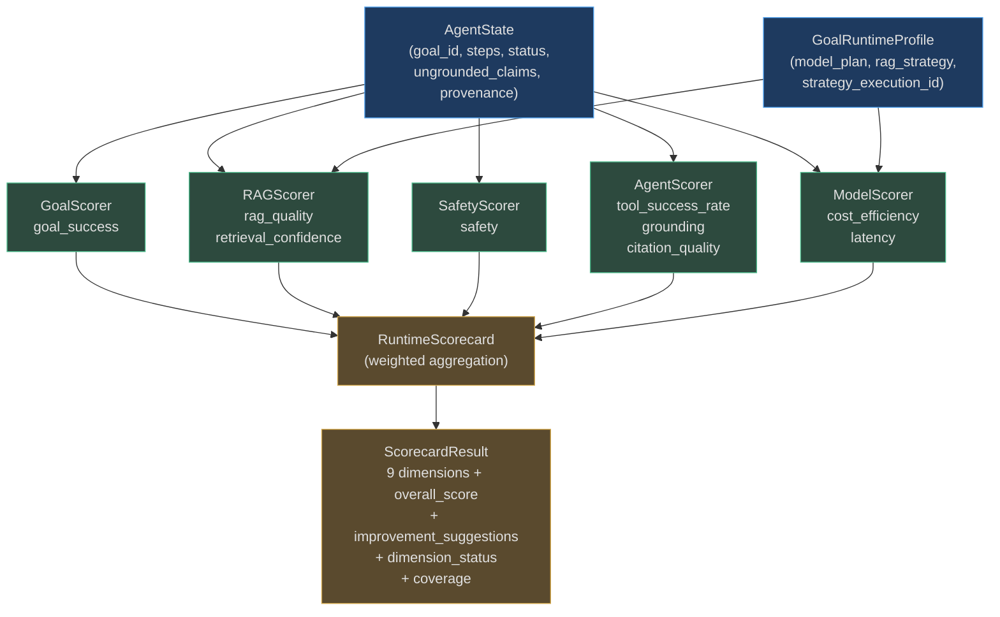
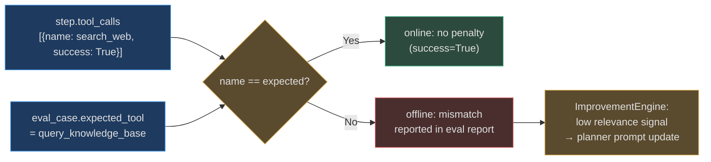
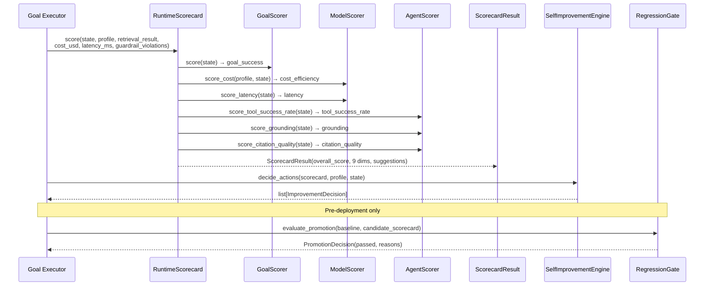
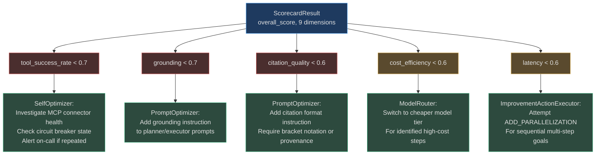

# Tool, Model, and Agent Evals

The `RuntimeScorecard` aggregates nine weighted dimensions from five dedicated scorer classes. Three of those scorers focus on aspects not covered by goal completion or safety: `AgentScorer` measures per-step execution quality (tool success, grounding, citations), `ModelScorer` measures how efficiently the agent used its LLM budget, and `RuntimeScorecard` combines every scorer into a single auditable result that gates deployments and feeds the self-improvement engine.

---

## Overview

### Why Three Separate Scorer Types

`GoalScorer` answers one question: *did the agent complete the task?* It can't tell you *how* the agent got there — whether it called the right tools, stayed within budget, or supported its claims with evidence. The additional scorers fill that gap:

| Scorer | What it measures | Core question |
|---|---|---|
| `GoalScorer` | Task completion and iteration efficiency | Did the goal succeed? |
| `RAGScorer` | Retrieval result confidence and ranking | Was the context good? |
| `SafetyScorer` | Guardrail violations, PII exposure | Was the agent safe? |
| `AgentScorer` | Tool success rate, grounding, citation quality | Did the agent execute well? |
| `ModelScorer` | Cost vs. budget, latency vs. SLA | Was the model used efficiently? |

### Dimension Weights in the RuntimeScorecard

These are the actual weights defined in `app/evals/runtime_scorecard.py`:

```python
DIMENSION_WEIGHTS: dict[str, float] = {
    "goal_success":          0.30,   # completion is the primary signal
    "rag_quality":           0.15,   # retrieval quality matters for RAG goals
    "safety":                0.15,   # violations block promotion
    "grounding":             0.10,   # hallucination detection
    "tool_success_rate":     0.10,   # tool reliability
    "citation_quality":      0.05,   # citation correctness
    "retrieval_confidence":  0.05,   # retrieval system confidence
    "latency":               0.05,   # SLA compliance
    "cost_efficiency":       0.05,   # budget compliance
}
```

The `overall_score` is computed as:

```
overall = sum(scores[dim] × weight[dim] for dim in measured_dims)
          ──────────────────────────────────────────────────────
                  sum(weight[dim] for dim in measured_dims)
```

Dimensions that are `not_applicable` (e.g. `rag_quality` when no retrieval was performed) or `unavailable` (e.g. `latency` when no timing data was recorded) are excluded from both numerator and denominator, so scores are never penalised for missing context.

### Architecture



---

## Tool and Execution Quality Evals — AgentScorer

`AgentScorer` (`app/evals/agent_score.py`) evaluates three dimensions of per-step execution quality. All three methods return `float | None` — `None` means the dimension is not applicable or there is insufficient data to produce a reliable score.

### Tool Success Rate

**Method:** `score_tool_success_rate(state: AgentState) → float | None`

Iterates over every `step` in `state.steps`, collects all `tool_calls` lists, and counts how many individual calls have `success=False`.

```python
def score_tool_success_rate(self, state: AgentState) -> float | None:
    all_calls: list[Any] = []
    for step in state.steps:
        all_calls.extend(getattr(step, "tool_calls", None) or [])
    if not all_calls:
        return None                              # no tool calls → not applicable
    failed = sum(1 for tc in all_calls
                 if isinstance(tc, dict) and not tc.get("success", True))
    return round(max(0.0, 1.0 - failed / len(all_calls)), 3)
```

**Formula:** `max(0.0, 1.0 − failed_calls / total_calls)`

A tool call is considered failed when the step records `{"success": False, ...}` in its `tool_calls` list. This is written by the executor when any of these conditions occur:
- The MCP connector throws an exception (timeout, network error)
- The tool returns an HTTP 4xx/5xx response
- Schema validation of the tool's output fails

**Threshold:** If `tool_success_rate < 0.5`, the `RuntimeScorecard` appends: `"Low tool success rate — check tool trust scores and circuit breakers"` to `improvement_suggestions`.

**In the RuntimeScorecard:** The dimension is only recorded when at least one step has tool calls (`tools_required = True`).

**Real-world example:**

> A DevOps agent is tasked with rotating database credentials across 8 microservices. It calls the `update_secret` tool 8 times. Seven succeed; one call to the `payments-db` service times out (the instance was being patched). The scorecard records `tool_success_rate = 0.875`. The circuit breaker for `update_secret@payments-db` increments its failure counter. On the next execution, the agent retries with a longer timeout and the step succeeds.

### Grounding Score

**Method:** `score_grounding(state: AgentState) → float | None`

Checks `state.ungrounded_claims` — a list populated by the verifier when it identifies factual claims in the agent's output that are not supported by retrieved context.

```python
def score_grounding(self, state: AgentState) -> float | None:
    ungrounded = len(getattr(state, "ungrounded_claims", []) or [])
    if not state.context.get("grounding_checked") and not ungrounded:
        return None            # grounding was never checked → unavailable
    if ungrounded == 0:
        return 1.0             # all claims are grounded
    return round(max(0.0, 1.0 - ungrounded * 0.2), 3)
```

**Formula:** `max(0.0, 1.0 − ungrounded_claims × 0.2)`

Each ungrounded claim reduces the score by 0.2. Five or more ungrounded claims gives a score of 0.0.

| Ungrounded claims | Grounding score |
|---|---|
| 0 | 1.0 |
| 1 | 0.8 |
| 2 | 0.6 |
| 3 | 0.4 |
| 4 | 0.2 |
| ≥ 5 | 0.0 |

**Applicable condition:** Grounding is only scored in the `RuntimeScorecard` when `retrieval_required = True` (retrieval was either explicitly flagged or a `retrieval_result` was passed).

**Threshold:** If `grounding < 0.7` the scorecard suggests: `"High hallucination rate — improve grounding or retrieval"`.

**Real-world example:**

> A financial analyst agent answers "What was Acme Corp's Q3 EBITDA margin?" using retrieved earnings transcripts. The verifier detects that the agent cited a Q2 figure as if it were Q3 and invented a comparison to a competitor not present in any retrieved document. Two ungrounded claims → `grounding = 0.6`. The grounding alert fires. The `SelfImprovementEngine` schedules a prompt update to instruct the agent to always quote the source date before using a number.

### Citation Quality Score

**Method:** `score_citation_quality(state: AgentState) → float | None`

Measures how well the agent's output is backed by verifiable sources, using two signals: `state.provenance` (a list of dicts with `confidence` floats produced by the RAG layer) and `state.cited_answer` (the agent's final answer text).

```python
def score_citation_quality(self, state: AgentState) -> float | None:
    cited_answer = getattr(state, "cited_answer", "") or ""
    provenance = getattr(state, "provenance", []) or []
    if not cited_answer and not provenance:
        return None                         # no citation data → not applicable
    if provenance:
        avg = sum(p.get("confidence", 0.5) if isinstance(p, dict) else 0.5
                  for p in provenance) / len(provenance)
        return round(avg, 3)                # primary signal: provenance confidence
    has_citations = "[" in cited_answer and "]" in cited_answer
    return 0.8 if has_citations else 0.4   # fallback: bracket notation proxy
```

**Scoring logic (priority order):**

1. **Provenance available:** Average of `provenance[i]["confidence"]` across all provenance entries. This is the most reliable signal — the retrieval layer computed it directly.
2. **No provenance, bracket citations detected:** Returns `0.8`. The agent included citation markers like `[1]`, `[2]` in the answer, which is a positive signal even without confidence data.
3. **No provenance, no bracket citations:** Returns `0.4`. The answer has no traceable sourcing.

**Applicable condition:** In the `RuntimeScorecard`, citation quality is only scored when `retrieval_required = True` **and** `profile.rag_strategy.citation_required = True`.

**Real-world example:**

> A legal research agent answers a query about a contract clause. The RAG layer retrieves 4 documents and produces provenance entries with confidences `[0.95, 0.88, 0.91, 0.93]`. The agent cites all four inline using bracket notation. Citation quality score = average(0.95, 0.88, 0.91, 0.93) = **0.9175**. This exceeds the `AttributionVerifier` threshold, so the answer is cleared for delivery.

### Tool Relevance: How Wrong-Tool Selection Is Detected

`AgentScorer` does not have an explicit `score_tool_relevance()` method. Tool relevance is instead measured indirectly through two signals:

1. **Tool success rate as a proxy:** An agent that consistently selects tools outside their intended scope will get more failure responses (invalid parameters, schema errors, "method not found"). This depresses `tool_success_rate`.

2. **Eval dataset comparison:** The offline `EvalSuiteRunner` compares actual `step.tool_calls[i]["name"]` against the `expected_tool` field in curated regression datasets. Mismatches are reported as failures in the offline eval report but do not produce a standalone online score.



**Real-world example:**

> A code review agent is expected to call `query_knowledge_base` to look up internal style guides, but instead calls `search_web`. The web search returns partial results that succeed (HTTP 200), so `tool_success_rate` stays high. In the next offline eval run, the `EvalSuiteRunner` compares the actual tool call against the golden dataset and flags a relevance mismatch. The `PromptOptimizer` adds an explicit instruction to the planner: "Use `query_knowledge_base` for internal documentation lookups."

---

## Model Efficiency Evals — ModelScorer

`ModelScorer` (`app/evals/model_score.py`) scores how efficiently the agent used its LLM compute budget. Two methods produce scores used by the `RuntimeScorecard`: `score_cost()` and `score_latency()`. There is also a combined `score()` method used in direct comparisons (e.g. model A vs. model B benchmarks).

### Cost Efficiency Score

**Method:** `score_cost(profile: GoalRuntimeProfile, state: AgentState) → float | None`

Reads `max_cost_usd` from the model plan and compares it against the actual cost stored in `state.context["total_cost_usd"]` (with a fallback to `state.total_cost_usd`).

```python
def score_cost(self, profile, state) -> float | None:
    max_cost = getattr(profile.model_plan, "max_cost_usd", 0.10) or 0.10
    _cost_ctx = getattr(state, "context", {}) or {}
    actual_cost = float(
        _cost_ctx.get("total_cost_usd",
                      getattr(state, "total_cost_usd", 0.0)) or 0.0
    )
    if "total_cost_usd" not in _cost_ctx and not hasattr(state, "total_cost_usd"):
        return 0.8                       # cost data unavailable → neutral score
    ratio = actual_cost / max_cost
    if ratio <= 0.3:   return 1.0        # ≤30% of budget: excellent
    if ratio <= 0.6:   return 0.8        # ≤60% of budget: good
    if ratio <= 1.0:   return 0.6        # ≤100% of budget: acceptable
    return max(0.0, 1.0 - (ratio - 1.0) * 0.5)   # over budget: penalty
```

**Scoring tiers:**

| Actual cost vs. budget | Cost efficiency score | Interpretation |
|---|---|---|
| ≤ 30% | **1.0** | Excellent — large headroom |
| 31–60% | **0.8** | Good — comfortable margin |
| 61–100% | **0.6** | Acceptable — within budget |
| 101–200% | 0.5 → 0.0 (linear) | Over budget — penalty |
| > 200% | **0.0** | Severely over budget |

**Over-budget formula:** `max(0.0, 1.0 − (ratio − 1.0) × 0.5)`

At 150% of budget: `1.0 − (1.5 − 1.0) × 0.5 = 0.75` → still penalised but not zero.
At 300% of budget: `1.0 − (3.0 − 1.0) × 0.5 = 0.0` → clamped to zero.

**Default budget:** If `model_plan.max_cost_usd` is zero or not set, the default is `$0.10` per goal.

**Real-world example (within budget):**

> A support triage agent has a `$0.10` budget. It uses a lightweight model and the goal resolves in 3 LLM calls totalling `$0.027`.
> `ratio = 0.027 / 0.10 = 0.27` → **cost score 1.0**.
> The `ModelRouter` notes this model tier is performing well under budget and increases its priority weight for similar goals.

**Real-world example (over budget):**

> A research synthesis agent has a `$0.10` budget but processes a complex multi-source query using GPT-4o, spending `$0.18`.
> `ratio = 0.18 / 0.10 = 1.8` → `1.0 − (1.8 − 1.0) × 0.5 = 0.6` → **cost score 0.6**.
> The `SelfImprovementEngine` schedules a `SWITCH_MODEL` action for this goal type, routing it to a cheaper model for the summarization step while keeping the expensive model for the reasoning step.

### Latency Efficiency Score

**Method:** `score_latency(state: AgentState) → float | None`

Reads `_latency_ms` from `state.context` and maps it to a score using stepped thresholds. Returns a neutral `0.75` if no latency data was recorded.

```python
def score_latency(self, state: AgentState) -> float | None:
    latency_ms = float(state.context.get("_latency_ms", 0) or 0)
    if "_latency_ms" not in state.context:
        return 0.75             # timing not recorded → neutral
    if latency_ms < 5_000:      return 1.0    # < 5s: fast
    if latency_ms < 15_000:     return 0.8    # 5–15s: acceptable
    if latency_ms < 30_000:     return 0.6    # 15–30s: slow
    if latency_ms < 60_000:     return 0.4    # 30–60s: very slow
    return 0.2                               # ≥ 60s: critically slow
```

**Scoring tiers:**

| End-to-end latency | Latency score | SLA category |
|---|---|---|
| < 5 seconds | **1.0** | Fast |
| 5–15 seconds | **0.8** | Acceptable |
| 15–30 seconds | **0.6** | Slow |
| 30–60 seconds | **0.4** | Very slow |
| ≥ 60 seconds | **0.2** | Critically slow |

Note: these are step-wise tiers, not a linear decay. The `score()` convenience method (used for model comparisons, not the scorecard) uses a linear decay between 5–30 seconds instead.

**Real-world example:**

> A customer service agent handles a billing query. End-to-end latency is recorded as `12,400ms` (`_latency_ms = 12400`).
> `12400 < 15000` → **latency score 0.8** (acceptable tier).
> The `RuntimeScorecard` passes with `latency = 0.8`. No latency alert fires. The SLA dashboard shows the goal within the 15-second threshold for the `starter` plan.

**Real-world example (SLA breach):**

> A data pipeline agent processes a large CSV transformation. It takes 47 seconds.
> `47000 ∈ [30000, 60000)` → **latency score 0.4** (very slow tier).
> The scorecard appends no automatic suggestion (the threshold for suggestions is not triggered by latency alone), but the `ImprovementActionExecutor` picks up the low latency score and tries `ADD_PARALLELIZATION` — splitting the CSV into chunks processed in parallel on subsequent executions.

### Combined Model Score (for direct comparisons)

The `score()` method combines cost and latency into a single `[0.0, 1.0]` value for model-vs-model benchmarks. It uses a simpler continuous formula than `score_cost()` / `score_latency()`:

```python
def score(self, *, cost_usd: float, latency_ms: float, budget_usd: float = 10.0) -> float:
    cost_ratio = cost_usd / budget_usd
    cost_score = max(0.0, 1.0 - cost_ratio)     # linear, capped at 0
    latency_s = latency_ms / 1000.0
    if latency_s <= 5:
        latency_score = 1.0
    elif latency_s <= 30:
        latency_score = 1.0 - (latency_s - 5) / 25    # linear decay
    else:
        latency_score = 0.1
    return 0.5 * cost_score + 0.5 * latency_score
```

This is **not** used in the `RuntimeScorecard`. The scorecard calls `score_cost()` and `score_latency()` separately to produce two independent dimension scores.

---

## RuntimeScorecard — How All Scorers Combine

The `RuntimeScorecard.score()` method is the single entry point that invokes all five scorers and produces a `ScorecardResult`.

### Score Assembly

```python
# Simplified from app/evals/runtime_scorecard.py
def score(self, *, state, profile, retrieval_result=None,
          cost_usd=None, latency_ms=None, guardrail_violations=None):
    scores = {}
    statuses = {}

    record("goal_success",       GoalScorer().score(state))
    record("rag_quality",        RAGScorer().score(retrieval_result),
                                 applicable=retrieval_required)
    record("retrieval_confidence", retrieval_result.confidence,
                                 applicable=retrieval_required)
    record("safety",             SafetyScorer().score(violations=guardrail_violations))
    record("cost_efficiency",    ModelScorer().score_cost(profile, state))
    record("latency",            ModelScorer().score_latency(state))
    record("grounding",          AgentScorer().score_grounding(state),
                                 applicable=retrieval_required)
    record("citation_quality",   AgentScorer().score_citation_quality(state),
                                 applicable=retrieval_required and citation_required)
    record("tool_success_rate",  AgentScorer().score_tool_success_rate(state),
                                 applicable=tools_required)

    available_weight = sum(DIMENSION_WEIGHTS[name] for name in scores)
    overall = sum(scores[name] * DIMENSION_WEIGHTS[name] for name in scores)
             / available_weight
```

### ScorecardResult Interpretation

```python
@dataclass
class ScorecardResult:
    goal_id: str
    scores: dict[str, float]         # per-dimension scores
    overall_score: float             # weighted aggregate
    improvement_suggestions: list[str]
    dimension_status: dict[str, DimensionStatus]  # "measured" | "unavailable" | "not_applicable"
    evidence_references: dict[str, list[str]]
    coverage: float                  # measured / applicable dimensions
    evaluator_version: str           # "runtime-scorecard-v2"
    # strategy tracking fields...

    def promotion_eligible(self, *, minimum_coverage: float = 0.9) -> bool:
        return self.coverage >= minimum_coverage
```

**Overall score interpretation:**

| Overall score | Status | Action |
|---|---|---|
| ≥ 0.90 | Excellent | No action required |
| 0.70–0.89 | Good | Monitor; investigate if consistent below 0.80 |
| 0.50–0.69 | Needs improvement | Automatic improvement actions triggered |
| < 0.50 | Critical | Escalated to `SelfImprovementEngine` high-priority queue |

**Coverage** is the fraction of applicable dimensions that were actually measured. `promotion_eligible()` requires coverage ≥ 0.9 (90% of applicable dimensions must have been scored). A goal with only `goal_success` measured (coverage = 1/9 ≈ 0.11) will never pass the promotion gate regardless of its score.

### Built-in Improvement Suggestions

The `RuntimeScorecard` generates suggestions inline based on threshold checks. These are appended to `ScorecardResult.improvement_suggestions` and picked up by `SelfImprovementEngine`:

| Condition | Suggestion generated |
|---|---|
| `rag_quality < 0.5` | "Consider switching RAG strategy — low retrieval confidence" |
| `goal_success < 0.7` and `iterations > 15` | "High iteration count — consider goal decomposition" |
| `safety < 1.0` | "Safety violations detected — review guardrail configuration" |
| `grounding < 0.7` | "High hallucination rate — improve grounding or retrieval" |
| `tool_success_rate < 0.5` | "Low tool success rate — check tool trust scores and circuit breakers" |

### Full Execution Flow



### Real-World Scorecard Example

> **Scenario:** A financial compliance agent verifies a suspicious transaction report against internal policy documents.
>
> After execution:
> - Goal completed in 9 iterations → `goal_success = 0.96` (4 excess iterations × 0.01 = 0.04 penalty)
> - RAG retrieval returned 5 documents with avg confidence 0.81 → `rag_quality = 0.81`
> - No safety violations → `safety = 1.0`
> - 2 ungrounded claims detected → `grounding = 0.6`
> - 12 tool calls, 1 failed (SFTP timeout) → `tool_success_rate = 0.917`
> - Provenance avg confidence 0.85 → `citation_quality = 0.85`
> - Retrieval confidence 0.81 → `retrieval_confidence = 0.81`
> - Latency: 18,200ms (15–30s tier) → `latency = 0.6`
> - Cost: $0.043 vs $0.10 budget → ratio 0.43 → `cost_efficiency = 0.8`
>
> Weighted overall:
> ```
> (0.96×0.30) + (0.81×0.15) + (1.0×0.15) + (0.6×0.10) + (0.917×0.10)
>   + (0.85×0.05) + (0.81×0.05) + (0.6×0.05) + (0.8×0.05)
> ──────────────────────────────────────────────────────────────────────
>                             1.00 (all dims measured)
> = 0.288 + 0.1215 + 0.15 + 0.06 + 0.0917 + 0.0425 + 0.0405 + 0.03 + 0.04
> = 0.864 → overall_score = 0.864
> ```
>
> Suggestion generated: "High hallucination rate — improve grounding or retrieval"
> Regression gate result: 0.864 > baseline 0.82 → **PASSES**

---

## How Tool and Model Eval Scores Drive Improvement

The `SelfImprovementEngine` interprets low dimension scores and triggers specific automated actions. The mapping is not hardcoded into `RuntimeScorecard` — it is evaluated by `SelfImprovementEngine.decide_actions()` using thresholds from the goal's runtime profile.



### Low Tool Success Rate → Connector Health Investigation

When `tool_success_rate < 0.7`, the platform:
1. Checks the circuit breaker state for every tool used in the failed steps.
2. Queries recent error logs for the failing connector (timeout vs. auth error vs. schema mismatch).
3. If the failure pattern is consistent (same tool, same error code, 3+ consecutive goals), escalates to an on-call alert.
4. The executor's retry budget for that connector is temporarily increased while the circuit breaker is in `HALF_OPEN` state.

### Low Grounding → Prompt Optimization

When `grounding < 0.7`, the `PromptOptimizer` identifies which executor prompts were used during the goal execution (via `strategy_execution_id`) and adds instructions requiring the agent to:
- Always reference the source document title before quoting a fact.
- Explicitly state when information is not present in the retrieved context.

This update is gated by the `RegressionGate` on a shadow run before being promoted to production.

### Low Cost Efficiency → Model Routing Change

When `cost_efficiency < 0.6` (>100% of budget spent), the `ModelRouter` logs the goal type and model combination as a cost-regression pair. On the next run for the same goal type, it attempts a cheaper model for the identified expensive steps (typically the summary/synthesis steps, not the reasoning steps).

### Low Latency → Parallelization Attempt

When `latency score < 0.6` (≥ 15 seconds), the `ImprovementActionExecutor` inspects the step dependency graph. If two or more consecutive steps have no data dependency, it schedules them as parallel tasks on the next execution. This is the most impactful improvement for multi-tool goals where the agent was issuing API calls sequentially.

---

## Debugging Low Scores

### Diagnosing tool_success_rate

```bash
# Find which tool calls failed in a recent goal
jq '.steps[].tool_calls[] | select(.success == false)' state_dump.json

# Check circuit breaker state for a connector
GET /api/v1/mcp/connectors/{connector_id}/health
```

Look for: `"success": false, "error": "timeout"` (network issue), `"error": "schema_validation_failed"` (version mismatch), `"error": "rate_limited"` (quota exhaustion).

### Diagnosing grounding score

The `ungrounded_claims` list in `AgentState` contains each claim that the verifier could not trace to a retrieved document. Inspect the list to determine whether the problem is:

- **Retrieval miss:** The correct document was never retrieved (fix: improve retrieval query or embedding).
- **Verifier strictness:** The verifier is flagging claims that are legitimately supported (fix: increase similarity threshold).
- **Agent hallucination:** The agent genuinely invented a fact (fix: grounding instruction prompt update).

### Diagnosing cost_efficiency

`state.context["total_cost_usd"]` is set by the cost tracking middleware. If it's missing, the `score_cost()` method returns a neutral `0.8` rather than failing. To get actual cost data, ensure `CostTracker` middleware is enabled and the `total_cost_usd` key is being written to context after each LLM call.

### Diagnosing latency

`state.context["_latency_ms"]` is the end-to-end wall-clock time from goal receipt to final answer. If it's missing, `score_latency()` returns neutral `0.75`. The underscore prefix marks it as an internal instrumentation field. To identify where latency is being spent, look at `state.steps[i].duration_ms` per step.

---

<!-- Sources: app/evals/agent_score.py, app/evals/model_score.py, app/evals/runtime_scorecard.py, app/evals/goal_score.py -->
