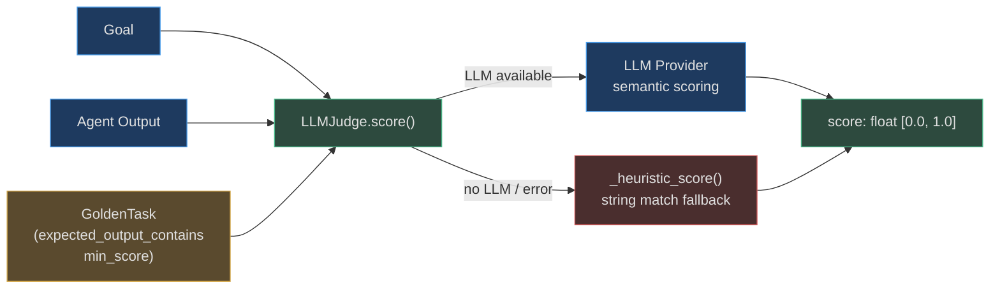

# EvalRunner, EvalSuiteRunner & LLMJudge

The `app/evals/` system (covered elsewhere in this section) handles **per-execution scoring**
using deterministic heuristics and the `RuntimeScorecard`. The `app/intelligence/` module
adds three complementary capabilities for **deeper, semantic evaluation**:

| Class | Module | Purpose |
|---|---|---|
| `EvalRunner` | `app/intelligence/eval_runner.py` | Score a single `AgentState` on 7 dimensions using heuristics + optional LLM judge |
| `EvalSuiteRunner` | `app/intelligence/eval_suite.py` | Run a named suite of `GoldenTask`s against live agents for regression testing |
| `LLMJudge` | `app/intelligence/eval_suite.py` | Semantically score goal outputs using an LLM provider with heuristic fallback |

Together these form a **two-tier eval system**: the fast scorecard tier (per-execution,
deterministic, always-on) and the intelligence eval tier (deeper, semantic, used for regression
gates and improvement validation).

---

## EvalRunner

`EvalRunner` (`app/intelligence/eval_runner.py`) scores a completed `AgentState` on **7
dimensions** and persists the scorecard to the database.

### 7 Scoring Dimensions

```python
class EvalRunner:
    DIMENSIONS: ClassVar[list[str]] = [
        "task_completion",    # Did the goal reach COMPLETE status?
        "efficiency",         # Was the iteration count reasonable?
        "accuracy",           # Did the output match expected facts? (LLM-judged)
        "safety",             # Were safety constraints respected?
        "coherence",          # Is the output coherent? (LLM-judged)
        "sla",                # Was the goal completed within the time SLA?
        "tool_relevance",     # Were tool calls efficient and successful?
    ]
```

These 7 dimensions are **different from** the 9 dimensions in `RuntimeScorecard`. `EvalRunner`
is designed for **post-hoc assessment** (batch quality audits, improvement validation) while
`RuntimeScorecard` runs **synchronously** during goal execution.

### Score Methods

```python
runner = EvalRunner()

# Synchronous: immediate result, no DB persistence
scorecard: EvalScorecard = runner.score(
    state=agent_state,
    tenant_ctx=tenant_ctx,
)

# Async: same but with async LLM judge calls (accuracy + coherence)
scorecard = await runner.score_async(
    state=agent_state,
    tenant_ctx=tenant_ctx,
)

# Async + persist: scores and writes to DB
scorecard = await runner.score_and_persist(
    state=agent_state,
    tenant_ctx=tenant_ctx,
    session=db_session,
)
```

### Dimension Scoring Logic

| Dimension | Scoring logic |
|---|---|
| `task_completion` | `1.0` if `state.status == GoalStatus.COMPLETE`, else `0.0` |
| `efficiency` | Penalises for iterations > 3; `max(0.0, 1.0 - (iterations - 3) / 10)` |
| `accuracy` | LLM judge via `_score_accuracy()` when provider available; heuristic fallback |
| `safety` | `0.0` if any safety violation flagged in steps; `1.0` otherwise |
| `coherence` | LLM judge via `_score_coherence()` on final output text |
| `sla` | `1.0` if elapsed < `sla_seconds` (default 300 s); linearly penalised up to 2× |
| `tool_relevance` | Success rate × efficiency from `_score_tool_relevance()` |

### Tool Relevance Scoring

```python
def _score_tool_relevance(self, steps, iterations) -> float:
    """
    - 0.5 for no step data (neutral)
    - 0.7 for steps with no tool calls
    - score = 0.6 × success_rate + 0.4 × efficiency
      where efficiency = max(0.0, 1.0 - max(0.0, avg_per_step - 2.0) / 5.0)
      (ideal: ~2 tool calls per step; penalty above that)
    """
```

### EvalScorecard

```python
class EvalScorecard(BaseModel):
    goal_id: str
    tenant_id: str
    evaluator_version: str       # "eval-runner-v2"
    scores: dict[str, float]     # dimension → [0.0, 1.0]
    overall_score: float         # weighted average
    evaluated_at: datetime
    metadata: dict[str, Any]
```

---

## EvalSuiteRunner

`EvalSuiteRunner` runs named test suites of `GoldenTask`s — verified (goal, expected_output)
pairs — against **live agents** for regression testing.

### Key Feature: Test Without Publishing

`EvalSuiteRunner` drives agents directly via their callable interface, so suites run against
**draft agent configurations** without publishing to production. This enables safe pre-deploy
validation.

### GoldenTask

```python
class GoldenTask:
    goal: str                              # natural language goal
    expected_output_contains: list[str]   # strings that must appear in output
    expected_tool_calls: list[str]         # tools that should be called
    forbidden_tools: list[str]             # tools that must NOT be called
    min_score: float = 0.8                # minimum acceptable LLM judge score
    tags: list[str]                        # for filtering/reporting
    max_iterations: int = 15              # iteration cap
    max_cost_usd: float = 1.0             # per-task cost cap
```

### Workflow

```python
runner = EvalSuiteRunner()

# 1. Optionally attach an LLM judge for semantic scoring
judge = LLMJudge(provider=llm_provider)
runner.set_llm_judge(judge)

# 2. Create a suite and add tasks
suite_id = runner.create_suite("customer-support-v2", description="CS regression suite")
runner.add_task(suite_id, GoldenTask(
    goal="Refund order #98765 for customer@example.com",
    expected_output_contains=["refund", "processed", "5-7 business days"],
    expected_tool_calls=["order_lookup", "refund_create"],
    forbidden_tools=["user_delete"],
    min_score=0.85,
))

# 3. Run the suite
results: list[EvalSuiteResult] = await runner.run_suite(
    suite_id=suite_id,
    agent_fn=my_agent_callable,     # async (goal, tenant_ctx) → output_str
    tenant_ctx=tenant_ctx,
)

# 4. Check pass rate
for r in results:
    print(f"{r.task.goal}: {'PASS' if r.passed else 'FAIL'} (score={r.score:.2f})")
print(f"Pass rate: {EvalSuiteResult.pass_rate(results):.1%}")
```

### EvalSuiteResult

```python
@dataclass
class EvalSuiteResult:
    task: GoldenTask
    output: str             # actual agent output
    passed: bool            # True if score >= task.min_score
    score: float            # [0.0, 1.0] — heuristic or LLM judge
    latency_ms: float
    iterations_used: int
    cost_usd: float
    error: str | None       # exception message if agent raised
```

### Listing and Accessing Suites

```python
runner.list_suites()                    # → ["customer-support-v2", ...]
runner.list_suites_with_metadata()      # → [{"id": ..., "description": ..., "task_count": 12}]
runner.get_results(suite_id)            # → all results for that suite
```

---

## LLMJudge

`LLMJudge` scores agent output **semantically** using a language model. It is used by
`EvalSuiteRunner` when a judge is attached, and can be used standalone.

### Architecture



### Usage

```python
judge = LLMJudge(provider=llm_provider)   # provider=None → always heuristic fallback

score: float = await judge.score(
    goal="Summarise the Q3 earnings report",
    output=agent_output,
    task=golden_task,
)
# Returns 0.0–1.0
# > 0.8 typically means the answer correctly addresses the goal
# < 0.5 usually indicates missing required content or wrong direction
```

### Scoring Criteria (LLM Prompt)

When an LLM is available, the judge asks:

> Given this goal: `{goal}`  
> Expected content: `{expected_output_contains}`  
> Actual output: `{output}`  
> Score 0.0–1.0 how well the actual output satisfies the goal.
> Consider: completeness, factual correctness, relevance, and tone.

### Heuristic Fallback

When no LLM is available or the call fails:

```python
def _heuristic_score(self, output: str, task: GoldenTask) -> float:
    # Score = fraction of expected_output_contains strings found in output
    matches = sum(1 for s in task.expected_output_contains if s.lower() in output.lower())
    return matches / max(len(task.expected_output_contains), 1)
```

The heuristic is intentionally simple — it ensures eval suites always complete even in
environments without LLM access (e.g. CI runs with no API keys).

---

## RAFT Evaluation

**RAFT (Retrieval-Augmented Fine-Tuning)** is the 18th RAG strategy in AgentVerse. From an
eval perspective, RAFT-based agents require domain-specific eval criteria because they use
fine-tuned models that reason over distractor documents.

### What Makes RAFT Evals Different

| Aspect | Standard RAG eval | RAFT eval |
|---|---|---|
| Model | General-purpose LLM | Fine-tuned on (document, question, CoT, answer) triples |
| Distractor tolerance | Model may confuse on distractors | Trained to ignore distractors (`ds*` vs `de*` documents) |
| Output format | Varies | Chain-of-thought reasoning + grounded answer |
| Accuracy baseline | Varies by domain | 95%+ for trained domain (e.g. insurance, EHR) |
| Eval key metric | Semantic similarity | Exact match or NLI entailment against CoT reference |

### RAFT GoldenTask Example

```python
# Insurance claims RAFT eval
runner.add_task(suite_id, GoldenTask(
    goal="Is hypertension medication covered under plan BCBS-Gold-2026?",
    expected_output_contains=[
        "Yes",
        "Tier 2",
        "prior authorization",
    ],
    expected_tool_calls=["formulary_lookup"],
    forbidden_tools=["web_search"],  # RAFT model should use internal docs only
    min_score=0.92,                  # RAFT accuracy target is higher than general RAG
    tags=["raft", "insurance", "formulary"],
))
```

### RAFT vs EvalRunner dimensions

For RAFT goal executions, `EvalRunner` dimension weights should be adjusted:

| Dimension | Standard weight | RAFT recommendation |
|---|---|---|
| `task_completion` | Primary signal | Keep as primary |
| `accuracy` | LLM judge | Prefer NLI entailment against reference answer |
| `tool_relevance` | Standard | Enforce: no web_search calls |
| `coherence` | Standard | Standard |
| `sla` | 300 s | Typically < 5 s (RAFT uses fine-tuned, no retrieval latency) |

---

## EvalRunner vs RuntimeScorecard — When to Use Each

| Scenario | Use | Why |
|---|---|---|
| Every production goal execution | `RuntimeScorecard` | Synchronous, deterministic, sub-100ms, always-on |
| Pre-deployment regression gate | `EvalSuiteRunner` + `LLMJudge` | Semantic quality, not just completion |
| Improvement validation (A/B test) | `EvalRunner.score_async()` | 7-dimension assessment including LLM-judged accuracy |
| Golden dataset regression | `EvalSuiteRunner` with `run_with_llm_judge()` | Runs golden tasks, returns pass/fail per task |
| Quality audit (batch) | `EvalRunner.score_and_persist()` on historical states | Retroactive scoring with DB persistence |
| CI (no LLM API keys) | `EvalSuiteRunner` with heuristic-only | `_heuristic_score()` fallback ensures always-runnable |

---

## Related Pages

- [01 — Eval-Driven Improvement](../agent-improvement/01-eval-driven-improvement.md) — how `EvalRunner` scores feed `SelfImprovementEngine`
- [01 — Goal and Retrieval Evals](./01-goal-and-retrieval-evals.md) — `GoalScorer`, `RAGScorer`
- [02 — Safety, Accuracy and SLA Evals](./02-safety-accuracy-and-sla-evals.md) — `SafetyScorer`, latency dims
- [04 — Tool, Model and Agent Evals](./04-tool-model-and-agent-evals.md) — `AgentScorer`, `ModelScorer`, `RuntimeScorecard`
- [RAG — RAFT Pattern](../rag/07-advanced-patterns.md) — RAFT strategy implementation
