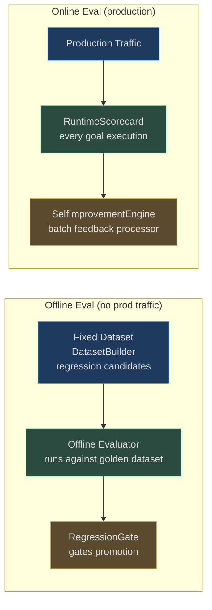
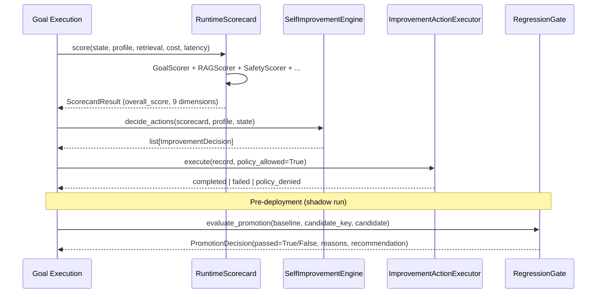

# Evals

Evaluation is the ground truth for agent quality. AgentVerse evaluates **every goal execution** — not just sampled ones — across nine weighted dimensions, producing a `ScorecardResult` that simultaneously drives deployment gating, self-improvement actions, and observability dashboards.

The principle: **if you can't measure it, you can't improve it.** No optimization is applied unless it can be validated against the same eval harness.

---

## Why Evals Are the Ground Truth

| Question | Without evals | With evals |
|---|---|---|
| Did this prompt change help? | Gut feel | Statistical A/B result with p-value |
| Is the new model worse? | Users complain | RegressionGate blocks at deploy time |
| Which goals are failing? | Support tickets | EvalDatasetBuilder captures as regression cases |
| Is cost improving? | Invoice shock | CostTracker + ScorecardResult tracks per-goal cost |
| Is the verifier trustworthy? | Unknown | VerifierCalibrationStore measures false-confirm rate |

---

## Eval Types

| Eval type | Module | Measured at | Requires production traffic? |
|---|---|---|---|
| **Goal completion** | `GoalScorer` | Per goal execution | No |
| **Retrieval quality** | `RAGScorer` | Per goal execution | No |
| **Safety compliance** | `SafetyScorer` | Per goal execution | No |
| **Attribution / grounding** | `AttributionVerifier` | Per answer with citations | No |
| **Multi-turn coherence** | `MultiTurnEvaluator` | Per conversation | No (uses agent_fn callable) |
| **Cost efficiency** | `CostTracker` + scorecard | Per goal execution | No |
| **Latency SLA** | `RuntimeScorecard` | Per goal execution | No |
| **Regression gate** | `RegressionGate` | Pre-deployment | Shadow run (no prod impact) |
| **Continuous improvement** | `SelfImprovementEngine` | Per scorecard + batch | Yes (feedback batch) |

---

## Scorecard Dimensions and Weights

Every goal execution produces a `ScorecardResult` with these weighted dimensions:

```python
# app/evals/runtime_scorecard.py
DIMENSION_WEIGHTS: dict[str, float] = {
    "goal_success":          0.30,   # Did the agent complete the goal?
    "rag_quality":           0.15,   # How good was retrieval?
    "safety":                0.15,   # No violations, no PII leakage
    "grounding":             0.10,   # Answer supported by context?
    "tool_success_rate":     0.10,   # Tool calls succeeded?
    "citation_quality":      0.05,   # Citations correctly support claims?
    "retrieval_confidence":  0.05,   # Retrieval system confidence
    "latency":               0.05,   # Within SLA?
    "cost_efficiency":       0.05,   # Within cost budget?
}
```

The `overall_score` is the weighted average. A score of **1.0** is perfect; **0.0** is complete failure.

---

## Online vs Offline Evaluation



**Offline evals** run against fixed golden datasets (produced by `EvalDatasetBuilder` from failed production executions with score < 0.6). They gate deployments through `RegressionGate`.

**Online evals** score every production goal execution via `RuntimeScorecard` and feed `SelfImprovementEngine.process_feedback_batch()` which processes unprocessed `goal_feedback` rows in batches of 100.

---

## Eval-to-Improvement Feedback Loop



---

## Key Eval Metrics and Targets

| Metric | Target | Critical threshold | Source |
|---|---|---|---|
| Goal completion rate | ≥ 0.85 | < 0.70 → UPDATE_PROMPT_VARIANT | `GoalScorer` |
| RAG quality | ≥ 0.70 | < 0.50 → UPDATE_RAG_STRATEGY | `RAGScorer` |
| Safety score | ≥ 0.99 | Any violation → alert | `SafetyScorer` |
| Attribution precision | ≥ 0.85 | Jaccard < 0.15 → unsupported | `AttributionVerifier` |
| Quality regression delta | ≤ 0.02 | > 0.02 → RegressionGate blocks | `RegressionGate` |
| Cost regression delta | ≤ 0.10 | > 0.10 → cost_regression | `RegressionGate` |
| Latency regression delta | ≤ 0.15 | > 0.15 → latency_regression | `RegressionGate` |
| False-confirm rate | ≤ 0.02 | > 0.02 → recalibrate verifier | `VerifierCalibrationStore` |
| Minimum sample size | ≥ 30 goals | < 30 → insufficient_samples | `RegressionGate` |

---

## Integration with Other Platform Systems

| System | How evals connect |
|---|---|
| **Improvement engine** | `ScorecardResult` → `SelfImprovementEngine.decide_actions()` |
| **Governance / audit** | Every scorecard is an immutable audit entry |
| **Memory** | Failed evals → `ReflexionService.learn()` → lesson stored |
| **Observability** | `ScorecardResult.to_dict()` feeds metrics dashboards |
| **CI/CD** | `RegressionGate.evaluate_promotion()` gates every deployment |
| **Dataset management** | `EvalDatasetBuilder.maybe_create()` (score < 0.6) creates golden cases |

---

## Navigation

| File | What it covers |
|---|---|
| [01-goal-and-retrieval-evals.md](./01-goal-and-retrieval-evals.md) | GoalScorer, RAGScorer, AttributionVerifier, MultiTurnEvaluator, DatasetBuilder |
| [02-safety-accuracy-and-sla-evals.md](./02-safety-accuracy-and-sla-evals.md) | SafetyScorer, RuntimeScorecard, RegressionGate, SLA tracking |
| [03-online-vs-offline-and-continuous-improvement.md](./03-online-vs-offline-and-continuous-improvement.md) | Online vs offline strategies, SelfImprovementEngine, debugging failing evals |
| [04-tool-model-and-agent-evals.md](./04-tool-model-and-agent-evals.md) | AgentScorer (tool success, grounding, citations), ModelScorer (cost, latency), RuntimeScorecard combined scoring |
| [05-eval-runner-and-llm-judge.md](./05-eval-runner-and-llm-judge.md) | `EvalRunner` (7 dims, post-hoc), `EvalSuiteRunner` (golden task regression), `LLMJudge` (semantic scoring), RAFT eval criteria |

<!-- Sources: app/evals/runtime_scorecard.py, app/evals/goal_score.py, app/evals/rag_score.py, app/evals/safety_score.py, app/evals/attribution_verifier.py, app/evals/dataset_builder.py, app/evals/regression_gate.py, app/evals/regression_baseline.py, app/evals/self_improvement_engine.py, app/evals/multi_turn_eval.py, app/intelligence/eval_runner.py, app/intelligence/eval_suite.py -->
