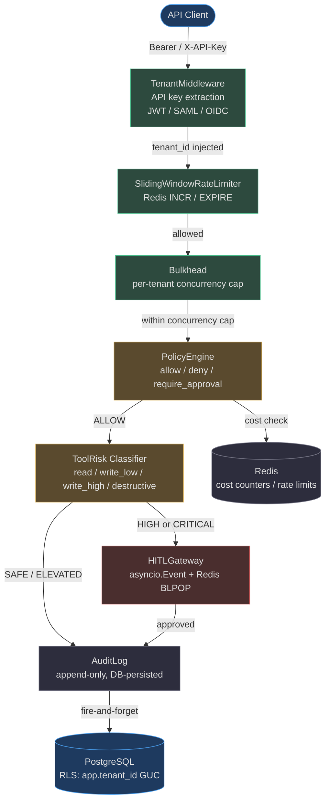
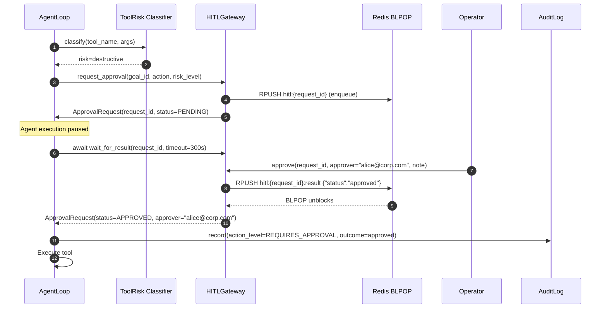
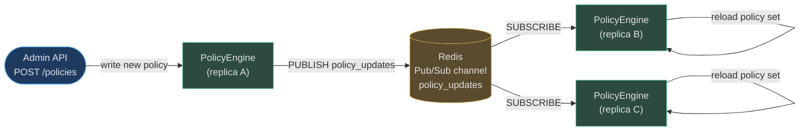

# Governance & Security

AgentVerse enforces a defense-in-depth governance model: every agent action is authenticated, tenancy-isolated, risk-classified, audited, and policy-checked before execution. This page documents the complete security stack from the API boundary through to database row-level security.

## Architecture Overview



<!-- Sources: app/tenancy/middleware.py:1-80, app/tenancy/rate_limiter.py, app/reliability/bulkhead.py, app/governance/policies.py:1-80, app/agent/tool_risk.py:1-80, app/governance/hitl.py:1-80, app/governance/audit.py:1-80, app/db/rls.py:1-80 -->

## Authentication Layer

### TenantMiddleware

[`app/tenancy/middleware.py`](https://github.com/harsh786/agent-verse/blob/main/agent-verse-backend/app/tenancy/middleware.py) is the entry point for all authenticated requests. It:

1. Extracts the API key from `Authorization: Bearer <key>` or the `X-API-Key` header.
2. Calls an injected `key_resolver` (DB lookup in production, in-memory in tests) to resolve the `TenantContext`.
3. Attaches the resolved `TenantContext` to `request.state.tenant`.
4. Returns `401 Unauthorized` for unresolvable keys — it **never fails open**.
5. Bypasses auth for the paths listed in `_BYPASS_PREFIXES`: `/health`, `/metrics`, `/docs`, `/openapi.json`, `/tenants/signup`, `/auth/login`, `/auth/callback`.

**In-process rate-limit fallback**: when Redis is unavailable, a conservative `_fallback_counters` dict enforces `min(plan_rpm, 120)` — the system never silently drops rate limiting.

### SSO Options

| Method | Module | Notes |
|---|---|---|
| TOTP MFA | [`app/auth/mfa.py`](https://github.com/harsh786/agent-verse/blob/main/agent-verse-backend/app/auth/mfa.py) | RFC 6238 TOTP for secondary factor |
| SAML 2.0 | [`app/auth/saml_provider.py`](https://github.com/harsh786/agent-verse/blob/main/agent-verse-backend/app/auth/saml_provider.py) | Enterprise SAML IdP integration |
| Keycloak OIDC | [`app/auth/keycloak.py`](https://github.com/harsh786/agent-verse/blob/main/agent-verse-backend/app/auth/keycloak.py) | OAuth 2.0 / OpenID Connect |
| SCIM 2.0 | [`app/auth/scim_handler.py`](https://github.com/harsh786/agent-verse/blob/main/agent-verse-backend/app/auth/scim_handler.py) | Automated user provisioning / de-provisioning |

---

## Row-Level Security (RLS)

PostgreSQL enforces per-tenant isolation at the database layer via the `app.tenant_id` GUC (Global User-level Configuration parameter). This means even a bug in application code cannot read another tenant's data — the database itself rejects the query.

<!-- Source: app/db/rls.py:1-60 -->
```python
# app/db/rls.py — transaction-scoped RLS activation
await session.execute(
    text("SELECT set_config('app.tenant_id', :tid, true)"),
    {"tid": tenant_id}
)
```

The `true` argument to `set_config` makes it `SET LOCAL` — the GUC value is automatically reverted when the transaction commits or rolls back. No explicit cleanup is needed, and the tenant scope cannot leak across requests.

[`system_session()`](https://github.com/harsh786/agent-verse/blob/main/agent-verse-backend/app/db/rls.py#L52) issues `SET LOCAL row_security = off` for system-level maintenance operations, using `BYPASSRLS` or a `__system__` policy marker.

---

## Rate Limiting

[`app/tenancy/rate_limiter.py`](https://github.com/harsh786/agent-verse/blob/main/agent-verse-backend/app/tenancy/rate_limiter.py) implements a **sliding-window rate limiter** in Redis using `INCR` and `EXPIRE`. The window is per-tenant, with the limit driven by the tenant's subscription plan. `X-RateLimit-Limit`, `X-RateLimit-Remaining`, and `X-RateLimit-Reset` headers are attached to every response by `TenantMiddleware`.

The [bulkhead](https://github.com/harsh786/agent-verse/blob/main/agent-verse-backend/app/reliability/bulkhead.py) (`app/reliability/bulkhead.py`) further caps **concurrent** requests per tenant using an `asyncio.Semaphore`, preventing a single tenant from monopolising the executor pool even within their rate limit.

---

## Tool Risk Classification

[`app/agent/tool_risk.py`](https://github.com/harsh786/agent-verse/blob/main/agent-verse-backend/app/agent/tool_risk.py) classifies every tool call before execution using a two-path classifier:

- **Jira/Atlassian tools**: token-based classifier matching verb sets for backward-compat with existing governance rules.
- **All other connectors**: substring-based classifier covering the full breadth of MCP tool names encountered in production.

### Risk Level Table

| Risk Level | `ToolRisk` Value | Examples | Governance Response |
|---|---|---|---|
| **Read-only** | `read` | `get_*`, `list_*`, `search_*`, `query_*`, `describe_*` | Auto-allow, audit recorded |
| **Low write** | `write_low` | `comment`, `label`, `update_description` | Auto-allow, audit recorded |
| **High write** | `write_high` | `create_issue`, `create_pr`, `assign`, `transition`, `merge` | PolicyEngine check, may require approval |
| **Destructive** | `destructive` | `delete`, `drop`, `truncate`, `purge`, `wipe`, `terminate`, `revoke`, `destroy` | HITL required (HIGH\_RISK\_CONNECTORS escalate even write_high) |
| **Unknown** | `unknown` | Unrecognised tool names | Treated as destructive (fail-closed) |

**High-risk connectors** (`stripe`, `payment`, `billing`, `finance`, `production`, `deploy`) automatically escalate any write operation to at least `write_high`, regardless of the verb — because even `update_payment` on Stripe carries financial risk.

Source: [`app/agent/tool_risk.py:50-80`](https://github.com/harsh786/agent-verse/blob/main/agent-verse-backend/app/agent/tool_risk.py#L50-L80)

---

## Human-In-The-Loop (HITL) Gateway

When a tool call is classified as `write_high` or `destructive`, or when a step contains risk keywords (`deploy`, `delete`, `prod`), the agent loop routes through the HITL gateway before executing.



<!-- Sources: app/governance/hitl.py:1-80, app/agent/tool_risk.py -->

### Dual-mode Implementation

[`app/governance/hitl.py`](https://github.com/harsh786/agent-verse/blob/main/agent-verse-backend/app/governance/hitl.py) supports two delivery modes:

| Mode | Mechanism | Use Case |
|---|---|---|
| **In-process** | `asyncio.Event` | Single-replica development/test — backward-compatible |
| **Cross-replica** | Redis `BLPOP` | Production fleets — approval survives server restarts and works across replicas |

The Redis BLPOP path stores results in `hitl:{request_id}:result`, which means an approval issued to any replica is picked up by whichever replica is waiting.

---

## Policy Engine

[`app/governance/policies.py`](https://github.com/harsh786/agent-verse/blob/main/agent-verse-backend/app/governance/policies.py) implements a `PolicyEngine` that evaluates tool calls against a stack of named policies. Policies are intentionally stateless — they hold no tenant context directly; the caller scopes which policies apply.

### Evaluation semantics

- **Most restrictive wins**: if any policy denies a tool, the call is denied regardless of other policies.
- **Glob matching**: `denied_tools` entries support exact names and glob prefixes (e.g., `stripe_*`).
- **Time-window support**: `allowed_hours_utc` and `allowed_weekdays` constrain when tools may run. Timezone-aware via `zoneinfo` (IANA timezone names).
- **Fail-closed for regulated domains**: domains in `REGULATED_DOMAINS` (`healthcare`, `hipaa`, `legal`, `finance`, `sox`, `fintech`, `pci`) require human approval when **no matching policy** is found.

```python
REGULATED_DOMAINS = frozenset(
    {"healthcare", "hipaa", "legal", "finance", "sox", "fintech", "pci"}
)
```
Source: [`app/governance/policies.py:32-35`](https://github.com/harsh786/agent-verse/blob/main/agent-verse-backend/app/governance/policies.py#L32-L35)

### Hot-reload via Redis Pub/Sub



<!-- Sources: app/governance/policies.py:1-80 -->

Policy changes propagate to all replicas within milliseconds, with no deployment required. Each replica subscribes to the `policy_updates` channel and reloads its in-memory policy set on receipt.

`PolicyVersionManager` (v2 migration 0056) creates an **immutable snapshot** on every policy mutation, providing an audit trail of all policy versions.

---

## Audit Trail

[`app/governance/audit.py`](https://github.com/harsh786/agent-verse/blob/main/agent-verse-backend/app/governance/audit.py) implements an append-only audit log:

```
class AuditLog:
    # No delete() method. No update() method.
    # The append-only constraint is enforced structurally.
    def record(self, event: AuditEvent, *, tenant_ctx: TenantContext) -> None: ...
```

### Immutability guarantees

| Layer | Mechanism |
|---|---|
| **Application** | `AuditLog` exposes only `record()` and `query()` — no delete or update methods |
| **Database** | Append-only PostgreSQL table with an immutability trigger that rejects `UPDATE`/`DELETE` |
| **In-flight** | `_db_record()` is fire-and-forget via `asyncio.create_task()` — DB failures are logged as warnings, never raised |
| **SOC2 fields** | `ip_address`, `user_agent`, `api_key_id`, `request_id`, `connector_id`, `auth_type` captured per event |

Source: [`app/governance/audit.py:37-47`](https://github.com/harsh786/agent-verse/blob/main/agent-verse-backend/app/governance/audit.py#L37-L47)

The three-tier audit system (`audit.py` / `audit_v2.py` / `audit_v3.py`) provides backward-compatible layering: v1 is the base in-memory structure, v2 adds tamper detection via hash chaining, v3 adds SIEM-ready structured fields.

---

## Cost Controls

[`app/governance/cost.py`](https://github.com/harsh786/agent-verse/blob/main/agent-verse-backend/app/governance/cost.py) enforces per-goal and per-tenant daily budgets before every tool call:

```
BudgetConfig(
    per_goal_usd=10.0,         # hard cap per individual goal
    per_tenant_daily_usd=500.0 # rolling 24-hour cap across all goals
)
```

### `check_and_record()` logic

1. Call `_reset_if_new_day(tenant_id)` — resets daily totals at midnight UTC.
2. Atomically check `goal_total + estimated_cost ≤ per_goal_usd`.
3. Atomically check `daily_total + estimated_cost ≤ per_tenant_daily_usd`.
4. If both pass: increment Redis counters and return `True`.
5. If either fails: return `False` — the tool call is blocked.

In production, Redis counters with daily TTL ensure accuracy across all replicas. Per-goal+tenant `asyncio.Lock` prevents TOCTOU races.

Source: [`app/governance/cost.py:54-80`](https://github.com/harsh786/agent-verse/blob/main/agent-verse-backend/app/governance/cost.py#L54-L80)

---

## Compliance Coverage

[`app/governance/compliance_bundles.py`](https://github.com/harsh786/agent-verse/blob/main/agent-verse-backend/app/governance/compliance_bundles.py) provides pre-built compliance bundles that automatically configure policies, audit retention, and data handling rules.

| Framework | Controls Automated | Key Audit Fields | Retention |
|---|---|---|---|
| **SOC2 Type II** | Immutable audit trail, API-key tracking, failed-access logging, MFA enforcement | `ip_address`, `api_key_id`, `auth_type`, `request_id` | 90 days minimum |
| **GDPR** | Right-to-erasure gating (legal holds prevent deletion), PII redaction in logs, data-residency enforcement | `user_agent`, `connector_id` | User-configurable |
| **PCI-DSS** | Stripe/payment tools require HITL approval, card number redaction in audit log, network segmentation policies | `ip_address`, `user_agent` | 1 year |
| **HIPAA** | Healthcare domain → fail-closed policy evaluation, audit log for all data access, encryption at rest | `connector_id`, `api_key_id` | 6 years |

### Legal Holds

[`app/governance/legal_holds.py`](https://github.com/harsh786/agent-verse/blob/main/agent-verse-backend/app/governance/legal_holds.py) implements a legal hold registry that blocks data deletion for specific tenants or goals during litigation or compliance investigations. Attempting to delete held data returns an error with the hold reason.

### SIEM Integration

[`app/governance/siem_adapters.py`](https://github.com/harsh786/agent-verse/blob/main/agent-verse-backend/app/governance/siem_adapters.py) ships adapters for **Splunk** (HEC format) and **Microsoft Sentinel** (CEF/JSON). Audit events are forwarded to the configured SIEM in real time via the same fire-and-forget async pipeline as DB writes.

---

## Security Headers

`SecurityHeadersMiddleware` (in [`app/tenancy/middleware.py`](https://github.com/harsh786/agent-verse/blob/main/agent-verse-backend/app/tenancy/middleware.py)) adds OWASP-recommended headers to every response:

| Header | Value |
|---|---|
| `Strict-Transport-Security` | `max-age=31536000; includeSubDomains` |
| `X-Content-Type-Options` | `nosniff` |
| `X-Frame-Options` | `DENY` |
| `X-XSS-Protection` | `1; mode=block` |
| `Content-Security-Policy` | Strict policy denying inline scripts |

---

## Related Pages

| Page | Why it's related |
|---|---|
| [Agent Loop](../architecture/agent-loop.md) | Where tool risk classification gates execution |
| [Guardrails](./guardrails.md) | Input/output safety layer that complements governance |
| [Observability](./observability.md) | Audit events feed into the structured logging and SIEM pipelines |
| [Multi-tenancy Architecture](../architecture/tenancy.md) | How RLS and TenantContext are wired end-to-end |
