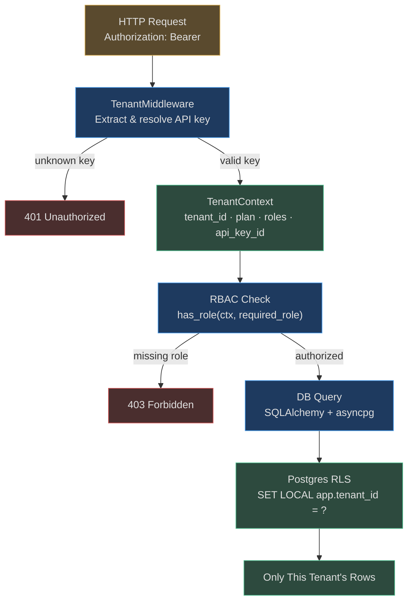

# Tenant Isolation and RBAC

AgentVerse is built for multi-tenancy from the ground up. Tenant isolation is not an
application-layer check that can be accidentally bypassed — it is enforced at three
independent layers: the API middleware, the RBAC system, and Postgres Row-Level Security.

---

## The Three Isolation Layers



---

## Layer 1: API Key Authentication

### Key Extraction

`TenantMiddleware` accepts keys from two header forms:

```http
Authorization: Bearer agv_sk_a1b2c3d4...
X-API-Key: agv_sk_a1b2c3d4...
```

The middleware tries `Authorization: Bearer` first, then `X-API-Key`. If neither is present,
and the path is not in the bypass list, the request is rejected with `401`.

### Bypass Paths

Some paths are intentionally public and skip API key validation:

```python
_BYPASS_PREFIXES = (
    "/health", "/metrics", "/status",
    "/docs", "/redoc", "/openapi.json",
    "/tenants/signup",   # public — new customer onboarding
    "/auth/login",       # SSO redirect
    "/auth/callback",    # SSO OAuth2 callback
    "/billing/webhook",  # Razorpay HMAC-authenticated
)
```

### Key Resolver

In production, `key_resolver` is a DB lookup that maps the key hash to a `TenantContext`.
In tests, it is a callable that returns a fake `TenantContext`. The resolver is injected at
startup — the middleware has no knowledge of how resolution works.

```python
@dataclass(frozen=True, slots=True)
class TenantContext:
    tenant_id: str
    plan: PlanTier          # FREE | STARTER | PROFESSIONAL | ENTERPRISE
    api_key_id: str         # key fingerprint for audit correlation
    roles: tuple[str, ...]  # RBAC roles assigned to this key
```

### Rate Limit Enforcement

Before forwarding the request, the middleware checks the tenant's rate limit using a
sliding-window algorithm backed by Redis. If Redis is unavailable, a conservative in-process
fallback enforces `min(plan_limit, 120)` RPM — it **never fails open**:

```
Plan         Rate Limit
FREE         60 RPM
STARTER      120 RPM
PROFESSIONAL 600 RPM
ENTERPRISE   10,000 RPM
```

---

## Layer 2: Role-Based Access Control

### Roles and Hierarchy

Four roles form a strict hierarchy:

```
admin
  └── operator
  └── approver
        └── viewer
```

```python
_ROLE_IMPLIES: dict[str, frozenset[str]] = {
    "admin":    frozenset({"admin", "operator", "viewer", "approver"}),
    "operator": frozenset({"operator", "viewer"}),
    "approver": frozenset({"approver", "viewer"}),
    "viewer":   frozenset({"viewer"}),
}
```

`admin` is a superset of all other roles. An operator can do everything a viewer can.
An approver can do everything a viewer can, plus HITL approvals.

### Permission Matrix

| Action | admin | operator | approver | viewer |
|--------|:-----:|:--------:|:--------:|:------:|
| View goals / agents | ✓ | ✓ | ✓ | ✓ |
| View audit logs | ✓ | ✓ | ✓ | ✓ |
| Create / delete agents | ✓ | ✓ | ✗ | ✗ |
| Run goals | ✓ | ✓ | ✗ | ✗ |
| Approve HITL requests | ✓ | ✗ | ✓ | ✗ |
| Manage connectors | ✓ | ✓ | ✗ | ✗ |
| Manage API keys | ✓ | ✗ | ✗ | ✗ |
| Emergency stop | ✓ | ✗ | ✗ | ✗ |
| Configure compliance bundles | ✓ | ✗ | ✗ | ✗ |
| View cost dashboard | ✓ | ✓ | ✗ | ✗ |

### Role Enforcement in Code

FastAPI endpoints use the `require_role` dependency factory:

```python
from app.tenancy.rbac import require_role

@router.delete("/agents/{agent_id}")
async def delete_agent(
    request: Request,
    agent_id: str,
    _: None = Depends(require_role("admin", "operator")),  # role check here
):
    ...
```

The dependency reads `request.state.tenant` (set by `TenantMiddleware`), expands the role
hierarchy, and raises `403` if the required role is not present.

---

## Layer 3: Postgres Row-Level Security (RLS)

### The Core Problem RLS Solves

Application-layer tenant checks (`WHERE tenant_id = ?`) can be accidentally omitted in a
complex query. Postgres RLS makes this **structurally impossible**: even if the ORM forgets
the `WHERE` clause, the DB will silently filter to the current tenant's rows only.

### How It Works

Every relevant table has an RLS policy:

```sql
-- Example: goals table
ALTER TABLE goals ENABLE ROW LEVEL SECURITY;

CREATE POLICY goals_tenant_isolation ON goals
    USING (tenant_id = current_setting('app.tenant_id', true));
```

Before executing queries, AgentVerse sets the `app.tenant_id` GUC per-transaction:

```python
@asynccontextmanager
async def sqlalchemy_rls_context(session: AsyncSession, tenant_id: str):
    """Set app.tenant_id RLS variable for a SQLAlchemy AsyncSession."""
    await session.execute(
        text("SELECT set_config('app.tenant_id', :tid, true)"),
        {"tid": tenant_id}
    )
    yield session
    # SET LOCAL auto-resets when transaction ends (transaction-scoped)
```

`true` as the third argument to `set_config` means `SET LOCAL` — the setting is
automatically cleared when the transaction commits or rolls back. No cleanup code required.

### Usage in the Audit Log Writer

```python
async with self._db() as session, session.begin():
    async with sqlalchemy_rls_context(session, tenant_id):
        row = AuditLogModel(id=event.event_id, tenant_id=tenant_id, ...)
        session.add(row)
```

The `AuditLogModel.INSERT` only sees the current tenant's rows for any concurrent reads.

### System Sessions (Cross-Tenant Maintenance)

Maintenance jobs that need to touch all tenants use `system_session`:

```python
async with system_session(session):
    # SET LOCAL row_security = off — bypasses RLS for this transaction
    await session.execute(text("UPDATE goals SET status = 'expired' WHERE ..."))
```

This is restricted to internal maintenance scripts, never exposed to user-facing code.

---

## Real-World Examples

### Example 1: Healthcare SaaS — Hospital A Cannot See Hospital B's Data

**Setup:** Two hospitals, `tenant_hospital_a` and `tenant_hospital_b`, both using the same
AgentVerse deployment. 500,000 patient interaction records total.

**Without RLS:**
```sql
-- Accidental bug: WHERE clause missing
SELECT * FROM agent_memories WHERE goal_id = ?;
-- Returns rows from ALL tenants — data breach
```

**With RLS (AgentVerse):**
```
Request arrives → API key resolves to tenant_hospital_a
→ SET LOCAL app.tenant_id = 'tenant_hospital_a'
→ query executes
→ Postgres RLS policy filters: only rows WHERE tenant_id = 'tenant_hospital_a' returned
→ Hospital B's data: invisible, not just hidden
```

The isolation is enforced by Postgres, not by application logic. A bug in the ORM layer
cannot cause a cross-tenant data leak.

### Example 2: Multi-Team Enterprise — Agents Role Cannot View Audit Logs

**Setup:** A financial services firm. Analysts create and run goals. Compliance runs audit
queries. Different teams, same tenant.

**Agent-runner API key:** Roles `["operator"]`
**Compliance API key:** Roles `["admin"]`

```
Analyst tries GET /audit?tenant=... → 403 Forbidden
(require_role("admin", "viewer_audit") rejects operator)

Compliance queries GET /audit?start=90d → 200 OK, full audit log
(require_role("admin") succeeds)
```

Within the same `tenant_id`, role separation provides functional isolation. Across
`tenant_id`, RLS provides data isolation.

---

## At Scale: 10,000 Tenants

| Metric | Value |
|--------|-------|
| Tenants | 10,000 active |
| Avg rows per table per tenant | 5,000 goals, 50K audit events |
| RLS overhead per query | ~1-3% (Postgres index on tenant_id) |
| API key lookup latency | < 1 ms (in-memory + Redis cache) |
| Role check overhead | < 0.1 ms (frozenset lookup) |
| Rate-limit check | 1-2 ms per request (Redis EVALSHA) |

The `app.tenant_id` index on every multi-tenant table ensures RLS does a
`Bitmap Index Scan` rather than a sequential scan. At 50 million rows across 10,000 tenants,
query time for a single tenant's 5,000 rows remains under 5 ms.

<!-- Sources: app/tenancy/middleware.py, app/tenancy/rbac.py, app/tenancy/context.py,
     app/db/rls.py, app/tenancy/rate_limiter.py -->
