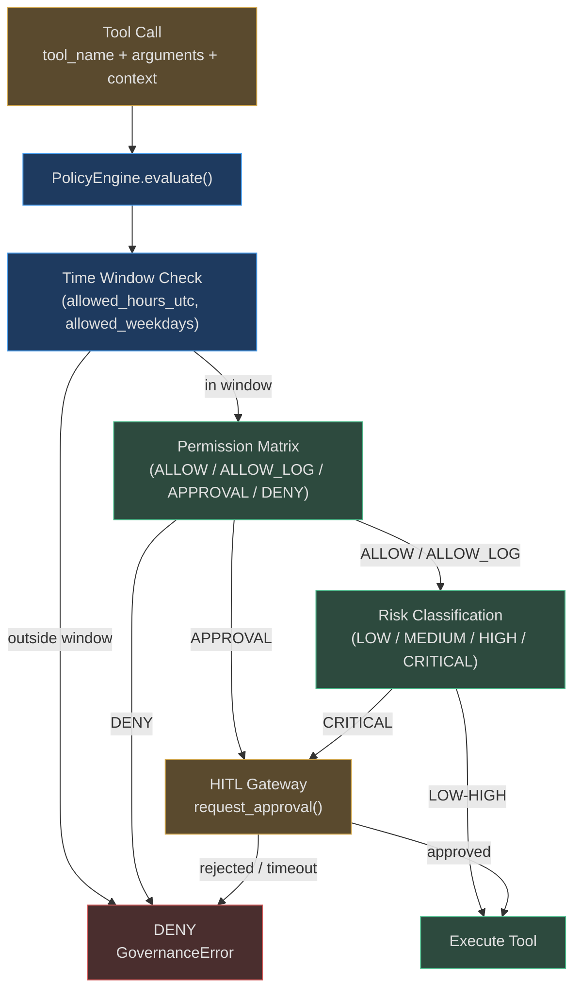
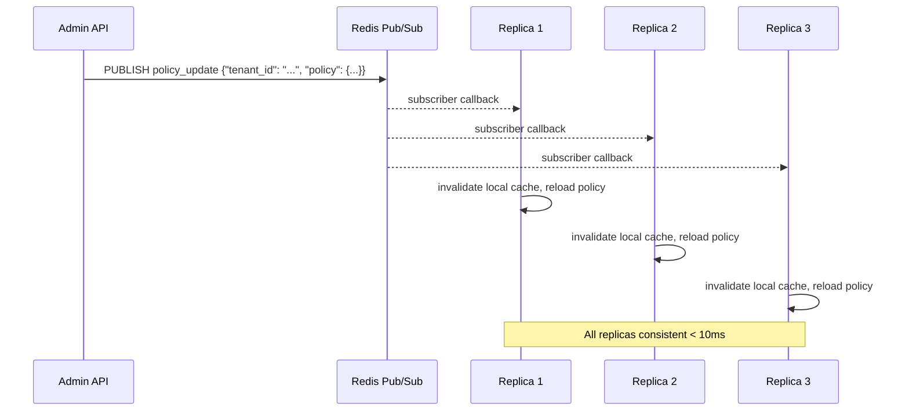

# Policy Engine

The policy engine is the runtime conscience of every agent. Before any tool fires, every
tool call passes through policy evaluation. The engine answers one question: **should this
tool be allowed to run right now, for this tenant, in this context?**

---

## Policy Architecture



---

## Policy Types

### 1. Tool Policies

A `Policy` object declares which tools are denied, which require approval, and optionally
restricts when the policy applies (time window, tenant scope):

```python
@dataclass
class Policy:
    name: str
    description: str = ""
    denied_tools: list[str] = field(default_factory=list)    # exact match or glob
    approval_tools: list[str] = field(default_factory=list)  # glob: "pay_*"
    scope: str = "global"
    allowed_hours_utc: tuple[int, int] | None = None  # (start_hour, end_hour)
    allowed_weekdays: list[int] | None = None          # 0=Monday, 6=Sunday
    tenant_id: str = ""                                # empty = applies to all
    timezone: str = "UTC"                              # IANA (e.g. "America/New_York")
    web_allowed_domains: list[str] = field(default_factory=list)
```

Tool patterns support **glob matching via `fnmatch`**:
- `"pay_*"` — matches `pay_vendor`, `pay_employee`, `pay_invoice`
- `"*_prod_*"` — matches any tool touching production
- `"delete_user"` — exact match only

### 2. Permission Rules (Permission Matrix)

The `PermissionMatrix` provides per-tool, per-tenant action levels:

| Action Level | Meaning | Logged? | Blocked? |
|---|---|---|---|
| `ALLOW` | Execute silently | No | No |
| `ALLOW_LOG` | Execute and audit (default) | Yes | No |
| `APPROVAL` | Pause and request HITL | Yes | Until approved |
| `DENY` | Block immediately | Yes | Always |

```python
class ActionLevel(enum.StrEnum):
    ALLOW = "allow"
    ALLOW_LOG = "allow_log"   # DEFAULT for unconfigured tools
    APPROVAL = "approval"
    DENY = "deny"
```

Every unconfigured tool defaults to `ALLOW_LOG` — executed but audited. This means
**nothing slips through unrecorded**.

### 3. Declarative Policy Rules

`policy_rules.py` supports a JSON-based policy-as-code format for complex conditions:

```json
{
  "name": "block-external-email",
  "conditions": [
    {"field": "tool_name", "op": "contains", "value": "send_email"},
    {"field": "arguments.to", "op": "not_ends_with", "value": "@company.com"}
  ],
  "logic": "AND",
  "action": "deny",
  "message": "Emails may only be sent to @company.com addresses"
}
```

**Supported operators:** `eq`, `ne`, `contains`, `not_contains`, `ends_with`,
`not_ends_with`, `starts_with`, `not_starts_with`, `in`, `not_in`, `gt`, `lt`,
`gte`, `lte`, `regex`

**Logic modes:** `AND` (all conditions must match), `OR` (any condition triggers)

Rules are evaluated **first-match wins**. All rules are checked in order; the first `deny`
wins regardless of later `allow` rules.

### 4. Time-Based Policies

`time_policy.py` enforces temporal governance rules. Platform-wide defaults protect all
tenants:

```python
_DEFAULT_TIME_RULES: list[TimeRule] = [
    TimeRule(
        name="no_destructive_overnight",
        tool_patterns=["delete_*", "drop_*", "truncate_*", "destroy_*", "wipe_*"],
        blocked_hours_utc=(22, 6),   # blocked 22:00–06:00 UTC
        reason="Destructive operations blocked 22:00-06:00 UTC.",
        require_hitl_override=True,
    ),
    TimeRule(
        name="no_prod_deploy_weekend",
        tool_patterns=["deploy_*", "*_to_prod", "kubectl_apply", "terraform_apply"],
        blocked_weekdays=[5, 6],     # Saturday, Sunday
        reason="Production deployments blocked on weekends.",
        require_hitl_override=True,
    ),
]
```

When `require_hitl_override=True`, a blocked tool can still proceed if a human approves it
through the HITL gateway — providing an emergency escape valve without disabling the policy.

---

## Policy Evaluation Order

When multiple policies apply to a tool call, the engine evaluates them **most restrictive
wins**:

```
1. Check if current time is within any Policy.allowed_hours_utc window → DENY if outside
2. Check if current weekday is in Policy.allowed_weekdays → DENY if excluded
3. Check tool_name against Policy.denied_tools (glob) → DENY if matched
4. Check tool_name against Policy.approval_tools (glob) → APPROVAL if matched
5. Check PermissionMatrix rule for (tenant_id, tool_name) → use ActionLevel
6. Default: ALLOW_LOG
```

Regulated domains get **fail-closed** semantics. If no policy explicitly allows a tool, the
platform defaults to `REQUIRE_APPROVAL` rather than `ALLOW`:

```python
REGULATED_DOMAINS: frozenset[str] = frozenset(
    {"healthcare", "hipaa", "legal", "finance", "sox", "fintech", "pci"}
)
```

---

## Redis Pub/Sub: Real-Time Policy Propagation

Policy changes must propagate to all replicas immediately. A 30-second cache window after a
policy update means 30 seconds where a newly-denied tool is still executable. This is
unacceptable for a security-critical system.



**Without Redis:** Policy engine uses in-process policy state. Updates require a restart
or manual reload. Acceptable for development, not production.

---

## Tool Risk Classification

Tools are classified by the risk of their outcome:

| Risk Level | Examples | Default Action |
|---|---|---|
| `LOW` | read-only queries, search, summarize | `ALLOW_LOG` |
| `MEDIUM` | send notification, write report, create draft | `ALLOW_LOG` |
| `HIGH` | send email externally, modify database records | `ALLOW_LOG` + policy check |
| `CRITICAL` | process payment, delete records, deploy to production | `REQUIRE_APPROVAL` |

Tools containing keywords `deploy`, `delete`, `prod`, `payment` in the agent loop's
`tool_risk.py` module are automatically classified as HIGH or CRITICAL.

---

## HITL Approval Workflow

When the policy engine returns `REQUIRE_APPROVAL`, the agent loop pauses and creates an
`ApprovalRequest`:

```python
@dataclass(eq=False)
class ApprovalRequest:
    goal_id: str
    action: str
    risk_level: str
    request_id: str           # UUID, doubles as a string ID (backward-compat)
    status: ApprovalStatus    # PENDING | APPROVED | REJECTED | TIMED_OUT
    approver: str | None
    required_approvers: int   # multi-person approval threshold
    approvals_received: int
    created_at: str           # ISO8601
```

The HITL gateway supports two delivery modes:

**In-process (development):** `asyncio.Event` — approval notification via in-process
signaling. Survives only for the current process.

**Cross-replica (production):** Redis `BLPOP` — approval result stored in a Redis list.
Any replica can receive the approval and resume the goal. Survives server restarts.

**Timeout escalation:** Default timeout is 300 seconds (5 minutes). After timeout, the
request transitions to `TIMED_OUT` and the action is blocked.

---

## Real-World Examples

### Example 1: Financial Agent — No Payment Over $10,000 Without Approval

**Policy configuration:**
```json
{
  "name": "large-payment-approval",
  "conditions": [
    {"field": "tool_name", "op": "starts_with", "value": "pay_"},
    {"field": "arguments.amount_usd", "op": "gt", "value": 10000}
  ],
  "logic": "AND",
  "action": "require_approval",
  "message": "Payments > $10,000 require CFO approval"
}
```

**Execution trace:**
```
Agent calls pay_vendor(vendor="Acme Inc", amount_usd=75000)
→ PolicyEngine evaluates declarative rules
→ Rule "large-payment-approval" matches (pay_*, amount > 10000)
→ HITL request created: "pay_vendor $75,000 to Acme Inc — awaiting CFO approval"
→ CFO receives Slack notification
→ CFO approves via /approve endpoint
→ Redis BLPOP delivers approval to agent replica
→ pay_vendor executes, audit event records approver="cfo@company.com"
```

### Example 2: Free-Tier Database Tool Block

**Policy:**
```python
Policy(
    name="no_db_tools_free_tier",
    denied_tools=["query_database", "execute_sql", "db_*"],
    scope="free",
    description="Database tools not available on free plan"
)
```

**Result:** Free-tier agents get immediate `DENY` on any database tool call. The error
message tells the user which plan upgrade unlocks the capability.

### Example 3: Weekend Production Deploy Block

At 14:30 on a Saturday, an agent tries to run `kubectl_apply`:

```
TimePolicyEngine.check("kubectl_apply")
→ matched rule: "no_prod_deploy_weekend" (blocked_weekdays=[5, 6])
→ today is Saturday (weekday=5)
→ BLOCK — "Production deployments blocked on weekends."
→ require_hitl_override=True → HITL request created
→ On-call engineer receives PagerDuty alert
→ Engineer approves → time policy override logged in audit trail
```

---

## Policy Audit Trail

Every policy evaluation that results in `DENY` or `REQUIRE_APPROVAL` is logged:

```python
AuditEvent(
    goal_id="goal_xyz",
    tool_name="pay_vendor",
    action_level=ActionLevel.APPROVAL,
    outcome="blocked_pending_approval",
    note="large-payment-approval policy matched: amount_usd=75000 > 10000",
    request_id="req_abc123",
)
```

This creates a complete paper trail: who requested what, which policy blocked it, who
approved it (or if it timed out), and what the final outcome was.

<!-- Sources: app/governance/policies.py, app/governance/policy_rules.py,
     app/governance/permissions.py, app/governance/time_policy.py, app/governance/hitl.py -->
