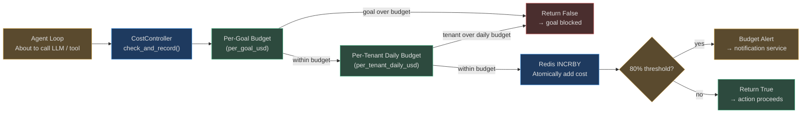

# Cost Control and Budgets

Autonomous agents can generate cost faster than any human workflow. A single runaway goal
can consume an entire monthly budget in minutes. AgentVerse's cost control system enforces
hard limits before every billable action — not after the fact on your invoice.

---

## Budget Architecture



---

## Budget Model

### Two Budget Dimensions

Every cost check evaluates two independent limits simultaneously:

```python
@dataclass(frozen=True)
class BudgetConfig:
    per_goal_usd: float = 10.0          # Max spend for a single goal run
    per_tenant_daily_usd: float = 500.0  # Max spend for all goals today (UTC)
```

**Per-goal budget** prevents a single runaway goal from consuming the entire monthly
allocation. A research goal that unexpectedly enters an infinite loop hits its `$10` limit
and stops — the other 99 goals that day continue normally.

**Per-tenant daily budget** prevents aggregate abuse. Even if each individual goal is
within its limit, a tenant with 1,000 goals all running at once could blow through
the monthly budget in a day without this guard.

### Check-Before-Execute, Not Bill-After

The critical design principle: `check_and_record()` is called **before** the LLM call or
tool execution. The estimated cost is checked atomically — if it would exceed the limit,
the action is blocked before any cost is actually incurred.

```python
async def check_and_record(
    self,
    *,
    goal_id: str,
    cost_usd: float,     # estimated cost of the action about to execute
    tenant_ctx: TenantContext,
    tool_name: str = "",
) -> bool:
    """Returns True if within budget. False blocks the action."""
    async with self._locks[f"{tenant_ctx.tenant_id}:{goal_id}"]:
        new_goal_total = self._goal_totals[goal_key] + cost_usd
        new_daily_total = self._daily_totals[tenant_ctx.tenant_id] + cost_usd

        if new_goal_total > self._cfg.per_goal_usd:
            return False   # goal blocked
        if new_daily_total > self._cfg.per_tenant_daily_usd:
            return False   # tenant daily blocked

        # Commit the cost
        self._goal_totals[goal_key] = new_goal_total
        self._daily_totals[tenant_ctx.tenant_id] = new_daily_total
```

### Atomic TOCTOU Protection

Cost tracking uses per-goal `asyncio.Lock` objects to prevent Time-of-Check/Time-of-Use
races. Without locking, two concurrent tool calls could both read the same budget total,
both calculate they're within budget, and both write — resulting in overspend. With locking,
the second check waits until the first has committed.

---

## Redis: Why Not Postgres?

Cost tracking has different requirements than general data storage:

| Requirement | Postgres | Redis |
|---|---|---|
| Write throughput | ~5K/s (with index) | >100K/s |
| Cross-replica sharing | Yes (connection overhead) | Yes (sub-ms) |
| TTL for daily reset | Complex (cron + delete) | Native EXPIREAT |
| Atomic increment | `SELECT FOR UPDATE` | `INCRBY` (atomic) |
| Latency | 2-10 ms | < 1 ms |

Redis `INCRBY` is a single atomic operation — no transactions, no locks at the DB level.
Millions of cost increments per second across thousands of tenants is achievable.

### Daily Reset via TTL

Daily budgets reset at UTC midnight. Redis TTL handles this automatically:

```python
# On first cost record of the day, set TTL to seconds until midnight UTC
seconds_until_midnight = ...
await redis.expireat(f"cost:{tenant_id}:daily", midnight_timestamp)
```

No cron job, no cleanup task, no risk of yesterday's costs bleeding into today.

### Cross-Replica Consistency

Without Redis, Replica 1 and Replica 2 each track costs independently. A tenant running
goals on both replicas sees double the effective budget limit. Redis centralizes the counter:
all replicas share one source of truth.

---

## Cost Components

What costs money in AgentVerse:

```
Goal execution cost = Σ (LLM invocations) + Σ (embedding API calls) + tool overhead

LLM cost = (input_tokens × input_rate + output_tokens × output_rate) / 1000
```

### Model Pricing Table

```python
# From app/governance/pricing.py (canonical source is app/intelligence/cost_tracker.py)
_PRICING = {
    "claude-opus-4":    (0.015, 0.075),   # $15/$75 per 1M tokens
    "claude-sonnet-4":  (0.003, 0.015),   # $3/$15 per 1M tokens
    "claude-haiku-3":   (0.00025, 0.00125),
    "gpt-4o":           (0.005, 0.015),
    "gpt-4o-mini":      (0.00015, 0.0006),
    "gemini-flash":     (0.00015, 0.0006),
    "llama-3.1-70b":    (0.0009, 0.0009),
}
```

Costs are estimated before execution using the token budget from the prompt + max_tokens
setting, then reconciled against actual usage after the LLM responds.

---

## Per-Plan Budget Defaults

Budget limits scale with plan tier:

| Plan | Per-Goal Limit | Per-Tenant Daily Limit | Notes |
|------|----------------|------------------------|-------|
| FREE | $0.50 | $5.00 | Strict hard limits, no soft alerts |
| STARTER | $2.00 | $50.00 | 80% soft alert to email |
| PROFESSIONAL | $10.00 | $500.00 | 80% alert + Slack notification |
| ENTERPRISE | Custom | Custom | Negotiated limits, dedicated alerts |

Enterprise customers can configure per-agent budgets in addition to global limits:

```python
BudgetConfig(
    per_goal_usd=100.0,          # this agent handles expensive research goals
    per_tenant_daily_usd=5000.0,  # enterprise allocation
)
```

---

## Soft vs Hard Limits

### 80% Soft Alert

When daily spend crosses 80% of the limit, the cost controller emits an alert:

```python
if 0.79 < new_daily_total / self._cfg.per_tenant_daily_usd <= 0.81:
    # Fire 80% budget alert (once per crossing)
    record_cost_usd(cost_usd, labels={"tenant": tenant_ctx.tenant_id, "alert": "80pct"})
```

This is the early warning. Admins receive notification and can:
- Add budget (enterprise tier)
- Cancel non-critical goals
- Wait for the daily reset at midnight UTC

### 100% Hard Block

At the limit, `check_and_record()` returns `False`. The agent loop receives this signal,
marks the goal as `budget_exceeded`, and records the outcome in the audit log. No cost is
incurred for the blocked action (check-before-execute prevents this).

---

## Real-World Examples

### Example 1: Free-Tier Startup — $5 Daily Limit

**Context:** A startup on the free plan. They have 3 agents running throughout the day.
Daily limit: $5.00.

```
09:00 — Agent "market_researcher" runs → $0.42 → daily total: $0.42
11:00 — Agent "code_reviewer" runs → $1.20 → daily total: $1.62
14:00 — Agent "report_writer" starts long-running goal → $1.50 → daily: $3.12
16:00 — Agent "report_writer" continues → tries to spend $2.50 (total would be $5.62)
         check_and_record() returns False
         Goal stops: "Daily budget of $5.00 exceeded"
         Audit event: {goal_id: "...", outcome: "budget_exceeded", note: "daily: $3.12 + $2.50 > $5.00"}
17:00 — Admin receives notification: "Daily budget reached"
00:00 — UTC midnight: Redis TTL expires, daily counter resets
```

The startup's bill for the day: $3.12. Not $5.62 (no overage).

### Example 2: Enterprise Customer — $50,000 Monthly Budget

**Context:** A financial firm on enterprise tier. Monthly budget $50,000 → daily limit
~$1,667 (or configured to allow burst up to $5,000/day).

```
Monday: 200 goals run → $820 total → within budget
Tuesday: Large batch analysis job → 3,000 goals → $4,100
         80% alert fires at $4,000 → DevOps alerted via PagerDuty
         Goals continue (within $5,000 daily hard limit)
Wednesday: Reset. Normal day: $650
...
Month-end: Platform reports total $32,400 → $17,600 remaining
```

Real-time tracking means the finance team sees current spend on their dashboard, updated
every minute, not at month-end on the invoice.

---

## Cost Reporting

`CostController` exposes spend totals for dashboards:

```python
# Per-tenant total spend today
daily = controller.get_daily_total(tenant_ctx)

# Per-goal breakdown
goal_total = controller.get_goal_total(tenant_ctx, goal_id="goal_xyz")
```

These feed the cost analytics dashboard showing spend by agent, by goal type, by time of
day — enabling tenants to optimize their agent configurations for cost efficiency.

<!-- Sources: app/governance/cost.py, app/governance/pricing.py,
     app/tenancy/context.py, app/observability/metrics.py -->
