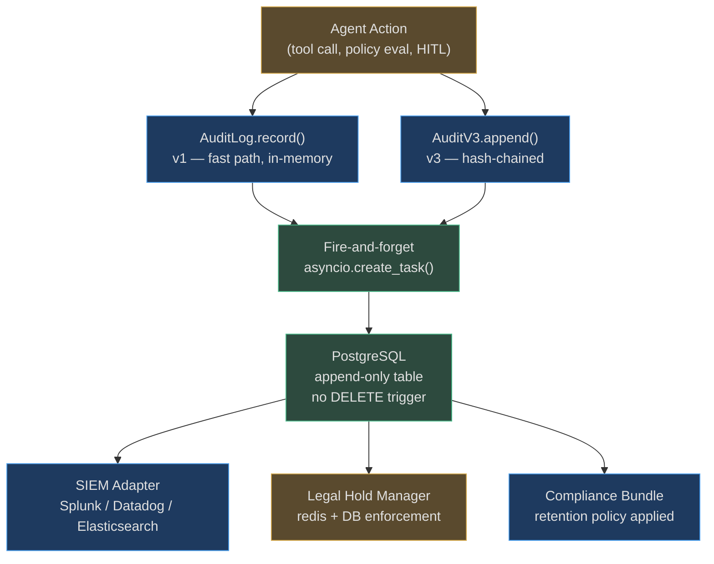

# Audit Trail and Compliance

A complete, tamper-proof record of every action is the foundation of enterprise trust. The
AgentVerse audit system provides three layers: an in-memory fast path (v1), a structured
schema (v2), and a cryptographically-chained immutable log (v3) — plus SIEM integration,
legal hold management, and pre-built compliance bundles for regulated industries.

---

## Audit System Architecture



---

## Audit V1: Fast Path

The base `AuditLog` provides a simple, fast, append-only store:

```python
@dataclass
class AuditEvent:
    goal_id: str
    tool_name: str
    action_level: ActionLevel     # ALLOW / ALLOW_LOG / APPROVAL / DENY
    outcome: str                  # "success", "blocked", "approved", "timed_out"
    event_id: str                 # UUID, generated automatically
    step_id: str = ""
    approver: str | None = None   # set when HITL approved
    note: str = ""
    # SOC2-required fields
    ip_address: str | None = None
    user_agent: str | None = None
    api_key_id: str | None = None # correlates to TenantContext.api_key_id
    request_id: str | None = None
    connector_id: str | None = None
    auth_type: str | None = None
```

**Append-only guarantee:** `AuditLog` has no `delete()` or `update()` methods. Structurally
impossible to mutate — not just policy-forbidden.

**DB writes:** Fire-and-forget `asyncio.create_task()`. DB failures are logged as warnings
and never raised to callers. The agent never waits for the audit write to complete. The
in-memory record is always written first, ensuring zero audit latency.

---

## Audit V3: Cryptographic Hash Chain

`AuditV3` is the production-grade immutable audit log with blockchain-style integrity
verification. Every record includes a hash of all its fields plus the hash of the previous
record — creating a tamper-evident chain.

### Record Schema

```python
@dataclass
class AuditRecord:
    id: str
    tenant_id: str
    goal_id: str
    action: str                     # "tool_call", "policy_deny", "hitl_approved", ...
    tool_name: str
    tool_args_hash: str             # sha256(sorted(tool_args)) — privacy-preserving
    actor: str                      # "user:alice", "agent:xyz", "system"
    actor_ip: str
    delegation_chain_hash: str      # hash of the delegation lineage
    previous_hash: str              # hash of the previous record in this tenant's chain
    entry_hash: str                 # hash of this record (includes previous_hash)
    timestamp: str                  # ISO 8601
    metadata_hash: str              # sha256(metadata dict)
    sequence: int                   # monotonically increasing per tenant
```

### Hash Computation

The hash input is a **deterministic canonical JSON** of all record fields:

```python
def compute_entry_hash(
    *,
    previous_hash: str,
    timestamp: str,
    tenant_id: str,
    goal_id: str,
    action: str,
    tool_name: str,
    tool_args_hash: str,   # hash of args, not raw args — preserves privacy
    actor: str,
    actor_ip: str,
    delegation_chain_hash: str,
    metadata_hash: str,
) -> str:
    payload = {key: value for key, value in sorted(locals().items())}
    return hashlib.sha256(json.dumps(payload, sort_keys=True).encode()).hexdigest()
```

**Privacy design:** Tool arguments are hashed (`tool_args_hash`), not stored raw. A
`execute_sql(query="SELECT ssn FROM users WHERE id=123")` becomes a hash. The raw SQL
never appears in the audit log — but if you need to verify a specific argument was used,
you can hash it yourself and compare.

### Tamper Verification

Because each record includes the hash of the previous record, any modification breaks the
chain. AgentVerse provides a tamper-verification endpoint:

```
GET /audit/verify-chain?tenant_id=...&start=0&end=100

→ Recomputes entry_hash for each record in range
→ Compares computed_hash vs stored entry_hash
→ Verifies previous_hash chain continuity
→ Returns: {"valid": true, "records_checked": 100, "broken_at": null}
```

A chain break indicates either a software bug or deliberate tampering. Both are incidents.

### Actions Captured by AuditV3

The following actions are always captured via `AuditV3`:

```python
_AGENT_PATTERN_AUDIT_ACTIONS = frozenset({
    "approval_issued", "approval_consumed", "policy_compiled", "budget_mutated",
    "replay_requested", "redrive_requested", "key_rotated", "context_disclosed",
    "memory_quarantined", "memory_deleted", "bid_unseal", "governor_authority_changed",
    "feature_flag_changed", "rollout_decided", "audit_accessed", "break_glass",
})
```

`audit_accessed` means every audit query is itself audited — auditors cannot read the audit
log without leaving a trace.

---

## Legal Holds

`LegalHoldManager` freezes audit records to prevent deletion during legal proceedings.

### Two-Tier Enforcement

1. **Application layer:** Every deletion path calls `LegalHoldManager.is_under_hold()`.
   If True, deletion is blocked with a `LegalHoldError`.

2. **Database layer:** A Postgres `BEFORE DELETE` trigger on `audit_events` (migration
   `0057`) prevents deletion at the DB level — even if the application check is bypassed.

### Hold Lifecycle

```python
# Create a hold
await hold_manager.create_hold(
    tenant_id="acme_corp",
    name="SEC Investigation 2026",
    resource_type="audit_events",
    resource_ids=["goal_xyz", "goal_abc"],
    user_ids=["user:alice", "user:bob"],
    date_range_start=datetime(2026, 1, 1, tzinfo=UTC),
    date_range_end=datetime(2026, 6, 30, tzinfo=UTC),
    legal_matter_id="SEC-2026-00142",
    created_by="legal@acme.com",
    expires_at=datetime(2028, 1, 1, tzinfo=UTC),  # 2-year hold
)
```

**Redis caching:** Hold membership is cached in Redis (`SET`) with a 1-hour TTL for O(1)
lookups on high-throughput deletion paths. Cache invalidation happens on `create_hold` and
`release_hold`.

---

## SIEM Integration

Seven SIEM adapters ship with AgentVerse:

| Adapter | Protocol | Use Case |
|---------|----------|----------|
| `SplunkHECAdapter` | HTTPS (HEC) | Enterprise Splunk deployments |
| `ElasticsearchAdapter` | Bulk API | ELK Stack / OpenSearch |
| `DatadogAdapter` | Logs API | Datadog-first orgs |
| `CEFAdapter` | Syslog UDP/TCP | ArcSight (Common Event Format) |
| `LEEFAdapter` | HTTP | IBM QRadar (Log Event Extended Format) |
| `WebhookAdapter` | HTTPS | Custom SIEM / generic HTTP endpoint |
| `NullAdapter` | — | Disabled / dev mode |

All adapters implement the same interface:

```python
class SIEMAdapter(abc.ABC):
    @abc.abstractmethod
    async def send(self, events: list[dict[str, Any]], config: SIEMConfig) -> bool:
        """Send events to the SIEM. Returns True on success."""
```

SIEM events are delivered asynchronously and do not block the agent loop.

---

## Compliance Bundles

Pre-built compliance configurations activate automatically when enabled:

```python
COMPLIANCE_BUNDLES: dict[str, ComplianceBundle] = {
    "hipaa": ComplianceBundle(
        required_guardrail_layers=["pii_scanner", "phi_detector", "output_scanner"],
        required_hitl_for=["send_email", "create_*_record", "update_patient_*"],
        max_autonomy_mode="supervised",
        audit_retention_days=2190,  # 6 years (HIPAA requirement)
        pii_fields_masked=["ssn", "dob", "mrn", "patient_id", "phone", "address"],
        required_policies=["no_phi_in_logs", "encrypt_at_rest", "mfa_required"],
        data_residency_required=True,
    ),
    "gdpr": ComplianceBundle(
        audit_retention_days=2555,  # 7 years
        pii_fields_masked=["email", "name", "phone", "ip_address", "location"],
        required_policies=["right_to_erasure", "consent_required", "dpa_required"],
        data_residency_required=True,
    ),
    "soc2": ComplianceBundle(
        required_hitl_for=["grant_access_*", "create_admin_*", "delete_*"],
        audit_retention_days=365,
        pii_fields_masked=["api_key", "password", "secret", "token"],
    ),
    "pci_dss": ComplianceBundle(
        required_guardrail_layers=["pii_scanner", "card_data_detector"],
        required_hitl_for=["process_payment", "store_card_*", "refund_*"],
        max_autonomy_mode="supervised",
        pii_fields_masked=["card_number", "cvv", "expiry", "cardholder_name"],
    ),
    "india_dpdp": ComplianceBundle(  # India DPDP Act 2023
        audit_retention_days=1825,   # 5 years
        pii_fields_masked=["aadhaar", "pan", "phone", "email", "name"],
        required_policies=["consent_purpose_tracking", "grievance_officer"],
        data_residency_required=True,
    ),
}
```

Bundles are **additive**: a healthcare firm handling payments enables both `hipaa` and
`pci_dss`. The combined policy is the union of all required elements, with the strictest
setting winning for any conflict.

---

## Real-World Examples

### Example 1: SOC2 Audit — 90-Day Data Access Query

**Scenario:** An auditor from a SOC2 certification body wants all data access events for
user `alice@corp.com` in the past 90 days.

```python
# Compliance team runs:
events = await audit_log.query_db(
    tenant_ctx=compliance_ctx,
    actor="user:alice@corp.com",
    start_time=(datetime.now(UTC) - timedelta(days=90)).isoformat(),
    action_filter=["tool_call", "data_export", "audit_accessed"],
    limit=10000,
)

# Returns: structured list of AuditRecord objects with full context
# Each record: timestamp, tool_name, tool_args_hash, actor_ip, outcome
# Chain integrity verified: all 847 records valid
```

The SOC2 auditor receives a signed JSON export. The export itself is logged
(`audit_accessed`). The chain verification proves no records were deleted or modified.

### Example 2: GDPR Right-to-Forget — The Audit Record Paradox

**Scenario:** EU customer requests erasure of all their data (GDPR Article 17).

The paradox: erasing audit records would violate the audit trail requirement. GDPR resolves
this with a specific exception: the *record of erasure* must be kept for 7 years.

**AgentVerse approach:**
```
1. Create legal hold: "GDPR erasure — user:eu_customer_123" (hold_type=GDPR_ERASURE)
2. Anonymize PII in audit records: replace user@email.com with [ERASED_EU_CUSTOMER_123]
3. Preserve the anonymized audit trail (required by GDPR)
4. Record the erasure action in AuditV3: action="gdpr_erasure", actor="legal_process"
5. Retain the erasure record for 7 years per GDPR recital 65
```

The customer's personal data is gone. The record of what happened to it is preserved.

---

## Data Retention and Lifecycle

```
Compliance Bundle → retention_days → Postgres table partition
→ Partition expiry job (nightly, maintenance tenant session)
→ Records under legal hold: SKIP (LegalHoldManager blocks delete)
→ Records past retention: DELETE (if no hold)
→ SIEM export: always run before deletion
```

| Regulation | Retention Required | AgentVerse Bundle |
|---|---|---|
| HIPAA | 6 years | `hipaa` (2190 days) |
| GDPR | 7 years | `gdpr` (2555 days) |
| SOC2 | 1 year minimum | `soc2` (365 days) |
| PCI-DSS | 1 year | `pci_dss` (365 days) |
| India DPDP | 5 years | `india_dpdp` (1825 days) |
| Default | 90 days | (no bundle) |

<!-- Sources: app/governance/audit.py, app/governance/audit_v2.py, app/governance/audit_v3.py,
     app/governance/compliance_bundles.py, app/governance/legal_holds.py,
     app/governance/siem_adapters.py -->
