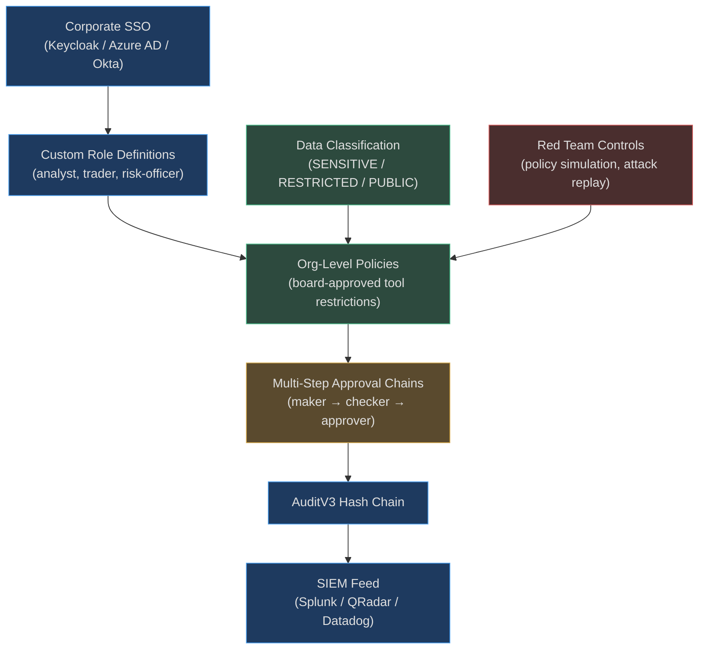
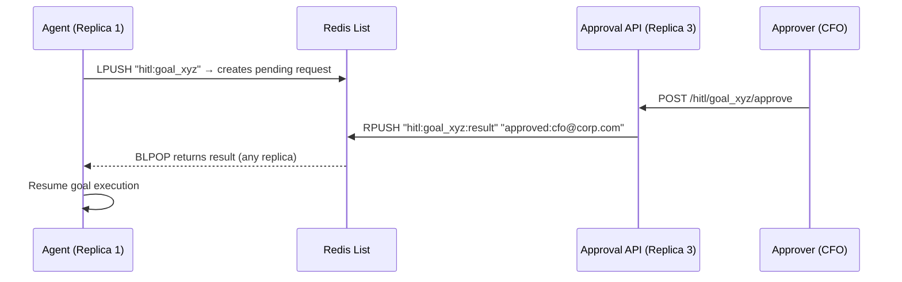

# Enterprise Controls

Enterprise governance extends beyond basic access control and audit trails. Large
organizations need multi-person approval chains for high-stakes actions, integration with
corporate identity providers, data sensitivity-aware policy enforcement, controlled
adversarial testing, and automated compliance reporting.

---

## Enterprise Governance Stack



---

## Multi-Step Approval Chains (HITL)

### Beyond Single Approver

Basic HITL requires one approver. Enterprise HITL supports multi-person approval chains —
the "four-eyes principle" and beyond:

```python
req = gateway.request_approval(
    goal_id="goal_xyz",
    action="process_wire_transfer(amount=500000, destination='SWIFT:BOFAUS3NXXX')",
    risk_level="critical",
    tenant_ctx=tenant_ctx,
    required_approvers=2,    # Two separate humans must approve
)
```

The `HITLGateway` tracks `required_approvers` vs `approvals_received`. The goal resumes
only when `approvals_received >= required_approvers`.

### Approval States

```python
class ApprovalStatus(enum.StrEnum):
    PENDING = "pending"        # waiting for first approval
    APPROVED = "approved"      # all required approvals received
    REJECTED = "rejected"      # any single rejection blocks
    TIMED_OUT = "timed_out"   # 5-minute default timeout
```

A single rejection from any required approver cancels the entire chain — the minority veto
principle. This prevents adversarial approvers from being outvoted.

### Cross-Replica Persistence (Redis BLPOP)



The approval lives in Redis, not process memory. The agent that submitted the request and
the replica that receives the approval can be different machines — approval delivery is
guaranteed across any cluster topology.

### Timeout Escalation

If no approval arrives within `DEFAULT_TIMEOUT = 300s`:
1. Status transitions to `TIMED_OUT`
2. Goal is marked `blocked_pending_timeout`
3. Audit event records `outcome="timed_out"`
4. Notification sent to escalation chain (configurable)

---

## SSO Integration

Enterprise customers authenticate via Keycloak, Azure AD, or Okta instead of (or in
addition to) API keys. The SSO flow integrates with the same `TenantContext` model:

```python
async def _try_resolve_sso(request: Request) -> TenantContext | None:
    """Attempt to resolve a Keycloak JWT Bearer token to a TenantContext."""
    from app.auth.keycloak import _sso_enabled, resolve_tenant_from_jwt

    if not _sso_enabled():
        return None

    auth = request.headers.get("Authorization", "")
    token = auth[7:].strip()  # "Bearer <jwt>"

    return await resolve_tenant_from_jwt(token)
    # Maps JWT claims → tenant_id, plan, roles
```

SSO-authenticated requests flow through the same middleware as API-key requests. The
`TenantContext` is identical regardless of auth method — all downstream governance code
is auth-method agnostic.

**Bypass paths for SSO:**
- `/auth/login` — initiates SSO redirect to IdP
- `/auth/callback` — OAuth2 callback, exchanges code for JWT
- `/auth/token` — authorization code exchange
- `/auth/config` — frontend discovers IdP endpoints

---

## Domain-Specific Role Templates

Enterprise deployments often need custom role names that map to domain vocabulary.
`domain_role_templates.py` provides pre-built role configurations for common verticals:

| Domain | Custom Roles | Maps To |
|--------|--------------|---------|
| Banking | `analyst`, `trader`, `risk-officer`, `compliance` | operator, operator, approver, admin |
| Healthcare | `clinician`, `nurse`, `administrator` | viewer, operator, admin |
| Legal | `associate`, `partner`, `paralegal` | viewer, admin, viewer |

Custom roles are defined at the org level and stored per-tenant. The RBAC hierarchy
expansion applies to custom roles the same way as built-in roles.

---

## Data Classification Integration

`data_classification/` tags data with sensitivity levels that flow into policy evaluation:

| Classification | Examples | Policy Impact |
|---|---|---|
| `PUBLIC` | Marketing content, documentation | No restrictions |
| `INTERNAL` | Employee directories, internal docs | ALLOW_LOG |
| `SENSITIVE` | Customer PII, financial data | APPROVAL for export |
| `RESTRICTED` | Trade secrets, patient records, auth tokens | DENY or APPROVAL |

When an agent retrieves a knowledge chunk or memory entry, the data classification tag is
part of the tool call context. Policies can reference it:

```json
{
  "name": "no-restricted-data-export",
  "conditions": [
    {"field": "retrieved_data_classification", "op": "eq", "value": "restricted"},
    {"field": "tool_name", "op": "starts_with", "value": "export_"}
  ],
  "logic": "AND",
  "action": "deny",
  "message": "Cannot export RESTRICTED data without explicit approval workflow"
}
```

---

## Red Team Controls

`enterprise/red_team.py` provides controlled adversarial testing within the governance
framework:

**Policy simulation:** Run a proposed policy change against a recorded production trace
without applying it — see which historical tool calls would have been blocked.

**Attack replay:** Replay known attack patterns (prompt injection, privilege escalation,
data exfiltration) against the current policy configuration to verify defenses hold.

**Penetration testing mode:** A dedicated tenant scope that allows testing dangerous
tool patterns without affecting production data, while logging everything to the audit trail.

Red team sessions are fully audited and always run under a separate `tenant_id` with a
`redteam` role that has no access to production data.

---

## Marketplace Controls

`enterprise/marketplace.py` manages which agent templates and skills are approved for use:

- **Approved templates:** Only templates in the tenant's approved list are deployable.
- **Skill vetting:** External skills must pass a security review before appearing in the
  marketplace for a regulated tenant.
- **Version pinning:** Enterprise tenants can pin to specific template versions to prevent
  automatic updates from changing agent behavior.
- **Policy inheritance:** Templates can carry embedded policies that activate when deployed
  to a governed tenant.

---

## Compliance Reporting

AgentVerse generates automated compliance status reports on demand or on schedule:

### Report Contents

```
Compliance Status Report — ACME Bank — Q2 2026
━━━━━━━━━━━━━━━━━━━━━━━━━━━━━━━━━━━━━━━━━━━━━━

Active compliance bundles: GDPR, SOC2, PCI-DSS

Audit trail:
  ✓ 2,847,432 records in hash chain
  ✓ Chain integrity: verified (0 breaks)
  ✓ SIEM delivery: 99.97% success rate
  ✓ Legal holds: 3 active (SEC-2026-00142, GDPR-001, Internal-Audit-Q2)

Policy compliance:
  ✓ 147 policy violations blocked (all correctly denied)
  ✓ 23 HITL approvals (all within SLA)
  ✗ 2 HITL timeouts (escalation sent, both later resolved)

Budget controls:
  ✓ No budget overruns this quarter
  ✓ 14 80%-threshold alerts (all acknowledged within 4h)

Access reviews:
  ✓ Quarterly access review completed 2026-04-01
  ✓ 3 stale API keys revoked
  ✓ 1 role change (analyst → risk-officer) logged
```

---

## Real-World: Bank Deploys AgentVerse

**The setup:** A mid-size bank deploys AgentVerse for 200 analysts and risk officers.
The platform must meet: SOX compliance, SWIFT network controls, FATF AML requirements.

**Configuration:**
```
Compliance bundles: soc2, pci_dss
Custom roles: analyst (→ operator), risk-officer (→ approver), chief-risk-officer (→ admin)
SSO: Azure AD, mapped to custom roles via group claims

Policies:
- wire_transfer > $100K → require_approvers=2 (risk-officer + chief-risk-officer)
- Any "payment_*" tool: 24/7 HITL, 4-eyes minimum
- Database write tools: blocked on weekends (no_prod_deploy_weekend equivalent)
- export_*: RESTRICTED data → always DENY (no exception)

SIEM: QRadar via LEEF adapter, real-time stream
Legal holds: Auto-created for any account flagged by AML scoring model

Audit retention: SOC2 requires 1 year; bank policy requires 7 years (soc2 bundle extended)
```

**Outcome:** 3 months in, a $4.2M unauthorized wire transfer attempt was blocked:
```
Agent "payment_automation" called pay_wire(amount=4200000, dest="offshore_account")
→ PolicyEngine: amount > $100K → REQUIRE_APPROVAL (2 approvers)
→ HITL requests sent to risk-officer and chief-risk-officer
→ Chief-risk-officer: REJECTED ("unrecognized beneficiary — AML flag")
→ Audit: tamper-proof record of the attempt and rejection
→ SIEM: QRadar alert → compliance team → regulatory report filed
→ Wire: never executed
```

---

**Real-World Example 2 — Global Insurance Company (GDPR + Lloyd's of London)**

> A multinational insurer deploys AgentVerse across 30 countries. EU agents are bound by GDPR bundle (7-year retention, right-to-forget within 72h); UK agents by Lloyd's syndicate rules (10-year retention, annual market conduct review). Custom enterprise roles map to underwriting hierarchy: `underwriter` (read + quote), `senior_underwriter` (write + bind up to £500K), `chief_underwriter` (bind unlimited, approve HITL requests). Red team runs quarterly penetration tests using the simulation sandbox — last quarter it identified a policy gap where agents could access competitor rate cards via a misconfigured knowledge collection scope, fixed before any real agent used it.

<!-- Sources: app/governance/hitl.py, app/governance/policies.py,
     app/governance/compliance_bundles.py, app/governance/siem_adapters.py,
     app/tenancy/rbac.py, app/tenancy/middleware.py, app/enterprise/ -->
