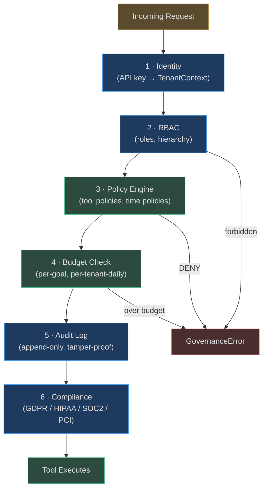

# Governance

> Control, visibility, and compliance for every autonomous action your agents take.

Governance is the operating system of trust. Without it, an autonomous agent is a liability.
With it, the same agent becomes a competitive advantage — one you can audit, budget, constrain,
and confidently deploy to regulated customers.

AgentVerse governance is **not a bolt-on**. Every tool call, every LLM invocation, every
memory write passes through the same pipeline before it executes.

---

## The Core Problem Governance Solves

Traditional software does what you code it to do. Agentic software does what it *decides* to
do based on a natural-language goal — which means you need runtime controls that go far beyond
static access control lists:

| Traditional Software | Agentic Platform Without Governance | AgentVerse |
|---|---|---|
| Predictable execution paths | Any tool, any order, any argument | Policies + permissions gate every tool |
| ACLs set at deploy time | No budget concept | Per-goal, per-tenant cost budgets |
| Logs are structured | Actions hard to explain | Append-only audit with full context |
| Single tenant | Shared infra, data leakage risk | Postgres RLS + tenant-scoped Redis |
| Human approves risky ops | Fully autonomous (no override) | HITL gateway for high-risk actions |

---

## Governance Pillars



### Pillar 1: Identity
Every request carries an API key. The `TenantMiddleware` resolves it to a `TenantContext`
containing `tenant_id`, `plan`, `api_key_id`, and `roles`. No context = 401, immediately.

### Pillar 2: Authorization (RBAC)
Four roles — `admin`, `operator`, `approver`, `viewer` — with strict hierarchy. Admin implies
all. Operator implies viewer. Roles are checked on every API endpoint.

### Pillar 3: Policy Enforcement
The `PolicyEngine` evaluates every tool call against named policies. Policies can DENY, ALLOW,
or REQUIRE_APPROVAL. Time-based policies block destructive tools overnight. Redis pub/sub
propagates policy changes to all replicas within milliseconds.

### Pillar 4: Cost Control
`CostController` tracks per-goal and per-tenant-daily spend in Redis. Before any LLM call or
tool execution, the controller checks the budget. Exceed the limit → action blocked.

### Pillar 5: Audit Trail
Every governed action writes an `AuditEvent` (v1), `AuditRecord` (v3 with hash chain), or
structured log via SIEM adapters. The append-only constraint is enforced structurally — no
delete or update method exists.

### Pillar 6: Compliance
Pre-built `ComplianceBundle` objects (HIPAA, GDPR, SOC2, PCI-DSS, India DPDP) automatically
apply the right guardrails, audit retention, PII masking, and HITL requirements for a
regulated industry.

---

## Who Needs Governance

### Enterprise SaaS
A company deploying AgentVerse for 500 internal teams needs:
- **Tenant isolation**: Team A cannot see Team B's agents or data.
- **Cost control**: Each team has a monthly budget; the platform doesn't overspend.
- **Audit**: The CISO can answer "who ran what agent at what time with what outcome?"

### Regulated Industries (Healthcare, Finance, Legal)
A hospital deploying an AI scheduling agent needs:
- **HIPAA compliance bundle**: PHI never appears in logs. BAA acknowledged.
- **HITL for patient data writes**: No autonomous `update_patient_record` without approval.
- **6-year audit retention**: Required by HIPAA.

### Multi-Tenant SaaS Platform Builders
A startup building on AgentVerse to serve their own customers needs:
- **API key scopes**: Each customer key grants access to only their resources.
- **Per-plan limits**: Free tier gets 25 goals/day; enterprise gets 50,000.
- **Row-Level Security**: Postgres enforces isolation at the DB, not just in app code.

---

## How Governance Integrates with the Agent Loop

```mermaid
sequenceDiagram
    participant Goal as GoalService
    participant Loop as Agent Loop
    participant PE as PolicyEngine
    participant CC as CostController
    participant HITL as HITLGateway
    participant Audit as AuditLog

    Goal->>Loop: start(goal_id, tenant_ctx)
    Loop->>PE: evaluate(tool_name, tenant_ctx)
    PE-->>Loop: REQUIRE_APPROVAL
    Loop->>HITL: request_approval(goal_id, action)
    HITL-->>Loop: approved=True, approver="alice@corp.com"
    Loop->>CC: check_and_record(goal_id, cost_usd)
    CC-->>Loop: True (within budget)
    Loop->>Audit: record(AuditEvent(..., approver="alice"))
    Loop->>Loop: execute tool
```

The agent loop is **governance-first**: policy evaluation happens before the LLM decides
anything. If the policy says no, the tool never fires.

---

## Performance Characteristics

| Operation | Latency | Notes |
|-----------|---------|-------|
| API key resolution | < 1 ms | In-memory map after warm-up |
| RBAC role check | < 0.1 ms | Pure Python frozenset lookup |
| Policy evaluation | < 1 ms | In-memory list scan, glob matching |
| Redis cost check | 1-2 ms | Single INCRBY + GET roundtrip |
| Audit write (in-memory) | < 0.1 ms | List append, fire-and-forget to DB |
| Audit write (DB) | async | Background task, never blocks caller |
| RLS context set | < 0.5 ms | Single `SET LOCAL` SQL statement |

---

## Navigation

| Document | What It Covers |
|----------|----------------|
| [01-tenant-isolation-and-rbac.md](./01-tenant-isolation-and-rbac.md) | Multi-tenancy, API keys, RBAC, Postgres RLS |
| [02-policy-engine.md](./02-policy-engine.md) | Policy types, evaluation, time policies, approval workflow |
| [03-cost-control-and-budgets.md](./03-cost-control-and-budgets.md) | Budget model, Redis tracking, plan tiers, alerts |
| [04-audit-trail-and-compliance.md](./04-audit-trail-and-compliance.md) | Audit v3 hash chain, SIEM, legal holds, compliance bundles |
| [05-enterprise-controls.md](./05-enterprise-controls.md) | HITL approval chains, SSO, red team, marketplace controls |

<!-- Sources: app/governance/audit.py, app/governance/policies.py, app/governance/cost.py,
     app/governance/permissions.py, app/governance/hitl.py, app/governance/compliance_bundles.py,
     app/tenancy/middleware.py, app/tenancy/rbac.py, app/tenancy/context.py, app/db/rls.py -->
