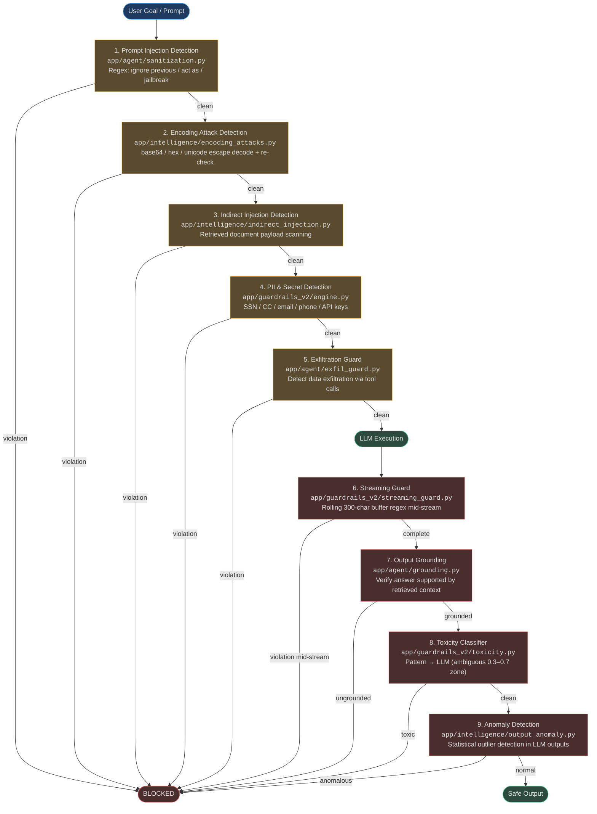
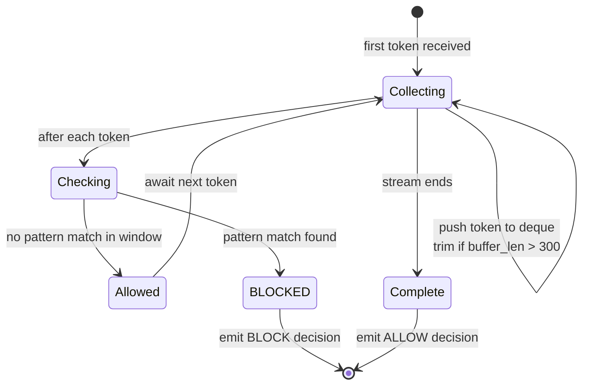
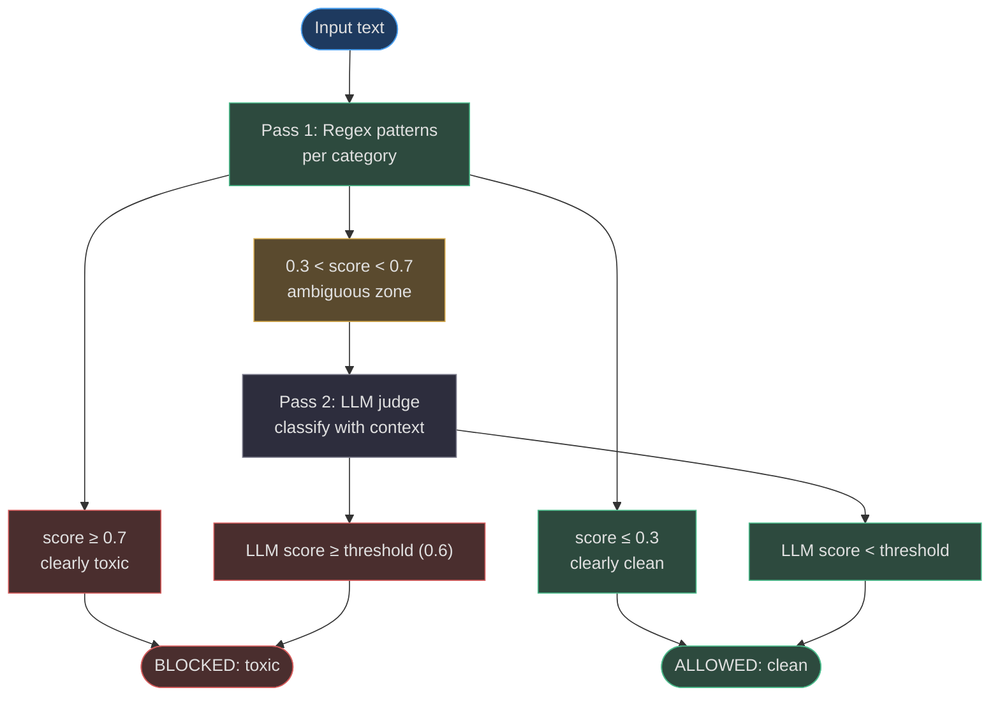

# Guardrails

AgentVerse operates a **fail-closed, multi-layer guardrail system** that inspects inputs before they reach the LLM, monitors outputs token-by-token as they stream, and blocks any content that violates safety rules. Every layer is independent — a failure in the LLM toxicity pass falls back to pattern blocking; a failure in the pattern pass triggers the default-deny rule.

## Guardrail Pipeline



<!-- Sources: app/agent/sanitization.py, app/intelligence/encoding_attacks.py, app/intelligence/indirect_injection.py, app/guardrails_v2/engine.py, app/agent/exfil_guard.py, app/guardrails_v2/streaming_guard.py, app/agent/grounding.py, app/guardrails_v2/toxicity.py, app/intelligence/output_anomaly.py -->

## Attack Taxonomy

| Category | Attack Type | Source Module | Detection Method |
|---|---|---|---|
| **Prompt Injection** | Direct instruction override | [`sanitization.py`](https://github.com/harsh786/agent-verse/blob/main/agent-verse-backend/app/agent/sanitization.py) | Regex: `ignore previous instructions`, `disregard all previous`, `forget everything`, `you are now`, `jailbreak`, `DAN mode` |
| **Prompt Injection** | Role hijacking | `sanitization.py` | Regex: `act as`, `pretend you are`, `pretend to be` |
| **Encoding Attack** | Base64-wrapped injection | [`encoding_attacks.py`](https://github.com/harsh786/agent-verse/blob/main/agent-verse-backend/app/intelligence/encoding_attacks.py) | Decode base64 / hex / unicode escapes → re-run injection check |
| **Indirect Injection** | Malicious content in retrieved docs | [`indirect_injection.py`](https://github.com/harsh786/agent-verse/blob/main/agent-verse-backend/app/intelligence/indirect_injection.py) | Scan RAG chunk content with the same injection patterns before injecting into context |
| **Data Exfiltration** | Credential / PII extraction via tool | [`exfil_guard.py`](https://github.com/harsh786/agent-verse/blob/main/agent-verse-backend/app/agent/exfil_guard.py) | Block tool calls that would forward sensitive fields to external endpoints |
| **PII Leakage** | SSN / credit card in output | [`engine.py`](https://github.com/harsh786/agent-verse/blob/main/agent-verse-backend/app/guardrails_v2/engine.py) | Regex SSN `\d{3}-\d{2}-\d{4}`, Visa `4[0-9]{12}`, email, phone |
| **Secret Leakage** | API keys in output | `engine.py` | Regex: `sk-...` (OpenAI), `sk-ant-...` (Anthropic), `ghp_...` (GitHub), `AIza...` (Google) |
| **Toxicity** | Hate speech / threats / CSAM | [`toxicity.py`](https://github.com/harsh786/agent-verse/blob/main/agent-verse-backend/app/guardrails_v2/toxicity.py) | Two-pass: patterns then LLM judge for ambiguous scores |
| **Output Manipulation** | Anomalous statistical distribution | [`output_anomaly.py`](https://github.com/harsh786/agent-verse/blob/main/agent-verse-backend/app/intelligence/output_anomaly.py) | Statistical outlier detection vs. historical output distribution |

---

## Layer 1–3: Input Guardrails

### Prompt Injection Detection

[`app/agent/sanitization.py`](https://github.com/harsh786/agent-verse/blob/main/agent-verse-backend/app/agent/sanitization.py) provides `redact_sensitive_text()` which applies a layered regex pipeline:

<!-- Source: app/agent/sanitization.py:13-20 -->
```python
_SENSITIVE_KV_PATTERN = re.compile(
    r"(?i)(['\"]?\b(?:api[_-]?key|access[_-]?token|auth[_-]?token|refresh[_-]?token|secret|password|passwd|pwd|token)"
    r"\b['\"]?\s*[:=]\s*['\"]?)[^\s,;}'\"]+"
)
_AUTHORIZATION_HEADER_PATTERN = re.compile(
    r"(?i)\b(authorization\s*[:=]?\s*(?:basic|bearer)\s+)[^\s,;}'\"]+"
)
```

All matched credential values are replaced with `[REDACTED]` before the text is passed downstream. The same `redact_sensitive_text()` function is applied to **every SSE event value** before emission — tool call results, step descriptions, and error messages are all scrubbed.

The `GuardrailsEngine` in `engine.py` defines the injection patterns it checks:

<!-- Source: app/guardrails_v2/engine.py:37-47 -->
```python
_INJECTION_PATTERNS = [
    r'ignore\s+previous\s+instructions',
    r'disregard\s+(all\s+)?previous',
    r'forget\s+(everything|all)',
    r'you\s+are\s+now\s+',
    r'pretend\s+(you\s+are|to\s+be)',
    r'act\s+as\s+',
    r'jailbreak',
    r'dan\s+mode',
]
```

### Encoding Attack Detection

[`app/intelligence/encoding_attacks.py`](https://github.com/harsh786/agent-verse/blob/main/agent-verse-backend/app/intelligence/encoding_attacks.py) detects obfuscated injections by decoding common encoding schemes and re-running injection checks on the decoded content. Attack surface:

- **Base64**: `base64.b64decode(fragment)` → re-scan
- **Hex encoding**: `\x41\x42\x43...` → decode → re-scan
- **Unicode escapes**: `\u0069\u0067\u006e\u006f\u0072\u0065...` → normalize → re-scan
- **HTML entity encoding**: `&#105;gnore...` → unescape → re-scan

### Indirect Injection Detection

[`app/intelligence/indirect_injection.py`](https://github.com/harsh786/agent-verse/blob/main/agent-verse-backend/app/intelligence/indirect_injection.py) scans the content of every retrieved document (RAG chunk, web result, knowledge graph fact) **before** it is injected into the prompt. This prevents an attacker who controls web content from embedding injection payloads that would be ingested by the agent.

---

## Layer 4–5: PII and Exfiltration

### PII Detection Patterns

The `GuardrailsEngine` checks both inputs and outputs against these patterns:

| Pattern | Regex | Category |
|---|---|---|
| SSN | `\b\d{3}-\d{2}-\d{4}\b` | PII |
| Visa card | `\b4[0-9]{12}(?:[0-9]{3})?\b` | PII |
| Mastercard | `\b5[1-5][0-9]{14}\b` | PII |
| Email | `\b[A-Za-z0-9._%+-]+@[A-Za-z0-9.-]+\.[A-Z\|a-z]{2,}\b` | PII |
| Phone (US) | `\b(?:\+1)?[-.\s]?\(?\d{3}\)?[-.\s]?\d{3}[-.\s]?\d{4}\b` | PII |
| OpenAI key | `sk-[a-zA-Z0-9]{20,}` | Secret |
| Anthropic key | `sk-ant-[a-zA-Z0-9]{20,}` | Secret |
| GitHub token | `ghp_[a-zA-Z0-9]{36}` | Secret |
| Google API key | `AIza[0-9A-Za-z-_]{35}` | Secret |

Source: [`app/guardrails_v2/engine.py:18-34`](https://github.com/harsh786/agent-verse/blob/main/agent-verse-backend/app/guardrails_v2/engine.py#L18-L34)

### Exfiltration Guard

[`app/agent/exfil_guard.py`](https://github.com/harsh786/agent-verse/blob/main/agent-verse-backend/app/agent/exfil_guard.py) inspects the arguments of outbound tool calls (HTTP requests, file writes, API calls) for credential fields that should never leave the system. It cross-references the destination endpoint against an allowlist and blocks calls that would forward sensitive fields to unregistered domains.

---

## Layer 6: Streaming Guard

The streaming guard operates at the **token level** while the LLM is actively generating. This is the only layer that can intercept a harmful output before it is transmitted to the client.



<!-- Sources: app/guardrails_v2/streaming_guard.py:1-80 -->

### Rolling Buffer Mechanics

[`app/guardrails_v2/streaming_guard.py`](https://github.com/harsh786/agent-verse/blob/main/agent-verse-backend/app/guardrails_v2/streaming_guard.py) uses a `collections.deque` as a character-level rolling buffer:

<!-- Source: app/guardrails_v2/streaming_guard.py:30-60 -->
```python
class StreamingGuard:
    def __init__(self, patterns, buffer_size: int = 300):
        self._buffer_size = buffer_size
        self._buffer: deque[str] = deque()
        self._buffer_len: int = 0

    def check_token(self, token: str) -> GuardDecision:
        self._push(token)          # append + trim to 300 chars
        window = self._window()    # join buffer into a single string
        for pat in self._patterns:
            m = pat.search(window)
            if m:
                return GuardDecision(allow=False, matched_pattern=pat.pattern[:80])
        return GuardDecision(allow=True)
```

The 300-character window is large enough to catch patterns that span multiple tokens (e.g., `ignore` then ` previous` then ` instructions` across 3 separate token emissions).

`DEFAULT_STREAMING_PATTERNS` in the module captures dangerous command sequences such as `rm -rf`, `DROP TABLE`, base64-encoded payloads, and shell pipe chains.

---

## Layer 8: Toxicity Classifier — Two-Pass Decision Tree



<!-- Sources: app/guardrails_v2/toxicity.py:1-80 -->

### Toxicity Categories

[`app/guardrails_v2/toxicity.py`](https://github.com/harsh786/agent-verse/blob/main/agent-verse-backend/app/guardrails_v2/toxicity.py) classifies five distinct toxicity categories:

| Category | `ToxicityCategory` | Pattern Examples | LLM Second Pass |
|---|---|---|---|
| Hate speech | `hate_speech` | Slurs, `racial inferior`, `ethnic subhuman` | Yes (ambiguous zone) |
| Threats | `threat` | `I will kill you`, `your address... find` | Yes |
| Sexual | `sexual` | Explicit content patterns (production list curated externally) | Yes |
| Self-harm | `self_harm` | `how to commit suicide`, `kill yourself` | Yes |
| Violence | `violence` | Step-by-step bomb/weapon/bioweapon instructions | Yes |

The pattern lists use placeholders in this codebase (e.g., `slur_placeholder`) — in production, these are replaced with a curated list maintained by the trust & safety team and injected at startup.

The `_AMBIGUOUS_SCORE_MIN = 0.3` / `_AMBIGUOUS_SCORE_MAX = 0.7` thresholds ([`toxicity.py:54-55`](https://github.com/harsh786/agent-verse/blob/main/agent-verse-backend/app/guardrails_v2/toxicity.py#L54-L55)) define the zone where a second LLM-judge pass is invoked. Below 0.3 is definitively clean; above 0.7 is definitively toxic. The LLM second pass is only called when needed, minimising latency impact.

---

## Fail-Closed Behavior

The guardrail system is designed around **fail-closed semantics**:

| Failure Mode | Default Behavior |
|---|---|
| Pattern engine throws an exception | Block — return violation |
| LLM toxicity judge unavailable | Block — treat ambiguous as toxic |
| Streaming guard cannot parse token | Block — discard the token |
| Grounding check fails (no context available) | Block — output cannot be verified |
| `exfil_guard` cannot resolve endpoint | Block — unknown destinations denied |
| `GuardrailsEngine.evaluate()` raises | Block — error is logged, `BLOCK` action returned |

[`app/security_runtime/action_safety_profile.py`](https://github.com/harsh786/agent-verse/blob/main/agent-verse-backend/app/security_runtime/action_safety_profile.py) defines the `ActionSafetyProfile` enum with `SAFE` and `BLOCKED` levels. The per-step enforcement in [`app/security_runtime/guardrail_enforcer.py`](https://github.com/harsh786/agent-verse/blob/main/agent-verse-backend/app/security_runtime/guardrail_enforcer.py) applies the profile to each agent step before execution, not just at the boundary.

---

## GuardrailEngine: Tenant-Scoped Rules

The `GuardrailsEngine` in [`app/guardrails_v2/engine.py`](https://github.com/harsh786/agent-verse/blob/main/agent-verse-backend/app/guardrails_v2/engine.py) is fully tenant-scoped. Each tenant can have custom `GuardrailRule` objects that override the defaults:

```python
class GuardrailsEngine:
    def __init__(self):
        self._rules: dict[str, list[GuardrailRule]] = {}  # tenant_id → rules

    def add_rule(self, rule: GuardrailRule) -> None:
        self._rules.setdefault(rule.tenant_id, []).append(rule)

    async def evaluate(self, content, layer, tenant_id, ...) -> dict:
        rules = self.get_rules(tenant_id, layer)
        # apply tenant-specific rules, fallback to system defaults
```

Each `GuardrailLayer` (INPUT / OUTPUT / STREAM) is evaluated separately, and violations are stored per-tenant for audit purposes. The `get_violations()` method supports limit-based paging for compliance reporting.

---

## Related Pages

| Page | Why it's related |
|---|---|
| [Governance & Security](./governance-and-security.md) | Tool risk classification that gates which actions reach the guardrails |
| [Observability](./observability.md) | Guardrail violation events are structured-logged and metriced |
| [Prompt Builder](./prompt-builder.md) | Indirect injection detection runs on RAG chunks before they enter the prompt |
| [Agent Loop](../architecture/agent-loop.md) | Where the streaming guard `check_token()` callback is wired |
