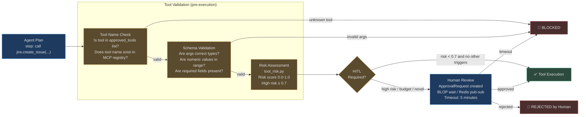
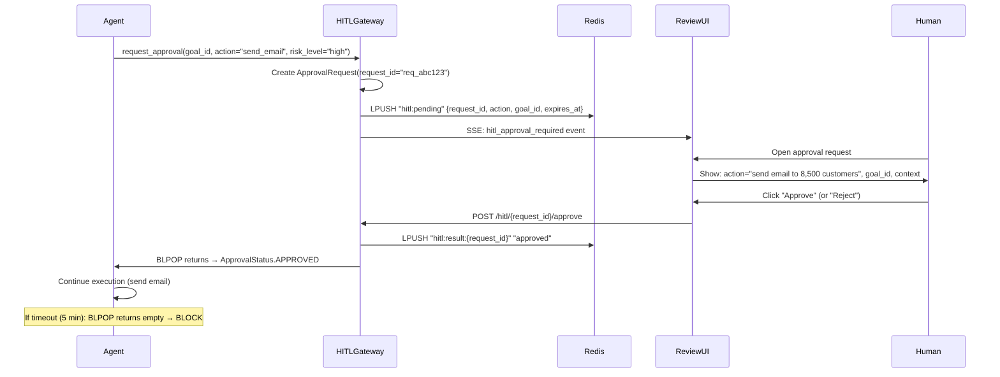

# Output Validation and Human-in-the-Loop

The final guardrail tier addresses two questions: "Is this tool call valid and safe?" and "Does a human need to approve this before it happens?" Together, these checks ensure that every action the agent takes has been validated for correctness and authorized for risk level.

## Tool Validation Pipeline



---

## Output Grounding

**Source:** `app/intelligence/nli_checker.py`

Output grounding answers: "Is what the agent said actually supported by what it retrieved?" Hallucination in an autonomous agent is more dangerous than in a chatbot — a hallucinated fact in an agent output might be used to trigger real actions (send an email, file a report, update a database).

### How Grounding Works

The `NLIChecker` evaluates whether the agent's final answer is **entailed** by the top retrieved chunks:

```python
# After goal completes, before delivering to user:
score = await nli_checker.check_answer_consistency(
    answer=final_answer,        # What the agent said
    chunks=top_3_rag_chunks,   # What it retrieved
    provider=llm_provider,
)
# score: 0.9 = entailed (grounded)
#        0.5 = neutral (no evidence either way)
#        0.15 = contradicts (hallucination detected)
```

The NLI prompt (`_NLI_PROMPT`) asks the LLM to return exactly one word: `ENTAILS`, `CONTRADICTS`, or `NEUTRAL`. The response is parsed with `max_tokens=10` — the absolute minimum cost for this check (approximately $0.0001 per check).

### Grounding Outcomes

| NLI Verdict | Score | Action |
|---|---|---|
| ENTAILS | 0.9 | Output delivered to user |
| NEUTRAL | 0.5 | Output delivered with lower confidence annotation |
| CONTRADICTS | ~0.15 | Output blocked; `grounding_failure` event logged |

### Citation Verification

For outputs that include explicit citations (e.g., "According to the Q4 Board Report [chunk_id_42]..."), AgentVerse verifies:

1. `chunk_id_42` exists in the vector store for this tenant
2. The chunk content was actually retrieved in this goal execution (not fabricated)
3. The chunk is semantically related to the cited claim

A fabricated citation — where the model invents a source identifier — triggers a `tool_hallucination` violation at severity `high`.

---

## Tool Hallucination Prevention

The agent planner sometimes invents tool names that don't exist. The tool name check prevents these phantom tool calls from causing errors or security bypasses.

### Validation Levels

**Level 1: MCP Registry Check**  
Every tool call is validated against the `MCPRegistry`. If the tool name is not registered for this tenant's connected connectors, the call is blocked immediately:

```
Tool "jira.delete_project" called
→ MCPRegistry lookup: "jira.delete_project" not in approved_tools for tenant "acme-corp"
→ BLOCK: GuardrailViolation(category="tool_injection", action="block")
→ Log: tool_hallucination_detected tool=jira.delete_project tenant=acme-corp
```

**Level 2: Argument Schema Validation**  
Even for valid tool names, argument schemas are validated against the tool's registered JSON schema. Type mismatches, out-of-range values, and missing required fields are caught before the MCP client sends the request.

```python
# Tool: confluence_read expects {"page_id": str}
# Agent calls: confluence_read({"page_id": 12345})  ← int, not str
→ Schema validation fails → BLOCK
```

**Level 3: Argument Content Scanning**  
`GuardrailLayer.TOOL_ARGS` scans argument *values* for dangerous patterns — PII, secrets, shell injection, SQL injection — before the tool call is made.

---

## Human-in-the-Loop (HITL) Gates

**Source:** `app/governance/hitl.py`

The `HITLGateway` pauses agent execution and routes the pending action to a human reviewer. This is the highest-trust safety mechanism: a human explicitly approves or rejects before any irreversible action proceeds.

### When HITL Is Triggered

| Trigger | Example | Risk Level |
|---|---|---|
| High-risk tool keyword | `delete`, `deploy`, `send`, `publish`, `drop` | High |
| Novel action | Tool call never made before by this agent | Medium |
| Budget threshold | Goal is within 80% of tenant spend limit | Medium |
| Low verifier confidence | Verifier score < 0.5 on step completion | Medium |
| Mass communication | Tool would send to > 100 recipients | Critical |
| Production environment detection | Arguments contain "prod", "production", "live" | High |
| Explicit HITL rule | Tenant configured HITL for this tool/connector | Configured |

### HITL Workflow



### ApprovalRequest Structure

```python
@dataclass
class ApprovalRequest:
    goal_id: str             # Which goal is waiting
    action: str              # Human-readable: "Send email to 8,500 customers"
    risk_level: str          # "high" | "critical"
    request_id: str          # UUID hex — used for Redis key and response routing
    status: ApprovalStatus   # PENDING → APPROVED / REJECTED / TIMED_OUT
    approver: str | None     # Who approved (email/username)
    note: str                # Reviewer's optional note
    required_approvers: int  # 1 for standard, 2 for critical actions
    approvals_received: int  # Current approval count
```

### Dual-Mode Operation

The HITL gateway supports two execution modes:

**In-Process Mode (tests, single replica):**  
Uses `asyncio.Event` — the agent coroutine awaits the event, which is set when `approve()` is called.

**Cross-Replica Mode (production, multi-replica):**  
Uses `Redis BLPOP`. The approval result is stored in a Redis list keyed by `request_id`. Any replica can pick up the result, not just the one that created the request. This ensures HITL works correctly across Celery workers and multiple API replicas.

```python
# Publishing approval from any replica:
async def publish_resolution(self, request_id: str, approved: bool) -> None:
    await redis.lpush(f"hitl:result:{request_id}", "approved" if approved else "rejected")
    # The waiting replica's BLPOP returns immediately
```

### Timeout Escalation

| Timeout | Action | Who Is Notified |
|---|---|---|
| 5 minutes | Request marked `TIMED_OUT`; agent execution fails | Tenant admin (Slack webhook) |
| No response after 30 min | Escalation alert fired | On-call engineer |
| No response after 2 hours | Auto-reject; incident created | SRE team |

### Multiple Approvers for Critical Actions

For actions classified as `risk_level="critical"` (e.g., deleting a production database, sending communications to > 1M users), `required_approvers=2` forces two distinct approvers. The gateway tracks `approvals_received` and only proceeds when the count reaches the threshold.

---

## Fail-Closed Guarantee

The most important invariant in the guardrail system:

```python
async def evaluate(self, content, layer, tenant_id, goal_id):
    try:
        # ... evaluation logic ...
        return result
    except Exception as exc:
        # GuardrailsEngine failure → BLOCK (never ALLOW)
        log.error("guardrail_engine_error", error=str(exc))
        return {
            "blocked": True,
            "hitl_required": False,
            "violation_count": 1,
            "violations": [{"rule_name": "SYSTEM_SAFETY", "action": "block",
                           "category": "system_error", "severity": "critical"}],
        }
```

**If the guardrail engine crashes, the action is blocked.** Not allowed. Not retried. Blocked. This is the only safe default for a system that executes real-world actions.

---

## Real-World Example: Email Campaign HITL

**Scenario:** A marketing agent is tasked: "Send our Q4 product announcement to all active subscribers."

**What happens:**

1. Agent plans: step 1 = fetch subscriber list, step 2 = compose email, step 3 = send_email
2. Step 3 tool args: `send_email(recipients=8547, subject="Q4 Product Announcement", ...)`
3. Tool risk assessment: `send_email` + `recipients=8547` → risk_score = 0.95 (mass communication)
4. HITL trigger: `required_approvers=1` (not critical, single approver needed)
5. `ApprovalRequest` created, agent execution pauses
6. Reviewer (marketing manager) opens approval UI:
   - Shows: draft email content, recipient count (8,547), estimated cost ($0.43)
   - Shows: goal_id, which agent, which tenant, timestamp
7. Reviewer reads draft, adds note: "Approved — verified recipient list is opt-in"
8. Clicks Approve → Redis BLPOP returns → agent resumes
9. Email sent via `send_email` tool

**Total pause: 3 minutes 22 seconds** (human review time)  
**Consequence if no HITL:** 8,547 emails sent without human verification. One typo in the email template, and 8,547 customers see a broken email.

---

## Compliance Bundles and HITL Rules

Compliance bundles can mandate HITL for entire categories of actions:

| Bundle | HITL-Required Actions |
|---|---|
| `HIPAA` | Any tool call that writes PHI to external system |
| `SOX` | Financial data modification or export |
| `PCI` | Any action involving payment card data |
| `GDPR` | Mass data export or deletion of user records |
| Custom | Tenant-configured: `tool_name`, `connector`, `risk_level` threshold |

HITL rules defined in the compliance bundle are applied automatically when the bundle is activated — no manual rule creation required.

<!-- Sources: app/governance/hitl.py, app/guardrails_v2/engine.py, app/guardrails_v2/models.py, app/intelligence/nli_checker.py -->
