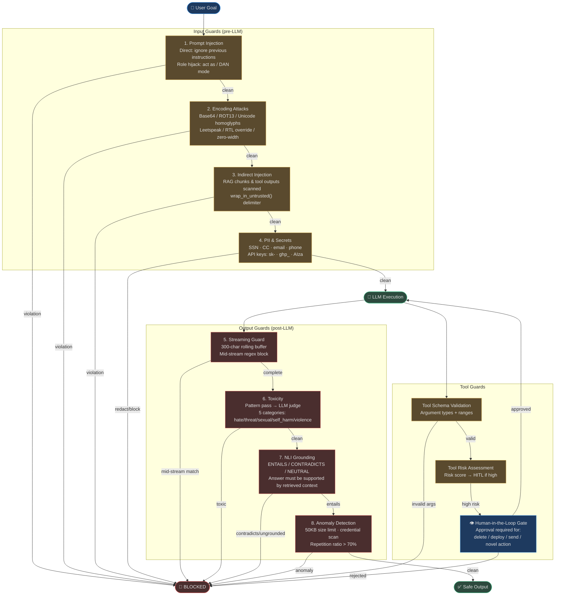

# Guardrails

> **An autonomous agent with no guardrails is an autonomous liability.** AgentVerse operates a 9-layer, fail-closed safety system that inspects every byte entering and leaving the LLM — before, during, and after generation.

Guardrails exist because autonomous agents face attacks and failure modes that traditional software doesn't: adversarial users hiding instructions in base64, malicious content embedded in documents the agent retrieved from Slack, LLM outputs that contain customer SSNs, and tool calls that would silently exfiltrate an entire database. Every layer of the guardrail system is designed to be independent — if one layer fails, the next layer still runs, and when in doubt the system blocks.

## The Fail-Closed Guarantee

```
if guardrail_engine.fails():
    action = BLOCK  # Never ALLOW
```

This is the most important invariant in the system. If the toxicity classifier throws an exception, if the NLI checker times out, if the encoding scanner encounters a novel encoding — the default is to **block the action and log the failure**. An unsafe output never reaches a user because a safety check failed to run.

## Guardrail Categories

| Category | What It Protects | Where It Runs |
|---|---|---|
| **Input Safety** | User goals, task descriptions | Before LLM sees any content |
| **Retrieval Safety** | RAG chunks, tool outputs | Between retrieval and LLM injection |
| **Output Safety** | LLM-generated text | Token-by-token during streaming + full scan after |
| **Tool Safety** | Tool arguments, tool names | Before tool execution |
| **Human Oversight** | High-risk, high-cost, novel actions | HITL gate before execution |

## Guardrail Layers

The `GuardrailLayer` enum (from `guardrails_v2/models.py`) defines exactly where each rule applies:

```python
class GuardrailLayer(str, Enum):
    GOAL         = "goal"          # User-submitted goal text
    PLAN         = "plan"          # LLM-generated plan
    STEP         = "step"          # Individual step description
    TOOL_ARGS    = "tool_args"     # Arguments before tool call
    TOOL_OUTPUT  = "tool_output"   # Raw tool return value
    FINAL_OUTPUT = "final_output"  # Agent's answer to user
    MEMORY_WRITE = "memory_write"  # Content written to long-term memory
    RAG_INGEST   = "rag_ingest"    # Documents being indexed
    GRAPH_EXTRACT = "graph_extract" # Entities extracted for knowledge graph
```

## Full Pipeline Architecture



## Compliance Bundles

Guardrail rules are organized into compliance bundles that activate sets of rules appropriate for a regulatory framework:

| Bundle | What It Enforces |
|---|---|
| `GDPR` | PII redacted from outputs and memory writes; PII blocked from RAG ingest |
| `HIPAA` | PHI blocked at every layer — goal, step, tool output, output, memory |
| `SOC2` | Secrets redacted from outputs; prompt injection blocked at goal and step |
| `PCI` | PCI data (card numbers) blocked from outputs, memory, and knowledge base |
| `DPDP` | India Data Protection — similar to GDPR scope |
| `SOX` | Financial data audit controls |

## Integration with Other Systems

| System | Integration |
|---|---|
| **Agent Loop** | `GuardrailLayer.STEP` and `TOOL_ARGS` checked at every loop iteration |
| **Prompt Builder** | Retrieved chunks pass through `scan_rag_chunks()` before context assembly |
| **Governance** | Every `GuardrailViolation` appended to append-only audit trail |
| **Observability** | Violations logged as structured events; violation count emitted as Prometheus gauge |
| **HITL Gateway** | High-risk tool calls pause execution and create `ApprovalRequest` |

## Navigation

| File | What It Covers |
|---|---|
| [01-input-and-injection-detection.md](./01-input-and-injection-detection.md) | Prompt injection, indirect injection, encoding attacks — all pre-LLM checks |
| [02-content-safety-and-pii.md](./02-content-safety-and-pii.md) | PII/PHI/PCI detection, toxicity classifier, streaming guard, anomaly detection |
| [03-output-validation-and-hitl.md](./03-output-validation-and-hitl.md) | Output grounding, tool validation, HITL approval workflow |

<!-- Sources: app/guardrails_v2/engine.py, app/guardrails_v2/models.py, app/guardrails_v2/streaming_guard.py, app/guardrails_v2/toxicity.py, app/intelligence/indirect_injection.py, app/intelligence/encoding_attacks.py, app/intelligence/nli_checker.py, app/intelligence/output_anomaly.py, app/intelligence/guardrail_patterns.py, app/governance/hitl.py -->
