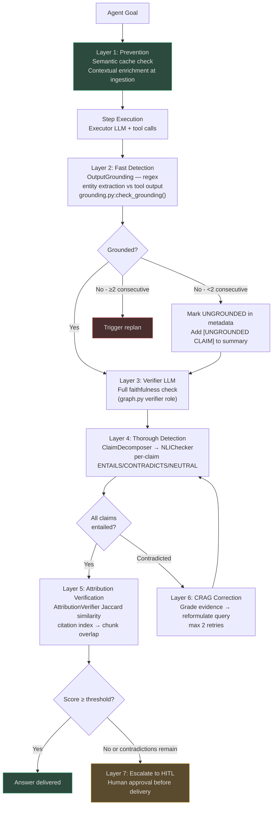
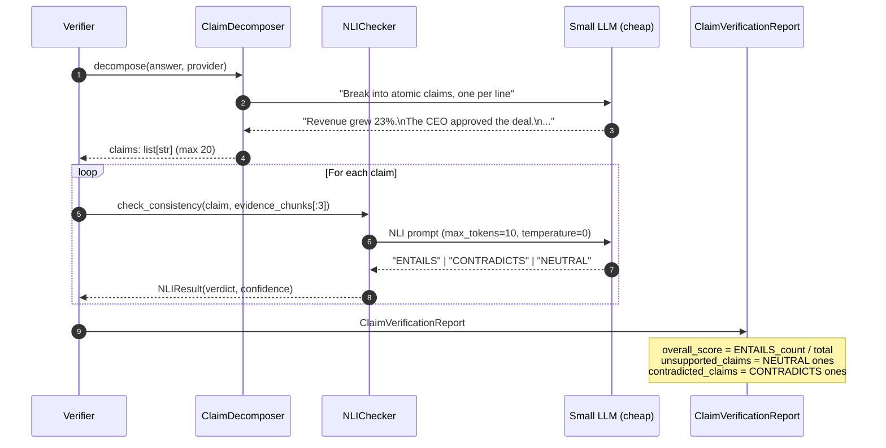
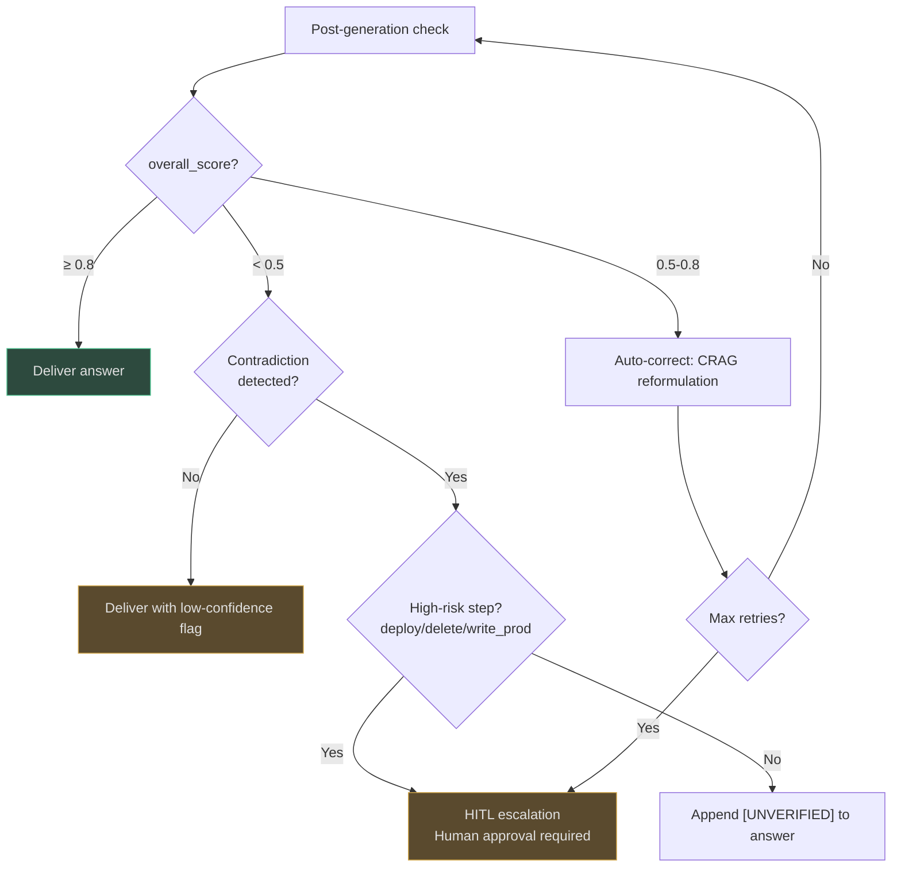

# Hallucination Handling

AgentVerse treats hallucinations as a first-class engineering problem, not an afterthought. Seven distinct mechanisms form a **defense-in-depth stack** that prevents, detects, and corrects ungrounded claims at every stage of agent execution.

## Defense Layer Summary

| Layer | Mechanism | Trigger | Cost |
|---|---|---|---|
| **Prevention** | Semantic cache deduplication | Every LLM call | Zero (cache hit) |
| **Prevention** | Contextual chunk enrichment | Ingestion | Low (1 LLM call/doc) |
| **Detection – Fast** | `OutputGrounding` (regex entity extraction) | Every executor step | Zero |
| **Detection – Thorough** | NLI claim checking | High-risk steps | Low (small model) |
| **Detection – Citation** | `AttributionVerifier` (Jaccard similarity) | Eval / verification | Zero |
| **Correction** | CRAG query reformulation | Low-relevance retrieval | Medium |
| **Correction** | Self-RAG critique loop | Verification pass | Medium |
| **Escalation** | HITL gateway | Contradicted claims / low confidence | Human |

---

## 1. Hallucination Defense Layers


<!-- Sources: app/agent/grounding.py:1-100, app/intelligence/nli_checker.py:1-100, app/intelligence/claim_decomposer.py:1-100, app/evals/attribution_verifier.py:1-80, app/rag/agentic/patterns/corrective.py:1-100 -->

---

## 2. Fast Grounding Check (Layer 2)

[`OutputGrounding`](https://github.com/harsh786/agent-verse/blob/main/agent-verse-backend/app/agent/grounding.py#L1-L100) runs a **zero-cost regex extraction pass** on every executor step output, checking that concrete claims (IDs, URLs, numbers, dates, emails, quoted strings) actually appear in the tool outputs:

```mermaid
flowchart LR
    OUT[LLM step output] --> EXT["extract_claims(output)<br>6 regex patterns"]
    EXT --> J[JIRA IDs: r'[A-Z]+-\d+']
    EXT --> P[PR numbers: r'PR\s*#?\d+']
    EXT --> U[URLs: r'https?://...']
    EXT --> D[Dates: r'\d{4}-\d{2}-\d{2}']
    EXT --> N[Numbers ≥10: r'\b\d{2,}\b']
    EXT --> Q["Quoted strings 4-60 chars"]

    J & P & U & D & N & Q --> CHK{Each claim in<br>tool_outputs?}
    CHK -->|All found| GR[grounded=True]
    CHK -->|>25% missing| UG["grounded=False<br>ungrounded_claims list"]
    UG --> META["StepResult.metadata['grounded']=False"]
    META --> COUNT{Consecutive<br>ungrounded?}
    COUNT -->|<2| CONT[Continue with warning]
    COUNT -->|≥2| REPLAN[Trigger replan]

    style GR fill:#2d4a3e,stroke:#4aba8a,color:#e0e0e0
    style REPLAN fill:#4a2e2e,stroke:#d45b5b,color:#e0e0e0
```
<!-- Sources: app/agent/grounding.py:55-100 -->

In `strict=False` mode (default), the threshold is **25%+ ungrounded claims**. `strict=True` fails on any single ungrounded claim.

---

## 3. NLI Claim Decomposition Pipeline (Layers 3–4)


<!-- Sources: app/intelligence/claim_decomposer.py:1-100, app/intelligence/nli_checker.py:1-100 -->

### NLI Confidence Mapping

[`NLIChecker`](https://github.com/harsh786/agent-verse/blob/main/agent-verse-backend/app/intelligence/nli_checker.py#L40-L80) uses a default confidence map:

| Verdict | Confidence | Meaning |
|---|---|---|
| `ENTAILS` | 0.90 | Evidence clearly supports claim |
| `CONTRADICTS` | 0.85 | Evidence refutes claim — action required |
| `NEUTRAL` | 0.50 | Evidence unrelated — claim is unsupported |

Falls back to `NEUTRAL` with `confidence=0.0` on any exception — never blocks the pipeline.

### `check_answer_consistency()` Aggregation

For a high-level consistency score without full decomposition, `check_answer_consistency(answer, chunks)` uses the top 3 chunks as a single combined evidence string and returns a `float` in `[0, 1]`.

---

## 4. Attribution Verification (Layer 5)

[`AttributionVerifier`](https://github.com/harsh786/agent-verse/blob/main/agent-verse-backend/app/evals/attribution_verifier.py#L1-L80) checks whether in-text citations (e.g. `[1]`, `[2]`) actually support the surrounding claims using **Jaccard similarity on key terms**:

```mermaid
flowchart LR
    ANS[Answer with citations<br>"Revenue grew [1], costs fell [2]"] --> EXT[_extract_citation_indices<br>regex: \[(\d+)\]]
    EXT --> IDX["[0, 1]  (0-indexed)"]
    IDX --> JC["_sentence_overlap(answer, chunk[i])<br>Jaccard on tokenised terms<br>threshold=0.15"]
    JC --> VER{overlap ≥ 0.15?}
    VER -->|Yes| PASS[verified += 1]
    VER -->|No| FAIL["failed += 1<br>unsupported_claims.append(sentence)"]
    PASS & FAIL --> REP["AttributionReport<br>precision_score = verified/total"]

    style PASS fill:#2d4a3e,stroke:#4aba8a,color:#e0e0e0
    style FAIL fill:#4a2e2e,stroke:#d45b5b,color:#e0e0e0
```
<!-- Sources: app/evals/attribution_verifier.py:1-80 -->

A `jaccard_threshold=0.15` is intentionally permissive — citations can use synonyms. Raise to 0.3 for strict factual domains (medical, legal).

---

## 5. CRAG Correction Loop (Layer 6)

[`CorrectiveRAGPattern`](https://github.com/harsh786/agent-verse/blob/main/agent-verse-backend/app/rag/agentic/patterns/corrective.py#L1-L100) runs when retrieved evidence is low quality:

```mermaid
flowchart TD
    Q[Query] --> RET[Retrieve documents]
    RET --> GRADE[grade_evidence<br>LLM scores each chunk 0.0-1.0<br>JSON: {"relevance":[0.8, 0.2]}]
    GRADE --> AVG{avg score ≥ 0.6?}
    AVG -->|Yes| GEN[Generate answer with context]
    AVG -->|No| REF[reformulate_query<br>LLM rephrases for better recall]
    REF --> RETRY{retry < MAX_CORRECTIVE_RETRIES<br>default 2}
    RETRY -->|Yes| RET
    RETRY -->|No| WEB["Fall back to web search<br>or generate without RAG"]
    WEB --> GEN
    GEN --> OUT[Answer]

    style GEN fill:#2d4a3e,stroke:#4aba8a,color:#e0e0e0
    style WEB fill:#5a4a2e,stroke:#d4a84b,color:#e0e0e0
```
<!-- Sources: app/rag/agentic/patterns/corrective.py:1-100 -->

`CORRECTIVE_RELEVANCE_THRESHOLD = 0.6` and `MAX_CORRECTIVE_RETRIES = 2` prevent infinite loops.

---

## 6. Self-RAG Critique Tokens (Layer 6 – Parallel)

[`Self-RAG`](https://github.com/harsh786/agent-verse/blob/main/agent-verse-backend/app/rag/agentic/patterns/self_rag.py#L1-L100) implements four critique dimensions, each evaluated by the LLM:

| Critique Token | Question | Decision |
|---|---|---|
| `[Retrieve]` | Does this query need retrieval? | Skip retrieval for math/greetings |
| `[ISREL]` | Is the retrieved doc relevant? | If False, discard + retry retrieval |
| `[ISSUP]` | Is the response supported by the doc? | If False, flag hallucination risk |
| `[ISUSE]` | Is the response useful overall? | If False, retry generation |

```mermaid
flowchart TD
    Q[User query] --> SHOULD{[Retrieve]<br>needed?}
    SHOULD -->|No| DIRECT[Generate without retrieval]
    SHOULD -->|Yes| RETR[Retrieve chunks]
    RETR --> ISREL{[ISREL]<br>context relevant?}
    ISREL -->|No| RETR
    ISREL -->|Yes| GEN[Generate with context]
    GEN --> ISSUP{[ISSUP]<br>supported?}
    ISSUP -->|No| HAL[Flag hallucination risk<br>confidence penalty]
    ISSUP -->|Yes| ISUSE{[ISUSE]<br>useful?}
    ISUSE -->|No| REGEN[Regenerate]
    ISUSE -->|Yes| OUT[SelfRAGResult<br>answer + critique metadata]

    style OUT fill:#2d4a3e,stroke:#4aba8a,color:#e0e0e0
    style HAL fill:#4a2e2e,stroke:#d45b5b,color:#e0e0e0
```
<!-- Sources: app/rag/agentic/patterns/self_rag.py:1-100 -->

`SelfRAGResult` carries all four critique booleans plus a `confidence` float, which the caller uses for escalation decisions.

---

## 7. When to Escalate vs Auto-Correct


<!-- Sources: app/governance/hitl.py, app/agent/graph.py -->

### Decision Criteria

| Condition | Action |
|---|---|
| `overall_score ≥ 0.8` | Deliver |
| `0.5 ≤ score < 0.8` | CRAG reformulation loop (max 2 retries) |
| `score < 0.5` + no contradiction | Deliver with `[LOW CONFIDENCE]` annotation |
| `CONTRADICTS` verdict + high-risk step | HITL approval required |
| `CONTRADICTS` verdict + low-risk step | Append `[UNVERIFIED]` marker |
| 2+ consecutive UNGROUNDED steps | Force replan |

---

## 8. Semantic Cache as Hallucination Prevention

[`SemanticCache`](https://github.com/harsh786/agent-verse/blob/main/agent-verse-backend/app/rag/semantic_cache.py) deduplicates LLM calls via embedding similarity. If a near-identical query was already answered (cosine sim ≥ threshold), the cached response is returned without hitting the LLM.

This prevents the "repeated hallucination" failure mode where the model consistently invents the same wrong fact across similar queries. A verified response stored in cache propagates correct answers to semantically similar future queries.

---

## Related Pages

| Page | Relevance |
|---|---|
| [AI Model Router](ai-model-router.md) | `TaskType.JUDGE` routes NLI calls to calibrated models |
| [Chunking Strategies](chunking-strategies.md) | Chunk quality determines evidence richness |
| [Platform Workflows](platform-workflows.md) | Verifier LLM position in the agent graph |
| [Governance & Security](governance-and-security.md) | HITL gateway implementation |
