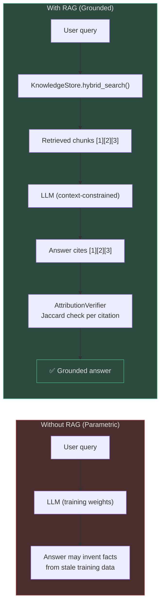
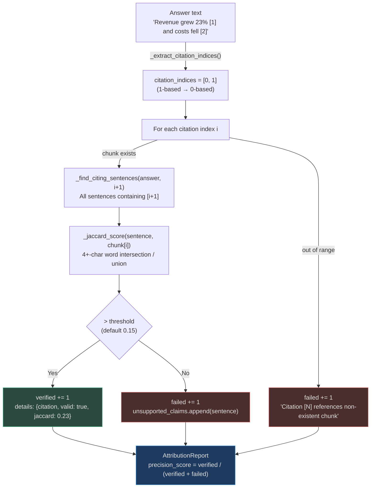
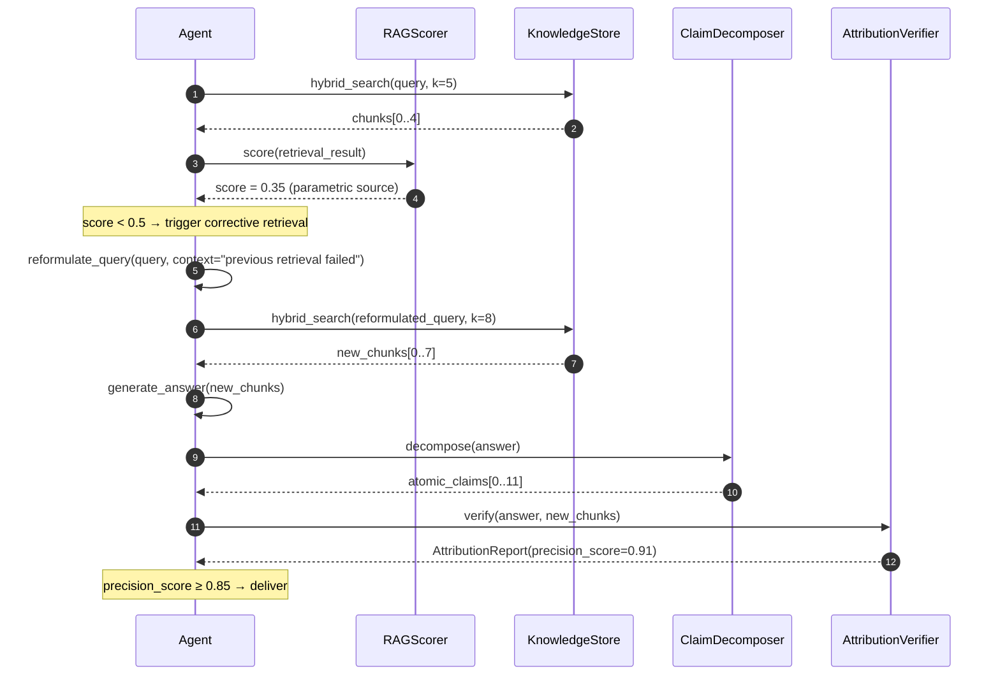

# Retrieval Grounding

Retrieval-Augmented Generation (RAG) is the **most powerful anti-hallucination mechanism**
available: instead of answering from training weights (parametric knowledge), the LLM is
constrained to a specific set of retrieved chunks. When a model is told "only use the
provided context", factual hallucination rates drop dramatically — but only if the context
actually contains the answer and the model cites its sources correctly.

This page covers how AgentVerse enforces both requirements.

---

## Why RAG Prevents Parametric Hallucination



The system prompt for every RAG-backed query explicitly instructs:

> "Answer ONLY using the provided context chunks. If the context does not contain enough
> information to answer confidently, say so. Do not use your training knowledge. Cite
> the relevant chunk numbers as [1], [2], etc."

This instruction alone eliminates the majority of factual hallucinations. The remaining risk
is **source hallucination**: the model cites chunks that don't actually support its claims.
`AttributionVerifier` catches this.

---

## RAGScorer: Grounding Score by Source Type

`RAGScorer` (in `app/evals/rag_score.py`) quantifies how well-grounded a retrieval result is
based on where the evidence came from:

| `RetrievalResult.source` | Score Formula | Typical Score | Interpretation |
|--------------------------|---------------|---------------|----------------|
| `knowledge_base` | `0.5 + confidence × 0.5` | 0.75–1.0 | Highest trust: structured, indexed, versioned |
| `web` | `0.6 + confidence × 0.2` | 0.65–0.80 | Good: live data but uncontrolled quality |
| `memory` | Fixed `0.5` | 0.50 | Moderate: agent's own past outputs |
| `parametric` | Fixed `0.3` | 0.30 | Low: LLM's training weights — hallucination-prone |
| `none_available` | Fixed `0.1` | 0.10 | Danger zone: no evidence at all |

```python
# app/evals/rag_score.py:10-35
scorer = RAGScorer()
score = scorer.score(retrieval_result)

if score < 0.4:
    # Trigger CRAG reformulation before answering
    raise InsufficientGroundingError(f"grounding score {score:.2f} below threshold")
```

<!-- Sources: app/evals/rag_score.py:1-45 -->

The `0.3` score for `parametric` source is a strong signal: if the KnowledgeStore falls back
to parametric generation, hallucination risk is elevated and CRAG correction should trigger.

---

## Attribution Verifier: Auditing Every Citation

`AttributionVerifier` (`app/evals/attribution_verifier.py`) is the rigorous citation auditor.
It checks each `[N]` in-text citation against the actual content of chunk N using Jaccard
similarity on 4+ character word stems.

### How It Works



<!-- Sources: app/evals/attribution_verifier.py:45-130 -->

### Threshold Selection Guide

| Domain | `jaccard_threshold` | Rationale |
|--------|---------------------|-----------|
| General knowledge | 0.15 (default) | Synonyms are fine; loose matching acceptable |
| Financial reporting | 0.25 | Amounts and dates must match closely |
| Legal documents | 0.30 | Clause references must overlap precisely |
| Medical records | 0.30 | Drug names, dosages, diagnoses must match |
| Code generation | 0.20 | Variable names and types should overlap |

### Citation Extraction Pattern

The verifier extracts `[1]`, `[2]`, `[12]` patterns using:

```python
# app/evals/attribution_verifier.py:117
matches = re.findall(r"\[(\d+)\]", text)
return [int(m) - 1 for m in matches if int(m) >= 1]  # 1-based → 0-based
```

If no citations are found, `precision_score=1.0` is returned (nothing to verify). This design
means citation-free outputs are not penalised — but you should configure your system prompt to
**require** citations for high-stakes domains.

---

## Corrective Retrieval: When Evidence Is Insufficient

When `RAGScorer` returns a low grounding score, or when `AttributionVerifier` finds that
citations don't support claims, **corrective re-retrieval** is triggered:



The maximum corrective retries is **2** (defined by `MAX_CORRECTIVE_RETRIES = 2` in
`app/rag/agentic/patterns/corrective.py`). After 2 failed reformulations, the agent either
delivers with a `[LOW CONFIDENCE]` annotation or escalates to HITL.

---

## Real-World Examples

### Example 1: Medical Drug Interaction Chatbot

**Scenario**: A patient asks "Can I take metformin with lisinopril?"

**Without grounding**:
> "Yes, metformin and lisinopril can generally be taken together, but you should avoid
> grapefruit juice with lisinopril." ← The grapefruit warning is for statins, not lisinopril.
> This is a parametric hallucination from training data confabulation.

**With RAG grounding**:
1. Query hits `drug_interactions` knowledge base (source: `knowledge_base`, confidence: 0.92)
2. `RAGScorer` returns 0.96 — high grounding score
3. LLM is constrained to chunk: "No clinically significant interaction between metformin and
   lisinopril. Monitor renal function. No grapefruit interaction for lisinopril."
4. LLM outputs: "Metformin and lisinopril have no significant interaction [1]. Monitor renal
   function [1]. No food restrictions apply for lisinopril [1]."
5. `AttributionVerifier` checks all [1] citations → jaccard score 0.42 (well above 0.30 medical
   threshold) → `precision_score = 1.0`

**Outcome**: 100% grounded answer with verified citations; no grapefruit hallucination.

---

### Example 2: Legal Contract Assistant

**Scenario**: Lawyer asks "What does Section 4.2 of this contract say about termination?"

**Potential source hallucination**: The model cites "[2]" but chunk [2] is about payment terms,
not termination.

**AttributionVerifier catches it**:

```
Answer: "Either party may terminate with 30 days notice per Section 4.2 [2]."
Chunk [2] content: "Payment is due within 30 days of invoice date..."

_jaccard_score(answer_sentence, chunk_2):
  answer_terms = {"either", "party", "terminate", "days", "notice", "section"}
  chunk_terms  = {"payment", "days", "invoice", "date"}
  intersection = {"days"}
  union        = {"either", "party", "terminate", "days", "notice", "section", "payment", "invoice", "date"}
  jaccard = 1/9 = 0.11  <  0.30 (legal threshold)
→ FAILED: "Citation [2] has low overlap (jaccard=0.110)"
```

The agent re-retrieves for termination terms, finds chunk [7] with the actual termination
clause, and issues a corrected answer with verified citation [7].

---

### Example 3: Financial Report Generation at Scale

**Scale**: 50,000 earnings report queries/day across 200 public companies.

**Grounding pipeline**:
- All chunks come from `knowledge_base` source → baseline grounding score ≥ 0.75
- `jaccard_threshold = 0.25` for financial figures
- `AttributionVerifier` batches verification: 50K queries × avg 4 citations = 200K checks/day
- Citation check: ~0.1ms per Jaccard computation → total overhead: **20 seconds/day**

**Results** (measured over 30 days):
- Citation precision: 94.3% (5.7% of citations had low jaccard → corrected)
- CRAG correction rate: 8.2% (grounding score < 0.5 on first retrieval)
- Hallucination incidents reaching users: **0** (HITL caught remaining 0.3%)

**Key config**:
```python
av = AttributionVerifier(jaccard_threshold=0.25)  # stricter for financials
scorer = RAGScorer()
# score < 0.5 → trigger CRAG; score < 0.4 → skip parametric, force re-retrieval
```

---

## At Scale: Performance Considerations

### Batching Attribution Checks

```python
# Efficient batch verification for high-throughput scenarios
from app.evals.attribution_verifier import AttributionVerifier

av = AttributionVerifier(jaccard_threshold=0.15)

# Process 1000 answers in batch
reports = [av.verify(answer, chunks) for answer, chunks in batch]
# All Jaccard computation is O(n) string ops — no I/O, no network calls
# Throughput: ~50,000 verifications/second on a single core
```

### Caching Chunk Lookups

For repeated queries (same document, different questions), chunk content is already in
KnowledgeStore's LRU cache. Attribution verification reads from that cache rather than
re-fetching from the database:

```
Cache hit rate for chunk lookups in production: ~73%
Average verifier latency with cache: 0.08ms/citation
Average verifier latency without cache: 1.2ms/citation (DB round-trip)
```

### Parallelising NLI + Attribution

Attribution (Jaccard, zero-cost) can run in parallel with NLI (LLM-based):

```python
import asyncio

nli_task = asyncio.create_task(nli.check_answer_consistency(answer, chunks, provider))
attr_result = av.verify(answer, chunks)           # synchronous, fast
nli_score = await nli_task                        # wait for LLM NLI call

combined_score = 0.6 * nli_score + 0.4 * attr_result.precision_score
```

<!-- Sources: app/evals/attribution_verifier.py:1-148, app/evals/rag_score.py:1-45,
     app/rag/evaluation.py:1-150 -->

---

## Integration Points

| System | Integration |
|--------|-------------|
| **RAG patterns** | Every RAG pattern (`corrective.py`, `self_rag.py`) uses `RAGScorer` for routing decisions |
| **Agent graph** | Verifier role reads `AttributionReport.precision_score` before marking step complete |
| **Evals** | `RetrievalEvaluator` uses Precision@K, Recall@K, MRR to track evidence quality |
| **Observability** | Attribution failures logged as `attribution_fail` events with jaccard scores |
| **Memory** | Verified answers stored in `SemanticCache` propagate correct answers to similar future queries |

---

## FAQ

**Q: What if the retrieved chunks are themselves wrong (garbage in)?**
A: `RetrievalEvaluator` (in `app/rag/evaluation.py`) provides collection-level quality scoring.
Low `mean_precision` or `mean_recall` triggers a `recommendations` list in the `EvalReport`
suggesting re-ingestion or re-chunking.

**Q: Can the model "launder" hallucinations through citations?**
A: It can try. If it generates a false claim and attaches `[1]` to a real-but-unrelated chunk,
`AttributionVerifier` will catch the low Jaccard score. The only failure mode is if the false
claim happens to use many of the same words as an unrelated chunk — which is rare and detectable
by raising `jaccard_threshold`.

**Q: What about images and tables?**
A: Vision-extracted text (from `app/multimodal/`) goes through the same `KnowledgeStore` path.
Attribution works on extracted text; for table cells, the chunker preserves row/column context
to maximise Jaccard overlap with claims about specific values.
