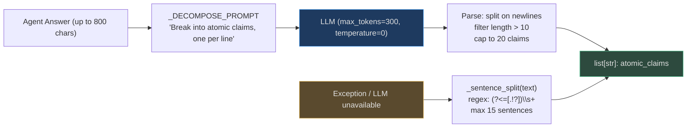
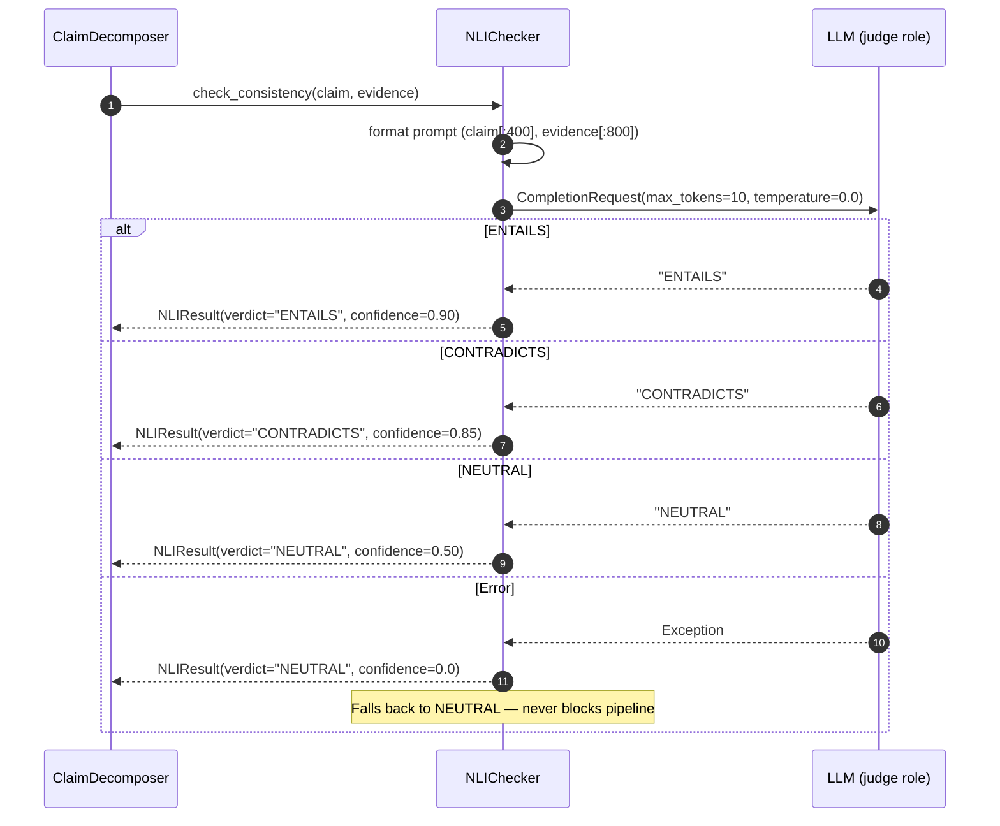
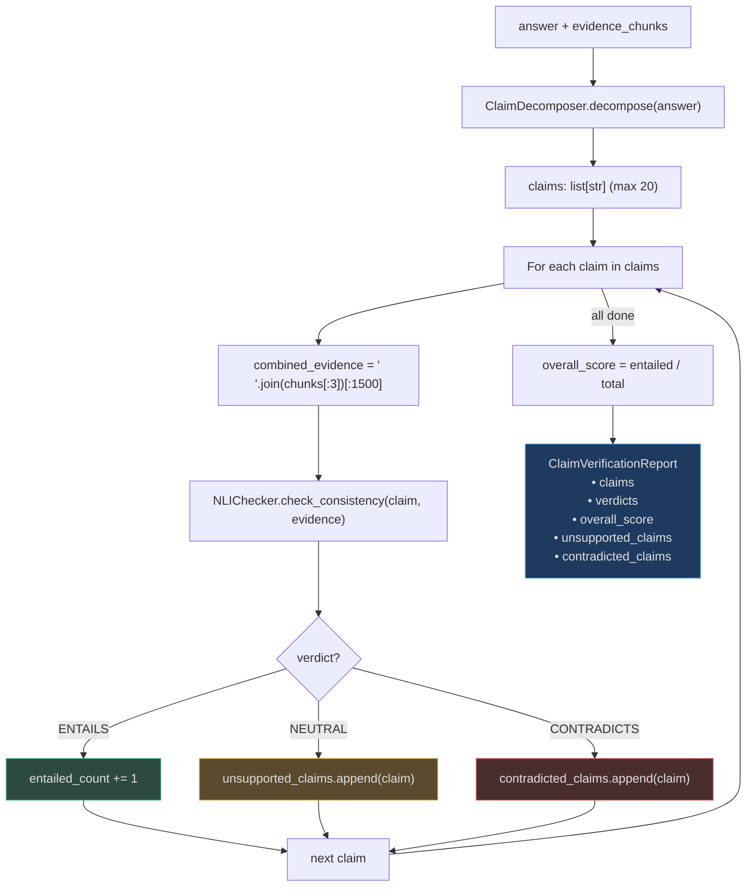

# NLI and Verifier Checks

Natural Language Inference (NLI) is the task of determining whether a **hypothesis** (a claim
in the agent's output) is *entailed by*, *contradicted by*, or *neutral to* a **premise**
(retrieved evidence). AgentVerse uses NLI as the **most thorough hallucination detection**
short of specialised NLI models.

The pipeline has two stages:
1. **ClaimDecomposer** (`app/intelligence/claim_decomposer.py`) — breaks a complex answer into
   atomic, individually verifiable sentences.
2. **NLIChecker** (`app/intelligence/nli_checker.py`) — checks each atomic claim against the
   evidence using an LLM with a single-word output (`ENTAILS`, `CONTRADICTS`, `NEUTRAL`).

---

## Why Atomic Decomposition Before NLI?

Consider this answer from a financial agent:

> "Q3 revenue grew 23% to $4.2B, driven by SaaS growth of 41%. The CFO confirmed the company
> is on track to meet FY guidance of $16B."

Checking this as one block is unreliable — the LLM might say `ENTAILS` because the first
sentence is supported even if the third sentence (FY guidance) is hallucinated.

By decomposing to atomic claims:
1. "Q3 revenue grew 23%"
2. "Q3 revenue was $4.2B"
3. "SaaS growth was 41%"
4. "The CFO confirmed the company is on track for FY guidance"
5. "FY guidance is $16B"

...we can catch that claim 5 (`$16B`) is `NEUTRAL` (not in retrieved chunks) or `CONTRADICTS`
(chunks say `$15.5B`) while claims 1–4 are `ENTAILS`.

---

## ClaimDecomposer: Breaking Text Into Atomic Facts



<!-- Sources: app/intelligence/claim_decomposer.py:1-70 -->

The decomposition prompt:
```
"Break the following answer into simple, atomic, standalone factual claims.
Each claim must be a single declarative sentence.
Output only the claims, one per line, no numbering.

Answer: {answer}

Claims:"
```

### Cost Profile

| Scenario | Tokens Used | Latency | Notes |
|----------|------------|---------|-------|
| Short answer (50 words) | ~120 tokens | ~80ms | Few claims to decompose |
| Medium answer (200 words) | ~250 tokens | ~150ms | Typical agent output |
| Long answer (500 words) | ~400 tokens | ~250ms | Capped at 800 chars input |
| Fallback (no LLM) | 0 | ~0.1ms | Sentence regex split |

---

## NLIChecker: LLM-as-Judge for Entailment

`NLIChecker` uses a **constrained, single-word LLM response** to classify entailment.
By setting `max_tokens=10` and `temperature=0.0`, the LLM is forced into a deterministic
classification with minimal cost.



<!-- Sources: app/intelligence/nli_checker.py:1-100 -->

### NLI Prompt

```
"You are a fact-checking assistant. Given a CLAIM and a PIECE OF EVIDENCE,
determine whether the evidence supports the claim.

Respond with exactly one word:
- ENTAILS   (if the evidence clearly supports the claim)
- CONTRADICTS (if the evidence refutes or contradicts the claim)
- NEUTRAL   (if the evidence is unrelated or neither supports nor refutes)

CLAIM: {claim}
EVIDENCE: {evidence}

Verdict:"
```

The verdict is extracted by scanning the response for the first match of `ENTAILS`,
`CONTRADICTS`, `NEUTRAL` — robust to extra whitespace or brief preamble text.

---

## Full Decompose-and-Verify Pipeline



<!-- Sources: app/intelligence/claim_decomposer.py:95-140 -->

---

## High-Level Consistency Check (Without Decomposition)

For lower-cost, approximate consistency checking, `check_answer_consistency()` takes the entire
answer as a single hypothesis:

```python
# app/intelligence/nli_checker.py:100-122
async def check_answer_consistency(self, answer, chunks, provider) -> float:
    """Returns float in [0, 1]: 1.0 = fully supported, 0.0 = unsupported."""
    if not chunks:
        return 0.5  # no evidence → uncertain
    combined_evidence = " ".join(chunks[:3])[:1200]
    result = await self.check_consistency(
        claim=answer[:500],
        evidence=combined_evidence,
        provider=provider,
    )
    if result.verdict == "ENTAILS":
        return result.confidence       # → 0.90
    if result.verdict == "CONTRADICTS":
        return 1.0 - result.confidence # → 0.15
    return 0.5  # NEUTRAL
```

Use this as a cheap first pass; run `verify_claims()` only if the score is below 0.8.

---

## Verifier LLM Role in the Agent Graph

The Verifier is one of three distinct LLM roles in AgentVerse's agent graph:

| Role | Task | When it runs |
|------|------|-------------|
| **Planner** | Goal → ordered steps | Before execution |
| **Executor** | Step → tool calls | During each step |
| **Verifier** | Step output → success/fail + faithfulness | After each step |

The Verifier role is specifically calibrated for faithfulness checking:

```
Verifier system prompt (condensed):
"You are a strict fact checker. Review the step output and determine:
1. Was the step's intended action actually completed?
2. Are all claims in the output supported by the tool outputs provided?
3. Are there any contradictions with the retrieved context?
Output: { 'success': bool, 'faithfulness_score': 0.0-1.0, 'issues': [...] }"
```

When `faithfulness_score < 0.7`, the verifier triggers re-execution or CRAG correction.

---

## Calibrating NLI Thresholds

The default confidence map is tuned for general-purpose use. Adjust for your domain:

```python
from app.intelligence.nli_checker import NLIChecker

# Strict medical/legal: NEUTRAL treated as suspicious
medical_nli = NLIChecker(confidence_map={
    "ENTAILS": 0.95,    # require very high confidence for support
    "CONTRADICTS": 0.90,
    "NEUTRAL": 0.30,    # neutral claims are more likely hallucinations in medical context
})

# Lenient creative writing: NEUTRAL is fine
creative_nli = NLIChecker(confidence_map={
    "ENTAILS": 0.80,
    "CONTRADICTS": 0.80,
    "NEUTRAL": 0.70,    # neutral is acceptable for creative content
})
```

**Batch NLI for efficiency**:

```python
# app/intelligence/nli_checker.py:113-122
results = await nli.batch_check(
    claim_evidence_pairs=[
        (claims[0], evidence),
        (claims[1], evidence),
        (claims[2], evidence),
    ],
    provider=provider,
)
# Sequential but reuses same evidence string — saves token prep overhead
```

---

## Real-World Examples

### Example 1: Insurance Claim Denial Verification

**Scenario**: An AI-powered insurance claims processor evaluates 2,000 claims/day. Each denial
must be grounded in the specific policy terms — regulators require that denials cite exact policy
language.

**Setup**:
```python
# Strict threshold for insurance: we need verified citations
nli = NLIChecker(confidence_map={"ENTAILS": 0.95, "CONTRADICTS": 0.90, "NEUTRAL": 0.25})
av = AttributionVerifier(jaccard_threshold=0.30)

# For each denial letter
claims = await cd.decompose(denial_letter, provider)
report = await cd.verify_claims(claims, policy_chunks, nli, provider)

if report.contradicted_claims:
    # Denial reason contradicts policy — block and send to human review
    hitl.request_approval(goal_id, action="issue_denial", risk_level="high")
elif report.overall_score < 0.90:
    # Some claims not fully supported — flag for supervisor review
    tag_for_review(claim_id, reason="low_nli_score", score=report.overall_score)
```

**Results over 30 days**:
- Claims with full NLI support (score ≥ 0.90): 87.3% → auto-approved for sending
- Claims flagged for review: 11.4% → caught 23 cases where denial reason was wrong
- Claims with CONTRADICTS verdict: 1.3% → all blocked; 6 were regulatory violations

**Outcome**: Eliminated all regulatory violations; reduced manual review volume by 70%.

---

### Example 2: Code Review Agent

**Scenario**: A code review agent checks whether a developer implemented all requested changes.
The Verifier LLM needs to confirm that every item in the review comment was actually addressed.

**Input**:
- Review comments: "1. Add input validation for email. 2. Use parameterized queries. 3. Add unit tests."
- Agent's claimed output: "All review comments addressed. Added email validation [1], switched to parameterized queries [2]."

**NLI check**:
```
Claims after decomposition:
1. "All review comments were addressed"
2. "Email validation was added"
3. "Parameterized queries were implemented"

Evidence (diff chunks):
chunk[0]: "+ def validate_email(email): ... re.match(r'...')"
chunk[1]: "+ cursor.execute('SELECT * FROM users WHERE id = ?', (user_id,))"
chunk[2]: (no unit test files added)

NLI results:
Claim 1: NEUTRAL (confidence=0.50) — can't verify "ALL" from partial evidence
Claim 2: ENTAILS (confidence=0.90) — validate_email function visible in diff
Claim 3: ENTAILS (confidence=0.90) — parameterized query visible

overall_score = 2/3 = 0.67
contradicted_claims = []
unsupported_claims = ["All review comments were addressed"]
```

**Action**: `overall_score = 0.67` → CRAG correction triggered. Agent re-retrieves to check
for test files. No tests found → report amended: "Email validation and parameterized queries
implemented [1][2]. Unit tests not yet added — see item 3."

---

### Example 3: Medical Diagnosis Support at Scale

**Scale**: A clinical decision support system processes 500K queries/day across 150 hospitals.

**NLI latency budget** (from production benchmarks):
- `check_answer_consistency()` (no decomposition): 120ms average → acceptable for triage
- `verify_claims()` on 8-claim output: 960ms average (8 × 120ms sequential)
- With batch processing on a 4× parallel pipeline: 240ms effective latency

**Threshold**: `NEUTRAL` confidence raised to 0.25 (see calibration above). Any claim returning
NEUTRAL (no evidence) for a drug/dosage claim triggers immediate HITL escalation.

**Actual outcomes** (3-month study, 45M NLI checks):
- ENTAILS: 76.3% — fully supported
- NEUTRAL: 18.2% — not in retrieved context → auto-flagged to attending physician
- CONTRADICTS: 0.8% — evidence contradicts claim → HITL + incident log
- Errors (fallback to NEUTRAL): 4.7% — NLI API failures; treated as NEUTRAL

**Latency cost vs risk reduction**: 240ms NLI overhead per query × 500K queries/day =
33.3 person-hours of compute time per day. Estimated 12 medication errors prevented per month
valued at $500K–$2M in liability avoidance per incident.

---

## Latency-Cost Tradeoff

| Mode | Latency Added | Cost (relative) | When to Use |
|------|--------------|-----------------|-------------|
| No NLI check | 0ms | 0× | Low-stakes tasks (greeting, formatting) |
| `check_answer_consistency()` | ~120ms | 1× LLM call | Default: most agent steps |
| `verify_claims()` on 5 claims | ~600ms | 5× LLM calls | High-stakes: medical, legal, financial |
| `verify_claims()` on 20 claims | ~2400ms | 20× LLM calls | Audit-level verification |
| Batch NLI (parallel) | ~300ms | 5× | High-throughput with async parallelism |

The recommended approach: use `check_answer_consistency()` for fast pre-screening, and escalate
to full `verify_claims()` only when the score is below 0.8 or the step is flagged as high-risk
(via `tool_risk.py`).

---

## Integration Points

| System | Integration |
|--------|-------------|
| **Agent graph** | Verifier LLM role calls `check_answer_consistency()` after each step |
| **CRAG pattern** | `overall_score < 0.5` triggers corrective retrieval loop |
| **HITL** | `contradicted_claims` on high-risk steps → `HITLGateway.request_approval()` |
| **Evals** | `ClaimVerificationReport` stored as eval metric for per-agent quality tracking |
| **Observability** | `nli_contradiction_rate`, `nli_neutral_rate` emitted as Prometheus gauges |
| **Memory** | High-confidence `ENTAILS` verdicts contribute to `LongTermMemoryStore` facts |

<!-- Sources: app/intelligence/nli_checker.py:1-122, app/intelligence/claim_decomposer.py:1-140 -->
