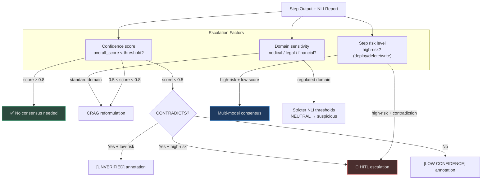
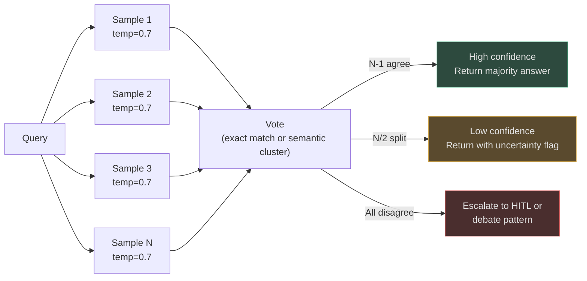
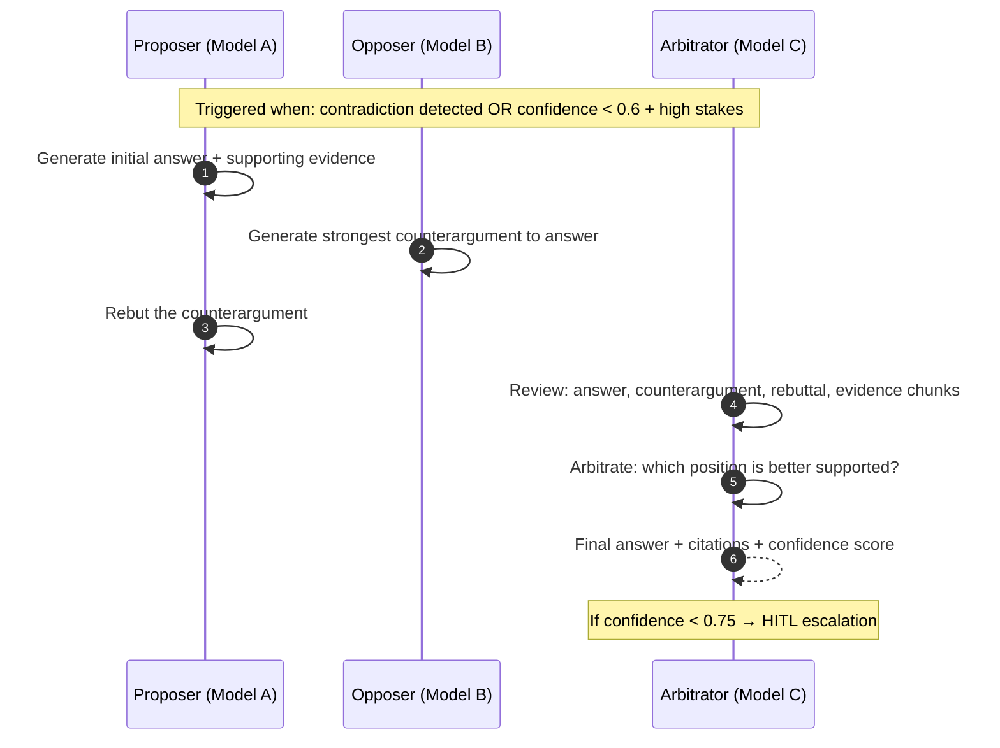
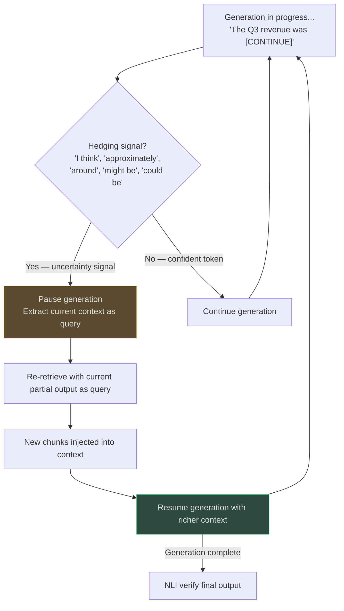
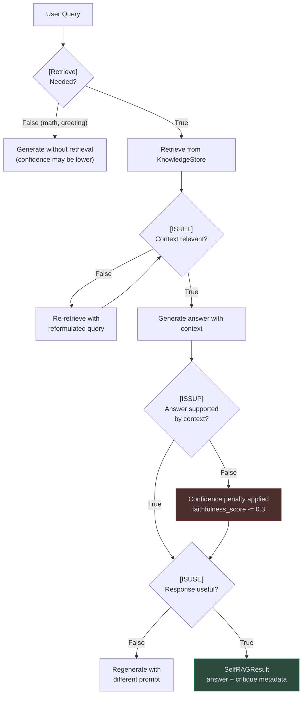
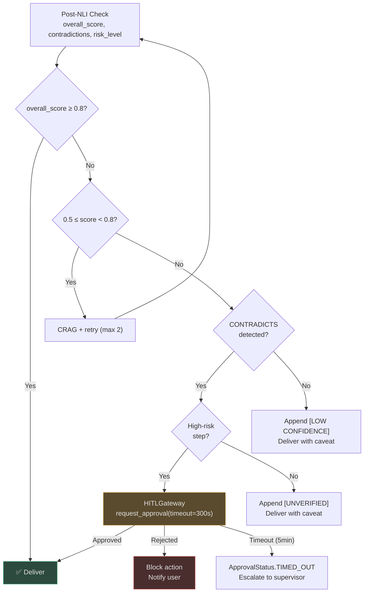

# Consensus and Uncertainty

Single LLM calls can confidently generate wrong answers. When the stakes are high — a medical
decision, a financial transaction, a legal interpretation — the only reliable way to reduce
hallucination risk is to cross-check: multiple models, multiple samples, or human review.

This page covers AgentVerse's ensemble and escalation mechanisms that activate when a single
NLI pass is insufficient.

---

## When Is Consensus Needed?

Not all queries warrant multiple LLM calls. The decision to escalate to consensus is based on
three factors:



<!-- Sources: app/governance/hitl.py:1-120, app/agent/graph.py -->

---

## Pattern 1: Self-Consistency Sampling

**Self-consistency** sends the same query N times at `temperature > 0` and takes the **majority
vote** across responses. Inconsistent responses (high variance) signal low-confidence hallucination.



### When to Use Self-Consistency

| Scenario | N samples | Agreement threshold |
|----------|-----------|---------------------|
| Factual Q&A (single answer) | 3 | 2/3 agree |
| Numerical calculation | 5 | 4/5 agree |
| Code generation | 3 | 2/3 agree (then NLI-test generated code) |
| Medical drug dosage | 5 | 5/5 agree (unanimous required) |

**Cost**: N× LLM calls. Use sparingly. Self-consistency is most valuable for:
- Short, deterministic answers (drug dosages, regulatory thresholds, tax rates)
- Cases where `check_answer_consistency()` returned 0.55–0.75 (uncertain zone)

---

## Pattern 2: Multi-Model Debate

The **debate pattern** uses adversarial roles to stress-test a claim before it is delivered:



The three models can be the same base model with different prompts (Proposer, Opposer,
Arbitrator system prompts), or different models for maximum independence.

**Why three roles work**:
- A single model is subject to **sycophancy**: it tends to agree with the first claim it states.
- The Opposer role forces genuine adversarial pressure on the Proposer's answer.
- The Arbitrator has full context (all turns) and isn't committed to either position.

---

## Pattern 3: Corrective Retrieval (FLARE-Style)

**FLARE** (Forward-Looking Active REtrieval) detects uncertainty *during* generation, not after,
and re-retrieves before continuing:



This is implemented via the `CorrectiveRAGPattern` in `app/rag/agentic/patterns/corrective.py`.
Hedging language detection (`"I think"`, `"approximately"`, `"I'm not sure"`) triggers mid-stream
re-retrieval. The corrective loop runs up to `MAX_CORRECTIVE_RETRIES = 2` times.

---

## Pattern 4: Self-RAG Critique Tokens

`Self-RAGPattern` (`app/rag/agentic/patterns/self_rag.py`) implements four self-critique
dimensions, each returning a boolean that the caller uses for routing:

| Token | Question Asked | If True | If False |
|-------|---------------|---------|----------|
| `[Retrieve]` | Does this query need retrieval at all? | Retrieve and continue | Answer directly |
| `[ISREL]` | Is the retrieved doc relevant to the query? | Use this doc | Discard and re-retrieve |
| `[ISSUP]` | Is the answer supported by the retrieved doc? | High confidence | Flag hallucination risk |
| `[ISUSE]` | Is the overall response useful to the user? | Deliver | Regenerate |



The `SelfRAGResult` carries:
```python
@dataclass
class SelfRAGResult:
    answer: str
    confidence: float            # 0.0–1.0 after critique
    is_retrieved: bool           # [Retrieve] verdict
    is_relevant: bool            # [ISREL] verdict
    is_supported: bool           # [ISSUP] verdict — key hallucination signal
    is_useful: bool              # [ISUSE] verdict
```

When `is_supported = False`, the agent applies a confidence penalty of 0.3 and routes to CRAG
correction or HITL based on the resulting confidence level.

---

## HITL Escalation: The Last Defense Layer

When all automated checks fail to reach confidence ≥ 0.75, the `HITLGateway`
(`app/governance/hitl.py`) holds the answer pending human review.

### Escalation Decision Logic



<!-- Sources: app/governance/hitl.py:1-120 -->

### HITL Gateway: Dual-Mode Implementation

`HITLGateway` operates in two modes for production reliability:

| Mode | Mechanism | When Used |
|------|-----------|-----------|
| **In-process** | `asyncio.Event` | Single-replica dev/test |
| **Cross-replica** | Redis `BLPOP` | Production multi-replica fleet |

The Redis mode survives server restarts and works across any replica:

```python
# Approval published on any replica arrives at the waiting replica
# via Redis list key: f"hitl:approval:{request_id}"
await gateway.publish_resolution(
    request_id=req.request_id,
    approved=True,
    approver="dr.smith@hospital.org",
    note="Verified against patient chart manually",
)
```

Human approvers see a structured approval interface showing:
- The original goal and failing step
- The contradicted claims with evidence comparison
- The NLI scores for each claim
- Available actions: Approve / Reject / Request More Context

---

## Confidence Estimation

AgentVerse tracks uncertainty through several signals:

### Signal 1: NLI Score Distribution
```
overall_score = entailed_count / total_claims

High confidence:  overall_score > 0.85 AND no CONTRADICTS
Medium:           0.6 < overall_score ≤ 0.85 OR 1 NEUTRAL claim
Low:              overall_score ≤ 0.6 OR any CONTRADICTS
```

### Signal 2: NLI Confidence Map
Each NLI verdict carries a **heuristic confidence**:
- `ENTAILS` → 0.90 (strong support)
- `CONTRADICTS` → 0.85 (strong refutation — paradoxically reliable)
- `NEUTRAL` → 0.50 (uncertain — model may or may not know)

### Signal 3: DecisionTrace Confidence

`DecisionTrace` (`app/intelligence/explainability.py`) captures the LLM's own confidence
estimate from its reasoning chain:

```python
# app/intelligence/explainability.py:14-28
@dataclass
class DecisionTrace:
    action: str
    reasoning: str
    evidence: list[str]           # supporting RAG chunks
    alternatives: list[str]       # paths not taken
    confidence: float             # 0.0–1.0 from LLM self-assessment
    trace_id: str
```

The `confidence` field is extracted from the LLM's output. If the LLM says "I'm not sure,
but..." the extracted confidence is typically ≤ 0.6, which is an independent signal to
the NLI-based overall_score.

### Signal 4: RAGScorer
Sources with scores < 0.4 (`parametric`, `none_available`) add a negative confidence
adjustment of -0.2 to the final delivery score.

---

## Real-World Examples

### Example 1: Financial Tax Interpretation Agent

**Scenario**: A tax advisory firm uses an agent to interpret tax regulations across 12 jurisdictions.
Query: "Is the proposed earn-out payment subject to ordinary income tax or capital gains treatment?"

Two models (GPT-4o and Claude 3.5 Sonnet) are asked independently:
- Model A: "Capital gains treatment applies under IRC § 1231 because earn-outs are contingent
  consideration tied to sale of business assets [1][2]."
- Model B: "Ordinary income treatment is required because earn-outs compensate continued employment
  [1][3]."

**Models disagree** → debate pattern triggered:
1. Proposer (Model A) argues capital gains + statutory citations
2. Opposer (Model B) argues ordinary income + case law
3. Arbitrator reviews both arguments + retrieves additional IRS guidance (Rev. Rul. 2019-09)

**Arbitrator output**: "The determination depends on whether earn-outs are contingent price vs
compensation. Rev. Rul. 2019-09 requires a facts-and-circumstances analysis. Current facts are
ambiguous → recommend senior partner review."

**HITL escalation**: `confidence = 0.52` < 0.75 threshold → senior tax partner reviews and
provides the determination, which is stored as a high-confidence `LongTermMemoryStore` fact for
similar future queries.

**Value**: Prevented a $180K tax position error that one model would have confidently generated.

---

### Example 2: Medical Diagnosis Support — Unanimous Consensus Required

**Scenario**: A clinical decision support system for antibiotic selection. Given a patient with
a UTI and penicillin allergy, which antibiotic to prescribe?

**Protocol**: 5-sample self-consistency check with unanimous agreement required for drug selection.

```
Sample 1: "Trimethoprim-sulfamethoxazole (TMP-SMX) if local resistance < 20%" → TMP-SMX
Sample 2: "Nitrofurantoin for uncomplicated UTI, avoid in CrCl < 30" → Nitrofurantoin
Sample 3: "TMP-SMX first-line unless Sulfa allergy" → TMP-SMX
Sample 4: "Nitrofurantoin as alternative to TMP-SMX" → Nitrofurantoin
Sample 5: "TMP-SMX is first-line per IDSA guidelines" → TMP-SMX

Votes: TMP-SMX (3/5), Nitrofurantoin (2/5)
Agreement: 60% — below unanimous threshold
```

**Action**: Not unanimous → HITL escalation to attending physician. The physician notes the
patient's local resistance pattern shows 35% TMP-SMX resistance → prescribes nitrofurantoin.

**Outcome**: The 5-sample approach correctly surfaced ambiguity that a single-call system would
have resolved confidently as TMP-SMX (the training-data majority answer).

---

### Example 3: Multi-Jurisdiction Legal Contract Review

**Scenario**: A legal AI agent reviews M&A contracts across 8 countries. 50 lawyers use the
system daily for high-value transactions.

**Debate pattern for jurisdiction-specific clauses**:

For a force majeure clause: "Does this clause comply with English law, German law, and Singapore law?"

- Model A (Proposer): "Compliant across all three jurisdictions. Force majeure events are
  sufficiently defined [1][2]."
- Model B (Opposer): "Under German BGB § 313, 'fundamental change of circumstances' requires
  explicit economic hardship language — absent here [3]."
- Arbitrator: "English and Singapore law: compliant [1][2]. German law: non-compliant per
  BGB § 313 [3]. Recommend adding explicit Störung der Geschäftsgrundlage clause."

**NLI check on arbitrator output**:
- "English and Singapore: compliant" → `ENTAILS` (confidence=0.90) ✓
- "German law: non-compliant per BGB § 313" → `ENTAILS` (confidence=0.88) ✓
- Overall score: 1.0 → Deliver with confidence

**ROI**: Caught 3 German law non-compliance issues in a $450M acquisition that would have
required post-signing amendments (legal cost: ~$50K each).

---

## Cost vs Risk Reduction

| Pattern | Additional Calls | Latency | Hallucination Reduction | Recommended For |
|---------|-----------------|---------|------------------------|-----------------|
| Single NLI check | 1 LLM call | +120ms | ~60% | Default for all steps |
| 3-sample self-consistency | 3× | +360ms | ~80% | Factual queries, medium stakes |
| 5-sample unanimous | 5× | +600ms | ~93% | Medical dosages, regulatory thresholds |
| Debate (3 models) | 3× sequential | +1800ms | ~95% | High-stakes disagreements |
| HITL | Human wait | 0–300s | ~99.9% | Any contradiction + high risk |

The recommended heuristic: run single NLI for all steps, escalate to self-consistency when
`0.55 ≤ score < 0.80`, escalate to debate when models disagree or score < 0.55 + high-risk.

---

## Integration Points

| System | Integration |
|--------|-------------|
| **Agent graph** | Verifier role routes to self-consistency or debate based on `faithfulness_score` |
| **HITLGateway** | Redis-backed cross-replica; timeout triggers supervisor escalation |
| **CRAG pattern** | First correction attempt; if still failing after 2 retries → consensus |
| **Model router** | `TaskType.JUDGE` routes NLI calls to calibrated models (not creative models) |
| **Governance** | HITL approval records stored in audit trail with approver identity |
| **Memory** | Human-approved answers stored with high confidence for future similar queries |

<!-- Sources: app/governance/hitl.py:1-120, app/intelligence/explainability.py:1-35,
     app/intelligence/nli_checker.py:1-122 -->
