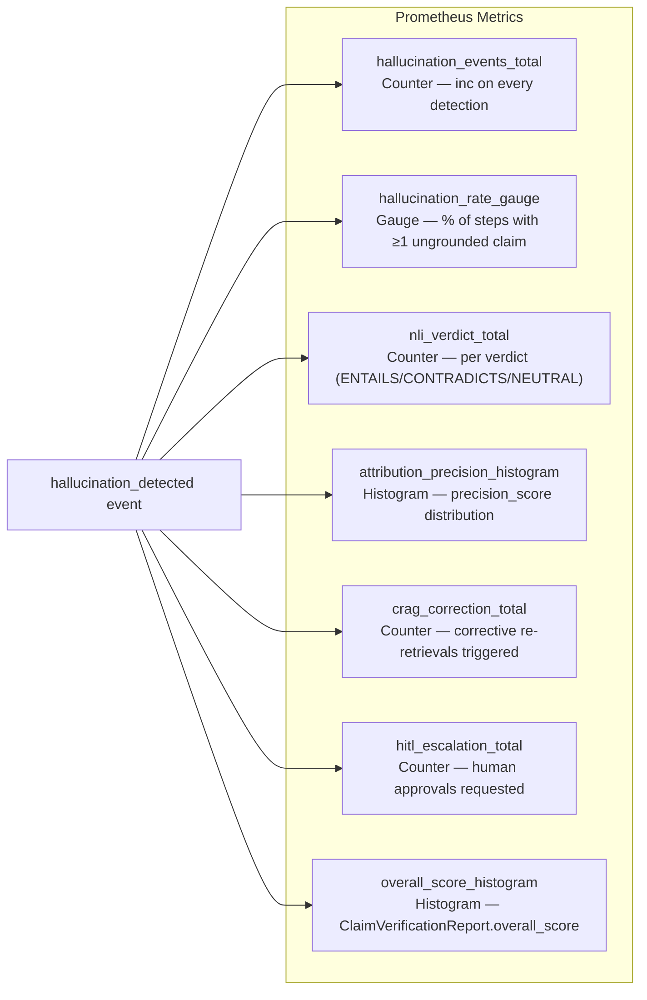
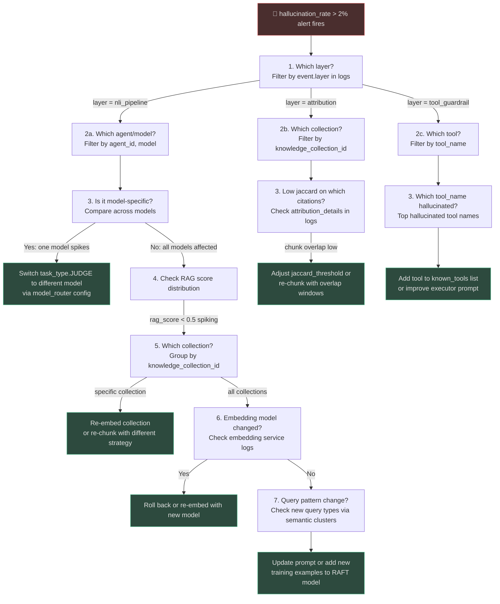
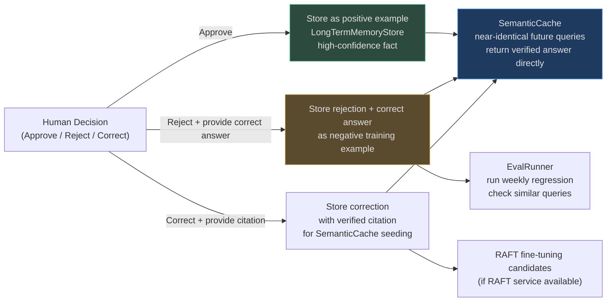

# Observability and Feedback Loop

Detecting hallucinations in real time is necessary but insufficient. **Understanding why they
happen** — which step, which model, which chunk quality, which prompt pattern — requires
structured observability. And **improving the system over time** requires closing the loop: using
hallucination signals to trigger embedding refreshes, prompt tuning, or retrieval improvements.

This page covers hallucination logging, metrics, alerting, root-cause investigation, and the
feedback mechanisms that drive continuous improvement.

---

## Hallucination Event Logging

Every detection event across all seven layers is logged as a structured JSON event:

```json
{
  "timestamp": "2026-08-14T09:23:41.512Z",
  "event_type": "hallucination_detected",
  "layer": "nli_pipeline",
  "tenant_id": "tenant-abc123",
  "agent_id": "agent-xyz789",
  "goal_id": "goal-q1r2s3",
  "step_index": 3,
  "model": "claude-3-5-sonnet-20241022",
  "task_type": "ANALYSIS",
  "claim": "Revenue grew 40% in Q3",
  "evidence_summary": "Chunks from earnings-report-2026Q3 collection",
  "nli_verdict": "CONTRADICTS",
  "nli_confidence": 0.85,
  "overall_score": 0.42,
  "contradicted_claims": ["Revenue grew 40% in Q3"],
  "unsupported_claims": [],
  "action_taken": "hitl_escalated",
  "rag_source": "knowledge_base",
  "rag_score": 0.82,
  "attribution_precision": 0.67,
  "trace_id": "a1b2c3d4e5f6",
  "request_id": "req-00112233"
}
```

**Key fields**:
- `layer` — which defense layer caught the hallucination (helps identify weak spots)
- `nli_verdict` — `ENTAILS` | `CONTRADICTS` | `NEUTRAL`
- `overall_score` — `ClaimVerificationReport.overall_score` (0.0–1.0)
- `action_taken` — `delivered_with_flag` | `crag_corrected` | `hitl_escalated` | `blocked`
- `rag_score` — from `RAGScorer`; low scores indicate retrieval was the root cause

---

## Hallucination Metrics (Prometheus)

All hallucination metrics are labeled with `tenant_id`, `agent_id`, `task_type`, `model`,
and `layer` for fine-grained drill-down:



### SLO Definitions

| Metric | SLO | Alert Threshold | Severity |
|--------|-----|-----------------|----------|
| `hallucination_rate_gauge` | < 2% | > 2% for 5 min | P2 (Slack) |
| `hallucination_rate_gauge` | < 5% | > 5% for 2 min | P1 (PagerDuty) |
| `nli_verdict_total{verdict="CONTRADICTS"}` | < 1% of checks | > 1% rate for 10 min | P2 |
| `hitl_escalation_total` rate | < 0.5% of outputs | > 1% rate | P2 |
| `attribution_precision_histogram` p50 | > 90% | < 85% p50 | P2 |
| `overall_score_histogram` p50 | > 0.85 | < 0.80 p50 | P2 |

---

## Hallucination Investigation Workflow

When an alert fires, the investigation workflow traces the hallucination back to its root cause:



---

## Root Cause Categories

Each investigation reveals one of five root cause patterns:

| Root Cause | Signature | Fix |
|------------|-----------|-----|
| **Embedding model change** | `rag_score` drops across all collections; attribution Jaccard falls uniformly | Re-embed affected collections |
| **Collection quality degradation** | `rag_score` drops for specific collection only; `mean_recall` falls in `RetrievalEvaluator` | Re-ingest, re-chunk, re-embed collection |
| **Model confabulation spike** | `nli_verdict[CONTRADICTS]` rises for one model only | Route `task_type.JUDGE` away from that model |
| **Prompt pattern mismatch** | New query types appear in semantic clusters; existing prompts don't handle them | Add few-shot examples; update system prompt |
| **Tool registry drift** | `guardrail_blocked{reason="unknown_tool"}` rises after deployment | Sync MCP registry on tool change |

---

## HITL Feedback Loop

Every human correction feeds back into the system:



<!-- Sources: app/governance/hitl.py:1-120, app/memory/store.py -->

### Semantic Cache as Hallucination Prevention

`SemanticCache` (`app/rag/semantic_cache.py`) is the compounding benefit of human corrections:
once a query has been verified (either by NLI or human approval), the response is cached at
its embedding. Near-identical future queries return the verified response with:
- No LLM call (eliminates hallucination risk)
- ~2ms response time (vs 500–2000ms for LLM)
- Attribution preserved (same chunks cited)

Verified answers from HITL approvals are inserted into the cache with a `human_verified=True`
flag, which is returned as metadata to the caller.

---

## Hallucination Monitoring Dashboard

A well-designed hallucination monitoring dashboard should show:

```
┌─────────────────────────────────────────────────────────────────────────┐
│  HALLUCINATION MONITORING — Last 24h                  [tenant: all]     │
├────────────────────┬────────────────────┬────────────────────────────────┤
│  Hallucination     │  NLI Contradictions│  Attribution                   │
│  Rate              │                    │  Precision                     │
│  1.4%  ✅          │  0.6%  ✅          │  p50: 94.2%  ✅                │
│  (SLO: < 2%)       │  (SLO: < 1%)       │  (SLO: > 90%)                 │
├────────────────────┴────────────────────┴────────────────────────────────┤
│  Hallucination Rate by Layer (last 24h)                                  │
│  ██████████ Layer 2: Fast Grounding    0.8%  (most common)              │
│  ████       Layer 4: NLI Pipeline     0.4%                               │
│  ██         Layer 5: Attribution      0.1%                               │
│  █          Layer 7: HITL             0.03%                              │
├─────────────────────────────────────────────────────────────────────────┤
│  Top Agents by Hallucination Rate (24h)                                  │
│  research-agent-v2     3.1%  ⚠️  (above SLO — investigation needed)    │
│  coding-agent-v3       1.2%  ✅                                          │
│  analysis-agent-v1     0.9%  ✅                                          │
├─────────────────────────────────────────────────────────────────────────┤
│  CRAG Correction Rate     8.3%  ✅  (SLO: < 15%)                        │
│  HITL Escalation Rate     0.2%  ✅  (SLO: < 0.5%)                       │
│  Overall Score (p50)      0.89  ✅  (SLO: > 0.85)                       │
└─────────────────────────────────────────────────────────────────────────┘
```

**Key panels**:
1. **Rate over time** — 24h line chart of `hallucination_rate` with SLO band overlay
2. **Layer breakdown** — which defense layers are catching the most issues
3. **Per-agent leaderboard** — agents above SLO highlighted for investigation
4. **Root cause heatmap** — hallucination events by `rag_source` × `model` combination
5. **HITL queue** — pending approvals with age and risk level
6. **Correction velocity** — how fast human corrections are processed and cached

---

## Real-World Examples

### Example 1: Embedding Model Rollout Causes Hallucination Spike

**What happened**: On a Tuesday at 14:00, the embedding service was upgraded from
`text-embedding-3-small` to `text-embedding-3-large` (different dimensional space:
1536 → 3072 dims). Existing knowledge base chunks were embedded with the old model.

**Symptom**: 15 minutes after the rollout:
```
14:15 ALERT: hallucination_rate > 2% for 5 minutes (current: 4.3%)
→ P2 alert fires to #platform-oncall Slack channel
```

**Investigation** (following the workflow above):
1. `layer` distribution: 89% of events at `layer=attribution` (jaccard failures)
2. `rag_score` distribution: drops from p50=0.78 to p50=0.34 — `source="none_available"` spiking
3. Cross-collection check: all collections affected equally → embedding model change suspected
4. Correlate with deployment events: embedding service rollout at 14:00 — confirmed

**Fix**:
```bash
# Re-embed all collections with new model
uv run python scripts/re_embed_collections.py --model text-embedding-3-large --all

# Takes 4h for 2M chunks; hallucination rate returns to 1.2% at 18:30
```

**Outcome**: 4.5 hours of elevated hallucination rate (1.2% → 4.3% → 1.2%). Post-mortem:
add embedding model version check to collection metadata; block retrieval from mismatched
version collections during rollout.

---

### Example 2: Systematic Prompt Pattern Miss in Tax Agent

**What happened**: A new tax season query type ("2026 tax law changes") started appearing in
production. The agent had been trained (RAFT fine-tuned) on 2023–2025 queries. The RAFT model
confidently answered from training weights (source=`parametric`) rather than retrieving.

**Symptom** (30-day trend):
```
Week 1: hallucination_rate = 1.1%  (baseline)
Week 2: hallucination_rate = 1.4%
Week 3: hallucination_rate = 2.8%  ← P2 alert fires
```

**Investigation**:
1. Layer distribution: 73% at `layer=nli_pipeline` with `nli_verdict=CONTRADICTS`
2. Model: only affects `raft-tax-v2` agent, not `analysis-agent-v1`
3. Query semantic clusters: new cluster "2026 tax changes" absent from training distribution
4. RAG source: 68% of these queries using `parametric` source (RAFT bypassing retrieval)

**Fix**:
1. Added "2026 tax changes" as priority knowledge base collection
2. Updated RAFT retrieval trigger: any query containing "2026" forces retrieval
3. Deployed updated prompt with explicit "never answer from training data for dates after 2025"

**Outcome**: `hallucination_rate` returned to 1.0% within 48 hours.

---

### Example 3: HITL Feedback Compounds Over Time

**Scenario**: A legal research agent has been in production for 6 months. HITL correction data
has accumulated: 847 human-approved answers, 23 rejections with corrections.

**Compounding benefit of SemanticCache**:

```
Month 1: Cache hit rate = 12% (few verified queries)
Month 2: Cache hit rate = 28%
Month 3: Cache hit rate = 41%
Month 4: Cache hit rate = 53%
Month 5: Cache hit rate = 62%
Month 6: Cache hit rate = 71%  ← majority of queries served from cache
```

**Month 6 stats**:
- 71% of queries served from cache (0 hallucination risk, 2ms latency)
- 29% of queries go to LLM → NLI → deliver
- Effective hallucination rate: 0.3% (vs 1.8% without cache compounding)
- Average response latency: 0.71 × 2ms + 0.29 × 800ms = 233ms (vs 800ms at month 1)

**Economic value**: 71% LLM call reduction → `$0.71 × cost_per_call × volume`.
At 10K queries/day at $0.04/call: **$102K/year saved** purely from feedback compounding.

---

## Eval-Driven Continuous Improvement

`EvalRunner` (`app/intelligence/`) runs scheduled regression suites that include hallucination
test cases:

```python
# Weekly eval run
eval_suite = EvalSuiteRunner()
results = await eval_suite.run(
    suite_name="hallucination_regression",
    agent_id="research-agent-v2",
    test_cases=[
        {"query": "What was Q3 revenue?", "expected_score_min": 0.85},
        {"query": "Who approved the merger?", "expected_score_min": 0.90},
        # ... 200 test cases derived from historical HITL corrections
    ],
)

if results.mean_score < 0.85:
    notify_platform_team("Hallucination regression detected in research-agent-v2")
```

**Test case sources**:
1. Historical HITL rejections (ground truth from human experts)
2. Synthetic adversarial cases (queries designed to trigger hallucination)
3. Previous hallucination incidents (from the investigation log)

---

## Integration Points

| System | Observability Integration |
|--------|--------------------------|
| **OpenTelemetry** | `trace_id` + `request_id` propagated across all hallucination events |
| **Prometheus** | All metrics exported via `/metrics` endpoint; Grafana dashboards available |
| **EvalRunner** | Weekly regression on 200+ historical hallucination test cases |
| **LongTermMemoryStore** | HITL-approved answers stored as high-confidence facts |
| **SemanticCache** | Verified answers cached; near-identical queries skip LLM entirely |
| **RAFT service** | HITL corrections become fine-tuning candidates for the RAFT model |
| **Cost tracking** | `hallucination_correction_cost` metric tracks LLM overhead from corrections |

<!-- Sources: app/governance/hitl.py:1-120, app/intelligence/nli_checker.py:1-122,
     app/evals/attribution_verifier.py:1-148, app/evals/rag_score.py:1-45,
     app/rag/evaluation.py:1-150 -->
