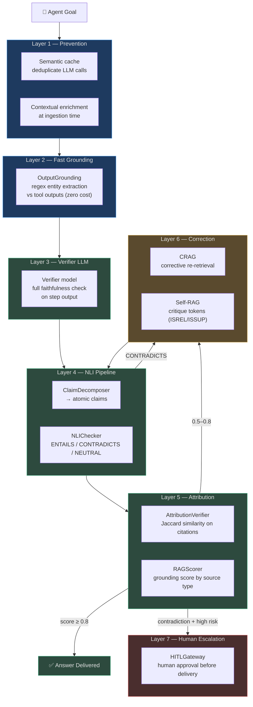
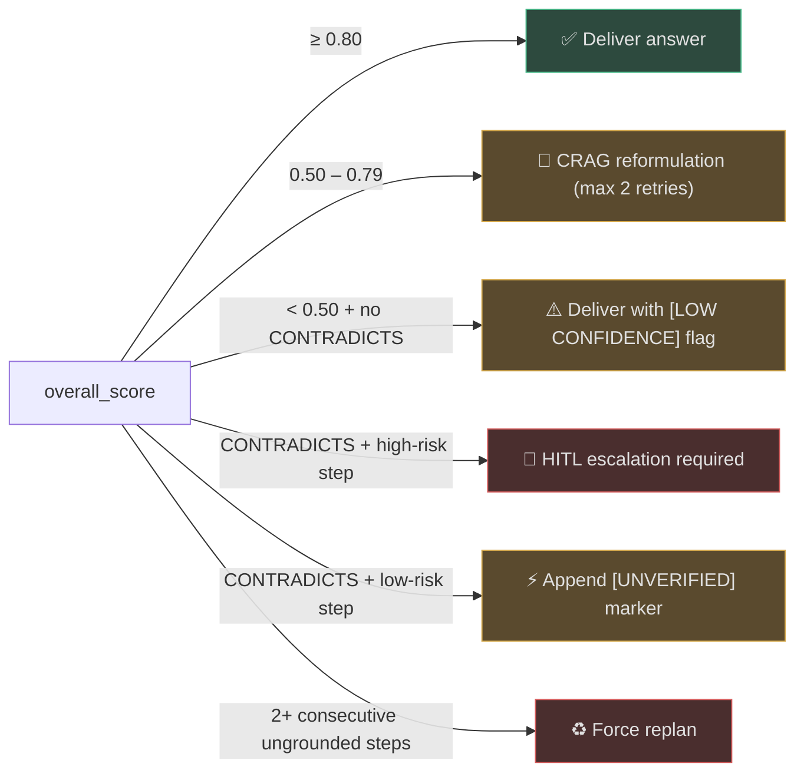

# Hallucination Handling

Hallucination — when a language model generates plausible but factually incorrect, unsupported, or
invented content — is the **#1 risk in autonomous agent deployment**. Unlike human mistakes, which
are typically bounded and recoverable, agent hallucinations can cascade across multi-step plans:
a hallucinated tool name blocks execution; a hallucinated medical dosage causes harm; a hallucinated
citation invalidates an entire report.

AgentVerse treats hallucination as a **first-class engineering problem** with seven distinct
defense layers operating across the full execution lifecycle.

---

## Why Hallucination Is The #1 Risk

Autonomous agents differ from chatbots in three ways that make hallucination particularly dangerous:

1. **Irreversible side effects** — agents call real tools. A hallucinated `delete_file` argument
   destroys real data. A chatbot that hallucinates "the file was deleted" does nothing; an agent
   that calls `delete_file('../../../etc/passwd')` causes real damage.

2. **Compounding errors** — multi-step plans build on previous outputs. Step 3 uses the result
   of step 2. If step 2 hallucinates a record ID, steps 3–10 operate on a phantom entity.

3. **Authority gradient** — agents present outputs with high confidence in formal contexts
   (reports, legal filings, medical decisions). Users tend to trust agent outputs more than
   search results.

---

## Taxonomy of Hallucination Types

| Type | Description | Example | Primary Defense |
|------|-------------|---------|-----------------|
| **Factual** | States wrong facts about the world | "The Eiffel Tower is 500m tall" | NLI + AttributionVerifier |
| **Source** | Cites wrong or non-existent references | "[1] says revenue grew 40%" when chunk [1] says 4% | AttributionVerifier Jaccard |
| **Tool** | Invents tool names not in the registry | Calls `search_database` (doesn't exist) | GuardrailChecker name registry |
| **Structural** | Produces wrong format / schema | Returns `{"result": "ok"}` when JSON schema requires `{"status": "success", "id": "..."}` | Schema validation + OutputAnomaly |
| **Parametric** | Answers from training weights instead of context | Uses pre-training "knowledge" instead of retrieved docs | RAG grounding + RAGScorer |
| **Confabulation** | Fills gaps with confident fabrications | Invents a meeting date that was never in context | ClaimDecomposer + NLI |

---

## The Seven Defense Layers



<!-- Sources: app/intelligence/nli_checker.py, app/intelligence/claim_decomposer.py,
     app/evals/attribution_verifier.py, app/evals/rag_score.py, app/governance/hitl.py -->

---

## Layer-by-Layer Summary

| Layer | Module | Mechanism | Cost | Trigger |
|-------|--------|-----------|------|---------|
| 1 — Prevention | `app/rag/semantic_cache.py` | Semantic deduplication; contextual enrichment | ~0ms (cache hit) | Every LLM call |
| 2 — Fast Grounding | `app/agent/grounding.py` | Regex entity extraction vs tool outputs | ~0ms | Every executor step |
| 3 — Verifier LLM | `app/agent/graph.py` (verifier role) | Full faithfulness LLM check | ~500ms | End of each step |
| 4 — NLI Pipeline | `app/intelligence/nli_checker.py` + `claim_decomposer.py` | Atomic claim decomposition + NLI | ~200ms/claim | High-stakes outputs |
| 5 — Attribution | `app/evals/attribution_verifier.py` + `rag_score.py` | Jaccard similarity on citations | ~0ms | Eval / verification pass |
| 6 — Correction | `app/rag/agentic/patterns/corrective.py` + `self_rag.py` | CRAG reformulation; Self-RAG critique | +1–2 retrieval round trips | Score 0.5–0.8 |
| 7 — Human Escalation | `app/governance/hitl.py` | HITLGateway with 5-min timeout | Human wait time | Contradiction + high risk |

---

## Integration Map

### With RAG
RAG is the **first hallucination prevention mechanism**: by constraining the LLM to retrieved
context, parametric hallucination is dramatically reduced. The `AttributionVerifier` then audits
whether the citations in the answer actually match the retrieved chunks.

→ See [01-retrieval-grounding.md](01-retrieval-grounding.md)

### With Guardrails
`GuardrailChecker` prevents **tool hallucination** (invented tool names) and **argument injection**
(malicious patterns in tool arguments) before any tool executes.

→ See [02-tool-and-schema-validation.md](02-tool-and-schema-validation.md)

### With Evals
`ClaimDecomposer` + `NLIChecker` form the NLI pipeline that scores every atomic claim. The
`RetrievalEvaluator` provides Precision@K, Recall@K, and MRR to track evidence quality over time.

→ See [03-nli-and-verifier-checks.md](03-nli-and-verifier-checks.md)

### With Governance
`HITLGateway` is the **last line of defense**: when NLI finds contradictions on high-risk steps
(deploy, delete, write to production), human approval gates the action.

→ See [05-observability-and-feedback-loop.md](05-observability-and-feedback-loop.md)

### With Observability
Every hallucination event is logged as a structured event. Per-agent, per-model, and per-task-type
hallucination rates are tracked as Prometheus metrics and feed back into the improvement loop.

→ See [05-observability-and-feedback-loop.md](05-observability-and-feedback-loop.md)

---

## Key Metrics

| Metric | Description | SLO |
|--------|-------------|-----|
| `hallucination_rate` | % of steps with ≥1 ungrounded claim | < 2% |
| `attribution_precision` | % of citations that pass Jaccard check | > 90% |
| `nli_contradiction_rate` | % of claims returning CONTRADICTS | < 1% |
| `crag_correction_rate` | % of retrievals requiring reformulation | < 15% |
| `hitl_escalation_rate` | % of outputs requiring human review | < 0.5% |
| `overall_score_p50` | Median `ClaimVerificationReport.overall_score` | > 0.85 |

---

## Decision Thresholds



---

## Navigation Guide

| File | Topic |
|------|-------|
| [01-retrieval-grounding.md](01-retrieval-grounding.md) | RAG prevents parametric hallucination; `AttributionVerifier` audits citations |
| [02-tool-and-schema-validation.md](02-tool-and-schema-validation.md) | `GuardrailChecker` prevents tool hallucination and injection attacks |
| [03-nli-and-verifier-checks.md](03-nli-and-verifier-checks.md) | `ClaimDecomposer` + `NLIChecker` for atomic claim-level verification |
| [04-consensus-and-uncertainty.md](04-consensus-and-uncertainty.md) | Multi-model debate, self-consistency sampling, and confidence estimation |
| [05-observability-and-feedback-loop.md](05-observability-and-feedback-loop.md) | Metrics, logging, alerting, and the improvement feedback loop |

---

## Quick-Start: Adding Hallucination Checks

```python
from app.intelligence.claim_decomposer import ClaimDecomposer
from app.intelligence.nli_checker import NLIChecker
from app.evals.attribution_verifier import AttributionVerifier

# 1. Decompose answer into atomic claims
cd = ClaimDecomposer()
claims = await cd.decompose(answer, provider)          # up to 20 atomic claims

# 2. Verify each claim via NLI
nli = NLIChecker()
report = await cd.verify_claims(claims, evidence_chunks, nli, provider)
# report.overall_score  → 0.0–1.0
# report.contradicted_claims  → list[str] — these need CRAG or HITL

# 3. Verify citations
av = AttributionVerifier(jaccard_threshold=0.15)
attr_report = av.verify(answer, chunks)
# attr_report.precision_score  → 0.0–1.0 (citation accuracy)
```

<!-- Sources: app/intelligence/claim_decomposer.py:1-140, app/intelligence/nli_checker.py:1-122,
     app/evals/attribution_verifier.py:1-148 -->
