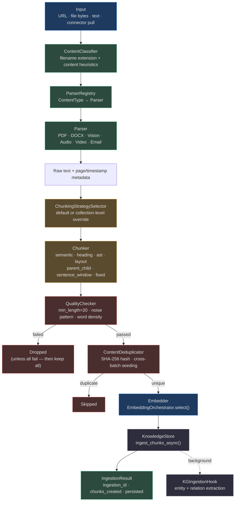
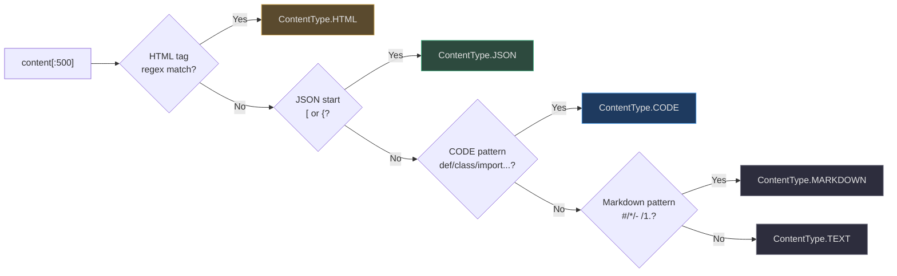
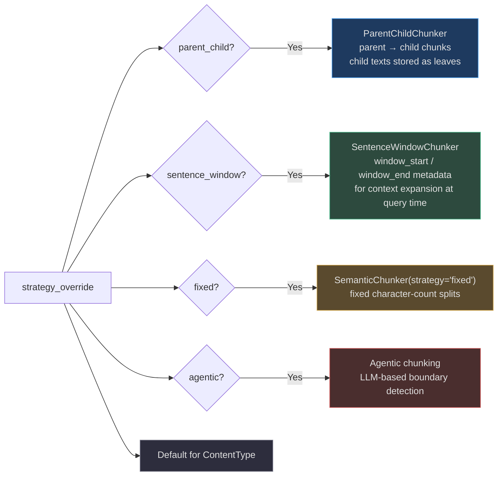
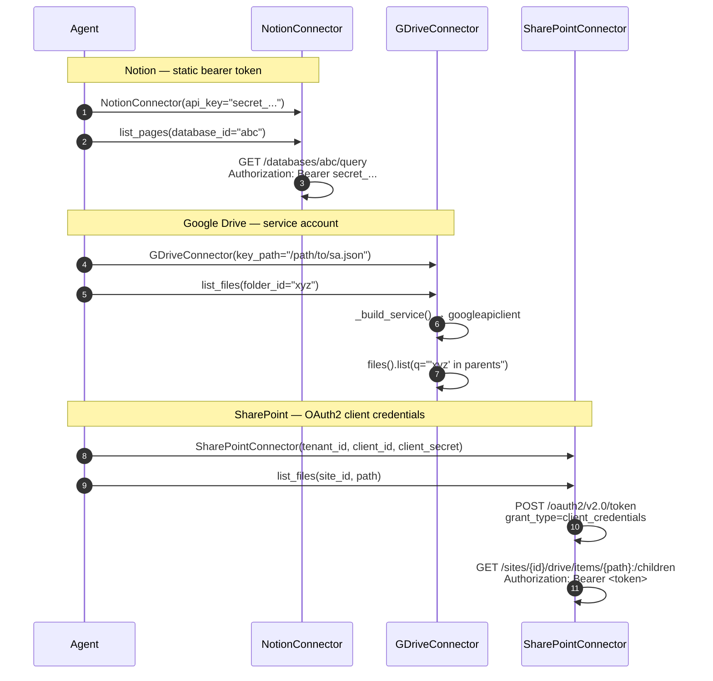
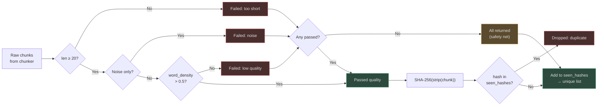

# Ingestion Pipeline

The ingestion pipeline transforms raw content — a URL, a file upload, a Notion page, or a Google Drive document — into embedding-ready chunks stored in the knowledge store. The pipeline is designed around three principles:

1. **Type-aware**: every content type gets a dedicated parser and chunker optimised for its structure.
2. **Quality-first**: low-signal chunks are filtered before they reach the embedding step.
3. **Idempotent**: SHA-256 deduplication ensures re-running ingest on the same content produces no duplicates.

---

## Full Pipeline — End to End



<!-- Sources: app/ingestion/orchestrator.py:1-140, app/ingestion/quality_checks.py:1-80, app/ingestion/chunking_strategy_selector.py:1-50 -->

---

## Content Classifier

**Class**: `ContentClassifier` — [`app/ingestion/content_classifier.py`](https://github.com/harsh786/agent-verse/blob/main/agent-verse-backend/app/ingestion/content_classifier.py)

Detection uses two methods:

### 1. By Filename Extension

```python
# Source: app/ingestion/content_classifier.py:24-38
_EXT_MAP = {
    ".pdf": ContentType.PDF,
    ".md":  ContentType.MARKDOWN,
    ".py":  ContentType.CODE,     # also: .js .ts .java .go .rs .cpp .rb .sh .sql
    ".png": ContentType.IMAGE,    # also: .jpg .jpeg .gif .webp .svg
    ".mp3": ContentType.AUDIO,    # also: .wav .ogg
    ".mp4": ContentType.VIDEO,    # also: .mov .avi
    ".csv": ContentType.CSV,
    ".json": ContentType.JSON,
    ...
}
```

### 2. By Content Heuristics (for `classify()`)

Detection order matters — first match wins:



<!-- Sources: app/ingestion/content_classifier.py:50-68 -->

---

## Content Type → Parser → Chunker Mapping

| `ContentType` | Parser | Default Chunker | Strategy Key |
|---|---|---|---|
| `TEXT` | — (raw text pass-through) | `SemanticChunker` | `semantic` |
| `MARKDOWN` | — (raw text) | `HeadingChunker` | `heading` |
| `PDF` | `PDFParser` | `PDFLayoutChunker` | `layout` |
| `DOCX` | `DocxParser` | paragraph split | `paragraph` |
| `HTML` | — (raw HTML) | DOM-based | `dom` |
| `CODE` | — (raw source) | `ASTChunker` | `ast` |
| `IMAGE` | `VisionParser` | region-based | `region` |
| `AUDIO` | `AudioParser` | `TimestampChunker` | `timestamp` |
| `VIDEO` | `VideoParser` | `SceneChunker` | `scene` |
| `CSV` | — (raw CSV) | row group split | `row_group` |
| `JSON` | — (raw JSON) | record split | `record` |
| `WEB_PAGE` | — (HTML) | DOM-based | `dom` |
| `MIXED` | — | `SemanticChunker` | `semantic` |

Sources: [content_classifier.py](https://github.com/harsh786/agent-verse/blob/main/agent-verse-backend/app/ingestion/content_classifier.py), [chunking_strategy_selector.py:8-23](https://github.com/harsh786/agent-verse/blob/main/agent-verse-backend/app/ingestion/chunking_strategy_selector.py#L8)

---

## Parsers

### PDF Parser
**File**: [`app/ingestion/parsers/pdf_parser.py`](https://github.com/harsh786/agent-verse/blob/main/agent-verse-backend/app/ingestion/parsers/pdf_parser.py)

Three-tier fallback strategy to maximize text extraction success:

```
pymupdf (fastest, best layout) → pdfminer.six (fallback) → UTF-8 decode (last resort)
```

Output: `PDFParseResult.to_chunks()` — one chunk per non-empty page, carrying `page_number` and `source_name` in metadata.

### Vision Parser (Image OCR)
**File**: [`app/ingestion/parsers/vision_parser.py`](https://github.com/harsh786/agent-verse/blob/main/agent-verse-backend/app/ingestion/parsers/vision_parser.py)

Images are base64-encoded and sent to a vision LLM with a descriptive prompt. Provider preference is configurable (`prefer_provider="openai"` or `"anthropic"`).

```python
# Source: app/ingestion/parsers/vision_parser.py:43-50
mime_type = _detect_image_mime(image_bytes)   # PNG / JPEG / GIF / WebP detection by magic bytes
b64_image = base64.standard_b64encode(image_bytes).decode()
# Tries openai → anthropic (or anthropic → openai based on prefer_provider)
```

Output: `VisionParseResult.description` — a natural language description injected as a single chunk.

### Audio Parser
Transcription-based: converts speech to text, then passes the transcript through the standard text chunker.

### Email Parser
**File**: `app/ingestion/parsers/email_parser.py` — RFC-5322 header parsing, HTML body stripping, attachment enumeration.

---

## Chunking Strategies

### Standard Strategies (via `ChunkingStrategySelector.select()`)

| Strategy | Chunker Class | Best For |
|---|---|---|
| `semantic` | `SemanticChunker` | Flowing prose — splits on meaning boundaries |
| `heading` | `HeadingChunker` | Markdown / structured docs — splits on `#` headings |
| `ast` | `ASTChunker` | Source code — function/class boundaries |
| `layout` | `PDFLayoutChunker` | PDFs with tables/figures — preserves page layout |
| `timestamp` | `TimestampChunker` | Audio/video — splits on speech timestamps |
| `scene` | `SceneChunker` | Video — splits on scene changes |
| `dom` | DOM chunker | HTML/web pages — splits on block-level elements |

### Advanced Strategies — Dispatch Table

Advanced strategies require special orchestrator dispatch and are enabled via collection-level `strategy_override`. Set via `ChunkingStrategySelector.select_advanced()`.

<!-- Source: app/ingestion/chunking_strategy_selector.py:25-40 -->



<!-- Sources: app/ingestion/orchestrator.py:72-130, app/ingestion/chunking_strategy_selector.py:25-45 -->

| Advanced Strategy | `_ADVANCED_STRATEGIES` | Use When |
|---|:---:|---|
| `parent_child` | ✓ | Long documents where context around a retrieved child chunk helps comprehension |
| `sentence_window` | ✓ | Dense technical content where retrieval precision is critical |
| `fixed` | ✓ | Uniform chunk sizes required by downstream tools |
| `agentic` / `agentic_chunking` | ✓ | Heterogeneous documents where LLM boundary detection is warranted |

---

## Quality Checks

**Class**: `QualityChecker` — [`app/ingestion/quality_checks.py:17`](https://github.com/harsh786/agent-verse/blob/main/agent-verse-backend/app/ingestion/quality_checks.py#L17)

### Quality Check Algorithm

A chunk passes quality if **all** of the following hold:

1. Not empty / not whitespace-only
2. Length ≥ `min_length` (default: **20 characters**)
3. Content is not pure noise (matches `^[\s\.\-_=+*#@!?/\\|<>(){}\[\]]+$`)
4. Word density score > `max_noise_ratio` (default: 0.5)

**Word density formula**:

$$\text{quality} = \min\!\left(1.0,\ \frac{\sum_{w \in \text{words}(≥3\,chars)} |w|}{|\text{content}|} \times 1.5\right)$$

**Safety net**: If *all* chunks in a batch fail quality, the filter returns the original batch unchanged. This prevents a single bad document from producing zero chunks and silent data loss.

```python
# Source: app/ingestion/orchestrator.py:57-65
def _filter_quality(self, chunks: list[str]) -> list[str]:
    checker = QualityChecker(min_length=20)
    filtered = [c for c in chunks if checker.check(c).passed]
    return filtered if filtered else chunks  # safety net
```

---

## Deduplication

**Class**: `ContentDeduplicator` — [`app/ingestion/quality_checks.py:40`](https://github.com/harsh786/agent-verse/blob/main/agent-verse-backend/app/ingestion/quality_checks.py#L40)

### How It Works

Each chunk is normalized (stripped whitespace) and hashed with SHA-256. Chunks whose hash has been seen before in the current session are dropped.

```python
# Source: app/ingestion/quality_checks.py:55-60
hash = hashlib.sha256(content.strip().encode()).hexdigest()
```

**Cross-batch deduplication**: Pass a pre-seeded `seen_hashes` set to `ContentDeduplicator(seen_hashes=previous_batch_hashes)`. This allows deduplication across multiple ingestion batches for the same collection.

```
DeduplicationResult
├── unique_chunks: list[str]     # chunks that passed
├── duplicate_count: int         # how many were dropped
└── seen_hashes: set[str]        # updated hash set (seed next batch)
```

---

## External Connectors

### Connector Comparison

| Feature | NotionConnector | GDriveConnector | SharePointConnector |
|---|---|---|---|
| **Source file** | [notion_connector.py](https://github.com/harsh786/agent-verse/blob/main/agent-verse-backend/app/ingestion/connectors/notion_connector.py) | [gdrive_connector.py](https://github.com/harsh786/agent-verse/blob/main/agent-verse-backend/app/ingestion/connectors/gdrive_connector.py) | [sharepoint_connector.py](https://github.com/harsh786/agent-verse/blob/main/agent-verse-backend/app/ingestion/connectors/sharepoint_connector.py) |
| **Auth method** | Bearer token (`Authorization: Bearer <api_key>`) | OAuth2 service account JSON or `Credentials` object | OAuth2 client credentials (`client_id` + `client_secret`) |
| **API** | Notion REST API v1 (`2022-06-28`) | Google Drive API v3 | Microsoft Graph API v1.0 |
| **List content** | `list_pages(database_id)` | `list_files(folder_id)` | `list_files(site_id, path)` |
| **Fetch content** | `fetch_page_content(page_id)` | `download_file(file_id)` | `download_file(site_id, item_id)` |
| **Native formats** | Notion blocks (JSON → text) | Docs, Sheets, Slides via export | SharePoint sites, OneDrive files |
| **Export formats** | Text | Google Docs→text, Sheets→CSV, Slides→text | Any downloadable Graph file |
| **HTTP client** | `httpx.AsyncClient` | `googleapiclient` (lazy built) | `httpx.AsyncClient` |
| **Required permissions** | `Integration` token with page read access | `drive.readonly` or service account with folder access | `Sites.Read.All` (app registration) |
| **Token refresh** | N/A (static API key) | Automatic via `google-auth` | `get_access_token()` — call before each request |

### Connector Authentication Flows



<!-- Sources: app/ingestion/connectors/notion_connector.py:16-50, app/ingestion/connectors/gdrive_connector.py:18-60, app/ingestion/connectors/sharepoint_connector.py:14-60 -->

---

## IngestionOrchestrator

**Class**: `IngestionOrchestrator` — [`app/ingestion/orchestrator.py:42`](https://github.com/harsh786/agent-verse/blob/main/agent-verse-backend/app/ingestion/orchestrator.py#L42)

### Constructor Dependencies

| Parameter | Type | Purpose |
|---|---|---|
| `knowledge_store` | `KnowledgeStore` | Destination for ingested chunks |
| `embedder` | Any | Embedding provider for vectorizing chunks |
| `indexing_dependencies` | `Mapping[RAGStrategy, IndexingDependency]` | LLM + model for RAPTOR/AGENTIC indexing |
| `rag_indexing_config` | `RAGIndexingConfig` | Strategy selection + batch sizes |

### `IngestionResult` Fields

| Field | Type | Description |
|---|---|---|
| `ingestion_id` | str | Unique ID for this ingestion run |
| `tenant_id` | str | Owning tenant |
| `collection_id` | str | Target collection |
| `content_type` | `ContentType` | Detected content type |
| `chunking_strategy` | str | Strategy actually used |
| `chunks_created` | int | Number of chunks persisted |
| `chunk_ids` | list[str] | IDs of persisted chunks |
| `chunks_prepared` | int | Chunks prepared (pre-dedup count) |
| `persisted` | bool | Whether DB write succeeded |

Source: [`app/ingestion/orchestrator.py:24-38`](https://github.com/harsh786/agent-verse/blob/main/agent-verse-backend/app/ingestion/orchestrator.py#L24)

---

## Quality and Dedup Pipeline — Detailed



<!-- Sources: app/ingestion/quality_checks.py:17-80 -->

---

## Related Pages

| Page | Description |
|---|---|
| [Knowledge & KG](./knowledge-and-kg.md) | Where ingested chunks are stored and queried |
| [Embedding System](./embedding-system.md) | How chunks are embedded before storage |
| [RAG System](./rag-system.md) | Retrieval patterns over ingested content |
