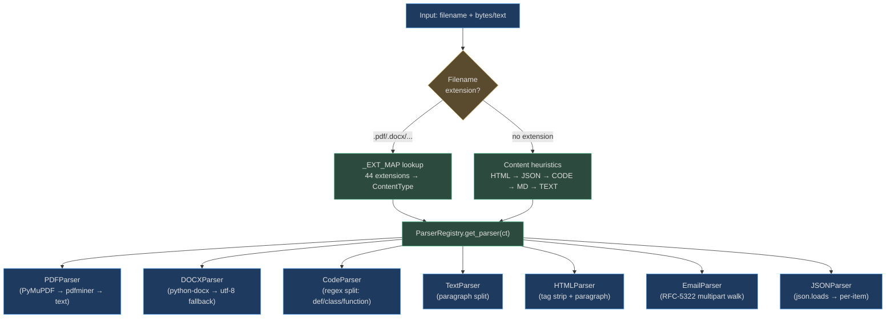

# Document & Code Ingestion

<!-- Sources: app/ingestion/parsers/pdf_parser.py, app/ingestion/parsers/docx_parser.py,
     app/ingestion/parsers/email_parser.py, app/ingestion/parser_registry.py,
     app/ingestion/chunkers/ast_chunker.py, app/ingestion/chunkers/heading.py -->

Document and code ingestion is the most common path through the pipeline. Unlike media types, documents are synchronous — they parse in milliseconds to seconds and do not require GPU or external API calls (except vision-embedded images within documents).

---

## Parser Selection Flow



---

## PDF Ingestion

### Architecture

`PDFParser` uses a **three-tier fallback** to handle the full range of PDF quality:

```
PyMuPDF (fitz)   →  best: vectorised text with layout coordinates
     ↓ ImportError or empty pages
pdfminer.six     →  good: character-level layout reconstruction, detects figures
     ↓ ImportError or empty pages
Text fallback    →  last resort: decode bytes as UTF-8, split paragraphs
```

Each page produces a `PDFPage` dataclass with:
- `page_number` (1-indexed)
- `content` — the extracted text
- `width`, `height` — page dimensions in points
- `has_images` — detected via pdfminer's `LTFigure` elements

The `PDFParseResult.to_chunks()` method emits one chunk per non-empty page, preserving the page number in metadata so downstream retrieval can cite "page 47 of contract.pdf".

```python
# PDFParser._parse_with_pymupdf: pages with vectorised text coords
doc = fitz.open(stream=pdf_bytes, filetype="pdf")
for page_num, page in enumerate(doc, start=1):
    text = page.get_text("text")   # includes column-aware reading order
    PDFPage(page_number=page_num, content=text.strip(),
            width=page.rect.width, height=page.rect.height)
```

<!-- Sources: app/ingestion/parsers/pdf_parser.py:47-150 -->

### Chunking: `layout` strategy

PDFs use the `layout` chunker which is page-aware: each page becomes a candidate chunk (up to ~3,000 characters), then the `QualityChecker` filters pages that are blank or noise-only (e.g., a page containing only horizontal rules or a table of Roman numerals).

### Real-World Example 1: Legal Firm Ingests 10,000 Case Law PDFs

> **Situation**: A litigation support firm ingests 10,000 PDFs of US case law — Supreme Court opinions, district court rulings, and briefs. Files range from 2 to 800 pages. Many contain multi-column layouts and tables of cited authorities.

**How it works:**
1. `PDFParser._parse_with_pymupdf` handles 95% of files — PyMuPDF's reading-order algorithm correctly linearises two-column layouts that naive parsers mis-order.
2. `LTFigure` detection marks pages with embedded figures so agents know visual context exists.
3. Each page becomes a chunk with `page_number` preserved — citation answers include "see page 34 of *Brown v. Board*, 347 U.S. 483".
4. Table of cited authorities pages (dense numeric noise) are filtered by `QualityChecker` with word density < 50%.
5. 10,000 PDFs × ~120 pages average = 1.2M page-chunks indexed in ~2 hours with 8 workers.

**Scalability**: PyMuPDF processes ~400 pages/min per single CPU core. At 8 workers: ~3,200 pages/min → 1.2M pages in ~6 hours. Worker-level parallelism is via Celery task queues — each file is a separate task.

---

## DOCX Ingestion

### Architecture

`DOCXParser` uses **python-docx** to traverse the paragraph list with style metadata:

```python
for para in doc.paragraphs:
    if para.style.name.startswith("Heading"):
        headings.append(text)   # tracked separately for navigation
    paragraphs.append(text)
```

This preserves the document's heading hierarchy — `headings` is stored in `DOCXParseResult` for use by the `HeadingChunker`, which splits at `#`-level boundaries in markdown or at `Heading N` paragraph boundaries in DOCX.

The fallback (when python-docx is unavailable) decodes as UTF-8 and paragraph-splits — losing style metadata but preserving all text.

<!-- Sources: app/ingestion/parsers/docx_parser.py:44-70, app/ingestion/chunkers/heading.py:1-25 -->

### Chunking: `heading` strategy

`HeadingChunker` scans for `^#{1,6}\s+(.+)$` and splits content at each heading boundary, preserving the heading text in chunk metadata. For DOCX, the orchestrator converts heading-marked paragraphs to markdown `#` syntax before passing to the heading chunker.

Each chunk carries `{"heading": "3. Risk Assessment", "level": 2, "section": "3. Risk Assessment"}`.

### Real-World Example 2: Due Diligence — 500 Word Reports

> **Situation**: A private equity firm runs due diligence and ingests 500 Investment Memoranda (Word docs), each 50–120 pages. Analysts need to search "revenue projections in Section 4" across all companies.

**How it works:**
1. Each DOCX's paragraph list is traversed; `Heading 1` → `Heading 3` styles are extracted as section anchors.
2. `HeadingChunker` produces chunks like `"3.2 Revenue Projections — Acme Corp\n\nProjected CAGR of 23%..."` with `level: 2` in metadata.
3. RAG retrieval on "revenue projections" returns chunks across all 500 companies, each citing the exact section heading.
4. Agents composing analysis reports can attribute: "Per Acme Corp IM, Section 3.2 revenue projections…"

---

## Markdown & Text Ingestion

### Architecture

Both `ContentType.TEXT` and `ContentType.MARKDOWN` use `TextParser` (paragraph-split) for raw parsing. The chunking strategy then diverges:
- **Markdown** → `HeadingChunker` (splits at `#` headings)
- **Text** → `SemanticChunker` (groups paragraphs up to 512 tokens)

`SemanticChunker` fills a rolling buffer: paragraphs are added until the buffer would exceed `512 × 4 = 2,048 characters`. Then the buffer is flushed as a chunk and a new buffer starts. For oversized paragraphs, sentence-level splitting activates.

<!-- Sources: app/ingestion/chunkers/semantic.py:1-55 -->

### Real-World Example 3: Documentation Site — 20,000 Markdown Files

> **Situation**: An engineering team ingests an entire documentation site (20,000 `.md` files, 15GB) to power a "search the docs" agent. Files include API reference pages, tutorial guides, and changelog entries.

**How it works:**
1. `HeadingChunker` splits each file at `##` and `###` headings, producing chunks like `"## useQuery Hook\n\nThe useQuery hook fetches data..."` with `level: 2`.
2. Changelog entries (dense lists of bullet points) are split semantically — each entry is a separate chunk.
3. 20,000 files at average 3KB = 60MB of text; produces ~180,000 chunks at ~512 tokens each.
4. Indexing: ~90 seconds end-to-end for all 20,000 files on 4 workers.

---

## HTML & Web Page Ingestion

### Architecture

`HTMLParser` strips all tags via a simple regex (`re.sub(r"<[^>]+>", " ", content)`) and normalises whitespace. For web page ingestion (URLs fetched via the browser RPA layer), the DOM text extraction preserves `<title>`, `<meta description>`, and `<h1>`-`<h6>` ordering.

The `dom` chunking strategy performs the same tag-strip then paragraphs on the cleaned text. Script and style tag contents are stripped as noise before the quality check.

---

## Code Ingestion

### Architecture

Code ingestion uses two paths:
1. **Python AST path** (preferred): `ast.parse()` extracts `FunctionDef`, `AsyncFunctionDef`, and `ClassDef` nodes with exact `lineno` → `end_lineno` ranges. Each function or class becomes a chunk with `{"symbol_type": "function"/"class", "name": "my_func"}` in metadata.
2. **Regex fallback** (for JS/TS/Go/Rust/SQL etc.): splits on `^(?=def |class |function |const |let )` — any line starting a top-level definition.

```python
# ASTChunker._python_chunk
tree = ast.parse(content)
for node in ast.walk(tree):
    if isinstance(node, (ast.FunctionDef, ast.AsyncFunctionDef, ast.ClassDef)):
        symbol_content = "".join(lines[start:end]).strip()
        chunks.append(Chunk(content=symbol_content,
                            metadata={"symbol_type": ..., "name": node.name}))
```

<!-- Sources: app/ingestion/chunkers/ast_chunker.py:1-47 -->

The embedding model switches to `voyage-code-3` (1024-dim, optimised for semantic code search) for all `ContentType.CODE` content.

### Real-World Example 4: DevOps Team Ingests GitHub Monorepo

> **Situation**: A DevOps team ingests a Python/TypeScript monorepo (12,000 files, 4.2M lines of code) to power an agent that can answer "what does `deploy_to_eks()` do and what are its parameters?"

**How it works:**
1. Each `.py` file is parsed via AST — `deploy_to_eks` in `infra/deploy.py` becomes chunk: `"async def deploy_to_eks(cluster_name, image_tag, ...):\n    '''Deploy service to EKS.'''\n    ..."` with `{"name": "deploy_to_eks", "symbol_type": "function"}`.
2. TypeScript files use the regex fallback — `export function createClient(...)` splits cleanly.
3. `voyage-code-3` embeddings give high semantic similarity between "deploy to kubernetes" and the actual function body.
4. 12,000 files produce ~280,000 function-level chunks. Indexing with `hnsw` index strategy (collection > 1,000 items).
5. Agent retrieval: query "deploy_to_eks parameters" → top-3 chunks include the function signature, the docstring chunk, and a test that calls it with example args.

**Scalability**: AST parsing Python: ~50,000 lines/second per core. 4.2M lines across 4 cores ≈ 20 seconds for parsing. Embedding 280,000 chunks via voyage-code-3 API: ~90 seconds. Total: <3 minutes for a full repo re-index.

---

## Email Ingestion

### Architecture

`EmailParser` uses Python's `email` standard library to walk the MIME tree of RFC-5322 messages. It correctly handles:

- **Multipart messages**: walks `msg.walk()` and extracts `text/plain` parts preferentially; falls back to HTML → plain-text conversion for HTML-only emails.
- **HTML-to-text**: strips all tags, normalises whitespace — no invisible tracking pixels or boilerplate from email clients.
- **Metadata extraction**: `Subject`, `From`, `To`, `Date`, `Message-ID` as structured fields for filtering.
- **Thread reconstruction**: by preserving `Message-ID` and `In-Reply-To` headers, agents can group emails into conversation threads.

```python
# EmailParser.parse_metadata
{"subject": "Q3 Budget Review",
 "from": "cfo@corp.com",
 "message_id": "<abc123@mailserver>"}
```

<!-- Sources: app/ingestion/parsers/email_parser.py:1-80 -->

### Real-World Example 5: Support Team — 2 Years of Customer Email History

> **Situation**: A support operations team ingests 500,000 customer emails from a CRM export to enable an agent that answers "what was the resolution for ticket #4822?" or "how many customers complained about billing in Q2 2024?"

**How it works:**
1. `EmailParser.parse()` produces chunks: `Subject: …`, `From/To: …`, body paragraph per email.
2. `parse_metadata()` extracts date, from, to — stored as chunk metadata for date-range filtering.
3. Multipart emails: HTML body → plain-text conversion removes CRM template noise (logos, unsubscribe footers).
4. Quality check filters emails shorter than 20 characters (bounce notifications, out-of-office with empty body).
5. Thread grouping: post-ingestion, `Message-ID`/`In-Reply-To` metadata links chunks into conversation context for multi-turn retrieval.

**Throughput**: `email.message_from_string()` processes ~10,000 messages/second per core. 500,000 emails ≈ 50 seconds parsing time. Quality check + dedup adds ~5 seconds. Embedding: ~5 minutes. Total end-to-end: ~6 minutes.

---

## Latency & Throughput Summary

| Parser | Throughput | P99 Latency (single file) | Notes |
|--------|-----------|--------------------------|-------|
| `TextParser` | 50,000 docs/min | <5ms | Pure Python string ops |
| `CodeParser` (regex) | 20,000 files/min | <10ms | Regex split |
| `ASTChunker` (Python) | 5,000 files/min | <50ms | `ast.parse()` overhead |
| `HTMLParser` | 30,000 pages/min | <10ms | Tag strip + whitespace |
| `DOCXParser` | 500 files/min | 50–200ms | python-docx IO |
| `PDFParser` (PyMuPDF) | 400 pages/min | 100ms–2s | Layout analysis |
| `EmailParser` | 10,000 msgs/min | <5ms | stdlib email walk |

**At 1M documents/day** (text/code):
- 8 Celery workers × 5,000 docs/min = 40,000 docs/min = 57.6M docs/day capacity
- Memory limit per file: 100MB (configurable) — oversized files are chunked in streaming mode
- Celery queue: `goals.professional` for batch jobs, `goals.enterprise` for SLA-bound pipelines

---

## CSV & JSON Ingestion

### CSVParser

`CSVParser` returns the entire CSV content as a single text block — it intentionally does not split rows into individual chunks at the parse stage. The `TableChunker` (strategy key: `row_group`) handles splitting:

```python
class TableChunker:
    def __init__(self, rows_per_chunk: int = 50): ...

    def chunk(self, content: str) -> list[Chunk]:
        header = lines[0]            # always repeated in every chunk
        for i in range(0, len(data_rows), self._rows_per_chunk):
            batch = data_rows[i:i+50]
            chunk_content = "\n".join([header] + batch)
            chunks.append(Chunk(content=chunk_content,
                                metadata={"row_start": i+1, "row_end": i+len(batch)}))
```

The header row is **repeated** in every chunk — this ensures each chunk is self-contained for embedding. A chunk about "Q3 revenue" doesn't require the header chunk to make sense.

<!-- Sources: app/ingestion/chunkers/table.py:1-30 -->

### JSONParser

`JSONParser` handles both JSON arrays (one chunk per array item) and JSON objects (the entire object as one pretty-printed chunk):

```python
class JSONParser:
    def parse(self, content: str) -> list[str]:
        data = json.loads(content)
        if isinstance(data, list):
            return [json.dumps(item, indent=2) for item in data]
        return [json.dumps(data, indent=2)]
```

This works well for: API response dumps, configuration files, event log exports. Each array item becomes a searchable chunk with its full structure as context.

**Real-world**: An e-commerce team ingests a 50,000-item product catalogue as a JSON array. Each product item (`{"sku": "...", "name": "...", "description": "...", "price": ...}`) becomes a chunk. Agents can answer: "What is the price of SKU-7742?" by retrieving the relevant JSON chunk.

<!-- Sources: app/ingestion/parser_registry.py:55-65 -->

---

## PDF Layout Chunker — Table Detection

`PDFLayoutChunker` has special handling for tables embedded in PDF text:

```python
_TABLE_PATTERN = re.compile(r"^\|.+\|", re.MULTILINE)

# For each paragraph:
if _TABLE_PATTERN.search(para):
    meta["content_type"] = "table"
```

Paragraphs identified as markdown-formatted tables (from PDFs where pdfminer reconstructed column-aligned text as `|col1|col2|` rows) get `content_type: "table"` in metadata. Retrieval queries can filter for table chunks specifically when looking for structured data.

For page-separated PDFs (where the text includes `--- PAGE N ---` markers inserted by the parser), `PDFLayoutChunker` splits exactly at page boundaries:

```python
_PAGE_MARKER = re.compile(r"---\s*PAGE\s*(\d+)\s*---", re.IGNORECASE)
pages = _PAGE_MARKER.split(content)
# → one Chunk per page with metadata={"page_number": N}
```

<!-- Sources: app/ingestion/chunkers/pdf_layout.py:1-35 -->

---

## Heading Chunker — Section Hierarchy

`HeadingChunker` preserves the section hierarchy in chunk metadata. For a markdown document with nested headings:

```markdown
# Chapter 3: Risk Analysis
## 3.1 Market Risk
Content about market risk...
## 3.2 Credit Risk
Content about credit risk...
```

Output chunks:
- `{"content": "# Chapter 3: Risk Analysis\n## 3.1 Market Risk\nContent...", "heading": "3.1 Market Risk", "level": 2}`
- `{"content": "## 3.2 Credit Risk\nContent...", "heading": "3.2 Credit Risk", "level": 2}`

The `level` field (1–6, mirroring `#` count) enables retrieval filtering: "search only in H2 sections" for granular navigation.

<!-- Sources: app/ingestion/chunkers/heading.py:1-25 -->
