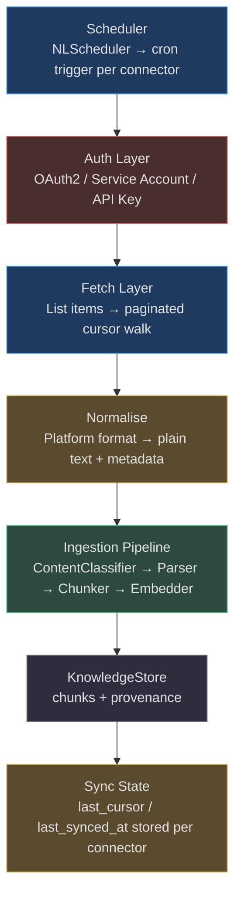
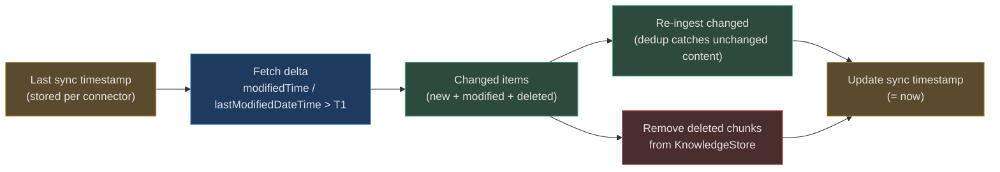
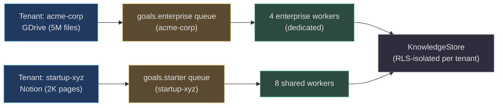

# External Source Connectors

<!-- Sources: app/ingestion/connectors/gdrive_connector.py,
     app/ingestion/connectors/notion_connector.py,
     app/ingestion/connectors/sharepoint_connector.py -->

External source connectors bridge third-party platforms into the ingestion pipeline. Rather than requiring users to export and upload files manually, connectors pull content directly from the platform API, normalise it, and feed it into the same parser → chunker → embedder pipeline used by uploaded files.

Three connectors ship with AgentVerse: **Google Drive**, **Notion**, and **SharePoint/OneDrive**.

---

## Connector Architecture



---

## Google Drive Connector

### Authentication

`GDriveConnector` supports two auth modes:
1. **Service account** (`key_path`): JSON key file for server-to-server access. Recommended for automated ingestion — no user interaction required, supports G Suite domain-wide delegation.
2. **Pre-built credentials object**: pass a `google.oauth2.credentials.Credentials` instance directly for user-OAuth flows.

The Google Drive REST API v3 service is built lazily on first use and reused across calls.

```python
# Scope: read-only access to all Drive files
creds = service_account.Credentials.from_service_account_file(
    key_path,
    scopes=["https://www.googleapis.com/auth/drive.readonly"],
)
```

<!-- Sources: app/ingestion/connectors/gdrive_connector.py:52-80 -->

### Fetch & Normalise

**File listing** uses the Drive Files API `q` parameter to scope to a folder: `'{folder_id}' in parents and trashed = false`. Results are paginated with `nextPageToken` — the connector walks all pages automatically.

**File download** handles three cases:
- **Google Workspace files** (Docs, Sheets, Slides): exported to `text/plain` or `text/csv` via the `export_media` API — no format conversion needed downstream.
- **Direct-download files** (PDF, Markdown, CSV, HTML, JSON, plain text): downloaded as-is via `get_media`.
- **Unsupported MIME types** (Drawings, Forms, binary blobs): skipped — returns empty string.

```python
_EXPORT_MIME = {
    "application/vnd.google-apps.document":     "text/plain",
    "application/vnd.google-apps.spreadsheet":  "text/csv",
    "application/vnd.google-apps.presentation": "text/plain",
}
```

### Incremental Sync

Connectors store `modifiedTime` from the Drive API's file metadata. On subsequent syncs, only files with `modifiedTime > last_synced_at` are re-ingested. The `ContentDeduplicator` provides a second layer of protection: even if a file's modified time is stale, identical chunk hashes are skipped.

### Rate Limiting

Google Drive API quotas:
- 12,000 requests/min per project (list + metadata calls)
- Export calls count against Drive download quotas (10GB/day for service accounts)

The connector does not implement explicit rate limiting — for high-volume connectors, wrap calls in a `tenacity` retry with exponential backoff: start at 1s, max 60s, respect `Retry-After` headers on 429 responses.

### Real-World Example 1: Marketing Team — Shared Drive with 50,000 Assets

> **Situation**: A marketing team has a shared Google Drive with 50,000 files: Google Docs (brand guidelines, copy), PDFs (campaign reports), CSV exports (ad performance data). They connect it to AgentVerse so agents can answer "what was our Q3 campaign ROI?" or "does our brand guide allow using competitor names?"

**How it works:**
1. `GDriveConnector.list_files(folder_id="marketing-shared-drive-id")` walks all 50,000 files in ~500 API calls (100 files/page).
2. Google Docs → `text/plain` export; PDFs → `PDFParser`; CSVs → `CSVParser`.
3. `modifiedTime` tracking means weekly re-syncs only process the ~200 files changed that week.
4. Brand guidelines (DOCX-style Google Docs) → `HeadingChunker` → chunk: `"## Competitor Naming Policy\n\nDo not use competitor brand names..."`.
5. Agent answers: "Per the Brand Guide (updated 2024-11-15), Section 7.3: competitor names may not appear in paid advertising copy."

---

## Notion Connector

### Authentication

`NotionConnector` uses a Bearer token from a **Notion Integration** (OAuth app or internal integration). The integration must be added to each workspace/database it should access.

Required header: `Notion-Version: 2022-06-28` — the connector pins to this version for API stability.

### Fetch & Normalise

**Database query**: `POST /v1/databases/{database_id}/query` — paginated with `start_cursor` + `page_size`. Returns all page objects in the database.

**Block content**: `GET /v1/blocks/{page_id}/children` — walks the block tree and extracts `rich_text[].plain_text` from each block. The `_blocks_to_text()` method:

```python
for block in blocks:
    bt = block.get("type", "")          # e.g. "paragraph", "heading_1"
    rich = block.get(bt, {}).get("rich_text", [])
    text = "".join(r.get("plain_text", "") for r in rich)
    lines.append(text.strip())
```

This handles: paragraph, heading_1/2/3, bulleted_list_item, numbered_list_item, toggle, quote, callout, code. Images and files produce a placeholder `[Image]` token.

**Workspace-wide search**: `POST /v1/search` with `filter: {object: "page"}` — finds all pages accessible to the integration, not just a specific database.

<!-- Sources: app/ingestion/connectors/notion_connector.py:55-90 -->

### Real-World Example 2: Product Team — Notion as Single Source of Truth

> **Situation**: A product team maintains all specs, PRDs, and roadmaps in Notion (8,000 pages across 40 databases). They connect Notion so agents can answer "what changed in v2.3?" or "what is the acceptance criteria for the payments feature?"

**How it works:**
1. `list_pages(database_id)` queries the Roadmap, PRD, and Engineering Spec databases in parallel.
2. Each page's blocks are fetched: `heading_1` → `## Feature: Stripe Checkout Integration`, `paragraph` → spec text, `bulleted_list_item` → acceptance criteria.
3. `HeadingChunker` splits at `heading_1`/`heading_2` boundaries — each chunk is a self-contained spec section.
4. Chunk metadata includes `page_id` from Notion, enabling deep-link citations: `notion.so/page/{page_id}`.
5. When v2.3 is released, Notion's `last_edited_time` triggers a re-sync of changed pages — only 15-30 pages in a typical release cycle.

**What agents can answer:**
- "What are the acceptance criteria for JIRA-442?" → finds the linked Notion PRD chunk.
- "What changed between v2.2 and v2.3?" → retrieves "Release Notes — v2.3" page.
- "Which features are in scope for Q2?" → searches Roadmap database chunks.

---

## SharePoint / OneDrive Connector

### Authentication

`SharePointConnector` uses OAuth 2.0 **client credentials flow** (app-only) via Microsoft Graph API. This requires an Azure AD app registration with `Sites.Read.All` permission (application, not delegated).

```python
# Token URL: POST to Entra ID
url = f"https://login.microsoftonline.com/{tenant_id}/oauth2/v2.0/token"
data = {
    "grant_type": "client_credentials",
    "client_id": client_id,
    "client_secret": client_secret,
    "scope": "https://graph.microsoft.com/.default",
}
```

Tokens are cached in `self._access_token`. On 401 responses, the connector retries once with a freshly acquired token — handling token expiry gracefully.

<!-- Sources: app/ingestion/connectors/sharepoint_connector.py:43-90 -->

### Fetch & Normalise

The connector exposes:
- `list_sites(search="*")`: all SharePoint sites accessible to the app
- `list_files(site_id, drive_id, folder_path)`: files in a document library
- `get_site(site_id)`: site metadata

Files are downloaded via Graph's `@microsoft.graph.downloadUrl` and passed to `IngestionOrchestrator` with the MIME type for parser selection: `.docx` → `DOCXParser`, `.pdf` → `PDFParser`, `.xlsx` → text export.

### Incremental Sync

SharePoint's `lastModifiedDateTime` field drives incremental sync. The connector queries `/sites/{id}/drive/root/children?$filter=lastModifiedDateTime ge {last_sync}` to reduce API calls.

### Real-World Example 3: Enterprise — 200GB SharePoint Knowledge Base

> **Situation**: A Fortune 500 company has 200GB of SharePoint content: HR policies, IT runbooks, compliance frameworks, and project wikis across 50 sites. They connect it to AgentVerse so employees can ask "what is the parental leave policy?" or "how do I request a software license?"

**How it works:**
1. `list_sites(search="*")` discovers all 50 SharePoint sites. Each site's document library is enumerated.
2. Files by extension: `.docx` → `DOCXParser` + heading chunker; `.pdf` → `PDFParser`; `.pptx` → text export.
3. Large document libraries (10,000+ files) are processed in batches of 100, with 30-second inter-batch pauses to respect Graph API rate limits (10,000 requests/10min).
4. Policy documents (frequently updated) get weekly re-sync. Project wikis get daily re-sync.
5. Employees query: "What is the maximum reimbursable amount for a home office setup?" → agent returns: "Per IT Policy v3.2 (SharePoint: HR-Policies/IT), Section 4.1: employees may expense up to $1,500 USD annually for home office equipment."

---

## Incremental Sync Protocol



---

## Rate Limiting & Backoff

| Connector | Quota | Recommended Strategy |
|-----------|-------|---------------------|
| Google Drive | 12,000 req/min (project-wide) | Exponential backoff on 429; 1s → 2s → 4s → max 60s |
| Notion | 3 req/sec per integration | Token bucket; add 350ms delay between page fetches |
| SharePoint (Graph) | 10,000 req/10min per app | Sliding window counter; pause 60s when approaching limit |

All connectors respect `Retry-After` headers when returned by the API. The recommended pattern:

```python
import tenacity

@tenacity.retry(
    wait=tenacity.wait_exponential(multiplier=1, min=1, max=60),
    stop=tenacity.stop_after_attempt(5),
    retry=tenacity.retry_if_exception_type(httpx.HTTPStatusError),
)
async def _fetch_with_retry(url: str) -> dict: ...
```

---

## At Scale: 1M+ Messages/Day

For high-volume connectors (e.g., a large Slack workspace with 10,000 active users):

| Metric | Value |
|--------|-------|
| Slack messages/day | 1M+ for a 10,000-user enterprise |
| Message size | 10–500 bytes average |
| Connector throughput | Limited by API rate (1 req/sec Slack = 86,400 messages/day per token) |
| Strategy | Multiple bot tokens across channels; distribute load |
| Dedup rate | ~15–25% (shared messages, edits, re-posts) |
| Index size growth | ~50MB/day for 1M short messages |
| Re-sync frequency | Real-time webhook for new messages; hourly for edits/deletes |

For document connectors at enterprise scale:

| Metric | Google Drive | SharePoint |
|--------|-------------|------------|
| Files in scope | 10M+ for large enterprises | 200GB+ typical |
| Initial index time | 3–7 days (rate-limited) | 2–5 days |
| Incremental sync time | 5–30 minutes/day | 5–30 minutes/day |
| Celery queue | `goals.enterprise` (priority) | `goals.enterprise` |
| Worker count needed | 4–8 dedicated connector workers | 4–8 dedicated connector workers |

---

## Connector Multi-Tenancy & Isolation

Each tenant's connector credentials are encrypted and stored separately — no connector can access another tenant's data. Connector tasks are queued in tenant-scoped Celery queues to prevent noisy-neighbour effects: a slow full-sync from one tenant's 10M-file SharePoint does not delay another tenant's quick Notion re-sync.



Postgres Row-Level Security ensures that even if two tenants' connector workers share the same database connection, their data cannot cross-contaminate. The `rls_context()` context manager sets `app.tenant_id` as a Postgres session variable before every query.

---

## Webhook-Based Real-Time Ingestion

For latency-sensitive connectors, polling is replaced by **webhooks**: the external platform pushes a notification when content changes, triggering incremental ingestion immediately.

| Platform | Webhook Mechanism | Latency |
|----------|------------------|---------|
| Notion | Webhook integrations (beta) | <5 seconds |
| SharePoint | Microsoft Graph change notifications | <30 seconds |
| Google Drive | Push notifications via Channel API | <60 seconds |

Webhook-triggered ingestion flow:
1. External platform sends HTTP POST to AgentVerse webhook endpoint.
2. Endpoint validates the payload signature (HMAC-SHA256 for Google, bearer token for Graph).
3. Ingest task is queued immediately in Celery with high priority.
4. `IngestionOrchestrator.ingest()` runs; `ContentDeduplicator` handles unchanged content efficiently.

For platforms without webhooks, **change polling** runs every 15–60 minutes (configurable per connector), using the `last_synced_at` timestamp to minimise API calls.

---

## Connector Health Monitoring

Connector-specific metrics to track:

| Metric | Description | Alert Threshold |
|--------|-------------|-----------------|
| `connector_fetch_error_rate` | % of fetch calls that fail | >2% |
| `connector_auth_failure_count` | OAuth token renewal failures | >0 in 5min |
| `connector_rate_limit_hit_count` | 429 responses per hour | >10/hour |
| `connector_sync_lag_minutes` | Minutes since last successful sync | >120 |
| `connector_items_fetched_total` | Total items fetched in this sync | — (trend) |
| `connector_items_ingested_total` | Items that produced chunks | — |
| `connector_items_skipped_dedup` | Items skipped as duplicate | — |

An increasing `connector_sync_lag_minutes` (e.g., growing beyond 2 hours) indicates a stuck connector — possibly due to token expiry, API downtime, or a Celery worker crash. The alert should page the operator responsible for connector health.
