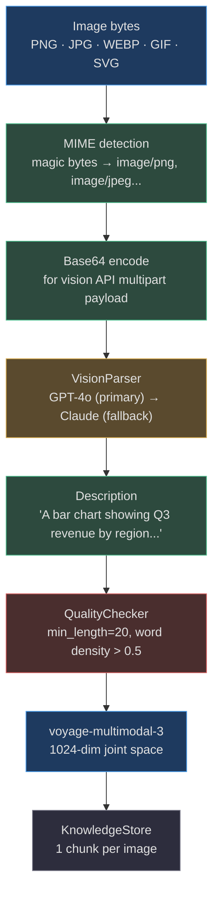
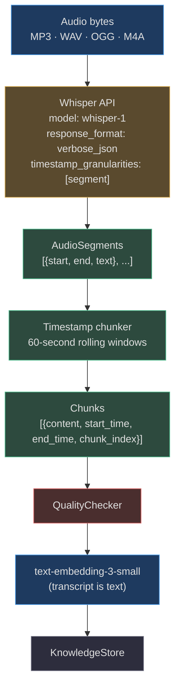
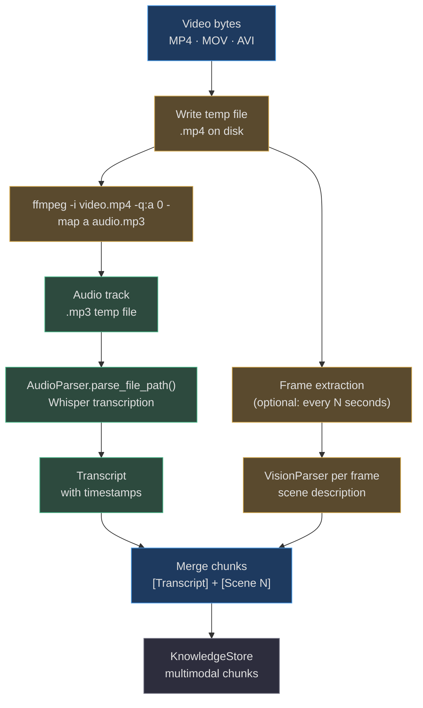
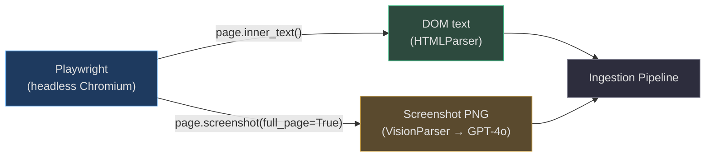

# Media Ingestion

<!-- Sources: app/ingestion/parsers/vision_parser.py, app/ingestion/parsers/audio_parser.py,
     app/ingestion/parsers/video_parser.py, app/ingestion/modality_pipeline.py,
     app/ingestion/embedding_policy_selector.py -->

Media ingestion is the most compute-intensive path through the pipeline. Unlike text documents that parse in milliseconds, images require vision model API calls, audio requires speech-to-text transcription, and video requires both. All three use the `voyage-multimodal-3` embedding model (1024-dim joint text+visual space) or fall back to `text-embedding-3-small` for pure transcripts.

---

## Modality Pipeline

`ModalityPipeline.select_pipeline()` maps each content type to its full processing configuration — parser class, chunker strategy, embedding modality, and capability flags:

```python
ContentType.AUDIO → ModalityPipelineResult(
    chunker_strategy="timestamp",
    embedding_modality="text",       # transcript is text
    requires_transcription=True,
)
ContentType.VIDEO → ModalityPipelineResult(
    chunker_strategy="scene",
    embedding_modality="multimodal", # frames + transcript
    requires_transcription=True,
)
ContentType.IMAGE → ModalityPipelineResult(
    chunker_strategy="region",
    embedding_modality="multimodal", # caption is the chunk
    requires_vision=True,
)
```

<!-- Sources: app/ingestion/modality_pipeline.py:22-40 -->

---

## Image Ingestion

### Architecture



### VisionParser

`VisionParser` calls vision models with the image as a base64-encoded payload:

1. **MIME type detection** via magic bytes: `\x89PNG` → `image/png`, `\xff\xd8\xff` → `image/jpeg`, `RIFF…WEBP` → `image/webp`.
2. **GPT-4o** (primary): `chat.completions.create` with `image_url.url = "data:{mime};base64,{b64}"`. Uses `"detail": "auto"` — GPT-4o automatically decides between low/high detail based on image size.
3. **Claude 3.5 Sonnet** (fallback): `messages.create` with `source.type = "base64"`. Triggered only if GPT-4o raises an exception.
4. **Hard fallback**: if both fail, returns `"[Image: {source_name}]"` — still a valid chunk, just no semantic content.

Default prompt: `"Describe this image in detail."` — can be overridden for domain-specific use (e.g., `"Extract all text visible in this screenshot"` for UI screenshots).

```python
# VisionParser._describe_with_openai
response = await client.chat.completions.create(
    model="gpt-4o",
    messages=[{"role": "user", "content": [
        {"type": "text", "text": prompt},
        {"type": "image_url", "image_url": {
            "url": f"data:{mime_type};base64,{b64_image}",
            "detail": "auto",
        }},
    ]}],
    max_tokens=500,
)
```

<!-- Sources: app/ingestion/parsers/vision_parser.py:45-90 -->

### Chunking: `region` strategy

Each image produces exactly **one chunk**: the vision model's description. For documents containing embedded images (PDFs with figures, DOCX with diagrams), each image is extracted as a separate ingestion event and merged with the parent document's provenance metadata.

### Real-World Example 1: Product Screenshots — UI QA Agent

> **Situation**: A QA team ingests 5,000 annotated screenshots from a web app — browser captures showing UI states, error dialogs, and layout issues. They want an agent that can answer "what does the checkout flow look like?" or "find screenshots where the 'Confirm' button is disabled."

**How it works:**
1. Each PNG is passed to `VisionParser` with prompt: `"Describe this UI screenshot, including all visible text, button states, form fields, and error messages."`
2. GPT-4o produces descriptions like: `"A checkout page showing a shopping cart with 3 items. The 'Confirm Order' button appears greyed out. A red error banner reads 'Invalid credit card number.' The form has fields for card number, expiry, and CVV."`
3. Chunk metadata: `{"source_name": "checkout_error_state.png", "content_type": "image", "model_used": "openai"}`.
4. QA agent query "checkout confirm button disabled" → retrieves this chunk → cites the screenshot filename.
5. **Cost**: GPT-4o vision at `"auto"` detail ≈ $0.002–$0.008 per screenshot. 5,000 images ≈ $10–40.

### Real-World Example 2: Financial Reports — Chart Extraction

> **Situation**: An investment research firm ingests 200 annual reports (PDFs). Many key insights are in charts and graphs (revenue trends, market share pie charts, growth waterfall diagrams) that text-only parsers would miss entirely.

**How it works:**
1. `PDFParser` extracts text per page. Pages with `has_images=True` (detected by pdfminer's `LTFigure`) trigger a secondary pipeline.
2. Each figure is extracted as raw image bytes and passed to `VisionParser` with prompt: `"This is a financial chart. Describe the data it shows, including axis labels, values, trends, and the title."`
3. GPT-4o output: `"Line chart titled 'Annual Revenue 2019-2024'. Revenue grows from $2.1B in 2019 to $4.8B in 2024, with a dip to $2.3B in 2020 (COVID impact). CAGR approximately 18%."`
4. This description becomes a searchable chunk — agents can now answer "what was Company X's revenue CAGR?" from a chart.

---

## Audio Ingestion

### Architecture



### AudioParser

`AudioParser` calls **OpenAI Whisper** (`whisper-1`) with `response_format="verbose_json"` and `timestamp_granularities=["segment"]`:
- The API returns `segments` — each with `start`, `end`, and `text`.
- Language is auto-detected and stored in `AudioParseResult.language`.
- Segments are grouped into **60-second rolling windows** (configurable via `chunk_duration_seconds`). Each window becomes a chunk with `start_time: "HH:MM:SS"` and `end_time: "HH:MM:SS"` in metadata.

```python
# AudioParser.to_chunks: 60-second windows
for seg in self.segments:
    if seg.start - window_start >= chunk_duration_seconds and window_texts:
        chunks.append({
            "content": " ".join(window_texts),
            "start_time": _fmt(window_start),
            "end_time": _fmt(seg.start),
        })
        window_start = seg.start
        window_texts = [seg.text]
    else:
        window_texts.append(seg.text)
```

<!-- Sources: app/ingestion/parsers/audio_parser.py:38-65, app/ingestion/parsers/audio_parser.py:70-110 -->

### Real-World Example 3: Conference Recording — Searchable Transcript

> **Situation**: A company ingests 6 months of all-hands meeting recordings (150 recordings, ~2 hours each, 300 hours total). They want an agent that can answer "when did the CEO mention the Q4 hiring freeze?" or "what was said about the product roadmap in the July all-hands?"

**How it works:**
1. Each MP3 is uploaded → `AudioParser.parse_bytes()` calls Whisper API with verbose JSON mode.
2. Whisper returns ~150–200 segments per hour of audio, each with sub-second timestamps.
3. Segments grouped into 60-second windows: chunk 0 = `"00:00:00"–"01:00:00"` → text of first minute.
4. Chunk metadata: `{"start_time": "00:14:30", "end_time": "00:15:30", "source_name": "all-hands-2024-10-15.mp3", "language": "en"}`.
5. Agent query: "CEO hiring freeze Q4" → retrieves chunk at `00:47:20–00:48:20` → "...and as you heard from finance, we're implementing a hiring freeze for engineering through Q4, with the exception of critical security roles..."
6. **Deep-link**: metadata includes timestamp, so the response can include a timestamped link to the recording player.

**Cost breakdown**:
- Whisper API: $0.006/minute. 300 hours = 18,000 minutes = **$108 total transcription cost**.
- Embedding 300h × ~60 chunks/hour = 18,000 chunks via `text-embedding-3-small` ≈ **$0.04**.
- Total for 300 hours of recordings: ~$110.

---

## Video Ingestion

### Architecture

Video ingestion is a **two-stage pipeline**: audio extraction via `ffmpeg` → Whisper transcription, then optional frame-level visual description.



### VideoParser

`VideoParser._extract_and_transcribe()` runs:
1. Write video bytes to a temp `.mp4` file (avoids streaming limitations).
2. Run `ffmpeg -i {video} -q:a 0 -map a {audio} -y -loglevel quiet` with a 120-second timeout.
3. If audio extraction succeeds, call `AudioParser.parse_file_path()` for transcription.
4. Clean up both temp files after processing.

`VideoParseResult.to_chunks()` produces:
- Chunk 0: `"[Transcript]\n{full_transcript}"` — type `transcript`
- Chunks 1–N: scene descriptions (from optional frame extraction) — type `scene_description`

<!-- Sources: app/ingestion/parsers/video_parser.py:42-80 -->

### Real-World Example 4: Product Demo Videos — Visual Context for QA

> **Situation**: A SaaS company ingests 500 product demo videos (5–20 minutes each) recorded by sales engineers. QA agents need to answer "does the demo show the new billing portal?" or "which demos cover the API setup flow?"

**How it works:**
1. `VideoParser` extracts audio → Whisper transcription with timestamps.
2. Scene descriptions are generated at 30-second frame intervals: frame at 01:30 → GPT-4o → "Dashboard view showing a user management table with 12 users listed."
3. Two chunk types per video: transcript chunks (60-second windows, searchable by spoken words) and scene chunks (searchable by visual content).
4. Agent query "billing portal" → retrieves transcript chunk where "billing" is mentioned + scene chunk showing the billing UI.

---

## Storage & Cost Considerations

### Binary Asset Storage

Binary assets (images, audio, video) are **not stored in Postgres**. The ingestion pipeline:
1. Processes the bytes in memory.
2. Stores only the extracted text/description in `KnowledgeStore` (Postgres + pgvector).
3. The original file remains in the upload store (object storage: S3/MinIO).
4. Chunk metadata includes `source_url` pointing back to the object store location.

### Cost Matrix

| Media Type | API | Cost | Per 1,000 files |
|------------|-----|------|-----------------|
| Image (GPT-4o auto) | OpenAI Vision | ~$0.004/image | ~$4 |
| Image (Claude 3.5) | Anthropic | ~$0.003/image | ~$3 |
| Audio (Whisper) | OpenAI | $0.006/minute | ~$36 for 1h avg |
| Video (ffmpeg + Whisper) | Self-hosted + OpenAI | $0.006/audio-min | ~$60 for 10min avg |

### GPU Workers for Scale

Video processing is compute-intensive. For production-scale video ingestion:

| Scale | Recommendation |
|-------|---------------|
| <100 videos/day | Single CPU worker, sequential processing |
| 100–1,000/day | 4 CPU workers, Celery `video_queue` |
| 1,000–10,000/day | GPU workers with local Whisper (whisper-large-v3), avoid API costs |
| >10,000/day | Dedicated GPU cluster (A10G), BatchTranscribe API with Azure/AWS |

For self-hosted Whisper (`whisper-large-v3` on A10G GPU):
- Throughput: 30–50× real-time (30 minutes of audio processed in 1 minute)
- Cost: ~$0.0002/minute (GPU rental) vs $0.006/minute (OpenAI API) — **30× cheaper**
- Breakeven: ~200 hours of audio/month

### P99 Latency Targets

| Media Type | File Size | P99 Latency |
|------------|-----------|-------------|
| Image (GPT-4o) | <5MB | 2–5 seconds |
| Image (Claude) | <5MB | 3–7 seconds |
| Audio | 60 minutes | 30–90 seconds (Whisper API) |
| Video | 60 minutes | 2–5 minutes (ffmpeg + Whisper) |
| Video (GPU Whisper) | 60 minutes | 45–90 seconds |

---

## Timestamp & Scene Chunkers

### TimestampChunker

`TimestampChunker` handles transcripts that embed `[HH:MM:SS]` markers (the format produced by Whisper's verbose JSON mode after post-processing):

```python
_TS_PATTERN = re.compile(r"\[(\d{2}:\d{2}:\d{2})\]")

def chunk(self, content: str) -> list[Chunk]:
    # Groups lines into 60-second windows
    for m in matches:
        sec = _to_seconds(ts)
        if sec - chunk_start_sec >= self._duration and chunk_lines:
            chunks.append(Chunk(content="\n".join(chunk_lines),
                                metadata={"start_time": chunk_start_ts}))
            chunk_lines = [line]; chunk_start_ts = ts
```

If no timestamps are present in the content (e.g., a manually-written transcript), the chunker falls back to line-by-line splitting with `start_time: "00:00:00"` on every chunk.

<!-- Sources: app/ingestion/chunkers/timestamp.py:1-45 -->

### SceneChunker

`SceneChunker` splits video content at `[SCENE N: description]` markers:

```
[SCENE 1: Product overview demo]
The presenter shows the main dashboard...

[SCENE 2: API setup walkthrough]
The developer opens a terminal and runs...
```

Output: two chunks with `{"scene_number": 1, "timestamp": "Product overview demo"}` and `{"scene_number": 2, "timestamp": "API setup walkthrough"}`. When scene markers are absent, the chunker falls back to paragraph-level splitting with sequential `scene_number` values.

<!-- Sources: app/ingestion/chunkers/scene.py:1-30 -->

---

## Browser / RPA Page Capture

The `rpa/` and `perception/` modules provide Playwright-based page capture that feeds directly into the ingestion pipeline. When an agent needs to ingest a live webpage (behind a login, or requiring JavaScript rendering), it:

1. Launches a headless Playwright browser session.
2. Navigates to the target URL and waits for the page to fully load.
3. Extracts the DOM text content — all visible text nodes, preserving `<h1>`–`<h6>` hierarchy.
4. Captures a full-page screenshot as PNG bytes.
5. Feeds (a) DOM text → `HTMLParser` → `dom` chunker, and (b) screenshot → `VisionParser` → `region` chunker.
6. Both text chunks and the visual description are indexed — a complete representation of the page at capture time.

This is used for:
- **Web scraping**: competitor product pages, pricing pages, documentation behind auth.
- **Screenshot-as-knowledge**: UI states that are hard to describe in text alone.
- **Monitoring**: capturing dashboards on a schedule to track metric trends over time.



**Latency**: Playwright page load + screenshot capture: 2–10 seconds per page. Vision API for screenshot: 2–5 seconds. Total per page: 4–15 seconds. This path is not suitable for bulk crawling — use static HTML export and `HTMLParser` directly for volume.
