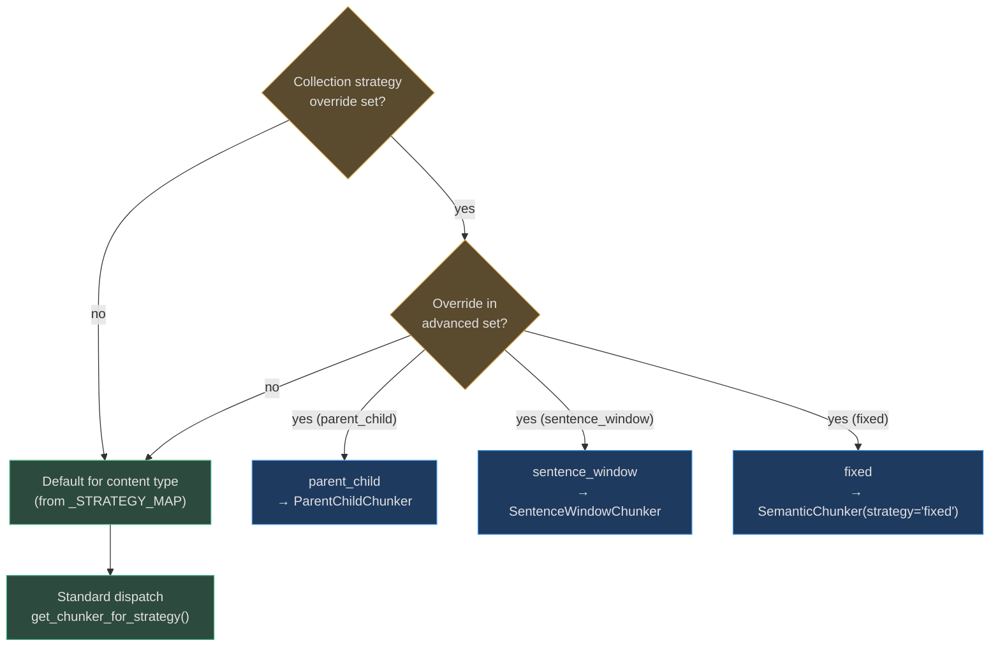

# Processing Pipeline

<!-- Sources: app/ingestion/orchestrator.py, app/ingestion/content_classifier.py,
     app/ingestion/quality_checks.py, app/ingestion/provenance_builder.py,
     app/ingestion/embedding_policy_selector.py, app/ingestion/chunking_strategy_selector.py -->

The processing pipeline is the sequence of transformations every content item passes through from raw bytes to indexed chunks. This page documents each stage in detail — the decision logic, data structures, and failure modes.

---

## End-to-End Pipeline with All Decision Points

```mermaid
flowchart TD
    INPUT["Input\ncontent:str, content_type:str, collection_id, tenant_ctx"]
    TYPDET{"content_type\n== 'auto'?"}
    CLS["ContentClassifier.classify()\nHeuristic detection"]
    KNOWN["ContentType(content_type)\nExplicit type"]
    EMBB["EmbeddingOrchestrator.select()\nSave model_id to metadata"]
    PARSE["ParserRegistry.get_parser(ct)\nParse raw content → text blocks"]
    CSS["ChunkingStrategySelector.select(ct)\n+ collection override if advanced"]
    CHUNK["_chunk(content, ct, strategy)\nParent-child / window / fixed / standard"]
    QC["QualityChecker(min_length=20)\ncheck(chunk) → passed/failed"]
    ALLFAIL{"All chunks\nfailed?"}
    KEEPALL["Keep all chunks\n(prevent total data loss)"]
    DEDUP["ContentDeduplicator.deduplicate()\nSHA-256 per chunk → skip seen"]
    PROV["ProvenanceBuilder.build()\nper chunk: source_url, page, index, ingestion_id"]
    EMB["Embedder / EmbeddingOrchestrator\nEmbed unique chunks"]
    STORE["KnowledgeStore.ingest_chunks_async()\nPersist to Postgres + pgvector"]
    RES["IngestionResult\ningestion_id, chunks_created, persisted=True"]

    INPUT --> TYPDET
    TYPDET -- yes --> CLS
    TYPDET -- no --> KNOWN
    CLS --> EMBB
    KNOWN --> EMBB
    EMBB --> PARSE
    PARSE --> CSS
    CSS --> CHUNK
    CHUNK --> QC
    QC -->|all failed| ALLFAIL
    ALLFAIL -- yes --> KEEPALL
    ALLFAIL -- no --> DEDUP
    KEEPALL --> DEDUP
    QC -->|some passed| DEDUP
    DEDUP --> PROV
    PROV --> EMB
    EMB --> STORE
    STORE --> RES

    style INPUT fill:#1e3a5f,stroke:#4a9eed,color:#e0e0e0
    style TYPDET fill:#5a4a2e,stroke:#d4a84b,color:#e0e0e0
    style CLS fill:#2d4a3e,stroke:#4aba8a,color:#e0e0e0
    style KNOWN fill:#2d4a3e,stroke:#4aba8a,color:#e0e0e0
    style EMBB fill:#1e3a5f,stroke:#4a9eed,color:#e0e0e0
    style PARSE fill:#2d4a3e,stroke:#4aba8a,color:#e0e0e0
    style CSS fill:#5a4a2e,stroke:#d4a84b,color:#e0e0e0
    style CHUNK fill:#5a4a2e,stroke:#d4a84b,color:#e0e0e0
    style QC fill:#4a2e2e,stroke:#d45b5b,color:#e0e0e0
    style ALLFAIL fill:#4a2e2e,stroke:#d45b5b,color:#e0e0e0
    style KEEPALL fill:#5a4a2e,stroke:#d4a84b,color:#e0e0e0
    style DEDUP fill:#4a2e2e,stroke:#d45b5b,color:#e0e0e0
    style PROV fill:#1e3a5f,stroke:#4a9eed,color:#e0e0e0
    style EMB fill:#1e3a5f,stroke:#4a9eed,color:#e0e0e0
    style STORE fill:#2d2d3d,stroke:#7a7a8a,color:#e0e0e0
    style RES fill:#2d4a3e,stroke:#4aba8a,color:#e0e0e0
```



---

## Stage 1: Content Classification

`ContentClassifier` uses two methods in priority order:

### 1a. Filename Extension (O(1) dict lookup)

```python
_EXT_MAP = {
    ".pdf": ContentType.PDF,
    ".py": ContentType.CODE,      # + .js .ts .java .go .rs .cpp .c .rb .sh .sql
    ".png": ContentType.IMAGE,    # + .jpg .jpeg .gif .webp .svg
    ".mp3": ContentType.AUDIO,    # + .wav .ogg
    ".mp4": ContentType.VIDEO,    # + .mov .avi
    # ... 44 total entries
}
```

### 1b. Content Heuristics (precedence order)

When no filename extension is available or the extension is unknown, heuristics scan the first 500–1,000 characters:

| Priority | Pattern | Detected as |
|----------|---------|------------|
| 1 | `<html|body|div|span|p|h[1-6]|script|style` (regex, case-insensitive) | `HTML` |
| 2 | `^\s*[\[\{]` — JSON start bracket | `JSON` |
| 3 | `^def |class |import |function |const |let |var |public class ` | `CODE` |
| 4 | `^#{1,6}\s|^\*\*|^-\s|^\d+\.\s` | `MARKDOWN` |
| 5 | (default) | `TEXT` |

The first match wins — detection is fast but order-sensitive. HTML with embedded JavaScript is classified as HTML (the `<html>` tag appears before `function`).

<!-- Sources: app/ingestion/content_classifier.py:45-65 -->

---

## Stage 2: Metadata Preservation

Before parsing, the orchestrator captures a **full metadata snapshot**:

```python
metadata = {
    "embedding_model": "text-embedding-3-small",  # from EmbeddingOrchestrator
    "source_url": source_url,                     # original location
    "collection_id": collection_id,               # target collection
    "content_type": detected.value,               # e.g. "pdf"
}
```

User-supplied metadata is merged in (allows custom fields like `author`, `department`, `version`).

---

## Stage 3: Quality Checking

`QualityChecker` runs three checks in sequence. A chunk fails if **any** check fails:

### Check 1: Emptiness
```python
if not content or not content.strip():
    return QualityCheckResult(False, 0.0, "empty content")
```

### Check 2: Minimum Length
```python
if len(content.strip()) < self._min_len:  # default: 20 chars
    return QualityCheckResult(False, 0.1, f"too short (min {min_len} chars)")
```

Catches: page headers/footers (`"Page 3"`), section dividers (`"---"`), blank placeholder paragraphs.

### Check 3: Noise Pattern
```python
_NOISE_PATTERN = re.compile(r"^[\s\.\-_=+*#@!?/\\|<>(){}\[\]]+$")
if _NOISE_PATTERN.match(content.strip()):
    return QualityCheckResult(False, 0.0, "noise-only content")
```

Catches: lines of equals signs (`===`), decorative separators, empty code blocks.

### Check 4: Word Density
```python
words = re.findall(r"\b\w{3,}\b", content)
word_chars = sum(len(w) for w in words)
quality = min(1.0, word_chars / max(len(content), 1) * 1.5)
passed = quality > self._max_noise  # default: 0.5
```

A chunk with only punctuation, numbers, or very short tokens scores below 0.5 and is filtered. Dense prose typically scores 0.7–0.9.

### The "All Fail" Safety Valve

```python
filtered = [c for c in chunks if checker.check(c).passed]
return filtered if filtered else chunks  # keep all if all fail
```

This prevents the pathological case where an entire document (e.g., a form with mostly checkboxes, a highly numeric financial table) gets zero-indexed. The quality check is a filter, not a blocker.

<!-- Sources: app/ingestion/quality_checks.py:13-80 -->

---

## Stage 4: Deduplication

`ContentDeduplicator` maintains a session-scoped set of SHA-256 hashes:

```python
@staticmethod
def hash_chunk(content: str) -> str:
    normalised = content.strip()               # trim leading/trailing whitespace
    return hashlib.sha256(normalised.encode()).hexdigest()

def deduplicate(self, chunks: list[str]) -> DeduplicationResult:
    unique = []
    dupe_count = 0
    for chunk in chunks:
        h = self.hash_chunk(chunk)
        if h in self._seen:
            dupe_count += 1
        else:
            self._seen.add(h)
            unique.append(chunk)
    return DeduplicationResult(unique, dupe_count, self._seen)
```

**Cross-batch deduplication**: pass a pre-seeded `seen_hashes` set from the collection's existing chunk hashes. This enables true idempotency across re-ingestion runs.

<!-- Sources: app/ingestion/quality_checks.py:43-80 -->

### Real-World Example 1: Two Engineers Upload the Same PDF

> **Situation**: Two engineers on the same team both upload `architecture-v2.1.pdf` (the same exact file) to the same collection within 5 minutes of each other. Without deduplication, every chunk would appear twice, doubling embedding costs and degrading retrieval precision.

**How it works:**
1. Engineer A uploads → `IngestionOrchestrator.ingest()` runs, produces 87 chunks, all unique → all indexed. Hashes stored in `ContentDeduplicator._seen`.
2. Engineer B uploads the same file → same 87 chunks produced → all 87 hashes are already in `_seen` → `dupe_count: 87`, `unique_chunks: []`.
3. `IngestionResult: {chunks_created: 0, persisted: False}` — no work done, no cost incurred.
4. On **cross-batch** dedup (different `IngestionOrchestrator` instances): the collection's existing chunk hashes are seeded into the new deduplicator before processing starts.

---

## Stage 5: Provenance Tracking

`ProvenanceBuilder` attaches a provenance record to every chunk:

```python
@dataclass
class IngestionProvenance:
    provenance_id: str        # UUID hex — unique per chunk
    tenant_id: str            # Row-Level Security tenant
    content_type: str         # "pdf", "code", "audio", etc.
    source_url: str           # "s3://bucket/docs/contract.pdf"
    source_name: str          # "contract.pdf"
    chunk_index: int          # position within the document
    page_number: int | None   # for PDFs; None for flat text
    ingestion_id: str         # shared across all chunks of this ingestion run
```

All chunks from a single `ingest()` call share the same `ingestion_id`. This allows:
- **Re-ingestion cleanup**: delete all chunks with `ingestion_id = old_id` before inserting new ones.
- **Citation**: "Source: contract.pdf, page 14, chunk 3 (ingested 2024-10-15)".
- **Audit**: governance audit trail records which agent triggered which ingestion.

<!-- Sources: app/ingestion/provenance_builder.py:1-55 -->

---

## Stage 6: Embedding Policy Selection

`EmbeddingPolicySelector` maps content type → embedding model + index strategy:

| Content Type | Model | Dimensions | Index | Cost Class |
|-------------|-------|-----------|-------|-----------|
| TEXT, MARKDOWN, PDF, DOCX, HTML | `text-embedding-3-small` | 1536 | exact (<1K), hnsw (≥1K) | low |
| CODE | `voyage-code-3` | 1024 | exact (<1K), hnsw (≥1K) | low |
| IMAGE, VIDEO | `voyage-multimodal-3` | 1024 | exact (<1K), hnsw (≥1K) | medium |
| AUDIO | `text-embedding-3-small` | 1536 | exact (<1K), hnsw (≥1K) | low |

The index strategy switches from `exact` to `hnsw` when the collection exceeds 1,000 chunks — HNSW's approximate nearest-neighbour search is ~100× faster for large collections at the cost of <1% recall loss.

```python
index = "hnsw" if collection_size > 1000 else "exact"
```

The selected `model_id` is stored in chunk metadata and the `IngestionResult`, so downstream components know which model was used (important for mixed-model collections).

<!-- Sources: app/ingestion/embedding_policy_selector.py:17-55 -->

---

## Real-World Example 2: Japanese Legal Document

> **Situation**: A Japanese law firm uploads `案件番号2024-447_契約書.pdf` (Contract No. 2024-447). The content classifier must correctly route this, the quality checker must not filter Japanese text as "noise," and the embedding model must handle CJK characters.

**How it works:**
1. **Classification**: filename extension `.pdf` → `ContentType.PDF` (no heuristics needed).
2. **Parsing**: `PDFParser` → PyMuPDF extracts UTF-8 Japanese text per page. PyMuPDF handles CJK fonts and vertical text layouts.
3. **Chunking**: `layout` strategy → one chunk per page. Page text: `"第3条 (契約期間)\n本契約の有効期間は、契約締結日から1年間とする..."`.
4. **Quality check**: `re.findall(r"\b\w{3,}\b", content)` uses Unicode `\w` — matches Japanese word characters. Quality score ≈ 0.75. Passes.
5. **Embedding**: `text-embedding-3-small` is multilingual — handles Japanese natively (trained on 100+ languages).
6. **Query**: "What is the contract duration?" → `text-embedding-3-small` embedding of the English query aligns with the Japanese chunk through cross-lingual space → retrieves "第3条 (契約期間)".

---

## Metadata Schema Reference

Every persisted chunk carries this metadata envelope:

```json
{
  "provenance_id": "a3f2b1c4...",
  "ingestion_id": "e7d8f9a0...",
  "tenant_id": "tenant_acme",
  "content_type": "pdf",
  "source_url": "s3://agentverse-uploads/acme/contract-v2.pdf",
  "source_name": "contract-v2.pdf",
  "chunk_index": 14,
  "page_number": 15,
  "embedding_model": "text-embedding-3-small",
  "chunking_strategy": "layout",
  "quality_score": 0.82
}
```

---

## Throughput at Scale

For a 1M documents/day ingestion target with mixed content types:

| Stage | Overhead per chunk | 10M chunks/day |
|-------|-------------------|---------------|
| Classification | ~0.01ms | negligible |
| Parsing | 1–200ms per doc | bottleneck for PDF/DOCX |
| Chunking | ~0.5ms per doc | negligible |
| Quality check | ~0.05ms per chunk | ~500ms for 10M chunks |
| Deduplication | ~0.1ms per chunk (SHA-256) | ~1,000ms for 10M chunks |
| Provenance build | ~0.01ms per chunk | negligible |
| Embedding (API) | 20–50ms per batch (100 chunks) | ~2,000ms for 10M chunks (parallelised) |
| Postgres insert | ~2ms per chunk (batch) | bottleneck for unpartitioned tables |

**Bottleneck mitigation**:
- **PDF parsing**: distribute across 8+ Celery workers; each worker is CPU-bound
- **Embedding**: batching 100 chunks per API call; parallel requests per worker
- **Postgres**: use pgvector's HNSW index built async after bulk insert, not during ingestion

---

## Chunking Strategy Decision Tree

When `select_advanced()` is called with a collection-level override, the decision logic is:



<!-- Sources: app/ingestion/orchestrator.py:75-150, app/ingestion/chunking_strategy_selector.py:27-55 -->

**When to use each advanced strategy:**

| Strategy | Use Case | Trade-off |
|---------|----------|-----------|
| `parent_child` | Max recall — children are small precise chunks, parents provide full context | 2× chunk count, higher storage cost |
| `sentence_window` | High-precision Q&A — retrieve at sentence level, answer with surrounding window | Slower indexing, excellent precision |
| `fixed` | Exact token budget control — for models with strict context windows | May cut mid-sentence, lower coherence |
| `agentic_chunking` | Complex heterogeneous documents where rule-based chunkers underperform | Highest latency (LLM-based), best quality |

---

## `IngestionResult` Reference

Every call to `IngestionOrchestrator.ingest()` returns an `IngestionResult`:

```python
@dataclass
class IngestionResult:
    ingestion_id: str          # UUID for this ingestion run
    tenant_id: str             # tenant who owns this content
    collection_id: str         # target collection
    content_type: ContentType  # detected or specified type
    chunking_strategy: str     # strategy used ("semantic", "ast", etc.)
    chunks_created: int        # number of chunks actually stored
    source_url: str            # original source location
    chunk_ids: list[str]       # list of chunk UUIDs (if persisted)
    chunks_prepared: int       # chunks before dedup/quality filter
    persisted: bool            # True if at least one chunk was stored
```

**Invariants:**
- `chunks_created <= chunks_prepared` always (quality + dedup can only reduce)
- `persisted = False` iff `chunks_created = 0`
- `ingestion_id` is always set, even on failure (for audit trail)
- `chunk_ids` is empty when `in_memory_only=True` or `dry_run=True`
