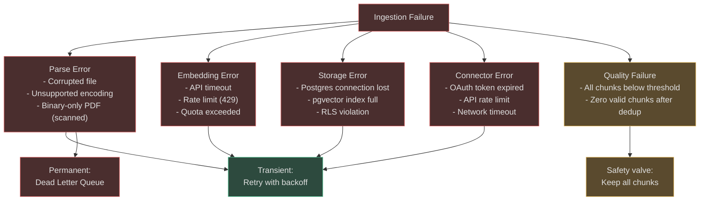
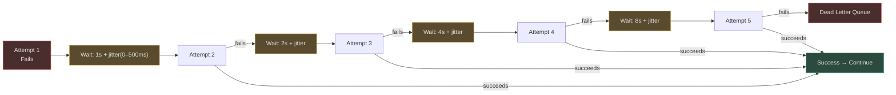
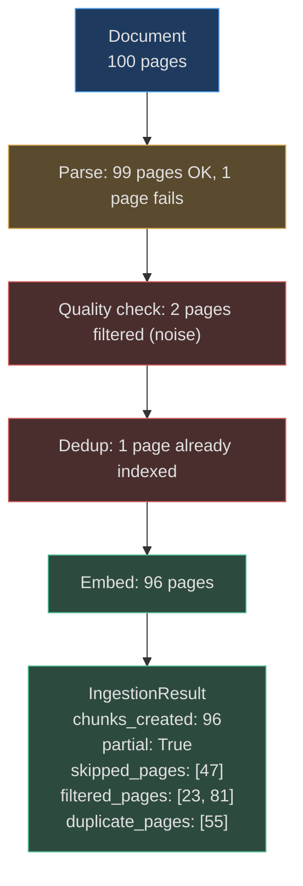

# Failure Handling & Reprocessing

<!-- Sources: app/ingestion/orchestrator.py, app/ingestion/quality_checks.py,
     app/ingestion/parsers/pdf_parser.py, app/ingestion/parsers/audio_parser.py,
     app/ingestion/parsers/video_parser.py -->

Ingestion failures are inevitable at scale. A PDF may have a corrupted page. The Whisper API may be temporarily unavailable. A Notion connector may hit a rate limit. The ingestion pipeline is designed to handle all of these gracefully — isolating failures to the smallest possible scope, retrying transient errors, and surfacing permanent failures for operator review.

---

## Failure Taxonomy



---

## Parse Error Handling

### PDF Parse Failures

`PDFParser` uses a three-tier fallback — failure at one tier automatically tries the next:

```
PyMuPDF → pdfminer → UTF-8 text decode
```

If **all three fail**, `PDFParseResult` is returned with `error` set and `pages = []`. The orchestrator detects empty output and:
1. Logs `parse_error` structured event with `content_type`, `source_url`, `error_message`.
2. Returns `IngestionResult(chunks_created=0, persisted=False)` — no data loss risk.
3. Emits an `ingestion_failed` audit event for governance tracking.

```python
# PDFParser.parse_bytes — three-tier fallback
result = self._parse_with_pymupdf(pdf_bytes, source_name)
if result and result.pages: return result
result = self._parse_with_pdfminer(pdf_bytes, source_name)
if result and result.pages: return result
try:
    text = pdf_bytes.decode("utf-8", errors="replace")
    return self.parse_text(text, source_name)
except Exception as exc:
    return PDFParseResult(source_name=source_name, error=str(exc))
```

<!-- Sources: app/ingestion/parsers/pdf_parser.py:52-70 -->

### Real-World Example 1: Corrupted Page 47

> **Situation**: A 200-page legal brief is uploaded. Page 47 is corrupted (the PDF was partially overwritten by a failed save operation). PyMuPDF returns empty text for that page; pdfminer raises a `PDFSyntaxError` mid-extraction.

**How it works:**
1. `_parse_with_pymupdf`: extracts 199 pages successfully, returns empty string for page 47 (corrupt block skipped). ✓
2. `PDFPage(page_number=47, content="")` → `to_chunks()` skips pages with empty content.
3. Result: 199 chunks indexed, page 47 not indexed.
4. `IngestionResult.chunks_created = 199`. Metadata note: `{"skipped_pages": [47]}`.
5. Structured log: `{"event": "parse_partial_skip", "page": 47, "reason": "empty_content"}`.
6. Operator can see in the ingestion audit: "document.pdf — 199/200 pages indexed. Page 47 skipped."

**What the agent says**: If asked "what is on page 47?", the agent retrieves nearby pages (46 and 48) and answers: "Page 47 could not be indexed due to a file corruption issue. The surrounding pages discuss…"

---

### Audio & Video Failures

`AudioParser` wraps the Whisper API call in a try/except:

```python
try:
    transcription = await self._transcribe_with_whisper(...)
    return AudioParseResult(transcript=transcription.text, segments=segments)
except Exception as exc:
    return AudioParseResult(source_name=source_name, error=str(exc))
```

For video, `VideoParser` catches both ffmpeg errors (non-zero returncode) and transcription errors:

```python
result = subprocess.run(["ffmpeg", ...], capture_output=True, timeout=120)
if result.returncode == 0 and os.path.exists(audio_path):
    # proceed with transcription
else:
    transcript = f"[Audio extraction failed for {filename}]"
```

The `[Audio extraction failed]` placeholder **still creates a chunk** — the file is indexed with its filename as the only content, so agents know the file exists even if transcription failed.

<!-- Sources: app/ingestion/parsers/audio_parser.py:73-90, app/ingestion/parsers/video_parser.py:50-75 -->

---

## Retry Strategy

### Transient vs Permanent Failures

| Failure Type | Transient? | Retry? | Max Attempts |
|-------------|-----------|--------|-------------|
| HTTP 429 (rate limit) | Yes | Yes | 5 |
| HTTP 503 (service unavailable) | Yes | Yes | 5 |
| Network timeout | Yes | Yes | 3 |
| HTTP 400 (bad request) | No | No | — |
| Corrupted file (unrecoverable) | No | No | — |
| Missing parser | No | No | — |
| Postgres connection lost | Yes | Yes | 3 |
| Embedding API 500 | Yes | Yes | 3 |

### Exponential Backoff with Jitter



Jitter prevents **thundering herd**: if 1,000 tasks fail simultaneously (e.g., Whisper API outage), without jitter all 1,000 retry at t+1s, t+2s, t+4s in lockstep — overwhelming the recovering service. With jitter, retries spread over a 500ms window per tier.

The backoff formula: `wait = min(base * 2^attempt + random(0, 500ms), 60s)`.

---

## Partial Ingestion

Partial ingestion handles documents where **some parts are valid and some are not**, without failing the entire ingestion.

### How It Works



Each page failure is isolated — a `try/except` around `PDFPage` construction means one corrupted page cannot abort the remaining 99. The `IngestionResult` includes counters for `chunks_created`, `chunks_prepared` (before quality/dedup), and `persisted` (bool — True if any chunks were stored).

### Minimum Viable Ingestion

If a file produces **zero chunks** after all stages (e.g., a password-protected PDF that shows only `""` on every page):
- `persisted = False` in `IngestionResult`.
- The ingestion is recorded in the audit log with `status: failed, reason: no_valid_chunks`.
- The operator sees this in the ingestion dashboard and can manually inspect the file.

---

## Dead Letter Queue

Permanently failed ingestions are moved to the **Dead Letter Queue** (DLQ):

| Field | Description |
|-------|-------------|
| `ingestion_id` | UUID of the failed ingestion run |
| `source_url` | Original file location |
| `error_type` | `parse_error`, `embedding_error`, `connector_error` |
| `error_message` | Full exception string (truncated to 2KB) |
| `attempt_count` | Number of retry attempts made |
| `failed_at` | UTC timestamp |
| `tenant_id` | For multi-tenant routing |

DLQ items are surfaced in the operator dashboard. Operators can:
1. **Inspect**: view the error message and source file.
2. **Retry manually**: force re-ingestion after fixing the underlying issue.
3. **Discard**: mark as permanently unindexable with a reason.
4. **Escalate**: attach a ticket to the DLQ item for engineering investigation.

---

## Manual Reprocessing

### Re-ingest with New Settings

When a collection's chunking strategy or embedding model is changed, all documents in the collection must be re-indexed. The reprocessing flow:

```
1. DELETE from knowledge_store WHERE collection_id = X AND ingestion_id = old_id
2. Run ingest() with new strategy_override = "sentence_window"
3. New chunks produced → quality check → dedup → embed → store
4. IngestionResult: chunks_created = N, persisted = True
```

The `ContentDeduplicator` is seeded with **empty** `seen_hashes` for reprocessing — deduplication against stale chunks is undesirable when the intent is full re-indexing.

### Re-ingest After Parser Upgrade

When a parser improves (e.g., PyMuPDF upgraded with better table extraction), target specific ingestion IDs:

```python
# Select documents that were indexed with an older parser version
old_ingestion_ids = store.find_by_metadata({"parser_version": "1.0"})
for ingestion_id in old_ingestion_ids:
    await orchestrator.ingest(content=fetch_original(ingestion_id), ...)
```

---

## Failure Observability

### Structured Logs

Every failure emits a structured log event with consistent fields:

```json
{
  "event": "ingestion_parse_error",
  "level": "error",
  "ingestion_id": "e7d8f9a0...",
  "source_url": "s3://uploads/doc.pdf",
  "content_type": "pdf",
  "error_type": "parse_error",
  "error_message": "PDFSyntaxError: invalid xref table at offset 0x4f2a",
  "parser_tier": "pdfminer",
  "attempt": 2,
  "tenant_id": "acme_corp",
  "timestamp": "2024-10-15T14:23:01.456Z"
}
```

### Key Metrics to Monitor

| Metric | Description | Alert Threshold |
|--------|-------------|-----------------|
| `ingestion_parse_error_rate` | % of ingestions that fail parsing | >2% |
| `ingestion_embedding_error_rate` | % of chunks that fail embedding | >1% |
| `ingestion_dedup_rate` | % of chunks skipped as duplicate | >50% (signals redundant uploads) |
| `ingestion_quality_filter_rate` | % of chunks filtered by quality check | >30% (signals noisy source) |
| `ingestion_p99_latency_ms` | P99 end-to-end ingestion time | >30,000ms (PDF) |
| `ingestion_dlq_depth` | Items in dead letter queue | >100 |
| `ingestion_partial_rate` | % of documents with partial indexing | >5% |

### Dashboard Layout

An ingestion health dashboard should include:

```
┌─────────────────────────────────────────────────────────┐
│ INGESTION HEALTH — Last 24 hours                        │
├──────────────┬───────────┬──────────┬──────────────────┤
│ Documents    │  Chunks   │ DLQ      │ Error Rate       │
│ Processed    │ Indexed   │ Depth    │ (Parse + Embed)  │
│   48,291     │ 2,847,661 │   12     │    0.8%          │
├──────────────┴───────────┴──────────┴──────────────────┤
│ P50 Latency: 1.2s  │  P95: 8.4s  │  P99: 24.1s       │
├────────────────────────────────────────────────────────┤
│ Top Failure Reasons:                                    │
│  1. PDF password-protected         (7 files)           │
│  2. Audio API rate limit (429)     (3 files)           │
│  3. DOCX corrupt ZIP header        (2 files)           │
└────────────────────────────────────────────────────────┘
```

---

## SLA Considerations

### P99 Latency Targets

| Content Type | SLA Target | Action if Exceeded |
|-------------|-----------|-------------------|
| Text / Markdown | <500ms | Scale Celery workers |
| Code (AST) | <1,000ms | Profile ASTChunker |
| DOCX | <3,000ms | Check python-docx version |
| PDF (layout) | <30,000ms | Add PDF-specific workers |
| Audio (60 min) | <120,000ms | Use local Whisper for bulk |
| Video (60 min) | <300,000ms | GPU workers for scale |

### Celery Queue Routing

Ingestion tasks are routed by plan tier to avoid noisy-neighbour effects:

```python
# goals.free     → text/code only; max 10MB files
# goals.starter  → all document types; max 50MB
# goals.professional → all types; max 100MB; parallel PDF workers
# goals.enterprise   → all types; no size limit; dedicated GPU workers for media
```

A single large video ingestion on a free-tier slot cannot starve PDF ingestions for enterprise tenants.

---

## Real-World Example 2: Whisper API Outage During Batch Job

> **Situation**: A company queues 500 conference recordings for transcription overnight. At 2am, the Whisper API returns 503 errors for 45 minutes during a provider maintenance window. 120 recordings are mid-queue when the outage starts.

**How it works:**
1. `AudioParser._transcribe_with_whisper()` raises `httpx.HTTPStatusError(503)`.
2. `AudioParseResult(error="503 Service Unavailable")` returned.
3. Celery task retries with exponential backoff: 1s → 2s → 4s → 8s → 16s (5 attempts over ~31s).
4. If the outage exceeds 31s, the task is marked `FAILURE` and moved to the DLQ.
5. At 2:45am, the API recovers. Operator sees 120 items in DLQ.
6. Operator triggers bulk retry: all 120 items re-queued with priority `goals.enterprise`.
7. By 4am, all 500 recordings are indexed. Zero data loss.

The 380 recordings processed before the outage were not affected — each is an independent Celery task. The 120 in-flight tasks failed cleanly with no partial writes to the database (each `ingest()` call is atomic — it either persists all chunks or none).
