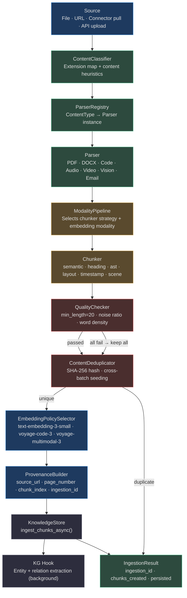
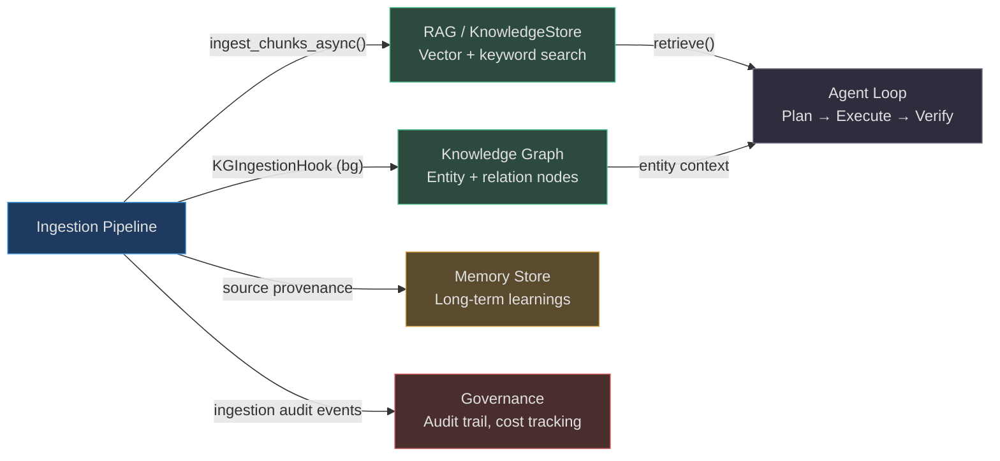

# Ingestion Pipeline

The ingestion pipeline is the **universal content intake system** for AgentVerse. It transforms any content — a PDF upload, a GitHub repository, a Slack channel, a recorded meeting — into structured, embedding-ready chunks that populate the knowledge store, power RAG retrieval, and feed the knowledge graph.

Every piece of information an agent can reason over must pass through this pipeline first.

---

## Supported Source Types

| Icon | Content Type | Parser | Chunker | Embedding Modality |
|------|-------------|--------|---------|-------------------|
| 📄 | PDF | `PDFParser` (PyMuPDF → pdfminer → text) | `layout` | text |
| 📝 | DOCX / Word | `DOCXParser` (python-docx) | `heading` | text |
| 🗒️ | Markdown / Text | `TextParser` | `semantic` / `heading` | text |
| 🌐 | HTML / Web Page | `HTMLParser` | `dom` | text |
| 💻 | Code (.py .js .ts .go …) | `CodeParser` | `ast` | code |
| 📧 | Email (RFC-5322) | `EmailParser` | `semantic` | text |
| 🖼️ | Image (PNG/JPG/WEBP) | `VisionParser` (GPT-4o / Claude) | `region` | multimodal |
| 🎙️ | Audio (MP3/WAV) | `AudioParser` (Whisper) | `timestamp` | text |
| 🎬 | Video (MP4/MOV) | `VideoParser` (ffmpeg + Whisper) | `scene` | multimodal |
| 📊 | CSV / TSV | `CSVParser` | `row_group` | text |
| 🔧 | JSON / JSONL | `JSONParser` | `record` | text |
| ☁️ | Google Drive | `GDriveConnector` | auto-detected | text |
| 📔 | Notion | `NotionConnector` | `semantic` | text |
| 🏢 | SharePoint / OneDrive | `SharePointConnector` | auto-detected | text |

<!-- Sources: app/ingestion/content_classifier.py:18-44, app/ingestion/parser_registry.py:88-102, app/ingestion/embedding_policy_selector.py:17-27 -->

---

## High-Level Pipeline



<!-- Sources: app/ingestion/orchestrator.py:44-200 -->

---

## Parser Selection Logic

The `ParserRegistry` maps `ContentType` → parser instance in a single dictionary lookup. Content type detection has two paths:

### Path 1: By filename extension (fast path)
Used when a filename is available. Extension → `ContentType` via `_EXT_MAP` (44 entries covering all major formats).

```
contract.pdf    → ContentType.PDF    → PDFParser
src/main.py     → ContentType.CODE   → CodeParser  (ASTChunker)
recording.mp3   → ContentType.AUDIO  → AudioParser (WhisperAPI)
logo.png        → ContentType.IMAGE  → VisionParser (GPT-4o)
```

### Path 2: By content heuristics (detection order)
Used when uploading raw bytes or text without a filename. Precedence: HTML tag → JSON bracket → code keyword → Markdown heading → TEXT fallback.

```python
# app/ingestion/content_classifier.py:51-62
if _HTML_PATTERN.search(content[:500]):   return ContentType.HTML
if _JSON_PATTERN.match(content[:20]):     return ContentType.JSON
if _CODE_PATTERNS.search(content[:1000]): return ContentType.CODE
if _MARKDOWN_PATTERN.search(content[:500]):return ContentType.MARKDOWN
return ContentType.TEXT
```

---

## Chunking Strategy Selection

`ChunkingStrategySelector` maps content type to the optimal chunking strategy. Collection-level overrides allow advanced strategies:

| Content Type | Default Strategy | Why |
|-------------|-----------------|-----|
| `TEXT` | `semantic` | Paragraph grouping up to 512 tokens |
| `MARKDOWN` | `heading` | Splits at `#` boundaries, preserving hierarchy |
| `PDF` | `layout` | Page-aware, respects column flow |
| `DOCX` | `paragraph` | Word paragraph objects, heading-anchored |
| `CODE` | `ast` | AST-based function/class boundary detection |
| `AUDIO` | `timestamp` | 60-second rolling windows with HH:MM:SS |
| `VIDEO` | `scene` | Scene boundary detection + transcript windows |
| `IMAGE` | `region` | Single chunk per image (description = chunk) |
| `HTML` | `dom` | Tag-aware strip + paragraph split |
| `CSV` | `row_group` | Row groupings for tabular context |

Advanced collection-level overrides: `parent_child`, `sentence_window`, `fixed`, `agentic_chunking`.

<!-- Sources: app/ingestion/chunking_strategy_selector.py:1-55 -->

---

## Design Principles

### 1. Idempotent by Default
Re-ingesting the same document produces **zero duplicate chunks**. The `ContentDeduplicator` computes SHA-256 of each normalised chunk and skips any hash already seen in the collection. Cross-batch deduplication is supported by passing in a pre-seeded `seen_hashes` set.

### 2. Provenance-First
Every chunk carries a `provenance_id`, `ingestion_id`, `source_url`, `source_name`, `page_number`, and `chunk_index`. Agents citing retrieved chunks can trace them back to the exact page of the exact document version.

### 3. Quality Gate Before Embedding
Embedding is the most expensive step. `QualityChecker` filters chunks shorter than 20 characters, pure noise patterns (lines of dashes, equals signs), and content with word density below 50%. Only high-signal text reaches the embedder. If **all** chunks fail, the gate opens anyway — preventing total data loss for terse documents.

### 4. Modality-Aware Embedding
Code gets `voyage-code-3` (optimised for semantic code search). Images and video get `voyage-multimodal-3` (joint text+visual space). Text gets `text-embedding-3-small`. The `EmbeddingPolicySelector` makes this decision automatically per content type.

<!-- Sources: app/ingestion/quality_checks.py:13-80, app/ingestion/provenance_builder.py:1-55, app/ingestion/embedding_policy_selector.py:1-55 -->

---

## Integration Map



---

## Navigation

| Page | What it covers |
|------|---------------|
| [01 — Document & Code Ingestion](./01-document-and-code-ingestion.md) | PDF, DOCX, Markdown, HTML, code, email parsers |
| [02 — External Source Connectors](./02-external-source-connectors.md) | Google Drive, Notion, SharePoint connectors |
| [03 — Media Ingestion](./03-media-ingestion.md) | Image OCR/captioning, audio transcription, video |
| [04 — Processing Pipeline](./04-processing-pipeline.md) | Classification, deduplication, provenance, quality |
| [05 — Failure Handling & Reprocessing](./05-failure-handling-and-reprocessing.md) | Retry, DLQ, partial ingestion, monitoring |
| [06 — GitHub, Jira, Confluence & Slack Ingestors](./06-github-jira-confluence-slack-ingestors.md) | API-driven developer platform ingestion, auth, chunking, MCP integration |

---

## Quick Throughput Reference

| Metric | Value |
|--------|-------|
| Throughput (text/code) | 2,000–5,000 documents/min per worker |
| Throughput (PDF layout) | 200–400 pages/min per worker |
| Throughput (audio transcription) | 10–30 min of audio/min (Whisper API) |
| Throughput (video) | 2–5 min of video/min (ffmpeg + Whisper) |
| Deduplication overhead | ~0.1ms per chunk (SHA-256 hash lookup) |
| Quality check overhead | ~0.05ms per chunk |
| P99 ingestion latency (text, 100KB) | <500ms end-to-end |
| P99 ingestion latency (PDF, 50 pages) | 2–8 seconds |
| Max supported file size | Configurable — default 100MB |
| Daily capacity (10 workers, text) | ~5–10M documents/day |

---

## Chunker Registry

Eight specialised chunkers handle different content structures:

| Chunker | Class | Strategy Key | Best For |
|---------|-------|-------------|---------|
| `SemanticChunker` | `chunkers/semantic.py` | `semantic` | Plain text, mixed content |
| `HeadingChunker` | `chunkers/heading.py` | `heading` | Markdown, structured docs |
| `ASTChunker` | `chunkers/ast_chunker.py` | `ast` | Python/JS/TS code |
| `PDFLayoutChunker` | `chunkers/pdf_layout.py` | `layout` | PDFs with page structure |
| `TimestampChunker` | `chunkers/timestamp.py` | `timestamp` | Audio transcripts with `[HH:MM:SS]` |
| `SceneChunker` | `chunkers/scene.py` | `scene` | Video with `[SCENE N: desc]` markers |
| `TableChunker` | `chunkers/table.py` | `row_group` | CSV/tabular data, 50 rows/chunk |
| `ParentChildChunker` | `rag/parent_child_chunker.py` | `parent_child` | Advanced RAG with context windows |

Advanced strategies (collection-level override only):

| Strategy | Class | When to Use |
|---------|-------|-------------|
| `parent_child` | `ParentChildChunker` | Max recall with context preservation |
| `sentence_window` | `SentenceWindowChunker` | Sentence-level precision retrieval |
| `fixed` | `SemanticChunker(strategy="fixed")` | Exact token-count control |
| `agentic_chunking` | Agent-driven boundary detection | Heterogeneous/complex documents |

<!-- Sources: app/ingestion/chunkers/__init__.py, app/ingestion/chunking_strategy_selector.py:19-35 -->

---

## Configuration Reference

Key environment variables affecting ingestion behaviour:

| Variable | Default | Description |
|----------|---------|-------------|
| `OPENAI_API_KEY` | — | Required for Whisper audio transcription and GPT-4o vision |
| `ANTHROPIC_API_KEY` | — | Fallback for vision parsing (Claude 3.5 Sonnet) |
| `VOYAGE_API_KEY` | — | Required for `voyage-code-3` and `voyage-multimodal-3` |
| `INGESTION_MIN_QUALITY` | `0.5` | Word density threshold below which chunks are filtered |
| `INGESTION_MIN_LENGTH` | `20` | Minimum character length for a valid chunk |
| `INGESTION_MAX_FILE_MB` | `100` | Maximum file size per ingestion request |
| `INGESTION_CHUNK_DURATION_S` | `60` | Audio window size in seconds for timestamp chunking |
| `CELERY_INGESTION_CONCURRENCY` | `4` | Concurrent ingestion workers per node |

---

## Quick Start

```python
from app.ingestion.orchestrator import IngestionOrchestrator

orchestrator = IngestionOrchestrator(
    knowledge_store=knowledge_store,
    embedder=embedder,
)

result = await orchestrator.ingest(
    content=pdf_text,
    content_type="auto",          # auto-detect or specify: "pdf", "code", etc.
    collection_id="legal-docs",
    tenant_ctx=tenant_ctx,
    source_url="s3://uploads/brief.pdf",
    metadata={"author": "Jane Smith", "department": "Legal"},
)

print(result.chunks_created)   # 87
print(result.ingestion_id)     # "e7d8f9a0..."
print(result.persisted)        # True
```

The `IngestionResult` always returns, even on failure — check `persisted` to confirm chunks were stored and `chunks_created` to see the count. A result with `chunks_created=0, persisted=False` indicates a complete parsing failure that should be investigated via the DLQ.

---

## Security Considerations

- All chunk content is stored per-tenant with Row-Level Security (RLS) enforced at the Postgres layer — `SET LOCAL app.tenant_id = '{tenant}'` before every query.
- File bytes are never persisted to Postgres — only extracted text reaches the database. Raw files remain in object storage.
- Source URLs in provenance metadata should use pre-signed URLs with short TTLs for sensitive documents.
- Parser sandboxing: PDF parsing via PyMuPDF runs in the same process — for untrusted PDFs, consider running `PDFParser` in an isolated subprocess to contain potential exploits in the PDF renderer.
- Connector credentials (OAuth tokens, API keys) are encrypted at rest using `app/governance/vault.py` — never stored in plaintext in the database.

---

## Common Ingestion Patterns

### Pattern 1: Upload a single file and wait

```python
result = await orchestrator.ingest(
    content=document_text,
    content_type="auto",
    collection_id="contracts-2024",
    tenant_ctx=ctx,
    source_url="s3://bucket/contract.pdf",
)
assert result.persisted
print(f"Indexed {result.chunks_created} chunks")
```

### Pattern 2: Dry run to preview chunk count

```python
result = await orchestrator.ingest(
    content=document_text,
    content_type="pdf",
    collection_id="preview-collection",
    tenant_ctx=ctx,
    dry_run=True,           # no writes to KnowledgeStore
)
print(f"Would create {result.chunks_prepared} chunks")
```

### Pattern 3: In-memory only (no persistence)

```python
result = await orchestrator.ingest(
    content=ephemeral_text,
    content_type="auto",
    collection_id="session-scratch",
    tenant_ctx=ctx,
    in_memory_only=True,    # chunks computed but not stored
)
```

Used by the simulation sandbox when agents need temporary context without polluting the production knowledge store.

---

## Deduplication Behaviour Reference

| Scenario | Outcome |
|----------|---------|
| Same file uploaded twice | `chunks_created=0` on second upload |
| File updated (new version) | Different hash → new chunks stored |
| Two identical paragraphs in one file | Second paragraph deduplicated |
| Same paragraph across 2 different files | Only deduplicated within same batch by default |
| Cross-batch dedup (collection-seeded) | Dedup works across all previous ingestions |
| Whitespace-only difference | Normalised before hashing → deduplicated |
| Case-different content | Case-sensitive → NOT deduplicated |

<!-- Sources: app/ingestion/quality_checks.py:43-80, app/ingestion/orchestrator.py:163-195 -->
