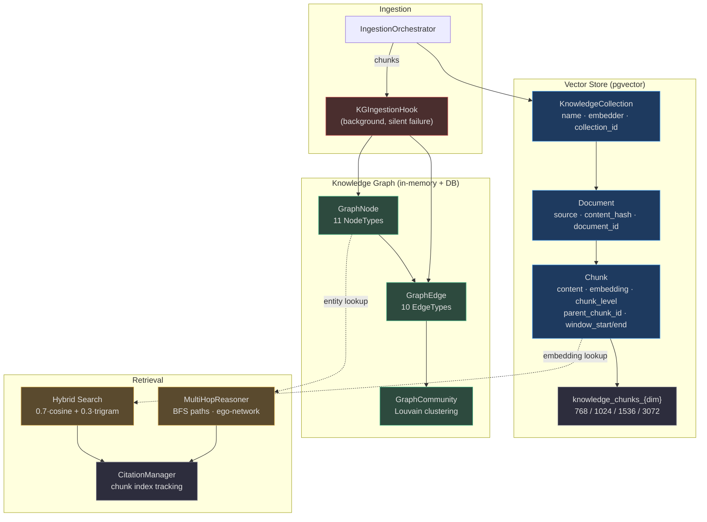
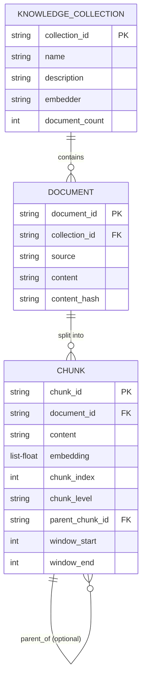
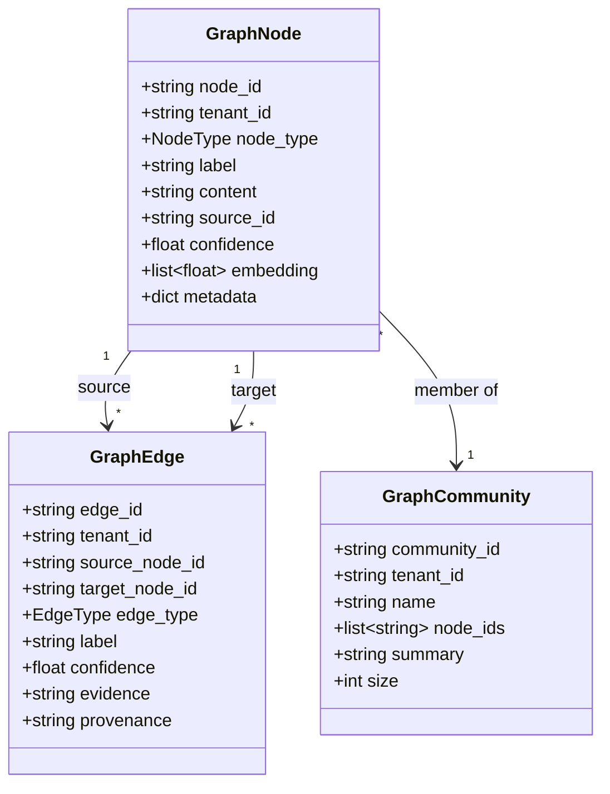
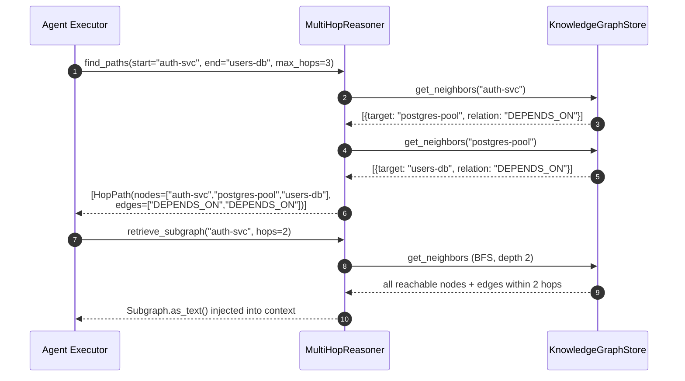
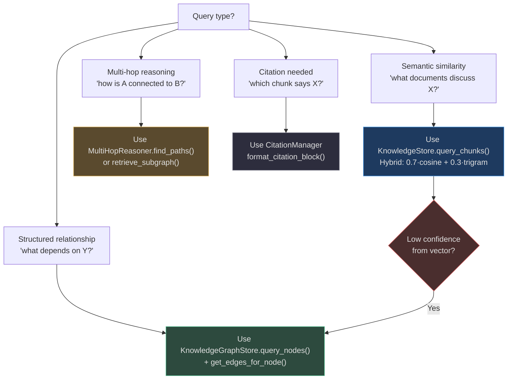
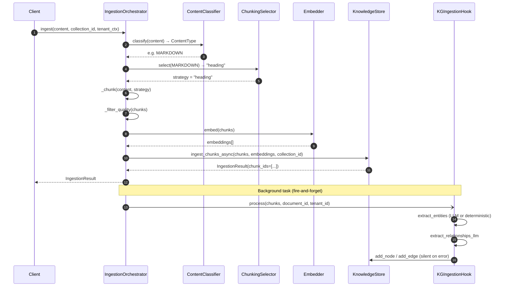

# Knowledge & Knowledge Graph

AgentVerse manages knowledge through two complementary stores: a **vector-based RAG store** (`KnowledgeStore`) for dense semantic retrieval and a **knowledge graph** (`KnowledgeGraphStore`) for structured entity-relationship reasoning. The two stores are coupled at ingestion time via `KGIngestionHook` and at query time via `MultiHopReasoner`.

## Architecture Overview



<!-- Sources: app/rag/store.py:1-30, app/rag/models.py:1-50, app/knowledge_graph/store.py:1-30, app/knowledge_graph/models.py:1-70, app/knowledge_graph/ingestion_hook.py:1-70 -->

---

## Knowledge Data Model



<!-- Sources: app/rag/models.py:7-50 -->

### Data Model Details

| Field | Type | Purpose | Source |
|---|---|---|---|
| `collection_id` | str (hex UUID) | Namespace for related documents | [models.py:8](https://github.com/harsh786/agent-verse/blob/main/agent-verse-backend/app/rag/models.py#L8) |
| `content_hash` | str | SHA-256 for deduplication at ingest | [store.py:21](https://github.com/harsh786/agent-verse/blob/main/agent-verse-backend/app/rag/store.py#L21) |
| `embedding` | list[float] | Dense vector (dim ∈ {768,1024,1536,3072}) | [models.py:39](https://github.com/harsh786/agent-verse/blob/main/agent-verse-backend/app/rag/models.py#L39) |
| `chunk_level` | str | `"leaf"` \| `"parent"` \| `"child"` | [models.py:44](https://github.com/harsh786/agent-verse/blob/main/agent-verse-backend/app/rag/models.py#L44) |
| `parent_chunk_id` | str \| None | Links child to parent in parent-child chunking | [models.py:42](https://github.com/harsh786/agent-verse/blob/main/agent-verse-backend/app/rag/models.py#L42) |
| `window_start/end` | int \| None | Sentence window boundaries for `sentence_window` strategy | [models.py:45-46](https://github.com/harsh786/agent-verse/blob/main/agent-verse-backend/app/rag/models.py#L45) |

### Dimension-Partitioned Tables

Embeddings are stored in **dimension-specific PostgreSQL tables** to avoid mixed-dimension index incompatibility:

| Embedding Dimension | Table Name | Typical Model |
|---|---|---|
| 768 | `knowledge_chunks_768` | `gemini/text-embedding-004` |
| 1024 | `knowledge_chunks_1024` | `voyage-3-lite`, `voyage-code-3` |
| 1536 | `knowledge_chunks_1536` | `openai/text-embedding-3-small` |
| 3072 | `knowledge_chunks_3072` | `openai/text-embedding-3-large` |

Dimension routing is handled by [`app/rag/store.py:29`](https://github.com/harsh786/agent-verse/blob/main/agent-verse-backend/app/rag/store.py#L29): `_chunk_table(dimension: int) → str`.

---

## KnowledgeStore

**Class**: `KnowledgeStore` — [`app/rag/store.py:83`](https://github.com/harsh786/agent-verse/blob/main/agent-verse-backend/app/rag/store.py#L83)

The primary interface for all knowledge CRUD operations. Falls back to pure-Python in-memory storage when no `db_session_factory` is provided (tests).

### Hybrid Search Formula

```
score = 0.7 × cosine_similarity(query_vec, chunk_vec)
      + 0.3 × trigram_overlap(query_text, chunk_text)
```

<!-- Source: app/rag/store.py:14-15 -->

The cosine component drives semantic recall; the trigram component handles exact keyword matches and proper noun retrieval that often fail in pure vector search.

**Trigram score** — character-level 3-gram overlap:

$$\text{trigram}(Q, T) = \frac{|\text{tris}(Q) \cap \text{tris}(T)|}{|\text{tris}(Q)|}$$

where $\text{tris}(s)$ is the set of all 3-character substrings of the lowercased string.

### Key Methods

| Method | When Called | Source |
|---|---|---|
| `create_collection_async()` | Knowledge API: `POST /knowledge/collections` | [store.py:105](https://github.com/harsh786/agent-verse/blob/main/agent-verse-backend/app/rag/store.py#L105) |
| `ingest_chunks_async()` | After chunking + embedding | [store.py:~160](https://github.com/harsh786/agent-verse/blob/main/agent-verse-backend/app/rag/store.py) |
| `query_chunks()` | At retrieval time (planner/executor context) | [store.py:~210](https://github.com/harsh786/agent-verse/blob/main/agent-verse-backend/app/rag/store.py) |
| `delete_document()` | Knowledge management API | [store.py:~260](https://github.com/harsh786/agent-verse/blob/main/agent-verse-backend/app/rag/store.py) |
| `sync_from_db()` | On lifespan startup — hydrates in-memory cache | [store.py:~300](https://github.com/harsh786/agent-verse/blob/main/agent-verse-backend/app/rag/store.py) |

---

## RAG Indexing Strategies

[`app/rag/indexing.py`](https://github.com/harsh786/agent-verse/blob/main/agent-verse-backend/app/rag/indexing.py) implements ingestion-time strategy-specific index construction. Two advanced strategies are supported:

| Strategy | Description | Key Config | Source |
|---|---|---|---|
| **RAPTOR** | Recursive summarization tree. Clusters base chunks, generates summaries, embeds summaries as new chunks at a higher hierarchy level. | `raptor_cluster_size=4`, `raptor_max_levels=3` | [indexing.py:15](https://github.com/harsh786/agent-verse/blob/main/agent-verse-backend/app/rag/indexing.py#L15) |
| **AGENTIC_CHUNKING** | Extracts standalone propositions from each chunk via LLM (`extract_propositions`). Each proposition becomes an independently searchable chunk. | `proposition_batch_size=16` | [indexing.py:15](https://github.com/harsh786/agent-verse/blob/main/agent-verse-backend/app/rag/indexing.py#L15) |

`RAGIndexRecord` — the normalized output of any indexing strategy — includes `hierarchy_level` (0 = base), `is_proposition`, `parent_chunk_id`, and `window_id` alongside the standard chunk fields.

---

## Knowledge Graph

### Node and Edge Models



<!-- Sources: app/knowledge_graph/models.py:1-70 -->

### NodeType Values

| NodeType | Usage |
|---|---|
| `DOCUMENT` | Root document ingested into the system |
| `CHUNK` | Individual text segment from a document |
| `ENTITY` | Named entity extracted from text (person, org, concept) |
| `CONCEPT` | Abstract concept identified by LLM |
| `GOAL` | A submitted agent goal |
| `TOOL` | An MCP or built-in tool |
| `MEMORY` | A memory artifact |
| `ARTIFACT` | A generated output (file, report) |
| `AGENT` | An agent identity |
| `WORKFLOW` | A multi-step workflow definition |

### EdgeType Values

| EdgeType | Semantics |
|---|---|
| `MENTIONS` | Node A mentions entity B |
| `SUPPORTS` | Node A provides evidence for B |
| `CONTRADICTS` | Node A contradicts B |
| `CAUSED_BY` | A is caused by B |
| `DEPENDS_ON` | A depends on B to function |
| `USED_TOOL` | Goal/step A used tool B |
| `PRODUCED_ARTIFACT` | A produced output B |
| `SIMILAR_TO` | A is semantically similar to B |
| `PARENT_OF` | A is the parent chunk of B |
| `REFERENCES` | A cites or links to B |

---

## Entity Extraction

[`app/knowledge_graph/extractor.py`](https://github.com/harsh786/agent-verse/blob/main/agent-verse-backend/app/knowledge_graph/extractor.py) provides two extraction modes:

### Deterministic Extraction

Regex pattern matching — always available, no LLM dependency:

| Pattern | Type |
|---|---|
| `[A-Z][a-z]+ [A-Z][a-z]+` | `person` (proper noun pairs) |
| `[A-Z]{2,}` | `acronym` |
| `` `code` `` | `code` (backtick-delimited) |
| `"quoted term"` | `quoted_term` |
| `https://...` | `url` |

Capped at **20 entities per text**, keyed by `uuid5(NAMESPACE_DNS, f"{tenant_id}:{label}")` for stable, deterministic IDs.

### LLM Extraction

When a provider is wired, `extract_entities_llm()` prompts the model for `[{"label": "...", "type": "...", "confidence": 0.0-1.0}]` JSON. Falls back to deterministic extraction on any error. `extract_relationships_llm()` requires at least 2 entities.

---

## KG Ingestion Hook

[`app/knowledge_graph/ingestion_hook.py`](https://github.com/harsh786/agent-verse/blob/main/agent-verse-backend/app/knowledge_graph/ingestion_hook.py) fires as a **background task** after `IngestionOrchestrator.ingest()` succeeds. Design principles:

1. **Silent failure** — any extraction or persistence error is caught and ignored. The ingestion pipeline is never blocked by KG enrichment.
2. **Cost capping** — only the first 10 chunks are processed per document to control LLM cost.
3. **Graceful degradation** — if `use_llm=False` or no provider is available, falls back to deterministic extraction automatically.

---

## Multi-Hop Reasoning

[`app/knowledge_graph/multi_hop.py`](https://github.com/harsh786/agent-verse/blob/main/agent-verse-backend/app/knowledge_graph/multi_hop.py) implements BFS-based graph traversal for answering questions that require connecting multiple entities.



<!-- Sources: app/knowledge_graph/multi_hop.py:45-100 -->

`HopPath.as_text()` renders paths as human-readable fact chains:
`auth-svc --[DEPENDS_ON]--> postgres-pool | postgres-pool --[DEPENDS_ON]--> users-db`

`Subgraph.as_text()` renders the ego-network as indented triples suitable for injection into an executor prompt.

---

## Vector vs. KG Retrieval — Decision Guide



<!-- Sources: app/rag/store.py:14-15, app/knowledge_graph/multi_hop.py:1-30, app/context/citation_manager.py -->

| Situation | Recommended Store | Why |
|---|---|---|
| Open-ended semantic search | Vector (hybrid) | Dense embeddings capture paraphrase and synonym |
| Dependency graphs, ownership, causality | Knowledge Graph | Explicit edge types preserve semantic precision |
| "Who uses what?" or "What caused X?" | Multi-hop KG | BFS traversal across typed edges |
| User-facing footnotes with source URLs | CitationManager | Tracks chunk_id → source_url mapping |
| New tenant with no KG yet | Vector only | KG populated lazily after first ingestion |
| Acronyms and proper nouns | Trigram (hybrid) | Exact substring matching via 3-gram overlap |

---

## Knowledge Flow — End to End



<!-- Sources: app/ingestion/orchestrator.py:42-140, app/knowledge_graph/ingestion_hook.py:40-80 -->

---

## Related Pages

| Page | Description |
|---|---|
| [Ingestion Pipeline](./ingestion-pipeline.md) | How content flows from URL/file to chunks |
| [Embedding System](./embedding-system.md) | How embeddings are selected and generated |
| [Memory System](./memory-system.md) | How KG memory relates to agent memory tiers |
| [RAG System](./rag-system.md) | Query-time retrieval patterns |
