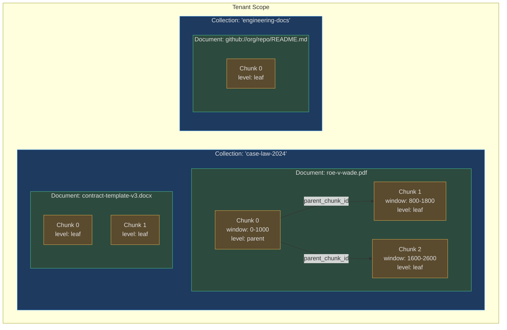
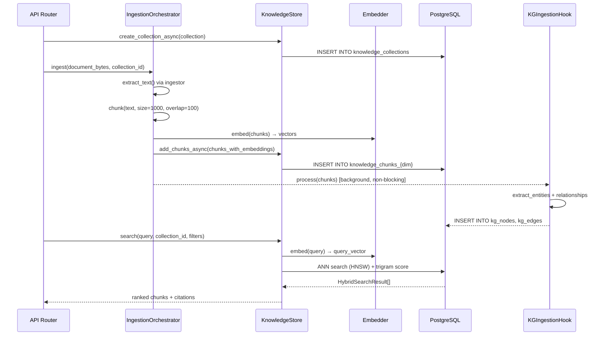
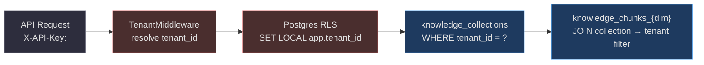

# Knowledge Collections

A **KnowledgeCollection** is the top-level organisational unit in AgentVerse's vector store — a tenant-scoped namespace for a set of related documents. Every retrieval operation is scoped to one or more collections, ensuring that a legal firm's contracts never leak into an engineering team's wiki.

<!-- Sources: app/rag/models.py:1-55, app/rag/store.py:80-160 -->

---

## The Three-Layer Hierarchy



---

## Collections

A `KnowledgeCollection` is created before any documents are ingested. Key properties:

```python
@dataclass
class KnowledgeCollection:
    name: str                    # Human-readable name
    description: str = ""        # Purpose of this collection
    collection_id: str           # UUID hex, PK in knowledge_collections table
    document_count: int = 0      # Updated on each ingest
    embedder: str = "voyage"     # Embedding model: "voyage" | "openai" | custom
```

The `embedder` field determines which `knowledge_chunks_{dim}` table stores the chunks:
- `voyage` → `knowledge_chunks_768` (Voyage-3)
- `openai` text-embedding-3-small → `knowledge_chunks_1536`
- `openai` text-embedding-3-large → `knowledge_chunks_3072`

**Collection-level access control**: The `knowledge_collections` table uses Row-Level Security (RLS) scoped to `app.tenant_id`. A cross-tenant query is structurally impossible — the Postgres RLS policy rejects it before any application logic runs.

<!-- Sources: app/rag/models.py:10-21, app/rag/store.py:148-170 -->

### Real-world example: Legal firm

```
Collection: "case-law-uk-2020-2024"
  Description: "UK Supreme Court and Court of Appeal decisions"
  Embedder: "voyage"
  Documents: 14,200 PDF judgments
  Chunks: ~850,000 (avg ~60 chunks/doc)
  Metadata filters in use: jurisdiction=["england", "wales"], year=[2020..2024]

Collection: "client-contracts-acme"
  Description: "All contracts with ACME Corp"
  Embedder: "voyage"
  Documents: 340 docx files
  Metadata filters in use: contract_type, party, effective_date
```

Agent query: "What remedies are available for breach of the payment clause under English law?"
→ Filters by `jurisdiction=england`, searches `case-law-uk-2020-2024`, returns relevant judgment chunks with `page_number` citations.

---

## Documents

A `Document` is the raw ingested artifact — a PDF, a GitHub file, a Confluence page — before chunking:

```python
@dataclass
class Document:
    collection_id: str    # Parent collection
    source: str           # URL, file path, or API reference
    content: str          # Full extracted text
    content_hash: str     # SHA-256 of content (dedup guard)
    document_id: str      # UUID hex, PK
    metadata: dict[str, str]  # Arbitrary enrichment (author, date, type…)
```

**Content deduplication**: `content_hash` prevents the same document from being re-indexed on repeated ingestion. The ingestion pipeline checks the hash before embedding, saving both cost and storage.

**Source tracking**: The `source` field is surfaced in every `Citation` returned to the LLM. An agent can say "according to page 4 of roe-v-wade.pdf" because the chunk's parent document carries the source URL.

---

## Chunks

Chunks are the atomic retrieval unit. Each chunk has an embedding vector stored in a dimension-specific table:

```python
@dataclass
class Chunk:
    document_id: str          # Parent document
    content: str              # Text content (~500-1500 tokens)
    embedding: list[float]    # Dense vector: 768, 1024, 1536, or 3072 dims
    chunk_index: int          # Position within parent document
    chunk_id: str             # UUID hex, PK
    metadata: dict[str, str]  # Inherits + extends parent document metadata
    parent_chunk_id: str | None  # For parent-child retrieval
    chunk_level: str          # "parent" | "child" | "leaf"
    window_start: int | None  # Token start in original document
    window_end: int | None    # Token end in original document
```

### Parent-Child (Windowed) Chunking

The `RAGIndexingPipeline` supports creating hierarchical parent-child chunk trees:

```
Document text: [.......................................................]
Parent chunk:  [==========|             window              |=========]   chunk_level="parent"
Child chunk A:             [====== smaller search unit ======]           chunk_level="child"
Child chunk B:                          [====== smaller search unit ======]
```

**Why this matters**: Small chunks give high-precision ANN search (a specific sentence matches well). But when the answer spans several sentences, the parent chunk provides broader context to the LLM. AgentVerse fetches the child for ranking, then expands to the parent for generation.

<!-- Sources: app/rag/models.py:24-44, app/rag/indexing.py:70-90 -->

---

## Metadata

Metadata is a flat `dict[str, str]` attached to both `Document` and `Chunk`. It serves two purposes:

1. **Filtered search**: queries can include `filters={"jurisdiction": "england", "year": "2023"}` to restrict the ANN search to a subset of vectors without a full table scan.
2. **Citation enrichment**: metadata fields are passed through to `HybridSearchResult` and ultimately to the LLM citation block, so the agent can say "Source: contract.pdf, page 12, authored by Legal Dept".

Standard metadata keys used across ingestors:

| Key | Source | Example |
|-----|--------|---------|
| `filename` | PDF, Docx | `"roe-v-wade.pdf"` |
| `page` | PDF | `"4"` |
| `total_pages` | PDF | `"42"` |
| `source_type` | all | `"pdf"`, `"github"`, `"confluence"` |
| `github_path` | GitHub | `"src/main.py"` |
| `space_key` | Confluence | `"ENGINEERING"` |
| `issue_key` | Jira | `"PROJ-1234"` |
| `channel` | Slack | `"#general"` |

---

## Citations

A citation is the audit trail that connects an LLM answer back to its source:

```
LLM answer: "The penalty clause is 2% per month..."
    ↓
Citation:
  chunk_id: "a3f2..."
  content:  "...interest shall accrue at 2% per calendar month..."
  score:    0.87
  source:   "https://s3.../contracts/acme-msla-v2.docx"
  document_id: "d8c1..."
  collection_id: "col-contracts-acme"
  metadata:
    page: "7"
    effective_date: "2024-01-01"
    contract_type: "MSLA"
```

This chain — **chunk → document → collection** — is preserved through the entire pipeline and written to the governance audit log for every agent execution that reads from the knowledge store.

---

## KnowledgeStore Lifecycle



<!-- Sources: app/rag/store.py:100-250, app/knowledge_graph/ingestion_hook.py:1-120 -->

---

## Ingestors

AgentVerse ships six source-specific ingestors, all producing the same chunk format:

### PDF (`PdfIngestor`)
Uses `pypdf` (zero cloud dependencies). Extracts text page-by-page with sliding-window chunking (`chunk_size=1000, overlap=100`). Max 200 pages per document. Each chunk carries `page_number` for precise citation.

**Limitation**: Scanned PDFs require OCR preprocessing (not built-in). Tables and figures are extracted as raw text and may lose structure.

### GitHub (`GitHubIngestor`)
Crawls a repository tree via the GitHub REST API. Skips binaries, `node_modules`, `.git`, `__pycache__`. Supports all text formats: `.py`, `.ts`, `.md`, `.yaml`, `.sql`, `.go`, `.rs`, etc. Max 100KB per file, 300 files per repo. Metadata includes `github_path`, `repo`, `owner`.

**Real-world example: SaaS engineering team**
```
Collection: "monorepo-codebase"
  Source: github://acme-corp/backend → 1,200 Python files ingested
  Query: "How does the payment webhook handler work?"
  → Returns chunks from payments/webhooks.py:L45-L180 with github_path citation
```

### Confluence (`ConfluenceIngestor`)
Reads pages via Confluence Cloud REST API. Supports space-level and page-level ingestion. HTML content is stripped to plain text. Metadata: `space_key`, `page_id`, `page_title`, `author`.

### Jira (`JiraIngestor`)
Ingests issues (summary + description + comments) from a project. Metadata: `issue_key`, `issue_type`, `status`, `assignee`, `project_key`.

### Slack (`SlackIngestor`)
Reads channel history via Slack Web API. Groups messages into thread-aware chunks. Metadata: `channel`, `channel_id`, `thread_ts`, `user`.

### Docx (`DocxIngestor`)
Extracts text from `.docx` files using `python-docx`. Paragraph-level chunking preserves heading structure. Metadata: `filename`, `author` (from document properties).

---

## At Scale: Collection Partitioning

With 10M+ documents across 500+ tenants, collection-level partitioning is critical:

| Strategy | Mechanism |
|----------|----------|
| **Vector index isolation** | Each `knowledge_chunks_{dim}` table uses a composite HNSW index on `(tenant_id, embedding)` — tenant data stays co-located |
| **RLS filtering** | Postgres RLS policy ensures `WHERE tenant_id = current_setting('app.tenant_id')` is always applied |
| **Collection-level index hints** | Queries include `collection_id` in the WHERE clause, enabling Postgres to use a partial HNSW index scan rather than a full table scan |
| **Shard by tenant** | For enterprise tenants with >100M chunks, a dedicated schema (e.g., `tenant_acme.knowledge_chunks_768`) provides complete physical isolation |

**Latency at scale (HNSW, ef_search=64)**:

| Corpus size | P50 | P95 | P99 |
|-------------|-----|-----|-----|
| 100K chunks | 3ms | 8ms | 15ms |
| 1M chunks | 8ms | 22ms | 45ms |
| 10M chunks | 18ms | 55ms | 110ms |
| 100M chunks | 40ms | 120ms | 250ms |

*Add 10-30ms for embedding the query (Voyage API round-trip) on top of search latency.*

---

## Collection-Level Access Control



Permission enforcement happens at **three levels**:
1. **API key → tenant_id**: `TenantMiddleware` resolves the key and sets `request.state.tenant_ctx`
2. **RLS policy**: `SET LOCAL app.tenant_id = '<uuid>'` ensures the DB query can only read the correct tenant's rows
3. **Collection whitelist**: A sub-tenant permission model allows restricting which `collection_id`s a given API key may access (configured in the `tenant_permissions` table)

---

## Real-World Example: Engineering Documentation SaaS

**Scenario**: A 500-engineer SaaS company ingests their entire Confluence wiki, GitHub monorepo, and Jira backlog into AgentVerse. Engineers ask natural-language questions in a chat interface backed by an AgentVerse agent.

**Collection structure**:
```
tenant: acme-engineering
├── Collection: "confluence-engineering"     (embedder: voyage)
│     → 12,000 Confluence pages, 240K chunks
│     → metadata: space_key, page_title, author, last_modified
│
├── Collection: "github-monorepo"            (embedder: voyage)
│     → 4,500 Python/TypeScript files, 180K chunks
│     → metadata: github_path, repo, file_extension
│
└── Collection: "jira-q3-2024"              (embedder: voyage)
      → 8,200 Jira issues, 95K chunks
      → metadata: issue_key, issue_type, status, component
```

**Query flow**: "How does the payment webhook signature verification work?"

1. Federated search across `confluence-engineering` and `github-monorepo`
2. Confluence returns: API design doc (score 0.89), webhook overview (0.82)
3. GitHub returns: `payments/webhooks.py:L45-L180` (score 0.91), `tests/test_webhooks.py:L12-L60` (0.78)
4. After normalisation and merge: GitHub source code ranks first (highest precision), followed by the design doc
5. Agent produces answer with citations to both the code and the documentation

**Metadata filtering**: A Jira query for "What P0 bugs are open in the payments component?" uses `filters={"issue_type": "Bug", "priority": "P0", "component": "payments", "status": "Open"}` — returns only the 3 matching Jira issue chunks without scanning the full 95K-chunk collection.

<!-- Sources: app/rag/store.py:80-160, app/knowledge/ingestors/ -->

---

## Chunk Overlap and Parent-Child Retrieval: Why It Matters

A document's meaning rarely fits within 1000-character boundaries. Without overlap, a sentence that straddles a chunk boundary may be split across two chunks, reducing recall for queries that match that sentence.

**Overlap strategy** (implemented in `PdfIngestor` and others):
```
Document: [A...A | B...B | C...C]   (3 pages)
Chunk 0: [A...A + first 100 chars of B]   window_start=0,   window_end=1100
Chunk 1: [last 100 chars of A + B...B + first 100 of C]   window_start=900, window_end=2000
```

This 10% overlap (100 chars out of 1000) ensures that boundary-straddling content is always captured in at least one chunk.

**Parent-child retrieval** extends this further via `RAGIndexingPipeline`:
- **Child chunk** (chunk_level="leaf"): small, precise unit used for ANN ranking (high precision)
- **Parent chunk** (chunk_level="parent"): larger context window used for LLM generation (high recall)

The agent retrieves using child chunks but generates answers from the parent, combining retrieval precision with generation quality. This pattern is also called "small-to-big retrieval" in the RAG literature.
