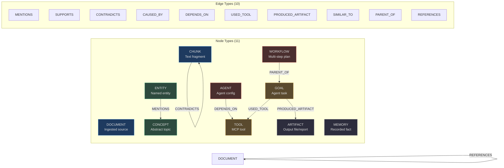
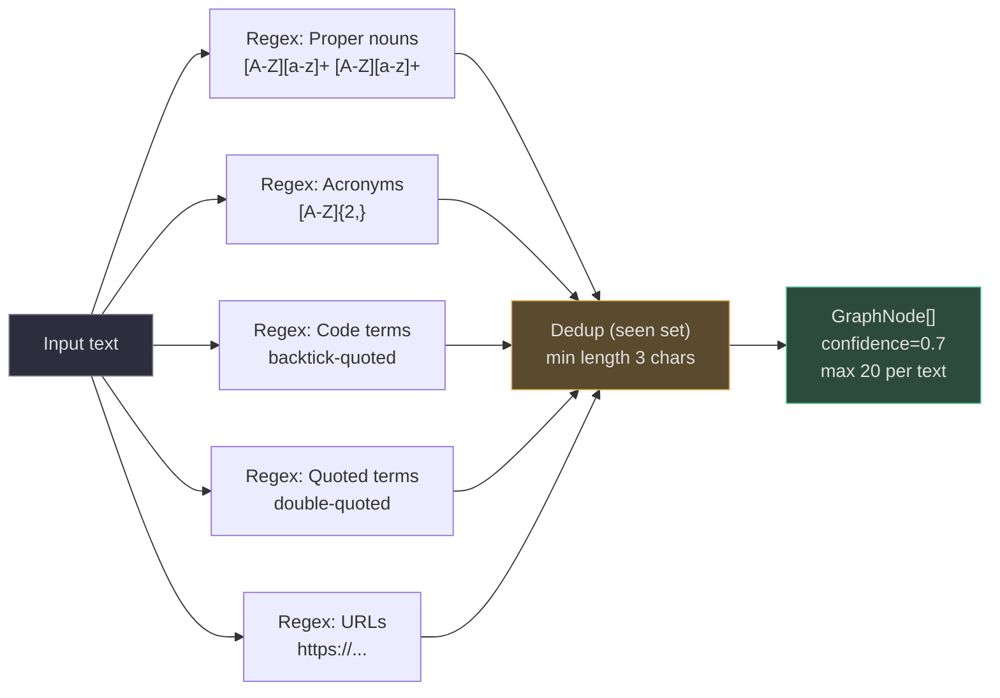
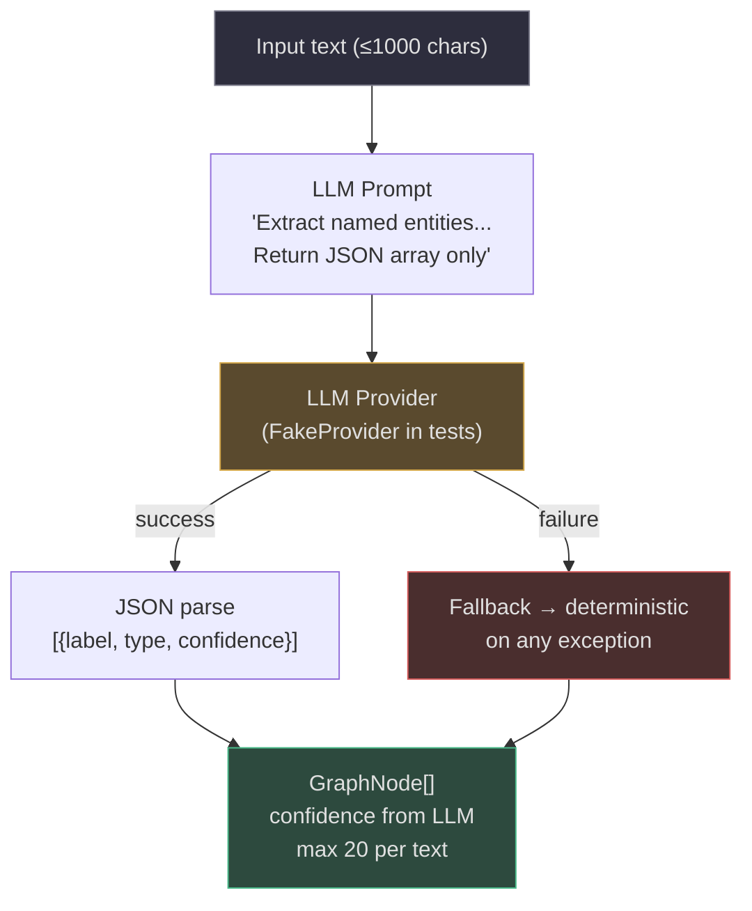
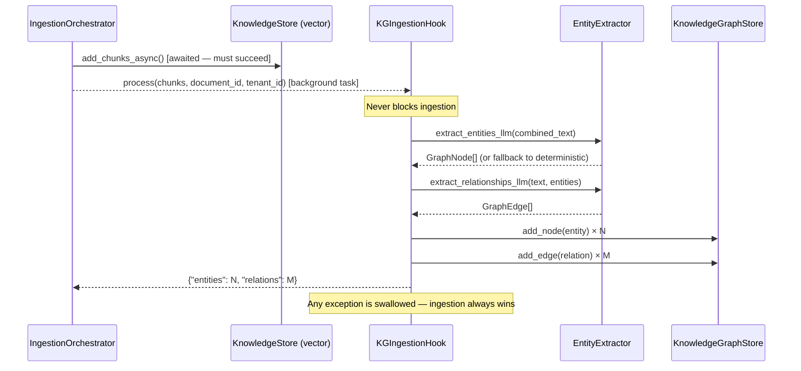
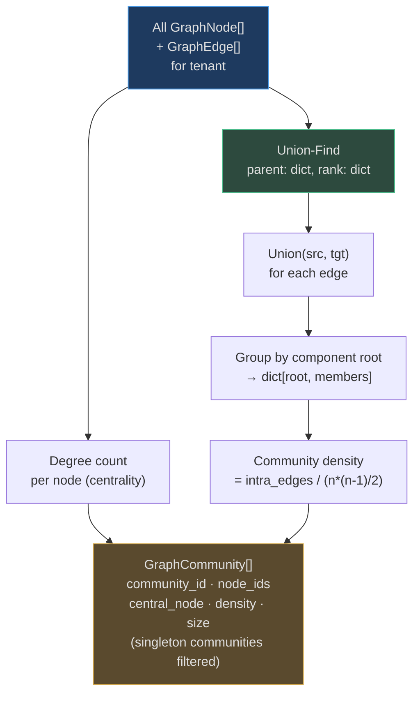
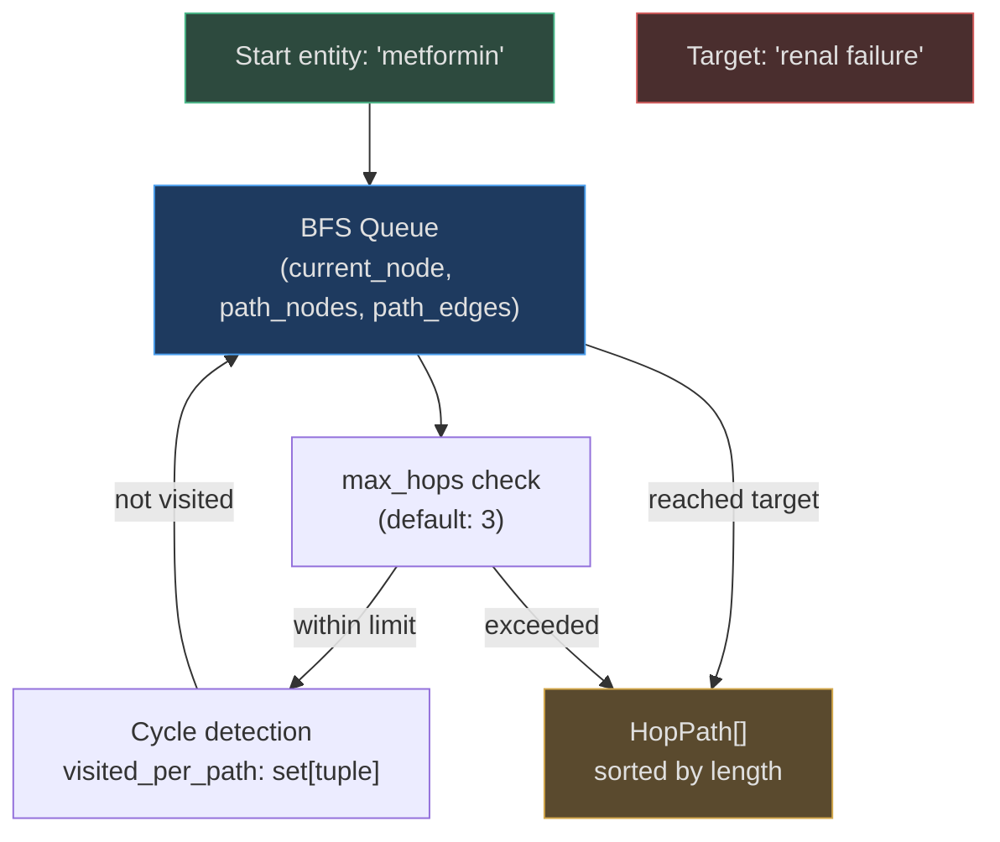

# Knowledge Graph

The **KnowledgeGraphStore** is AgentVerse's relational brain. Where the vector store answers "what text is similar to this query?", the knowledge graph answers "how are these entities connected, through what chain of relationships, and with what confidence?".

The graph is populated automatically at ingestion time via `KGIngestionHook` and queried at planning time by `MultiHopReasoner`. It is never a hard dependency — the ingestion hook falls back to deterministic extraction if no LLM provider is available, and the agent loop functions without graph enrichment if the graph is empty.

<!-- Sources: app/knowledge_graph/store.py:1-50, app/knowledge_graph/models.py:1-90 -->

---

## Node Types and Edge Types



---

## GraphNode Data Model

```python
@dataclass
class GraphNode:
    node_id: str          # UUID5 (namespace=DNS, name="tenant_id:label") — stable across re-ingestion
    tenant_id: str        # RLS isolation
    node_type: NodeType   # One of 11 types
    label: str            # Human-readable name (≤100 chars)
    content: str          # Extended description or embedding text
    source_id: str | None # ID of originating document/goal/etc
    confidence: float     # 0.0–1.0 (LLM extraction: ~0.8, deterministic: 0.7)
    embedding: list[float] | None  # Optional: for semantic node search
    metadata: dict[str, Any]       # entity_type, extraction_method, etc.
    created_at: str | None
    updated_at: str | None
```

**Stable node IDs**: `uuid5(NAMESPACE_DNS, f"{tenant_id}:{label}")` means the same entity label always produces the same `node_id`. Re-ingesting the same document performs an upsert, not a duplicate insertion.

## GraphEdge Data Model

```python
@dataclass
class GraphEdge:
    edge_id: str             # UUID
    tenant_id: str           # RLS isolation
    source_node_id: str      # FK → GraphNode.node_id
    target_node_id: str      # FK → GraphNode.node_id
    edge_type: EdgeType      # One of 10 types
    label: str               # Human-readable relationship label
    confidence: float        # 0.0–1.0
    evidence: str            # Quote from text that justifies this edge
    provenance: str          # Source document/chunk where edge was extracted
    metadata: dict[str, Any]
    created_at: str | None
```

**Evidence field**: Unlike most KG implementations, every edge stores the exact text snippet that justified its creation. This enables explainability queries: "Why does the system think drug A interacts with drug B?" → returns the `evidence` field verbatim.

<!-- Sources: app/knowledge_graph/models.py:34-80 -->

---

## Entity Extraction

The `EntityExtractor` supports two modes, selected based on LLM provider availability:

### Mode 1: Deterministic (Regex-based)



Deterministic extraction is fast (< 1ms), never fails, and costs zero LLM tokens. It catches proper nouns, acronyms, code identifiers, and URLs reliably. Confidence score: **0.7**.

### Mode 2: LLM-Assisted (High Quality)



The LLM extraction prompt requests structured JSON output with entity type labels (`person`, `org`, `concept`, `tool`, `location`). Each entity's confidence is determined by the LLM. The extractor caps at 20 entities per text to control cost.

### Relationship Extraction

After entities are extracted, a second LLM call identifies relationships between them:

```
Prompt: "Find relationships between [entity_list] in the text.
Return JSON: [{source, target, relation, evidence, confidence}]"
```

The `relation` field maps to `EdgeType` values. The `evidence` field captures the supporting text snippet, stored verbatim in `GraphEdge.evidence`.

<!-- Sources: app/knowledge_graph/extractor.py:1-150 -->

---

## KG Ingestion Hook

The `KGIngestionHook` runs as a background task after every successful document ingestion:



Key design decisions:
- **Cost control**: Only the first 10 chunks of a document are processed (combined text), not all chunks. This limits LLM token spend per ingest.
- **Silent failure**: The entire hook is wrapped in a `try/except` that swallows all exceptions. A broken KG extractor never prevents document ingestion.
- **Upsert semantics**: `node_id = uuid5(tenant_id, label)` means re-ingesting the same text updates existing nodes rather than creating duplicates.

<!-- Sources: app/knowledge_graph/ingestion_hook.py:1-120 -->

---

## Graph Storage Model

The `KnowledgeGraphStore` uses a **dual-layer architecture**:

### Layer 1: In-memory adjacency maps
```python
self._nodes: dict[str, GraphNode]          # node_id → node
self._edges: dict[str, GraphEdge]          # edge_id → edge
self._tenant_nodes: dict[str, set[str]]    # tenant_id → {node_ids}
self._tenant_edges: dict[str, set[str]]    # tenant_id → {edge_ids}
```

All reads (query, path finding, community detection) are served from memory. This gives sub-millisecond latency for graph operations.

### Layer 2: PostgreSQL persistence
Writes fire-and-forget async tasks (`asyncio.create_task`) to persist to `kg_nodes` and `kg_edges` tables. The store hydrates per-tenant data from the DB on first access (lazy load, once per tenant per process lifetime).

**Trade-off**: Reads are fast (in-memory), writes are eventually consistent (async DB persist). For the KG use case — enriching retrieval context — this is acceptable. The KG is not a transactional store.

---

## Community Detection

`CommunityDetector` uses **Union-Find (Disjoint Set Union)** with path halving for O(n·α(n)) time complexity — effectively O(n) in practice:



Each community has:
- `community_id`: UUID
- `node_ids`: all member node IDs
- `central_node`: node with the highest degree (most edges)
- `density`: fraction of possible edges that actually exist (0.0–1.0)
- `size`: number of nodes (singleton communities are excluded)

### Real-world example: Authentication community

After ingesting a full codebase and architecture docs:
```
Community: "auth-security"
  size: 18 nodes
  central_node: "JWT" (degree=12)
  density: 0.34
  members: JWT, OAuth2, PKCE, refresh_token, access_token, TenantMiddleware,
           API_key, bcrypt, argon2, rate_limiter, RBAC, permission_check,
           session_store, cookie, HTTPS, CORS, HSTS, CSP
```

When an agent asks "how does authentication work?", querying the `auth-security` community returns all 18 nodes without needing to traverse the full graph. This is 18× faster than a full-graph BFS.

<!-- Sources: app/knowledge_graph/community_detection.py:1-115 -->

---

## Multi-Hop Traversal

`MultiHopReasoner` performs BFS path finding and ego-network extraction:



A `HopPath` renders as human-readable text for LLM injection:
```
metformin --[treats]--> type_2_diabetes --[complication_of]--> renal_failure
    ↓ renders as:
"metformin --[treats]--> type_2_diabetes | type_2_diabetes --[complication_of]--> renal_failure"
```

### `find_paths(start, end, max_hops=3)`
Returns all paths between two entities, shortest first. Avoids cycles by tracking the full path state in `visited_per_path`. Returns at most 5 paths to prevent output explosion.

### `retrieve_subgraph(entity, depth=2)`
Extracts the ego-network around an entity: all nodes reachable within `depth` hops. Returns a `Subgraph` with `center`, `nodes`, and `edges`. The `as_text()` method renders it as structured bullet points for LLM injection.

---

## Real-World Examples

### Example 1: Medical Knowledge Base

A pharmaceutical research team ingests drug interaction data, clinical trial reports, and FDA warnings.

```
Graph nodes:
  metformin         (ENTITY, type=drug)
  type_2_diabetes   (ENTITY, type=condition)
  renal_failure     (ENTITY, type=condition)
  ACE_inhibitors    (ENTITY, type=drug_class)
  lactic_acidosis   (ENTITY, type=side_effect)
  FDA_2020_warning  (DOCUMENT, source=fda.gov/...)

Edges:
  metformin --[treats]--> type_2_diabetes
    evidence: "Metformin is first-line therapy for T2DM..."
  metformin --[contraindicated_with]--> renal_failure
    evidence: "Contraindicated in eGFR < 30 mL/min..."
  metformin --[causes]--> lactic_acidosis
    evidence: "Risk of lactic acidosis increases with renal impairment..."
  ACE_inhibitors --[causes]--> renal_failure
    evidence: "ACE inhibitors may impair renal function in..."
  FDA_2020_warning --[references]--> metformin
```

**Multi-hop query**: "What drugs should be avoided in a patient with heart failure taking metformin?"

Path found (3 hops):
```
metformin --[causes]--> lactic_acidosis --[worsened_by]--> heart_failure
→ "Metformin → lactic acidosis risk increases with heart failure"
```

Combined with vector search for similar clinical guidelines, the agent produces a complete drug interaction report with citations.

---

### Example 2: Code Repository Knowledge Graph

An engineering team ingests their Python monorepo. The KG extractor identifies code entities and dependencies.

```
Graph nodes:
  GoalService          (ENTITY, type=code, source=app/services/goal_service.py)
  AsyncSession         (ENTITY, type=code, source=sqlalchemy)
  RLS_context          (ENTITY, type=code, source=app/db/rls.py)
  TenantMiddleware     (ENTITY, type=code, source=app/tenancy/)
  PostgreSQL           (ENTITY, type=technology)
  celery               (TOOL, source=pyproject.toml)

Edges:
  GoalService --[depends_on]--> AsyncSession
    evidence: "async with self._db() as session:"
  GoalService --[depends_on]--> RLS_context
    evidence: "async with sqlalchemy_rls_context(session, tenant_id):"
  TenantMiddleware --[depends_on]--> PostgreSQL
    evidence: "API key lookup in pg tenants table"
  GoalService --[used_tool]--> celery
    evidence: "await celery_app.send_task('goals.execute',...)"
```

**Multi-hop query**: "What does GoalService depend on transitively?"

Subgraph (depth=2):
```
GoalService
  → AsyncSession → PostgreSQL
  → RLS_context → PostgreSQL
  → celery → Redis
```

An architect can now see the full transitive dependency chain without manually reading all source files.

---

## KG vs KnowledgeGraphMemory

| Feature | `KnowledgeGraphStore` | `KnowledgeGraphMemory` |
|---------|----------------------|------------------------|
| Scope | Full tenant graph, all entities | Per-session working memory |
| Persistence | In-memory + PostgreSQL | In-memory (session-scoped) |
| Size | Thousands–millions of nodes | Hundreds of nodes |
| Population | KGIngestionHook + agent execution | Agent memory writes |
| Use case | RAG enrichment, multi-hop traversal | Agent context window management |
| Query API | `query_nodes`, `find_path`, `get_edges_for_node` | `recall`, `store` |

The memory system uses `KnowledgeGraphMemory` as a lightweight adapter that reads from the full `KnowledgeGraphStore` but limits retrieval to the most relevant entities for the current conversation, preventing context window overflow.

<!-- Sources: app/knowledge_graph/store.py:160-200, app/memory/ -->
