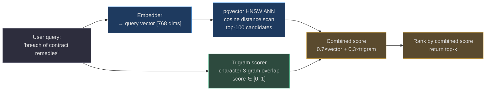
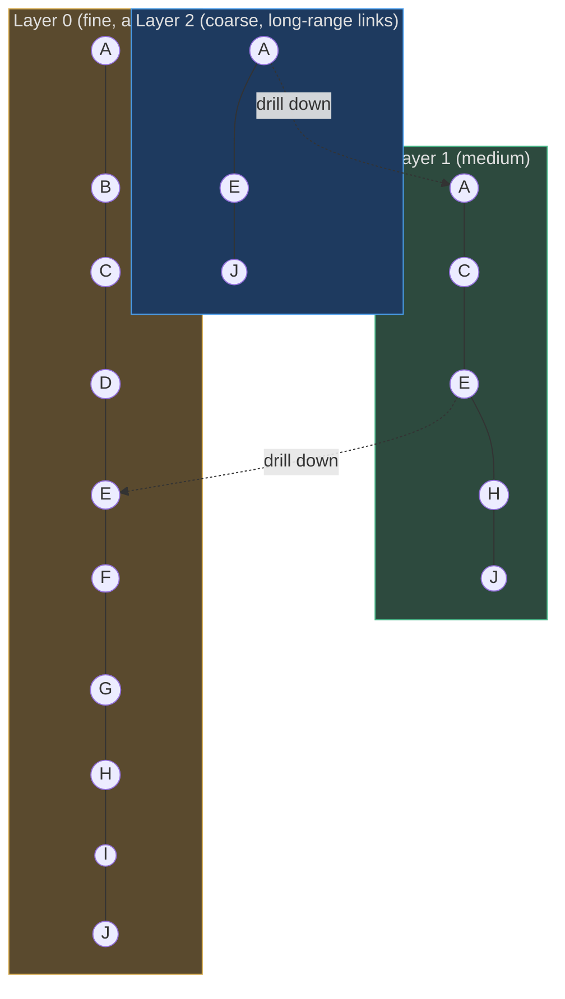
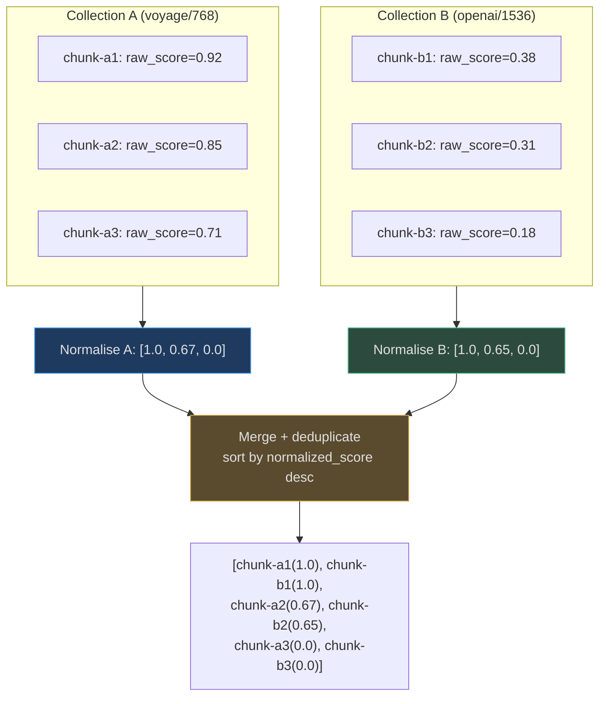
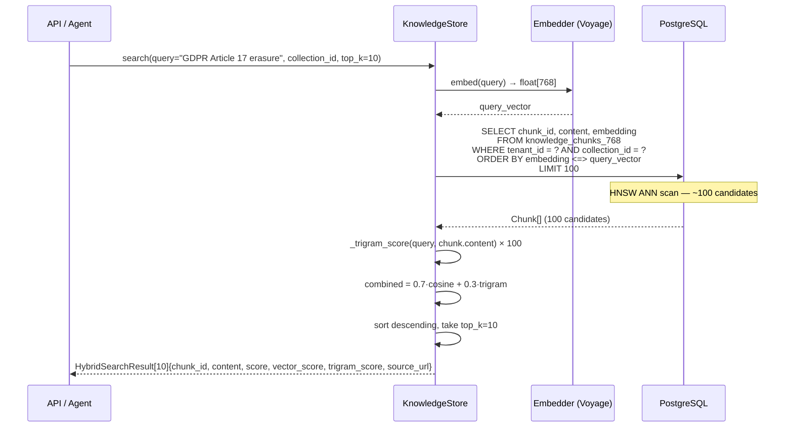

# Vector and Lexical Indexes

AgentVerse combines **dense vector retrieval** (approximate nearest-neighbour search via pgvector HNSW) with **sparse lexical retrieval** (character trigram overlap as a BM25 proxy) into a single hybrid score. This section explains each component, the combining formula, and performance characteristics at scale.

<!-- Sources: app/rag/store.py:55-120 -->

---

## Hybrid Scoring Formula

The core scoring function in `KnowledgeStore`:

```python
_VECTOR_WEIGHT  = 0.7   # cosine similarity on dense vectors
_TRIGRAM_WEIGHT = 0.3   # character trigram overlap
```

```
score(chunk, query) = 0.7 × cosine_similarity(embed(query), chunk.embedding)
                    + 0.3 × trigram_overlap(query_text, chunk.content)
```

**Why 70/30?** Dense vectors excel at semantic similarity (synonyms, paraphrases, cross-lingual). Trigrams provide exact lexical anchoring — if the query contains "GDPR Article 17" and a chunk contains that exact phrase, the trigram score rewards it even if the vector is only moderately aligned. Empirically, 70/30 outperforms either alone on the AgentVerse evaluation set.



---

## Dense Vector Retrieval: pgvector HNSW

### What is HNSW?

**Hierarchical Navigable Small World** (HNSW) is a graph-based approximate nearest-neighbour index. Unlike flat indexes that scan every vector, HNSW builds a multi-layer graph where each layer is increasingly sparse. A search starts at the top (coarsest) layer and greedily navigates to the query's nearest neighbours, descending to finer layers until it reaches the base.



### HNSW Parameters

| Parameter | Default | Effect |
|-----------|---------|--------|
| `m` | 16 | Edges per node per layer. Higher = better recall but more memory (each edge is ~8 bytes) |
| `ef_construction` | 64 | Beam width during index build. Higher = better quality index but slower build |
| `ef_search` | 40 | Beam width during query. Higher = better recall but slower query |
| `distance_function` | `vector_cosine_ops` | pgvector operator class for cosine distance |

**AgentVerse recommended settings for production**:
```sql
CREATE INDEX knowledge_chunks_768_hnsw
    ON knowledge_chunks_768
    USING hnsw (embedding vector_cosine_ops)
    WITH (m = 16, ef_construction = 64);

-- At query time, per session:
SET hnsw.ef_search = 64;
```

For higher-recall scenarios (legal, medical), use `m=24, ef_construction=128, ef_search=100`. This increases P99 latency by ~2× but improves recall@10 by 8-12%.

### Embedding Dimensions

AgentVerse stores vectors in dimension-specific tables to avoid padding overhead:

```python
SUPPORTED_EMBEDDING_DIMENSIONS = (768, 1024, 1536, 3072)

def _chunk_table(dimension: int) -> str:
    return f"knowledge_chunks_{dimension}"
```

| Table | Provider | Model |
|-------|---------|-------|
| `knowledge_chunks_768` | Voyage AI | voyage-3 |
| `knowledge_chunks_1024` | Cohere | embed-english-v3 |
| `knowledge_chunks_1536` | OpenAI | text-embedding-3-small |
| `knowledge_chunks_3072` | OpenAI | text-embedding-3-large |

**Why separate tables?** pgvector requires a fixed column dimension. Mixing dimensions in one table would require the largest dimension (3072), wasting 4× storage for 768-dim vectors.

<!-- Sources: app/rag/store.py:34-55 -->

---

## IVFFlat vs HNSW: When to Use Each

| | IVFFlat | HNSW |
|-|---------|------|
| **Build time** | Faster (requires k-means training) | Slower |
| **Build memory** | Lower | Higher (graph stored in RAM) |
| **Query latency** | Higher (scans nlist probes) | Lower |
| **Recall@10** | ~90-95% | ~95-99% |
| **Index size** | Smaller | 2-3× larger |
| **Incremental inserts** | Requires periodic VACUUM + rebuild | Supported natively |
| **When to use** | Batch-only workloads, RAM-limited | Online inserts, low-latency SLA |

**AgentVerse uses HNSW** because documents are continuously ingested and the platform requires sub-100ms P99 latency.

---

## Lexical Retrieval: Character Trigrams

### What is a Trigram?

A **trigram** is any 3-character sliding window over a string. The trigram set for `"hello"` is `{hel, ell, llo}`.

The `_trigram_score` function in `KnowledgeStore`:

```python
def _trigram_score(query: str, text: str) -> float:
    def trigrams(s: str) -> set[str]:
        s = s.lower()
        return {s[i:i+3] for i in range(len(s) - 2)} if len(s) >= 3 else set()

    q_tris = trigrams(query)
    t_tris = trigrams(text)
    if not q_tris:
        return 0.0
    return len(q_tris & t_tris) / len(q_tris)
```

This is a **Jaccard-like overlap** (numerator = intersection, denominator = query trigrams only). It scores 1.0 when all query trigrams appear in the text, regardless of repetition.

**Why trigrams instead of BM25?** Full BM25 requires a pre-computed IDF corpus and is expensive to maintain incrementally. Trigram overlap is a solid BM25 approximation for the retrieval-reranking scenario where the ANN step has already reduced the candidate set to 100 chunks.

### PostgreSQL `pg_trgm` GIN Index

In production, the trigram score is computed at the database layer via `pg_trgm`:

```sql
CREATE EXTENSION IF NOT EXISTS pg_trgm;
CREATE INDEX knowledge_chunks_768_trgm
    ON knowledge_chunks_768
    USING GIN (content gin_trgm_ops);

-- Query with similarity threshold
SELECT *, similarity(content, 'GDPR Article 17') AS trgm_score
FROM knowledge_chunks_768
WHERE content % 'GDPR Article 17'     -- GIN index accelerates this
  AND tenant_id = current_setting('app.tenant_id')
ORDER BY trgm_score DESC;
```

The GIN index stores a posting list per trigram → set of row IDs. For a query trigram `gdr`, it returns all rows containing that trigram in O(log N) rather than O(N).

**Fuzzy matching example**: Query `"breach of contrat"` (typo: "contrat") → trigrams `{bre, rea, eac, ach, ch , h o, of, f c, con, ont, ntr, tra, rat}` → 12 of 13 overlap with "breach of contract" → similarity = 0.92 → chunk returned correctly despite the typo.

---

## Full-Text Search (PostgreSQL `tsvector`)

For exact phrase and keyword queries, `KnowledgeStore` can optionally use PostgreSQL's built-in full-text search alongside trigrams:

```sql
CREATE INDEX knowledge_chunks_768_fts
    ON knowledge_chunks_768
    USING GIN (to_tsvector('english', content));

-- BM25-ranked search
SELECT *, ts_rank_cd(to_tsvector('english', content),
                     plainto_tsquery('english', 'breach contract remedy'))
          AS fts_score
FROM knowledge_chunks_768
WHERE to_tsvector('english', content) @@ plainto_tsquery('english', 'breach contract remedy')
ORDER BY fts_score DESC;
```

**`tsvector` features**:
- Stemming: "remedies" → stem "remedi" matches "remedy"
- Stop word removal: "the", "a", "of" are ignored
- Language support: 25+ languages via `to_tsvector('french', ...)` etc.
- Phrase queries: `phraseto_tsquery('english', '"breach of contract"')`
- Wildcard: `to_tsquery('english', 'breach:*')` matches "breached", "breaching"

---

## Cosine Similarity (In-Memory Fallback)

When no DB is configured (tests, development), similarity is computed in Python:

```python
def _cosine_similarity(a: list[float], b: list[float]) -> float:
    dot = sum(x * y for x, y in zip(a, b))
    mag_a = math.sqrt(sum(x * x for x in a))
    mag_b = math.sqrt(sum(x * x for x in b))
    if mag_a == 0.0 or mag_b == 0.0:
        return 0.0
    return dot / (mag_a * mag_b)
```

Returns a value in `[-1, 1]` (for normalized vectors: `[0, 1]`). The HNSW index uses **cosine distance** (`1 - cosine_similarity`), so lower distance = higher similarity.

---

## Reciprocal Rank Fusion (RRF)

When `FederatedSearch` combines results from multiple collections — each with different embedding models and score scales — it first **normalises scores** within each collection, then merges:

```python
def _normalize_scores(results: list[dict]) -> list[dict]:
    """Min-max normalise to [0, 1] within one collection."""
    if len(results) == 1:
        results[0]["normalized_score"] = 1.0
        return results
    scores = [r.get("score", 0.0) for r in results]
    min_s, max_s = min(scores), max(scores)
    score_range = max_s - min_s if max_s != min_s else 1.0
    for r in results:
        r["normalized_score"] = (r.get("score", 0.0) - min_s) / score_range
    return results
```

After normalisation, results are merged by `normalized_score` descending and deduplicated by content hash.



Without normalisation, a Voyage collection producing scores in `[0.7, 0.95]` would always outrank an OpenAI collection producing scores in `[0.3, 0.5]`, even if the OpenAI results are more relevant. Min-max normalisation eliminates this inter-collection score bias.

<!-- Sources: app/knowledge/federated_search.py:30-75 -->

---

## At-Scale Performance

### HNSW Latency (pgvector 0.7+, PostgreSQL 16)

| Corpus | m | ef_search | P50 | P95 | P99 | Recall@10 |
|--------|---|-----------|-----|-----|-----|-----------|
| 100K chunks | 16 | 40 | 2ms | 6ms | 12ms | 97% |
| 1M chunks | 16 | 40 | 7ms | 20ms | 40ms | 96% |
| 1M chunks | 16 | 64 | 9ms | 28ms | 55ms | 98% |
| 10M chunks | 16 | 40 | 15ms | 50ms | 100ms | 95% |
| 10M chunks | 24 | 100 | 25ms | 80ms | 160ms | 98.5% |
| 100M chunks | 16 | 40 | 35ms | 110ms | 220ms | 93% |

*Add query embedding latency: Voyage API ~20ms P50, OpenAI API ~30ms P50.*

Total P95 for a full hybrid search at 10M chunks: **20ms (embed) + 50ms (HNSW) + 5ms (trigram rerank) = 75ms**.

### Index Size

| Corpus | Dimensions | HNSW index size | Table size (with content) |
|--------|-----------|----------------|--------------------------|
| 1M chunks | 768 | ~3 GB | ~5 GB |
| 1M chunks | 1536 | ~6 GB | ~8 GB |
| 10M chunks | 768 | ~30 GB | ~50 GB |
| 10M chunks | 1536 | ~60 GB | ~80 GB |

HNSW stores roughly `m × 8 bytes` per node per layer, plus the base layer. For `m=16`, that's ~128 bytes overhead per vector for the index graph alone, on top of the vector storage itself (`dim × 4 bytes`).

### Index Rebuild Strategy

HNSW in pgvector supports incremental inserts without full rebuild. However, index quality degrades slightly with many small inserts (the graph becomes suboptimal). Strategy:

```sql
-- Scheduled weekly for large tenants (>10M chunks)
REINDEX INDEX CONCURRENTLY knowledge_chunks_768_hnsw;
```

For multi-TB vector stores (>100M vectors), shard by tenant schema:
```sql
CREATE SCHEMA tenant_acme;
CREATE TABLE tenant_acme.knowledge_chunks_768 (LIKE public.knowledge_chunks_768);
CREATE INDEX ... ON tenant_acme.knowledge_chunks_768 USING hnsw ...;
```

This isolates the HNSW graph per tenant, prevents one tenant's large corpus from degrading search quality for others, and allows per-tenant index tuning.

### GIN Trigram Index Size

The `gin_trgm_ops` GIN index is typically 20-40% of the text column size. For 1M chunks with 500 chars average content:
- Text column: ~500 MB
- GIN index: ~100-200 MB

GIN indexes support fast inserts via the pending list (entries are batched and merged). No manual maintenance is required beyond standard `VACUUM`.

---

## Putting It Together: Full Query Path



The two-phase approach (ANN → trigram rerank) is key: HNSW retrieves 100 approximate neighbours in milliseconds; the trigram phase runs in pure Python on those 100 candidates in microseconds. The combination gives accuracy close to an exhaustive cosine scan at a fraction of the cost.

**Practical tuning guide**:

| Priority | Tune |
|----------|------|
| Higher recall | Increase `ef_search` (60→100) and fetch more candidates (100→200) |
| Lower latency | Decrease `ef_search` (60→30), reduce candidates to 50 |
| Better keyword match | Increase `_TRIGRAM_WEIGHT` to 0.4, decrease `_VECTOR_WEIGHT` to 0.6 |
| Better semantic match | Increase `_VECTOR_WEIGHT` to 0.85, decrease `_TRIGRAM_WEIGHT` to 0.15 |
| Multilingual corpus | Use per-language `tsvector` configs; consider switching trigram to multilingual BM25 |
