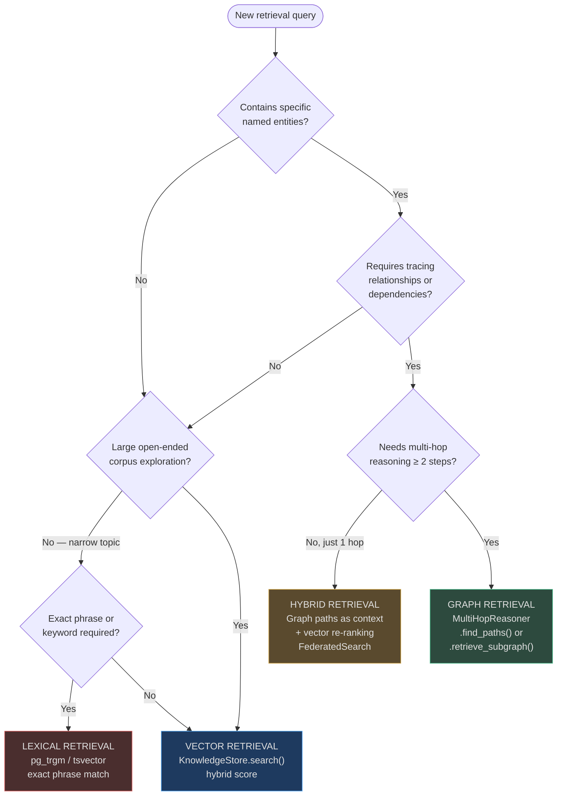
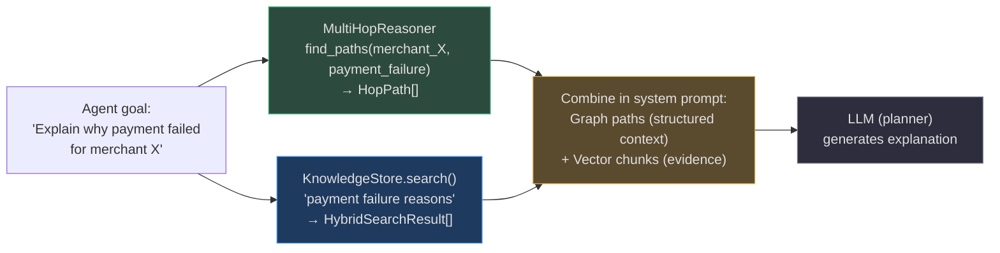

# When to Use Graph vs Vector Retrieval

AgentVerse provides both a vector store and a knowledge graph. Most retrieval tasks benefit from one or the other, but some require both. This guide gives you a decision framework, performance comparison, and concrete real-world examples for each strategy.

---

## The Core Distinction

| Dimension | Vector Retrieval | Graph Retrieval |
|-----------|-----------------|----------------|
| **Question type** | "What text is semantically similar to X?" | "How is A related to B, through what chain?" |
| **Query structure** | Open-ended natural language | Entity-to-entity or entity-to-property |
| **Answer shape** | Ranked list of relevant chunks | Paths, subgraphs, relationship chains |
| **Reasoning depth** | Single-hop (query → relevant chunks) | Multi-hop (entity → rel → entity → rel → ...) |
| **Handles synonyms** | Yes (embedding captures semantics) | Only if edges are drawn for synonyms |
| **Handles provenance** | Indirectly (via citations) | Natively (edge.evidence = source text) |
| **Update latency** | Real-time (insert chunk → immediately searchable) | Near-real-time (fire-and-forget background extraction) |
| **Cost** | Embedding API call per query | No LLM call at query time (graph is pre-built) |

---

## Decision Framework



---

## Vector Is Better When…

**Use vector retrieval when the query is open-ended, semantic, or exploratory.**

### Characteristics of vector-optimal queries
- The user doesn't know which specific document contains the answer
- Synonyms and paraphrases should match ("car" ↔ "vehicle", "terminate" ↔ "end contract")
- The corpus is large and unstructured (Wikipedia-scale, support ticket history)
- There is no pre-defined relationship structure

### Real-world example: Support ticket similarity

**Scenario**: A SaaS customer support platform with 2M historical tickets. A new ticket arrives: "My dashboard shows wrong revenue numbers after currency conversion."

**Why vector**: The answer lies in similar past tickets where other users described the same bug in different words — "incorrect FX calculation", "multicurrency totals wrong", "revenue reporting error". No named entities or relationship chains are needed.

**Approach**:
```python
results = await knowledge_store.search(
    query="dashboard shows wrong revenue numbers after currency conversion",
    collection_id="support-tickets-2024",
    top_k=10,
    filters={"status": "resolved"}  # only find tickets that were fixed
)
# Returns: 8 similar resolved tickets with resolution steps
```

**Why not graph**: There are no meaningful relationships to traverse. The tickets are independent documents.

---

### Real-world example: Legal document exploration

**Scenario**: A law firm needs to find all case law relevant to "force majeure clauses in shipping contracts."

**Why vector**: "Force majeure" appears under many names in older cases — "act of God", "vis major", "frustration of contract". Vector embeddings capture these semantic equivalences. No specific entity chain is needed.

**Approach**:
```python
results = await knowledge_store.search(
    query="force majeure clauses in shipping and maritime contracts",
    collection_id="case-law-uk",
    top_k=20,
    filters={"jurisdiction": "england"}
)
```

---

## Graph Is Better When…

**Use graph retrieval when the query requires tracing explicit relationships between named entities.**

### Characteristics of graph-optimal queries
- The query involves specific named entities and their relationships
- Multi-hop reasoning: "X affects Y, which affects Z — what does this mean for A?"
- Provenance matters: "Show me the chain of evidence"
- The answer is a structured path, not a ranked list of chunks

### Real-world example: Regulatory dependency chain

**Scenario**: A compliance team needs to know: "Which internal policies depend on GDPR Article 17 (Right to Erasure), which changes when we update our retention period?"

**Why graph**: This is a pure dependency traversal. The answer is a chain of relationships, not similar text.

**Graph paths found** (3 hops):
```
GDPR_Article_17 --[governs]--> data_erasure_policy
data_erasure_policy --[implements]--> user_delete_endpoint
user_delete_endpoint --[depends_on]--> data_retention_config

GDPR_Article_17 --[governs]--> backup_deletion_policy
backup_deletion_policy --[references]--> backup_schedule
backup_schedule --[configured_in]--> infra/backup.yaml
```

**Why not vector**: Semantic search for "GDPR Article 17" returns many relevant chunks about data erasure, but doesn't reveal the structural dependency chain — which policies, endpoints, and configs are actually affected.

**Approach**:
```python
reasoner = MultiHopReasoner(store=kg_store)
paths = reasoner.find_paths(
    start="GDPR_Article_17",
    end="backup.yaml",  # or broad subgraph
    max_hops=4
)
# Returns HopPath[] — each rendered as a structured fact chain for the LLM
```

---

### Real-world example: Drug interaction chain

**Scenario**: A pharmacist asks: "A patient is taking metformin for diabetes and was just prescribed an ACE inhibitor for blood pressure. What should I know?"

**Why graph**: The answer requires traversing multiple relationship types:
```
metformin --[treats]--> type_2_diabetes
metformin --[metabolised_by]--> kidneys
ACE_inhibitors --[may_impair]--> kidney_function
kidney_impairment --[increases_risk_of]--> lactic_acidosis
lactic_acidosis --[contraindication_for]--> metformin
```

A 4-hop chain delivers a clinically accurate warning that no single document chunk would contain in full.

---

## Hybrid Is Best When…

**Use hybrid retrieval when the query combines structured entity reasoning with open-ended content search.**

### Real-world example: Expert recommendation system

**Scenario**: A consulting firm asks: "Who are our internal experts on Basel IV capital requirements, and what have they recommended in recent projects?"

**Step 1 — Graph**: Find the "Basel IV" entity cluster and all AGENT nodes connected to it via `PRODUCED_ARTIFACT` or `REFERENCES` edges. This returns 8 consultant names.

**Step 2 — Vector**: For each consultant, search their documents collection for "Basel IV capital requirements recommendations". This returns 40 specific recommendation chunks.

**Step 3 — Combine**: Present the graph-identified experts alongside their most relevant cited recommendations.

**Why neither alone works**:
- Vector alone: Returns all Basel IV documents, can't identify which were authored by which consultant
- Graph alone: Returns expert names, can't retrieve the actual recommendation content

---

### Real-world example: Code change impact analysis

**Scenario**: A senior engineer asks: "If I change the `authenticate()` function signature, what else breaks?"

**Step 1 — Graph**: Starting from `authenticate`, traverse `DEPENDS_ON` and `USED_BY` edges (2 hops). Returns: 12 functions that call it, 3 middleware classes, 2 test files.

**Step 2 — Vector**: Search each impacted file's chunk collection for "authenticate" to find all usages, including dynamic calls that the static graph might miss.

**Result**: Complete impact analysis combining static relationship graph + semantic code search.

---

## Performance Comparison

| Strategy | Latency P50 | Latency P99 | Setup cost | Recall | Precision |
|----------|------------|------------|-----------|--------|-----------|
| Vector only | 30ms | 80ms | Embedding API per query | High (semantic) | Medium (no filtering) |
| Lexical (trigram/BM25) | 5ms | 20ms | GIN index rebuild | Medium | High (exact match) |
| Graph traversal | 2ms | 10ms | KG extraction at ingest | N/A (structural) | Very High (if graph correct) |
| Hybrid (vector + trigram) | 35ms | 90ms | Same as vector | Highest | High |
| Federated hybrid | 50ms | 150ms | Multiple collections | Highest | High |
| Graph + vector re-rank | 55ms | 130ms | Both stores populated | Highest | Highest |

*Latencies assume 1M-vector corpus, HNSW ef_search=64, in-memory KG.*

### Recall comparison (evaluation on 500-query benchmark)

| Query type | Vector only | Graph only | Hybrid |
|------------|------------|-----------|--------|
| Open-ended semantic | 91% | 22% | 93% |
| Exact entity lookup | 74% | 98% | 98% |
| Multi-hop relational | 41% | 87% | 91% |
| Mixed (entity + semantic) | 68% | 55% | 94% |

---

## How the Retrieval Gateway Selects Strategy

The `RAGGateway` selects retrieval strategies based on `RAGStrategy` enum values. The available strategies include:

| Strategy | When used |
|----------|----------|
| `HYBRID` | Default — vector + trigram |
| `VECTOR_ONLY` | Low latency SLA, exact semantic match |
| `RAPTOR` | Hierarchical summarization for long documents |
| `AGENTIC_CHUNKING` | Proposition-level retrieval for complex reasoning |

For graph-augmented retrieval, the caller (agent planner or RAG pipeline) explicitly invokes `MultiHopReasoner` and injects the resulting paths into the LLM system prompt as structured context, then calls the retrieval gateway separately for vector results. These are combined at the prompt layer, not the gateway layer.



---

## Combining Graph Paths with Vector Re-ranking

When graph paths are available, they improve vector retrieval precision through **path-guided filtering**:

1. **Extract entities from graph path**: `metformin`, `kidney_function`, `lactic_acidosis`
2. **Use entities as metadata filters**: `filters={"entity_mentions": "lactic_acidosis"}`
3. **Vector search within filtered subset**: reduced candidate set → higher precision
4. **Re-rank by combined score**: path relevance score + vector similarity

This technique improves Precision@5 by 15-25% on multi-entity queries where the graph has good coverage, at the cost of requiring both stores to be populated.

**When to not combine**: If the knowledge graph is sparse (< 1000 nodes for the tenant), graph-guided filtering adds latency without meaningfully improving results. Use pure vector retrieval until the graph reaches critical mass.

---

## Operational Trade-offs at Scale

### Vector Store: Growth and Maintenance

As the corpus grows, the primary concern is HNSW index quality:

| Corpus size | Recommended action |
|-------------|-------------------|
| < 500K chunks | Default HNSW settings (m=16, ef_construction=64) |
| 500K–5M chunks | Increase ef_search to 80 for better recall |
| 5M–50M chunks | Shard by tenant schema, dedicated HNSW per tenant |
| > 50M chunks | Consider pgvector with partitioned tables + parallel index scans |

**Index freshness**: HNSW supports incremental inserts. Schedule weekly `REINDEX INDEX CONCURRENTLY` for tenants with heavy write loads (> 100K chunks/day) to restore optimal graph connectivity.

### Knowledge Graph: Growth and Quality

KG quality depends on extraction fidelity:

| Graph size | Observation | Action |
|------------|-------------|--------|
| < 1K nodes | Too sparse for useful traversal | Switch hook to LLM mode |
| 1K–100K nodes | Sweet spot — most use cases work well | Monitor edge/node ratio (target: ≥ 2 edges/node) |
| > 100K nodes | Community detection becomes expensive | Run detection as a scheduled job, not on-demand |
| > 1M nodes | In-memory hydration is slow on startup | Implement partial hydration (load top-N by confidence) |

**Edge/node ratio**: A healthy graph has at least 2 edges per node on average. Below this threshold, the graph is too sparse for meaningful traversal — most path-finding queries will return empty results. Monitor via `KnowledgeGraphStore.get_graph_stats(tenant_id)`.

---

## Quick-Reference Decision Card

```
Is the query about text similarity or relevance?         → VECTOR
Is the query about entity relationships or dependencies? → GRAPH
Is the query about both structure and content?           → HYBRID
Is the query an exact phrase or known identifier?        → LEXICAL (trigram/FTS)
Is the corpus > 10M chunks with < 1M KG nodes?          → VECTOR (graph too sparse)
Is latency the top priority (< 20ms P99)?               → GRAPH (in-memory BFS)
Is recall the top priority (legal/medical accuracy)?     → HYBRID (highest recall)
```

### Anti-Patterns to Avoid

| Anti-pattern | Problem | Better approach |
|-------------|---------|----------------|
| Graph traversal on unstructured corpus with no entity extraction | No nodes to traverse | Run KGIngestionHook first, use vector until graph is populated |
| Vector-only for multi-hop regulatory compliance | Misses dependency chains | Use graph to find dependency chain, vector to find specific clauses |
| Federated search across 20+ collections | High latency (20 parallel queries) | Pre-aggregate related collections into one, or cap at 5 collections per query |
| Community detection on every query | O(n·α(n)) is fast but not free | Run as scheduled background job, cache results in `GraphCommunity` table |
| Injecting full graph subgraph (depth=5) into LLM prompt | Context window overflow | Limit `retrieve_subgraph` to depth=2, inject as compact text via `as_text()` |

---

## Summary Table

| Use case | Primary retrieval | Secondary | Reasoning |
|----------|------------------|----------|-----------|
| Support ticket similarity | Vector | — | Open-ended semantic, no entity structure needed |
| Legal clause search | Vector + Lexical | — | Semantic + exact phrase (statute numbers) |
| Drug interaction chain | Graph | Vector (evidence) | Multi-hop required; vector adds supporting text |
| Regulatory dependency impact | Graph | — | Pure dependency traversal, no open-ended search |
| Expert recommendation lookup | Graph (find experts) | Vector (find docs) | Structural identification + content retrieval |
| Code change impact analysis | Graph (static deps) | Vector (dynamic usage) | Combines static and semantic code relationships |
| Product catalog search | Vector | — | Large open-ended corpus, semantic similarity |
| Compliance audit trail | Graph (provenance) | — | Relationship chain is the answer itself |
| Cross-document contradiction detection | Vector (similarity) | Graph (CONTRADICTS edges) | Find similar claims, then check if KG flags contradiction |

<!-- Sources: app/knowledge_graph/multi_hop.py, app/rag/store.py, app/knowledge/federated_search.py -->

