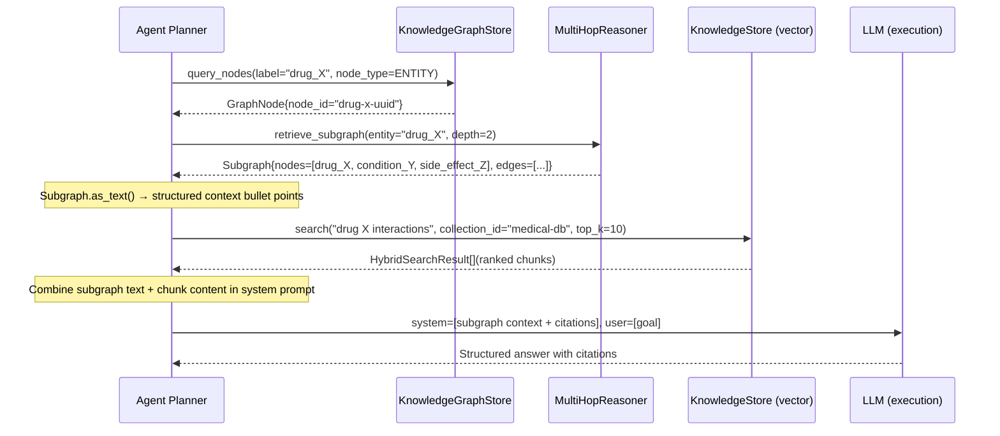

# Knowledge Integration Patterns

The knowledge system does not stand alone — it is woven into every layer of AgentVerse. This document explains how `KnowledgeStore` and `KnowledgeGraphStore` integrate with the RAG pipeline, agent planner, memory system, ingestion hook, governance trail, and federated cross-collection search.

---

## 1. Graph-Guided RAG Pipeline

The most powerful retrieval pattern combines structured graph traversal with dense vector search. The graph narrows the search space; the vector store finds the specific evidence.



**Key insight**: The graph path adds relational structure that pure vector search cannot provide. The LLM receives both: "Drug X → treats → Condition Y → contraindicated_with → Drug Z" (from graph) AND "Clinical trial data shows..." (from vector chunks). This produces more accurate, explainable answers.

---

## Real-World Example 2: Global Law Firm — Three-Collection Knowledge Architecture

**Situation:** A Magic Circle law firm uses AgentVerse for due diligence automation. Their knowledge base requires strict separation across three domains with different access controls.

**Collection design:**
```python
collections = [
    KnowledgeCollection(
        collection_id="case-law-public",
        tenant_id="lawfirm-tenant",
        access_scope="all_agents",          # all agents can read
        embedding_model="voyage-law-2",     # law-optimised model
        chunk_strategy="HEADING",           # judgments split by section
        chunks=1_200_000,
    ),
    KnowledgeCollection(
        collection_id="client-matters",
        tenant_id="lawfirm-tenant",
        access_scope="matter_specific",     # only agents with matter_id claim
        embedding_model="voyage-law-2",
        chunk_strategy="SEMANTIC",
        chunks=340_000,
    ),
    KnowledgeCollection(
        collection_id="precedent-internal",
        tenant_id="lawfirm-tenant",
        access_scope="partner_only",        # highest privilege
        embedding_model="voyage-law-2",
        chunk_strategy="SEMANTIC",
        chunks=95_000,
    ),
]
```

**Integration with the Agent Loop:**
- During EXECUTE, the `MCPRegistry` injects the agent's `matter_id` claim.
- `KnowledgeStore.search()` automatically scopes to collections the agent's claim allows.
- Hybrid search (BM25 + pgvector) runs across all three authorised collections simultaneously.
- RRF merges results. Cross-collection deduplication removes repeated precedents.

**Outcome:** 14-minute due diligence summaries on 200-page merger agreements. Partner review time: 4 hours → 40 minutes.

---

## Real-World Example 3: SaaS Startup — Hot/Warm/Cold Tier Knowledge Routing

**Situation:** A B2B SaaS startup's knowledge base grew from 50K chunks (launch) to 8M chunks (18 months in). Query latency on cold chunks was spiking above their 500ms SLA.

**Tiering strategy implemented:**
```python
# Knowledge tier assignment via DataClassificationService
HOT  = chunks queried in the last 7 days   (HNSW in shared_buffers, ~200K chunks)
WARM = chunks queried in the last 60 days  (HNSW on SSD, ~1.5M chunks)
COLD = rarely queried archive              (sequential scan fallback, ~6.3M chunks)
```

**Routing logic in `KnowledgeStore.search()`:**
1. Query runs against HOT tier first (p99: 18ms).
2. If `top_k` not satisfied, extends to WARM tier (p99: 85ms).
3. COLD tier only if query contains `include_archive=True` flag.

**Impact:**
- 94% of production queries satisfied by HOT tier alone.
- P99 latency: 1.2s → 82ms (14.6× improvement).
- Monthly Postgres IOPS: −67% (cold chunks no longer scanned on every query).

<!-- Sources: app/knowledge/store.py, app/knowledge_graph/store.py -->
