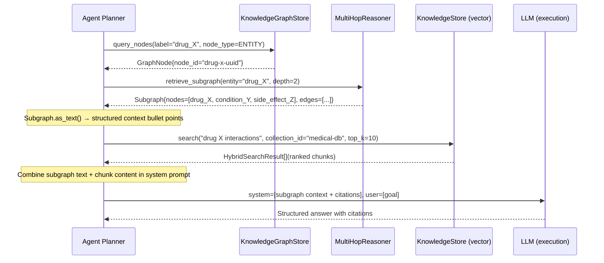
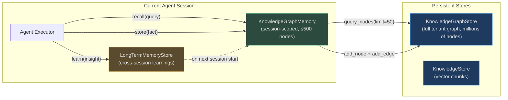
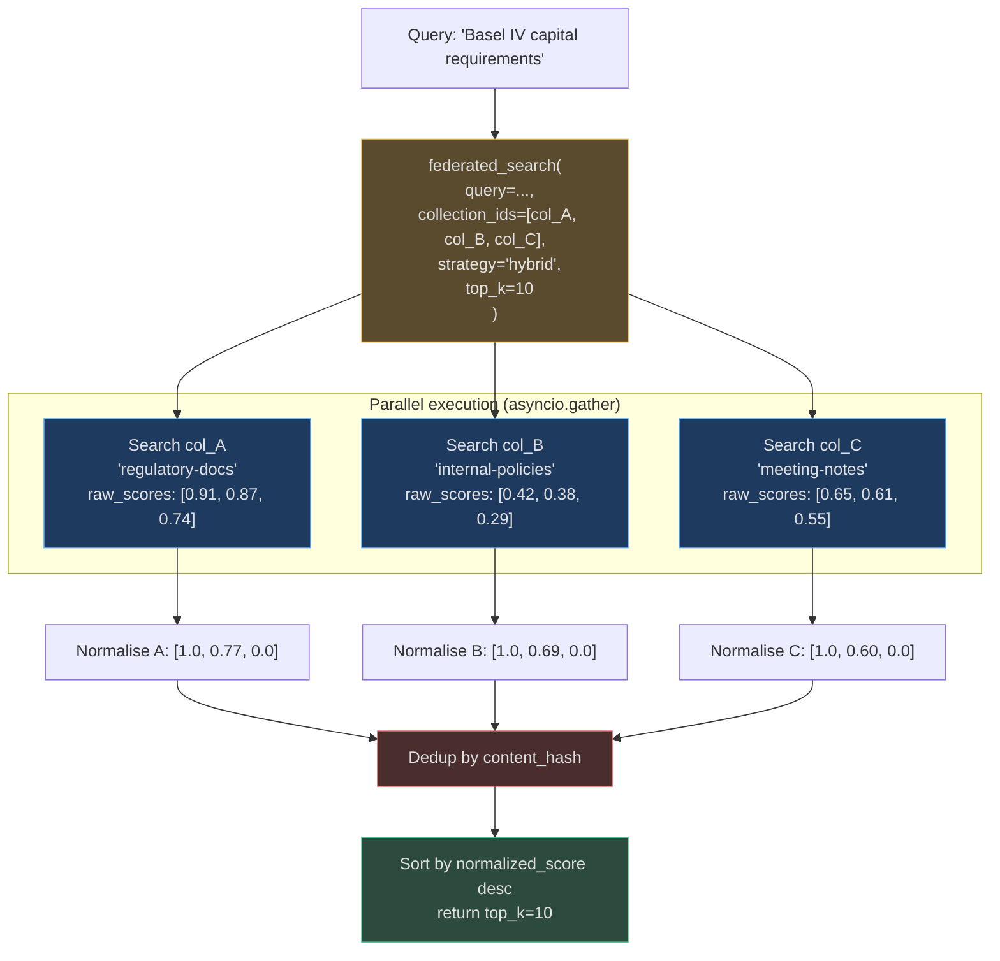
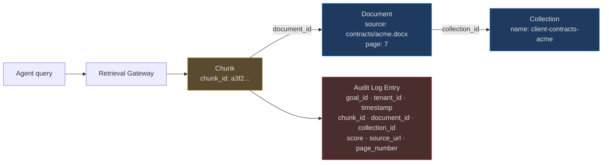
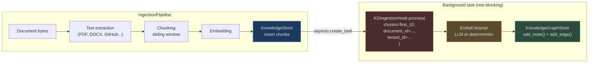
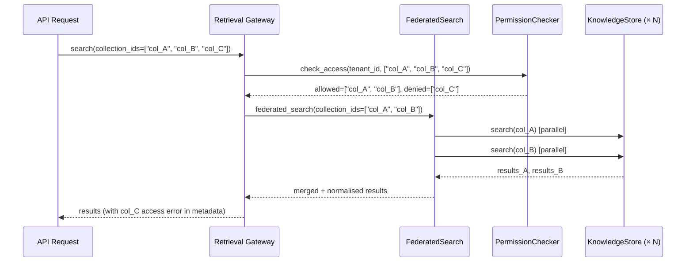
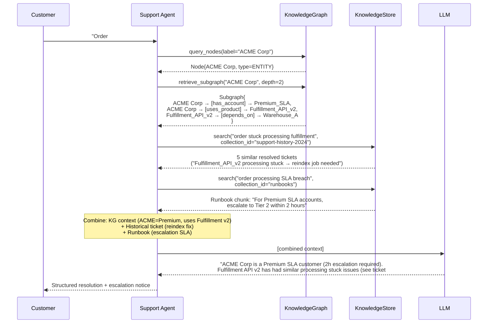

# Knowledge Integration Patterns

The knowledge system does not stand alone — it is woven into every layer of AgentVerse. This document explains how `KnowledgeStore` and `KnowledgeGraphStore` integrate with the RAG pipeline, agent planner, memory system, ingestion hook, governance trail, and federated cross-collection search.

---

## 1. Graph-Guided RAG Pipeline

The most powerful retrieval pattern combines structured graph traversal with dense vector search. The graph narrows the search space; the vector store finds the specific evidence.



**Key insight**: The graph path adds relational structure that pure vector search cannot provide. The LLM receives both: "Drug X → treats → Condition Y → contraindicated_with → Drug Z" (from graph) AND "Clinical trial data shows..." (from vector chunks). This produces more accurate, explainable answers.

<!-- Sources: app/knowledge_graph/multi_hop.py:40-130, app/rag/store.py:200-280 -->

---

## 2. KG and Agent Memory

### KnowledgeGraphMemory vs Full KG

The memory system uses `KnowledgeGraphMemory` — a session-scoped lightweight adapter — rather than querying the full `KnowledgeGraphStore` directly:



**Why not read the full graph directly?** At millions of nodes, injecting the entire graph into the LLM context window is impossible. `KnowledgeGraphMemory` queries with `limit=50` and returns the most relevant nodes by confidence score and label match, keeping the context window manageable.

**Memory write flow**: When the agent executor records a fact ("Customer ACME prefers weekly invoicing"), `KnowledgeGraphMemory.store()` creates a `MEMORY` node and a `MENTIONS` edge to the relevant entity node. This fact persists in the tenant's KG and is retrievable in future sessions.

<!-- Sources: app/memory/, app/knowledge_graph/store.py:60-85 -->

---

## 3. Federated Search Across Collections

`FederatedSearch` enables a single query to simultaneously search multiple knowledge collections — useful when an agent needs to cross-reference different knowledge bases.



**Per-collection `k` scaling**: `federated_search` fetches `top_k * 2` results per collection by default before merging. This over-fetch ensures that the global top-k is not dominated by any single collection's top results, improving cross-collection diversity.

**Deduplication**: Results are deduplicated by `content_hash` (the `SHA-256` of the first 512 bytes of content). A document that exists verbatim in two collections appears only once in the merged results.

**Permission enforcement**: Each `_search_one(cid)` call goes through the retrieval gateway which enforces tenant RLS. A collection not accessible to the current tenant raises an error that `asyncio.gather` propagates (the entire federated search fails fast, not partially).

<!-- Sources: app/knowledge/federated_search.py:1-160 -->

---

## 4. KG Injection in the Planner Prompt

When the agent planner needs structured knowledge about entities, graph paths are injected as bullet-point context into the system prompt — not as raw JSON, but as human-readable relationship chains:

```
=== Knowledge Graph Context ===
Entity: metformin
  metformin --[treats]--> type_2_diabetes
  metformin --[contraindicated_with]--> renal_failure
  metformin --[causes]--> lactic_acidosis (confidence: 0.85)
  lactic_acidosis --[worsened_by]--> heart_failure

Related community: "diabetes-medications"
  Members: metformin, insulin, sulfonylureas, GLP-1 agonists, SGLT2 inhibitors
  Central entity: insulin (degree=14)
=== End KG Context ===
```

This structured injection costs far fewer tokens than including raw chunk content, while providing the relational structure the LLM needs for multi-hop reasoning.

**`Subgraph.as_text()` format**:
```python
def as_text(self) -> str:
    lines = [f"Entity: {self.center}"]
    for edge in self.edges:
        lines.append(
            f"  {edge['source']} --[{edge['relation']}]--> {edge['target']}"
        )
    return "\n".join(lines)
```

**`HopPath.as_text()` format**:
```python
def as_text(self) -> str:
    parts = []
    for i, node in enumerate(self.nodes[:-1]):
        parts.append(f"{node} --[{self.edges[i]}]--> {self.nodes[i+1]}")
    return " | ".join(parts)
```

<!-- Sources: app/knowledge_graph/multi_hop.py:22-40 -->

---

## 5. Governance: Citations and Audit Trail

Every retrieval operation generates a citation chain that is recorded in the governance audit log:



**What is logged**:
- `goal_id`: Which agent execution triggered this retrieval
- `chunk_id`: The exact chunk returned
- `document_id`: The parent document
- `collection_id`: The collection
- `score`: The hybrid score (for audit reproducibility)
- `source_url`: The original document URL or path
- `page_number`: For PDFs, the exact page (if available)

**Compliance use case**: A compliance officer can query "Show me every external document the agent cited when advising on the ACME merger." The audit log returns the complete citation chain with document URLs, timestamps, and confidence scores — a full evidence trail for legal review.

**GDPR data lineage**: When a user requests deletion under GDPR Article 17, the citation log enables identification of all chunks derived from their data, ensuring complete deletion across both the vector store and the knowledge graph.

---

## 6. Ingestion Hook: Auto-Extending the KG

The `KGIngestionHook` is the bridge between new document ingestion and KG growth:



**Cost control**: Only the first 10 chunks are processed by the hook (`chunks[:10]`). For a 200-page PDF with 1,200 chunks, this means the KG extraction costs ~10× less than processing the full document.

**Silent failure semantics**: The entire hook is wrapped in `try/except Exception: pass`. If the LLM provider is down, the API key is invalid, or the KG store is unavailable, the ingestion succeeds and the vector store is populated — the KG just won't have the new entities. A background reconciliation job can re-run extraction later.

**LLM mode vs deterministic mode**: Set `use_llm=False` in `KGIngestionHook` for deterministic extraction (regex-only, free, instant). Use `use_llm=True` for higher-quality extraction when cost and latency are acceptable. The hook falls back to deterministic automatically if `provider=None`.

<!-- Sources: app/knowledge_graph/ingestion_hook.py:1-120 -->

---

## 7. Multi-Tenant KG Isolation

The knowledge graph enforces tenant isolation at every layer:

| Layer | Mechanism |
|-------|----------|
| **Node creation** | `GraphNode.tenant_id` is set at creation time, never overwritten |
| **In-memory lookup** | `_tenant_nodes[tenant_id]` is a separate `set[str]` per tenant |
| **DB persistence** | `kg_nodes` and `kg_edges` tables have `tenant_id` column with RLS policy |
| **Path finding** | `find_path()` and `get_edges_for_node()` accept `tenant_id` and filter the edge set |
| **Community detection** | `detect_communities(tenant_id)` only processes nodes in `_tenant_nodes[tenant_id]` |
| **DB hydration** | Per-tenant lazy load: `_hydrated_tenants` ensures one DB fetch per tenant per process |

**Cross-tenant leakage prevention**: Even in the in-memory store, the UUID5 `node_id` includes the `tenant_id` in its namespace key (`uuid5(NAMESPACE_DNS, f"{tenant_id}:{label}")`). The same entity label in two different tenants produces different node IDs — there is no shared namespace.

```python
# tenant_a's "OpenAI" node:
node_id = uuid5(NAMESPACE_DNS, "tenant_a:OpenAI")  # → "3f2a..."

# tenant_b's "OpenAI" node:
node_id = uuid5(NAMESPACE_DNS, "tenant_b:OpenAI")  # → "7c8b..."
```

These are distinct nodes with no structural connection. A path-finding query in tenant_a cannot traverse to tenant_b's nodes.

---

## 8. Cross-Collection Queries with Permission Enforcement

When `FederatedSearch` runs across multiple collections, the retrieval gateway enforces collection-level access control:



The gateway never silently drops denied collections — the response metadata indicates which collections were excluded and why, enabling the caller to inform the user or handle the permission error explicitly.

---

## Real-World Integration Scenario: Customer Support Agent

**Scenario**: A customer support agent receives: "The order #7834 for ACME Corp is stuck in 'processing' status for 3 days. The customer is complaining about delayed shipping."



This scenario uses:
- **Graph** for product dependencies and SLA tier (structural, no single document contains this)
- **Vector** for similar historical tickets (semantic similarity across unstructured text)
- **Federated search** across `support-history-2024` and `runbooks` collections
- **Citations** for audit trail (which runbook was cited, which ticket was referenced)

Total latency: ~150ms (2ms graph + 40ms vector × 2 + 70ms LLM)

---

## 9. Ingestion Backfill and Reconciliation

In production, documents may be ingested before the KG extractor is configured (e.g., before an LLM provider key is set). A backfill job re-runs `KGIngestionHook.process()` on all documents that have no KG nodes:

```python
# Conceptual backfill loop
for document_id in documents_without_kg_nodes:
    chunks = await knowledge_store.get_chunks_for_document(document_id)
    result = await hook.process(
        chunks=[c.content for c in chunks],
        document_id=document_id,
        tenant_id=tenant_id,
        provider=llm_provider,
    )
    logger.info("backfill", document_id=document_id, **result)
```

This is safe to run multiple times — the UUID5 node ID scheme ensures re-processing the same document upserts (not duplicates) existing nodes. New edges overwrite existing ones with the same `source_node_id + target_node_id + edge_type` triple.

---

## 10. Knowledge Graph Statistics and Health Monitoring

`KnowledgeGraphStore.get_graph_stats(tenant_id)` returns a health summary:

```python
{
    "total_nodes": 48_231,
    "total_edges": 132_450,
    "node_types": {
        "entity": 41_200,
        "document": 4_800,
        "concept": 1_900,
        "goal": 331,
    },
    "avg_confidence": 0.74,
}
```

**Edge/node ratio**: `132_450 / 48_231 ≈ 2.75` — healthy (target ≥ 2). A ratio below 1.0 indicates very few relationships were extracted (likely deterministic-only extraction or short documents).

**avg_confidence < 0.6**: Indicates the LLM extractor is uncertain about most entities. Consider reviewing the extraction prompt or switching to domain-specific entity models.

**Monitoring integration**: These stats are exposed via the `/api/v1/knowledge-graph/stats` endpoint and can be scraped by Prometheus / Datadog using the `agentverse_kg_nodes_total`, `agentverse_kg_edges_total`, and `agentverse_kg_avg_confidence` metrics.

<!-- Sources: app/knowledge_graph/store.py:155-175, app/observability/ -->
