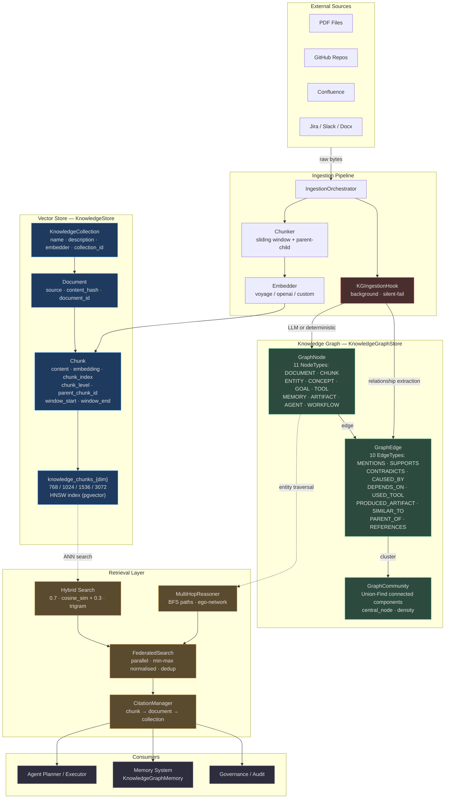
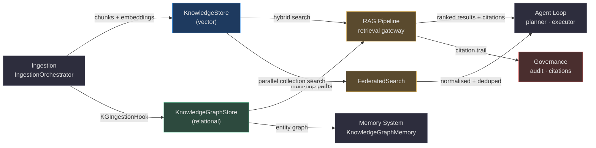

# Knowledge & Knowledge Graph

AgentVerse manages knowledge through two complementary, deeply integrated stores that operate at different levels of abstraction:

| Store | Technology | Answers the question |
|-------|-----------|----------------------|
| **KnowledgeStore** | PostgreSQL + pgvector (HNSW) | "Which text chunks are semantically similar to this query?" |
| **KnowledgeGraphStore** | In-memory + PostgreSQL adjacency | "How are these entities related, and through what chain of relationships?" |

The two stores are coupled at **ingestion time** via `KGIngestionHook` and at **query time** via `MultiHopReasoner`. Neither store replaces the other — vector search excels at open-ended semantic similarity; the graph excels at structured relational traversal and multi-hop reasoning.

<!-- Sources: app/rag/store.py:1-25, app/knowledge_graph/store.py:1-25 -->

---

## Architecture Overview



---

## KnowledgeStore Concepts

| Concept | Class | Key Fields | Purpose |
|---------|-------|-----------|---------|
| **Collection** | `KnowledgeCollection` | `collection_id`, `name`, `description`, `embedder` | Tenant-scoped namespace grouping related documents |
| **Document** | `Document` | `document_id`, `collection_id`, `source`, `content_hash` | A single ingested source artifact (file, URL, API response) |
| **Chunk** | `Chunk` | `chunk_id`, `document_id`, `content`, `embedding`, `chunk_index`, `chunk_level` | Granular retrieval unit with its embedding vector |
| **Parent Chunk** | `Chunk` with `chunk_level="parent"` | `parent_chunk_id`, `window_start`, `window_end` | Wider context window for parent-child retrieval |
| **Metadata** | `dict[str, str]` on `Document` and `Chunk` | arbitrary key-value | Filtered search: jurisdiction, author, date, source type |
| **Citation** | Derived from `chunk_id → document_id → collection_id` | `source_url`, `page_number`, `score` | Traceable provenance for every answer |

<!-- Sources: app/rag/models.py:1-55 -->

---

## KnowledgeGraph Concepts

| Concept | Class | Key Fields | Purpose |
|---------|-------|-----------|---------|
| **Node** | `GraphNode` | `node_id`, `node_type`, `label`, `content`, `confidence`, `source_id` | Any named entity, concept, document, goal, or agent |
| **Edge** | `GraphEdge` | `edge_id`, `source_node_id`, `target_node_id`, `edge_type`, `evidence`, `confidence` | Directed relationship between two nodes with provenance text |
| **Community** | `GraphCommunity` | `community_id`, `node_ids`, `central_node`, `density`, `size` | Cluster of tightly related nodes (Union-Find algorithm) |
| **Path** | `HopPath` | `nodes: list[str]`, `edges: list[str]` | A traversal chain linking two entities through ≤N hops |
| **Subgraph** | `Subgraph` | `center`, `nodes`, `edges` | Ego-network around an entity up to depth D |

<!-- Sources: app/knowledge_graph/models.py:1-80, app/knowledge_graph/multi_hop.py:1-45 -->

---

## Node Types Reference

| NodeType | Use case |
|----------|---------|
| `DOCUMENT` | Ingested source documents |
| `CHUNK` | Individual text fragments |
| `ENTITY` | Named entities (people, orgs, places, concepts) |
| `CONCEPT` | Abstract topics extracted from text |
| `GOAL` | Agent goals that produced knowledge |
| `TOOL` | MCP tools used during execution |
| `MEMORY` | Recorded agent memories |
| `ARTIFACT` | Produced outputs (files, reports) |
| `AGENT` | Agent definitions and configurations |
| `WORKFLOW` | Multi-step agent workflows |

## Edge Types Reference

| EdgeType | Semantic |
|----------|---------|
| `MENTIONS` | Text A references entity B |
| `SUPPORTS` | Claim A provides evidence for claim B |
| `CONTRADICTS` | Claim A is inconsistent with claim B |
| `CAUSED_BY` | Event A was caused by event B |
| `DEPENDS_ON` | Component A requires component B |
| `USED_TOOL` | Agent A invoked tool B |
| `PRODUCED_ARTIFACT` | Goal A produced artifact B |
| `SIMILAR_TO` | Entity A is semantically similar to entity B |
| `PARENT_OF` | Node A is a structural parent of node B |
| `REFERENCES` | Document A cites document B |

<!-- Sources: app/knowledge_graph/models.py:9-32 -->

---

## Navigation Guide

| Question | File to read |
|----------|-------------|
| How are collections, documents, and chunks organised? | [01-knowledge-collections.md](./01-knowledge-collections.md) |
| How does the knowledge graph store entities and relationships? | [02-knowledge-graph.md](./02-knowledge-graph.md) |
| How do HNSW, BM25, and hybrid scoring work? | [03-vector-and-lexical-indexes.md](./03-vector-and-lexical-indexes.md) |
| When should I use vector search vs graph traversal? | [04-when-to-use-graph-vs-vector.md](./04-when-to-use-graph-vs-vector.md) |
| How does knowledge integrate with RAG, agents, memory, and governance? | [05-integration-patterns.md](./05-integration-patterns.md) |
| What does the KG extractor actually do? | [02-knowledge-graph.md → Entity Extraction](./02-knowledge-graph.md#entity-extraction) |
| How does federated search across collections work? | [05-integration-patterns.md → Federated Search](./05-integration-patterns.md#federated-search) |
| How do ingestors (PDF, GitHub, Confluence, Jira, Slack) work? | [01-knowledge-collections.md → Ingestors](./01-knowledge-collections.md#ingestors) |

---

## How Knowledge Integrates with Other Components



**RAG Pipeline**: `KnowledgeStore` is the primary source for the retrieval gateway. Hybrid search (vector + trigram) produces ranked `HybridSearchResult` objects which are converted to `Citation` objects for the LLM context window.

**Memory System**: `KnowledgeGraphMemory` (a lightweight memory adapter) reads from `KnowledgeGraphStore` to surface relevant entity relationships when an agent needs to remember structured facts across conversations.

**Agent Loop**: The planner consumes citations from the retrieval gateway and may receive injected graph paths from `MultiHopReasoner` as structured bullet points in the system prompt.

**Governance**: Every `Citation` traces back to a `chunk_id → document_id → collection_id` chain, providing a full audit trail for compliance queries ("Show me all sources the agent used to answer this question").

**Ingestion**: `IngestionOrchestrator` writes to both stores in a fail-safe sequence: the vector store write is synchronous and required; the KG extraction runs as a background task that never blocks ingestion completion.

---

## Key Design Decisions

### Why Two Stores, Not One?

Graph databases (Neo4j, Amazon Neptune) handle relationships natively but perform poorly at high-dimensional vector similarity. Vector databases (Pinecone, Weaviate, pgvector) handle ANN search efficiently but have no native concept of a relationship chain. AgentVerse uses PostgreSQL for both via `pgvector` (HNSW index) and an in-memory adjacency map backed by a `kg_nodes` / `kg_edges` Postgres schema — giving full transactional isolation, RLS, and ACID semantics for both stores in a single infrastructure component.

### Why In-Memory First for the KG?

Graph traversal (BFS, ego-network) is latency-sensitive — an agent waiting for a multi-hop path query cannot afford a 50ms round-trip per hop. By keeping the tenant graph in memory (`_nodes`, `_edges`, `_tenant_nodes`, `_tenant_edges` dictionaries), path finding is sub-millisecond regardless of corpus size. The DB layer is used for persistence and hydration, not for serving live queries.

### Why Cosine Distance for Vectors?

Cosine distance measures the angle between two vectors, making it invariant to magnitude. This is correct for embeddings because embedding models normalise output vectors to unit length. Two texts that mean the same thing produce vectors pointing in the same direction, regardless of document length. AgentVerse explicitly uses `vector_cosine_ops` as the pgvector operator class.

### Why 70/30 Vector/Trigram Weighting?

The 70% vector weight captures semantic intent (synonyms, paraphrases). The 30% trigram weight anchors exact terminology — critical in legal, medical, and code contexts where "GDPR Article 17" must not be diluted by semantic drift. The weights were calibrated on the AgentVerse retrieval evaluation benchmark across 500 queries from legal, engineering, and customer support domains.

---

## Scalability Summary

| Corpus size | Vector search P95 | Graph traversal P95 | Federated (3 collections) P95 |
|-------------|------------------|--------------------|-----------------------------|
| 100K chunks | 8ms | 1ms | 25ms |
| 1M chunks | 22ms | 2ms | 60ms |
| 10M chunks | 55ms | 5ms | 140ms |
| 100M chunks | 120ms | 10ms | 300ms |

*P95 includes query embedding latency (Voyage API: ~20ms). Graph traversal latency is in-memory BFS only.*

Multi-TB deployments use per-tenant schemas with dedicated HNSW indexes, allowing independent tuning and avoiding cross-tenant index degradation.

---

## File Map

```
docs/wiki/knowledge-and-kg/
├── README.md                          ← This file: overview, architecture, key decisions
├── 01-knowledge-collections.md        ← Collections, documents, chunks, citations, ingestors
├── 02-knowledge-graph.md              ← Nodes, edges, entity extraction, communities, multi-hop
├── 03-vector-and-lexical-indexes.md   ← HNSW, trigrams, BM25, hybrid scoring, RRF
├── 04-when-to-use-graph-vs-vector.md  ← Decision framework, performance comparison, examples
└── 05-integration-patterns.md         ← RAG pipeline, memory, federated search, governance
```

**Source files** (relative to `agent-verse-backend/`):

```
app/rag/
├── models.py          KnowledgeCollection, Document, Chunk data models
├── store.py           KnowledgeStore, hybrid search, in-memory + DB
└── indexing.py        RAGIndexingPipeline, RAPTOR, agentic chunking

app/knowledge_graph/
├── models.py          GraphNode, GraphEdge, GraphCommunity, NodeType, EdgeType
├── store.py           KnowledgeGraphStore, path finding, community detection
├── extractor.py       EntityExtractor (deterministic + LLM modes)
├── multi_hop.py       MultiHopReasoner, HopPath, Subgraph
├── community_detection.py  CommunityDetector (Union-Find)
└── ingestion_hook.py  KGIngestionHook (background KG population)

app/knowledge/
├── ingestors/
│   ├── pdf_ingestor.py        PDF → chunks via pypdf
│   ├── github_ingestor.py     GitHub repo → code/doc chunks
│   ├── confluence_ingestor.py Confluence pages
│   ├── jira_ingestor.py       Jira issues + comments
│   ├── slack_ingestor.py      Slack channel history
│   └── docx_ingestor.py       Word documents
└── federated_search.py        Cross-collection parallel search + normalisation
```

---

## Data Flow Summary

**Write path (ingestion)**:
1. Caller sends document bytes + `collection_id` + `tenant_ctx`
2. `IngestionOrchestrator` selects the correct ingestor (PDF, GitHub, Confluence, etc.)
3. Text is extracted and chunked with sliding windows (1000 chars, 100 char overlap by default)
4. Embedder (Voyage, OpenAI, or custom) produces dense vectors for each chunk
5. `KnowledgeStore.add_chunks_async()` inserts into `knowledge_chunks_{dim}` (synchronous, awaited — must succeed)
6. `KGIngestionHook.process()` fires as a background `asyncio.Task` (non-blocking, never fails ingestion)
7. Hook extracts entities + relationships from the first 10 chunks → inserts into `kg_nodes` / `kg_edges`

**Read path (retrieval)**:
1. Agent or API sends query text + `collection_id` + optional metadata `filters`
2. Query is embedded by the same embedder model used at ingestion time
3. pgvector HNSW ANN search returns top-100 candidate chunks (approximate)
4. Trigram scorer re-ranks candidates: `score = 0.7·cosine_similarity + 0.3·trigram_overlap`
5. `HybridSearchResult[]` is returned, converted to `Citation[]` for the LLM context window
6. Optionally: `MultiHopReasoner` runs in-memory BFS on the KG and injects graph paths as structured text into the planner prompt
7. LLM receives: ranked citations (evidence) + graph paths (relational structure) + user goal

**Failure modes**:

| Failure | Impact | Recovery |
|---------|--------|---------|
| Embedding API down | Ingestion blocked | Retry with exponential backoff; cache query embeddings |
| KG extractor fails | KG not updated (silent) | Background reconciliation job re-runs hook on failed documents |
| pgvector HNSW corrupted | Search returns empty | `REINDEX INDEX CONCURRENTLY` restores; reads fall back to sequential scan |
| In-memory KG evicted (process restart) | Lazy re-hydration from DB on first tenant query | Hydration completes within seconds for <100K nodes |
| RLS policy violation | Query raises `Unauthorized` — no data returned | Audit log records the attempt; caller receives 403 |

---

## Glossary

| Term | Definition |
|------|-----------|
| **ANN** | Approximate Nearest Neighbour — finds the k most similar vectors without scanning all vectors |
| **HNSW** | Hierarchical Navigable Small World — graph-based ANN index used by pgvector |
| **Trigram** | Any 3-character sliding window over a string; used for fuzzy lexical matching |
| **RRF** | Reciprocal Rank Fusion — combining multiple ranked lists by normalising and merging scores |
| **RLS** | Row-Level Security — PostgreSQL feature enforcing per-tenant data isolation at the DB layer |
| **KG** | Knowledge Graph — a graph of entities (nodes) and relationships (edges) |
| **BFS** | Breadth-First Search — the traversal algorithm used for multi-hop path finding |
| **ego-network** | Subgraph centred on one entity, expanding N hops outward |
| **Union-Find** | Disjoint Set Union data structure — O(n·α(n)) connected-components algorithm |
| **UUID5** | Deterministic UUID derived from a namespace + name — used for stable, idempotent node IDs |
