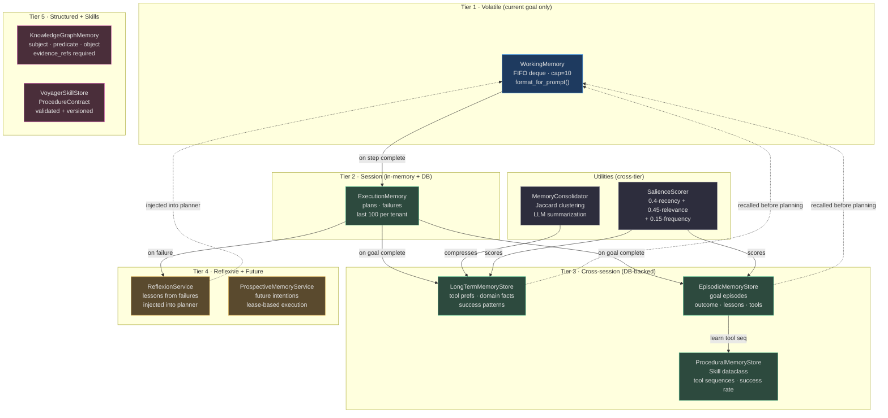
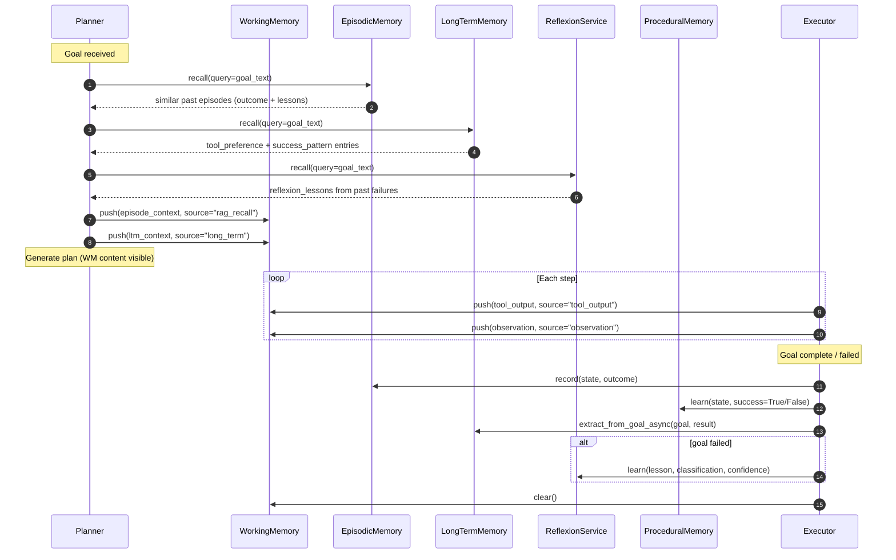
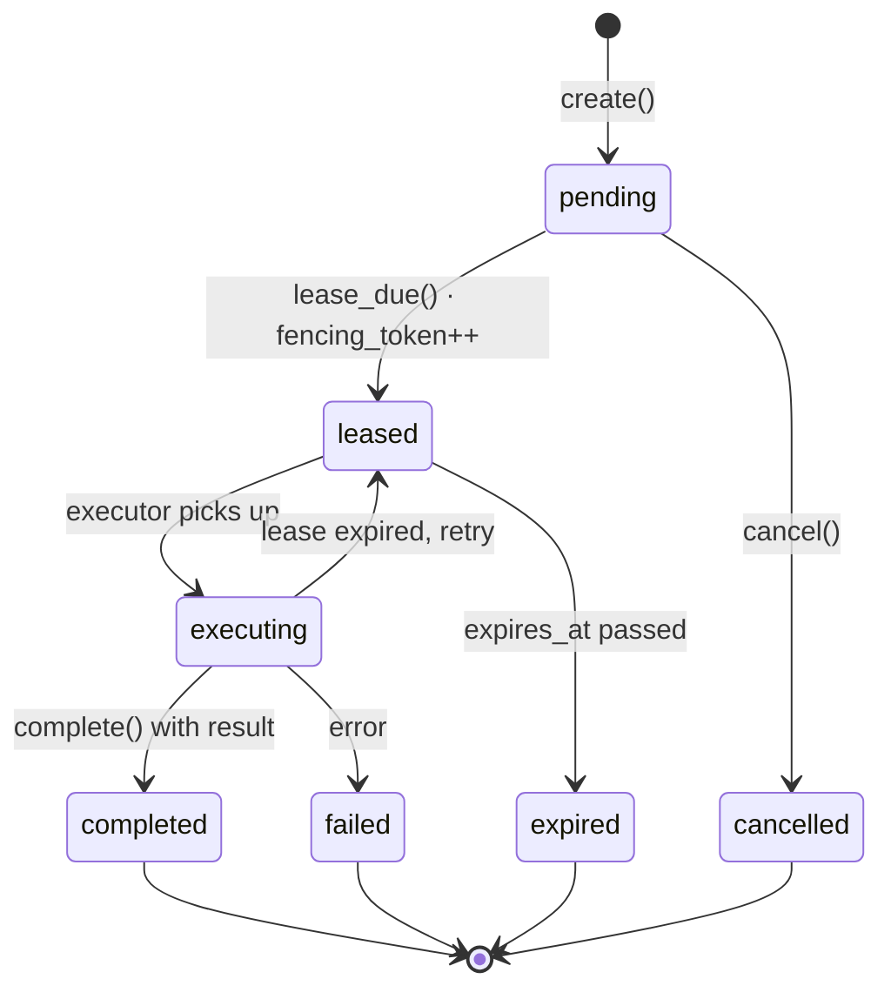
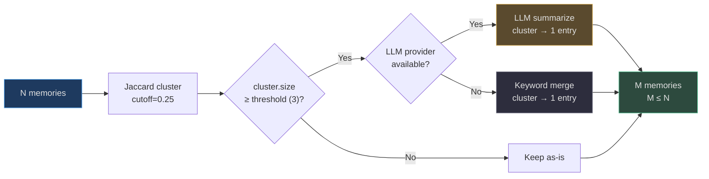

# Memory System

AgentVerse implements **11 distinct memory types** organized across five cognitive tiers. Each tier serves a different temporal and semantic scope — from the volatile working memory of a single tool call to immutable knowledge-graph facts that survive across tenant sessions.

Understanding *which* memory layer to read from (or write to) at each agent lifecycle event is the single most important factor for building predictable, learning agents.

## Quick Reference

| Memory Type | Class | Tier | Scope | Persistent? | Source |
|---|---|---|---|---|---|
| **Working** | `WorkingMemory` | Volatile | goal run | No (in-process) | [working_memory.py](https://github.com/harsh786/agent-verse/blob/main/agent-verse-backend/app/memory/working_memory.py) |
| **Execution** | `ExecutionMemory` | Session | tenant | Yes (DB) | [execution.py](https://github.com/harsh786/agent-verse/blob/main/agent-verse-backend/app/memory/execution.py) |
| **Long-Term** | `LongTermMemoryStore` | Cross-session | tenant | Yes (DB) | [long_term.py](https://github.com/harsh786/agent-verse/blob/main/agent-verse-backend/app/memory/long_term.py) |
| **Reflexion** | `ReflexionService` | Cross-session | tenant + goal | Yes (DB) | [reflexion.py](https://github.com/harsh786/agent-verse/blob/main/agent-verse-backend/app/memory/reflexion.py) |
| **Episodic** | `EpisodicMemoryStore` | Cross-session | tenant | Yes (DB) | [episodic.py](https://github.com/harsh786/agent-verse/blob/main/agent-verse-backend/app/memory/episodic.py) |
| **Procedural** | `ProceduralMemoryStore` | Cross-session | tenant | Yes (DB) | [procedural.py](https://github.com/harsh786/agent-verse/blob/main/agent-verse-backend/app/memory/procedural.py) |
| **Prospective** | `ProspectiveMemoryService` | Future-oriented | tenant | Yes (DB) | [prospective.py](https://github.com/harsh786/agent-verse/blob/main/agent-verse-backend/app/memory/prospective.py) |
| **Salience** | `SalienceScorer` | Utility | — | No | [salience.py](https://github.com/harsh786/agent-verse/blob/main/agent-verse-backend/app/memory/salience.py) |
| **Consolidation** | `MemoryConsolidator` | Utility | — | No | [consolidation.py](https://github.com/harsh786/agent-verse/blob/main/agent-verse-backend/app/memory/consolidation.py) |
| **KG Memory** | `KnowledgeGraphMemory` | Structured | tenant | Yes (in-memory+lock) | [knowledge_graph_memory.py](https://github.com/harsh786/agent-verse/blob/main/agent-verse-backend/app/memory/knowledge_graph_memory.py) |
| **Voyager Skills** | `VoyagerSkillStore` | Skill library | tenant | Yes (in-memory) | [voyager_skills.py](https://github.com/harsh786/agent-verse/blob/main/agent-verse-backend/app/memory/voyager_skills.py) |

---

## Architecture — Memory Tiers



<!-- Sources: app/memory/working_memory.py:22-33, app/memory/execution.py:16-25, app/memory/long_term.py:29-45, app/memory/episodic.py:12-40, app/memory/procedural.py:18-55, app/memory/reflexion.py:8-25, app/memory/prospective.py:10-55, app/memory/salience.py:47-90, app/memory/consolidation.py:38-85 -->

---

## Memory Scoping

Every memory type is namespaced to prevent cross-tenant data leakage. The table below shows which scope key each type uses.

| Memory Type | `tenant_id` | `agent_id` | `goal_id` | `collection_id` | Notes |
|---|:---:|:---:|:---:|:---:|---|
| WorkingMemory | — | — | implicit | — | Lives inside the `AgentState` object for one run |
| ExecutionMemory | ✓ | — | — | — | `_plans[tenant_id]`, `_failures[tenant_id]` |
| LongTermMemoryStore | ✓ | via tags | — | — | `memory_type` field distinguishes sub-categories |
| ReflexionService | ✓ | — | ✓ | — | `source_goal_id` and `source_execution_id` on every record |
| EpisodicMemoryStore | ✓ | — | ✓ | — | `Episode.goal_id` links episode to originating goal |
| ProceduralMemoryStore | ✓ | — | — | — | Skills are per-tenant; `domain` field further groups them |
| ProspectiveMemoryService | ✓ | — | ✓ | — | `source_goal_id`, fenced by `fencing_token` |
| KnowledgeGraphMemory | ✓ | — | — | — | `(tenant_id, subject, predicate, object)` uniqueness key |
| VoyagerSkillStore | ✓ | — | — | — | `(tenant_id, procedure_id, skill_version)` key |

---

## Memory Lifecycle

The sequence below shows the canonical read-before-plan / write-after-complete lifecycle for a single goal execution.



<!-- Sources: app/memory/episodic.py:48-90, app/memory/long_term.py:88-110, app/memory/reflexion.py:16-60, app/memory/working_memory.py:45-96 -->

---

## Memory Types — Deep Dive

### 1. WorkingMemory

**What**: A bounded FIFO deque holding the most recently observed facts and tool outputs during a single goal execution. Backed by `collections.deque(maxlen=capacity)`.

**Why**: The LLM context window is finite. Injecting only the *most recent and relevant* observations prevents context overflow while preserving decision-relevant state.

**How**: [`app/memory/working_memory.py:22`](https://github.com/harsh786/agent-verse/blob/main/agent-verse-backend/app/memory/working_memory.py#L22)

```python
# Source: app/memory/working_memory.py:33
wm = WorkingMemory(capacity=10)   # default capacity
wm.push("API returned 404", source="tool_output")
wm.push("User asked about billing", source="observation")
prompt_block = wm.format_for_prompt(max_chars=400)  # injected into executor prompt
```

**When to use**:
- Push: after every tool call, observation, or RAG chunk retrieval during execution
- Read: in `format_for_prompt()` immediately before constructing the next executor message
- Clear: at goal start and goal end to prevent state bleed between runs

**Key behaviour**: When `capacity` (default 10) is exceeded, the oldest item is silently evicted. `format_for_prompt()` limits total characters to `max_chars=400` by walking newest-first and stopping early.

---

### 2. ExecutionMemory

**What**: Per-tenant store of past goal executions — both successful plans and failed approaches. In-memory with async PostgreSQL persistence via `record_async()`.

**Why**: Winning plans are fed back into the planner prompt to bias toward proven approaches. Failed approaches are included as negative examples to avoid repeating mistakes.

**How**: [`app/memory/execution.py:16`](https://github.com/harsh786/agent-verse/blob/main/agent-verse-backend/app/memory/execution.py#L16)

```python
# Source: app/memory/execution.py:96-115
await memory.record_async(
    goal=state.goal,
    plan=steps,
    success=True,
    tenant_id=ctx.tenant_id,
    db=db,
)
# In-memory capped at 100 entries per tenant; DB is source of truth
```

**When to use**:
- Record: on every goal completion (success *and* failure) via `record_async()`
- Recall: in the planner prompt builder to retrieve similar past plans
- Record failure: whenever a step raises an unrecoverable error via `record_failure()`

**Key behaviour**: In-memory capped at last 100 entries per tenant. Successful plans are added to both `_memories` and `_plans` so both `recall()` (sync) and the async DB path stay in sync within the same session.

---

### 3. LongTermMemoryStore

**What**: Cross-session learnings extracted from completed goals — tool preferences, domain facts, success patterns, and failure patterns. In-memory + DB-backed.

**Why**: Agents should accumulate knowledge across sessions. A domain fact learned in session 1 (e.g., "Jira project KEY is INFRA") should be available in session 100 without re-learning.

**How**: [`app/memory/long_term.py:29`](https://github.com/harsh786/agent-verse/blob/main/agent-verse-backend/app/memory/long_term.py#L29)

Four `memory_type` values:

| Type | Content | Example |
|---|---|---|
| `tool_preference` | Which tool works best for a task category | "Use `jira_search` not `web_search` for issue lookups" |
| `domain_fact` | Stable facts about the tenant's environment | "Production DB is on RDS us-east-1" |
| `success_pattern` | Goal → result summaries from successful runs | Auto-extracted by `extract_from_goal()` |
| `failure_pattern` | What went wrong and why | "PATCH on /api/v1/users fails for read-only keys" |

**When to use**: Call `extract_from_goal_async()` on every successful goal completion. Recall in the planner context builder.

---

### 4. ReflexionService

**What**: Stores and retrieves *lessons learned* from failed or partial goal executions, using a repository pattern with idempotency keys.

**Why**: The Reflexion framework (Shinn et al., 2023) shows that injecting prior failure lessons into the planner prompt dramatically improves success rate on repeated similar goals.

**How**: [`app/memory/reflexion.py:8`](https://github.com/harsh786/agent-verse/blob/main/agent-verse-backend/app/memory/reflexion.py#L8)

```python
# Source: app/memory/reflexion.py:14-40
await reflexion.learn(
    tenant_id=ctx.tenant_id,
    goal_id=state.goal_id,
    execution_id=exec_id,
    safe_lesson="Avoid calling delete_file without first checking file_exists",
    evidence_refs=("step-3-error-log",),
    classification=Classification.INTERNAL,
    confidence=80,
    idempotency_key=f"lesson-{exec_id}",
)
# Recalled before planning — injected as "reflexion_lessons" context block
```

**When to use**: On any goal that terminates with `FAILED` or `MAX_ITERATIONS_EXCEEDED` status. `record_effectiveness()` is called after the next run to score whether the lesson actually helped.

---

### 5. EpisodicMemoryStore

**What**: DB-backed time-stamped episodes of past goal executions. Each `Episode` captures the full what/how/outcome tuple of a completed goal.

**Why**: Enables temporal reasoning — "I've attempted this type of goal 3 times; twice it succeeded by querying Jira first; once it failed when I called the API without auth." Episodic recall helps the planner choose a proven approach.

**How**: [`app/memory/episodic.py:12`](https://github.com/harsh786/agent-verse/blob/main/agent-verse-backend/app/memory/episodic.py#L12)

`Episode` fields:

| Field | Type | Description |
|---|---|---|
| `episode_id` | str | UUID |
| `goal_text` | str | First 200 chars of goal |
| `action_summary` | str | First 5 step descriptions joined by `→` |
| `outcome` | str | `"success"` \| `"failed"` \| `"partial"` |
| `lessons` | str | `verification_feedback` from `AgentState` |
| `quality_score` | float | Caller-supplied quality rating [0,1] |
| `tools_used` | list[str] | Up to 10 unique tool names |

**When to use**: Always call `record()` on goal completion. Query with a keyword-based goal hint before generating a new plan.

---

### 6. ProceduralMemoryStore

**What**: Learned tool-use patterns (skills) extracted from successful goal executions. A `Skill` encodes a generalized goal pattern, a domain, and an ordered tool sequence.

**Why**: If "resolve JIRA-123" always uses `jira_get_issue → jira_update_status → slack_notify`, the agent should suggest that sequence for similar goals rather than replanning from scratch.

**How**: [`app/memory/procedural.py:18`](https://github.com/harsh786/agent-verse/blob/main/agent-verse-backend/app/memory/procedural.py#L18)

Goal normalization strips specific identifiers before storing:

```python
# Source: app/memory/procedural.py:40-46
# "Fix JIRA-456 for user John" → "Fix TICKET for user VALUE"
pattern = re.sub(r'\b[A-Z][A-Z0-9]+-\d+\b', 'TICKET', goal)
pattern = re.sub(r'\b\d+\b', 'N', pattern)
pattern = re.sub(r'"[^"]{1,50}"', 'VALUE', pattern)
```

`Skill.to_hint()` formats as: `[Skill: pattern] Tool sequence: A → B → C (success rate: 95%, used 12x)`.

**When to use**: `learn()` after every successful goal. Query before planning to get tool sequence hints.

---

### 7. ProspectiveMemoryService

**What**: Future-oriented intentions — actions the agent should execute at a future time or when a condition is met. Uses a lease-based execution model with fencing tokens to prevent double-execution.

**Why**: Agents often need to schedule follow-up actions: "check deployment status in 10 minutes", "remind the user about the meeting tomorrow". Prospective memory provides a reliable, at-most-once execution guarantee.

**How**: [`app/memory/prospective.py:10`](https://github.com/harsh786/agent-verse/blob/main/agent-verse-backend/app/memory/prospective.py#L10)



<!-- Sources: app/memory/prospective.py:13-28, app/memory/prospective.py:45-90 -->

**Idempotency**: `create()` uses `(tenant_id, idempotency_key)` as a deduplication key — submitting the same intention twice returns the first record. `complete()` validates the `fencing_token` to prevent stale lease execution.

**When to use**: When the executor encounters a step that schedules future work. The scheduler polls `lease_due()` and calls `complete()` after running.

---

### 8. SalienceScorer

**What**: A pure scoring function that computes a relevance-weighted importance score in [0, 1] for any memory entry given a query, access count, and last-accessed timestamp.

**Why**: Not all memories are equally useful for a given query. Surface recently accessed, frequently used, and semantically relevant memories first to keep recall focused.

**How**: [`app/memory/salience.py:47`](https://github.com/harsh786/agent-verse/blob/main/agent-verse-backend/app/memory/salience.py#L47)

#### Salience Formula

$$\text{score} = 0.4 \times R_{\text{recency}} + 0.45 \times R_{\text{relevance}} + 0.15 \times R_{\text{frequency}}$$

**Recency** — exponential decay with a 7-day half-life (168 hours):

$$R_{\text{recency}} = 0.5^{\,\frac{\text{hours\_ago}}{168}}$$

| Age | Recency Score |
|---|---|
| Just accessed | ≈ 1.0 |
| 1 day ago | ≈ 0.91 |
| 7 days ago | 0.50 |
| 14 days ago | 0.25 |
| 28 days ago | ≈ 0.06 |

**Relevance** — TF-IDF-like term overlap (stop words removed, 3+ char tokens only):

$$R_{\text{relevance}} = \frac{\sum_{t \in Q} \text{tf}(t, C)}{\sqrt{|Q| \cdot |C|}}$$

**Frequency** — logarithmic access count boost:

$$R_{\text{frequency}} = \min\!\left(1.0,\ \frac{\log_{10}(\max(1, \text{count}))}{2}\right)$$

| Access Count | Frequency Score |
|---|---|
| 1 | 0.0 |
| 3 | ≈ 0.24 |
| 10 | 0.5 |
| 100 | 1.0 |

**`apply_decay()`** reduces any current score by the same exponential factor — useful for batch aging without a full re-score.

**When to use**: Score entries before returning from `recall()` methods. Sort descending, return top-k.

---

### 9. MemoryConsolidator

**What**: Compresses a large episodic memory set by clustering entries with high keyword-Jaccard overlap, then either merging or LLM-summarizing each cluster above the size threshold (default: 3).

**Why**: Unbounded episodic memory sets hurt recall latency and pollute planning context with redundant information. Consolidation keeps memory manageable while preserving signal.

**How**: [`app/memory/consolidation.py:38`](https://github.com/harsh786/agent-verse/blob/main/agent-verse-backend/app/memory/consolidation.py#L38)



<!-- Sources: app/memory/consolidation.py:60-100, app/memory/consolidation.py:20-35 -->

Jaccard similarity:

$$J(A, B) = \frac{|A \cap B|}{|A \cup B|}$$

where A and B are keyword sets (4+ character words, stop words removed).

`consolidate_sync()` uses text merging only. `consolidate()` uses LLM summaries when a provider is available, falling back to text merging on LLM failure.

**When to use**: Run as a scheduled background job when `EpisodicMemoryStore` size exceeds a tenant threshold. Returns `ConsolidationResult.clusters_merged` to audit compression ratio.

---

### 10. KnowledgeGraphMemory

**What**: An append-only, evidence-linked store of `(subject, predicate, object)` facts with tenant isolation. Merges duplicate facts by combining evidence references and taking the higher confidence.

**Why**: Structured factual knowledge (e.g., `"Service-A DEPENDS_ON Service-B"`) benefits from a graph representation for explainability and provenance tracking. Every fact must carry at least one `evidence_ref` — no evidence means no fact.

**How**: [`app/memory/knowledge_graph_memory.py:1`](https://github.com/harsh786/agent-verse/blob/main/agent-verse-backend/app/memory/knowledge_graph_memory.py#L1)

```python
# Source: app/memory/knowledge_graph_memory.py:36-48
fact = KnowledgeFact(
    fact_id="f-001",
    tenant_id="t1",
    subject="auth-service",
    predicate="depends_on",
    object="user-db",
    evidence_refs=("goal-abc:step-2",),
    classification="internal",
    confidence=90,
)
merged = await kg_memory.merge(fact)  # raises ValueError if evidence_refs is empty
```

**Merge semantics**: Duplicate `(tenant_id, subject, predicate, object)` keys merge evidence refs and take `max(confidence)`. `version` is incremented on every merge.

**When to use**: When an executor step produces a structural fact about the tenant's system (dependencies, configurations, ownership). Query by `subject` to retrieve all known predicates and objects.

---

### 11. VoyagerSkillStore

**What**: An immutable, versioned registry of validated `ProcedureContract` skills. Once published, a `(tenant_id, procedure_id, skill_version)` triple cannot be mutated.

**Why**: Inspired by Voyager (Wang et al., 2023), a validated executable skill (e.g., "deploy to Kubernetes") should be reusable across goals without re-validation.

**How**: [`app/memory/voyager_skills.py:1`](https://github.com/harsh786/agent-verse/blob/main/agent-verse-backend/app/memory/voyager_skills.py#L1)

`publish()` calls `validate_procedure()` (from `procedural_validator.py`) before registering the skill. Validation checks:
- All required tools in `available_tools`
- All capabilities in `allowed_capabilities`
- All connectors in `ready_connectors`
- Policy fingerprint matches current policy

Publishing an existing `(tenant_id, procedure_id, skill_version)` with different content raises `ValueError("skill version is immutable")`. Republishing the identical skill is a no-op.

**When to use**: When an executor verifies a multi-step procedure for the first time. Retrieve by description similarity and execute directly instead of replanning.

---

## When to Use Each Memory Type

| Scenario | Primary Memory Type | Secondary |
|---|---|---|
| Track tool output during current step | WorkingMemory | — |
| Avoid repeating a failed plan | ExecutionMemory + ReflexionService | LongTermMemory |
| Suggest proven tool sequence for new goal | ProceduralMemory | EpisodicMemory |
| Recall what happened in a similar past goal | EpisodicMemory | LongTermMemory |
| Surface a domain fact from a past session | LongTermMemoryStore | KGMemory |
| Prevent an LLM from repeating a mistake | ReflexionService | — |
| Schedule a follow-up action | ProspectiveMemoryService | — |
| Prioritize which memories to surface | SalienceScorer | — |
| Memory set has grown too large | MemoryConsolidator | — |
| Store a structural fact with provenance | KnowledgeGraphMemory | — |
| Reuse a validated multi-step procedure | VoyagerSkillStore | ProceduralMemory |

---

## Related Pages

| Page | Description |
|---|---|
| [Knowledge & KG](./knowledge-and-kg.md) | How knowledge chunks and KG nodes relate to memory |
| [Agent Patterns](./agent-patterns.md) | How the agent loop reads from and writes to memory |
| [RAG System](./rag-system.md) | Retrieval system that feeds context into WorkingMemory |
