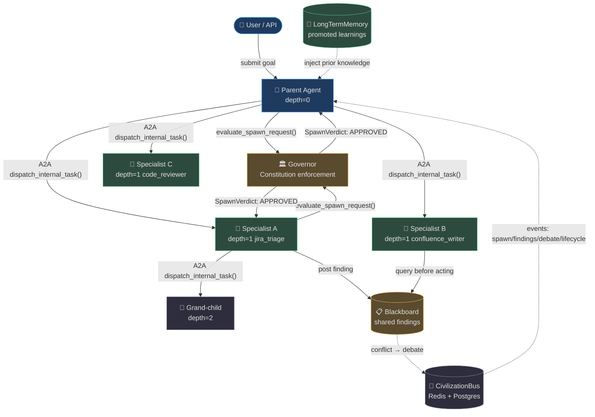
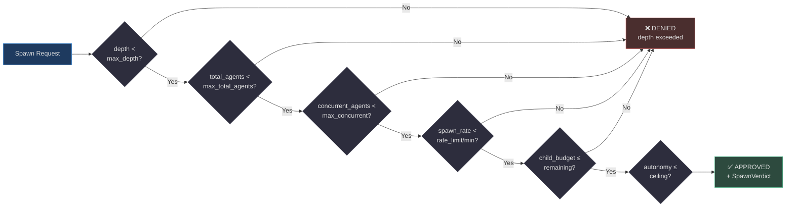
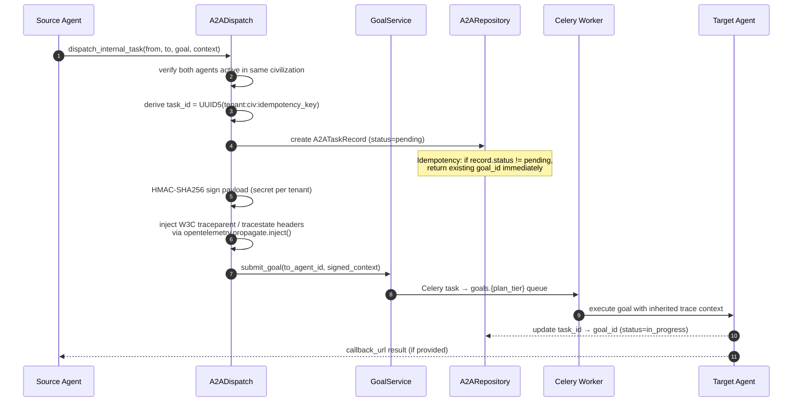
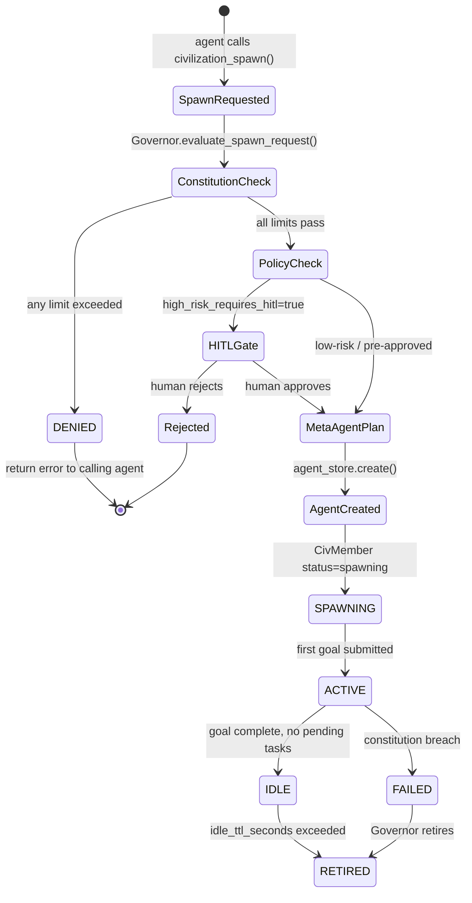
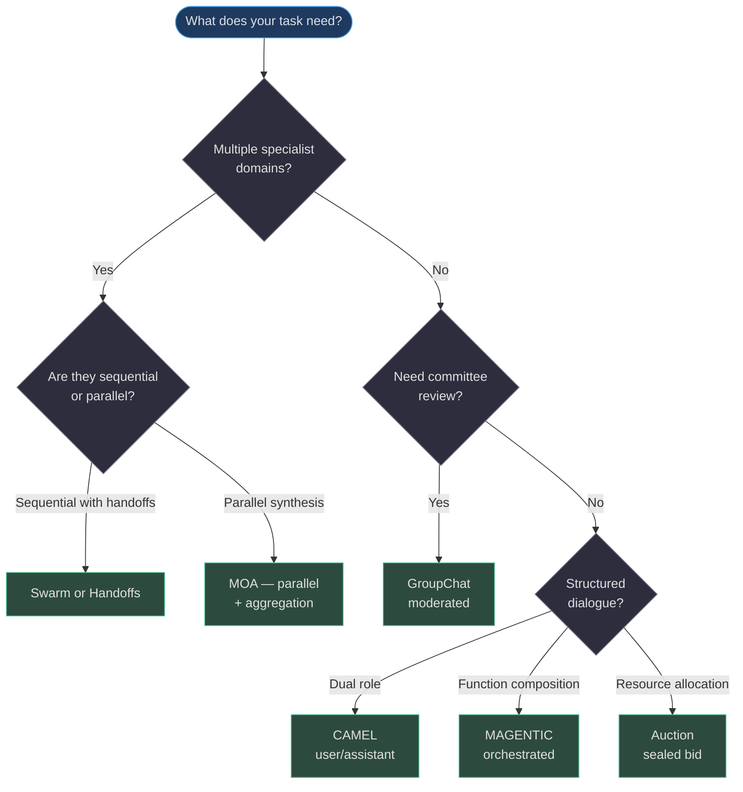
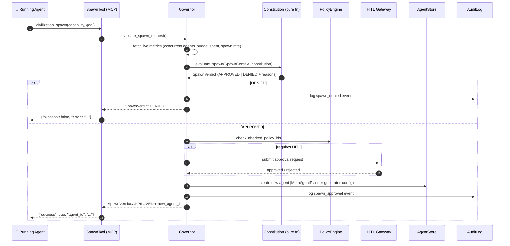

# Multi-Agent Civilization & Coordination

AgentVerse's **civilization layer** is the operating system for teams of agents. Rather than hard-wiring multi-agent pipelines, it provides a governed substrate in which agents dynamically spawn sub-agents, share findings via a blackboard, coordinate using pluggable patterns (CAMEL, Swarm, GroupChat, MAGENTIC, MOA, Auction), and propagate W3C distributed traces across every hop.

## Architecture at a Glance

| Component | File | Responsibility |
|---|---|---|
| `Governor` | [governor.py](https://github.com/harsh786/agent-verse/blob/main/agent-verse-backend/app/civilization/governor.py) | Central authority — only entity that creates/retires agents |
| `Constitution` | [constitution.py](https://github.com/harsh786/agent-verse/blob/main/agent-verse-backend/app/civilization/constitution.py) | Immutable policy: depth, budget, rate, autonomy ceiling |
| `Society` | [society.py](https://github.com/harsh786/agent-verse/blob/main/agent-verse-backend/app/civilization/society.py) | Membership, reputation (EWMA), goal routing |
| `Blackboard` | [blackboard.py](https://github.com/harsh786/agent-verse/blob/main/agent-verse-backend/app/civilization/blackboard.py) | Shared findings store; conflict triggers debate |
| `CivilizationBus` | [bus.py](https://github.com/harsh786/agent-verse/blob/main/agent-verse-backend/app/civilization/bus.py) | Redis pub/sub + Postgres persistence for all events |
| `LearningPipeline` | [learning.py](https://github.com/harsh786/agent-verse/blob/main/agent-verse-backend/app/civilization/learning.py) | Curated collective learning — EvalRunner-gated anti-poisoning |
| `A2ADispatch` | [a2a_dispatch.py](https://github.com/harsh786/agent-verse/blob/main/agent-verse-backend/app/civilization/a2a_dispatch.py) | Secure inter-agent task dispatch via GoalService |
| `A2ASecurity` | [a2a_security.py](https://github.com/harsh786/agent-verse/blob/main/agent-verse-backend/app/civilization/a2a_security.py) | HMAC-SHA256-v1 request/callback signing with nonce replay protection |
| `SpawnTool` | [spawn_tool.py](https://github.com/harsh786/agent-verse/blob/main/agent-verse-backend/app/civilization/spawn_tool.py) | MCP tool exposed to agents: `civilization_spawn` |
| `CivMetrics` | [metrics.py](https://github.com/harsh786/agent-verse/blob/main/agent-verse-backend/app/civilization/metrics.py) | Prometheus gauges/counters for civilization-level operations |

## Multi-Agent Topology

The civilization forms a DAG of agent nodes. The Governor sits outside the DAG — it governs topology changes but does not participate in task execution.



<!-- Sources:
  agent-verse-backend/app/civilization/governor.py:1-70
  agent-verse-backend/app/civilization/a2a_dispatch.py:24-85
  agent-verse-backend/app/civilization/blackboard.py:36-80
  agent-verse-backend/app/civilization/bus.py:1-70
  agent-verse-backend/app/civilization/society.py:1-70
-->

## The Constitution: Immutable Behavioral Policy

The [`Constitution`](https://github.com/harsh786/agent-verse/blob/main/agent-verse-backend/app/civilization/models.py#L47-L75) is a frozen dataclass that encodes the hard limits of a civilization. It is created once at startup and never mutated — the Governor reads from it on every decision.

```python
# Source: agent-verse-backend/app/civilization/models.py:47-75
@dataclass
class Constitution:
    max_depth: int = 4                        # Max agent spawn depth
    max_total_agents: int = 50                # Total alive agents
    max_concurrent_agents: int = 10           # Simultaneously active agents
    total_budget_usd: float = 100.0           # Civilization-wide budget cap
    per_agent_budget_usd: float = 10.0        # Default per-agent budget
    budget_decay: float = 0.6                 # child_budget = parent * (0.6 ^ depth)
    spawn_rate_limit_per_min: int = 20        # Spawn rate throttle
    high_risk_requires_hitl: bool = True      # HITL gate for risky operations
    autonomy_ceiling: str = "bounded-autonomous"
    reputation_floor: float = 0.2            # Retire agents below this score
```

**Why `budget_decay`?** A child at depth 2 receives `parent_budget * 0.6^2 = 36%` of the parent's budget. This exponential decay prevents runaway cost explosions — a depth-4 sub-agent can only consume `0.6^4 ≈ 13%` of the root budget, regardless of what the root agent was allocated. The calculation lives in [`Constitution.compute_child_budget()`](https://github.com/harsh786/agent-verse/blob/main/agent-verse-backend/app/civilization/models.py#L73-L75).

### Constitution Evaluation Flow



<!-- Sources:
  agent-verse-backend/app/civilization/constitution.py:1-80
  agent-verse-backend/app/civilization/models.py:47-75
-->

## A2A Dispatch: Secure Agent-to-Agent Communication

### How It Works

The [`dispatch_internal_task()`](https://github.com/harsh786/agent-verse/blob/main/agent-verse-backend/app/civilization/a2a_dispatch.py#L24-L85) function is the only sanctioned path for one civilization agent to task another. It intentionally routes through `GoalService` — the same path as a regular user request — so **per-tenant budget limits, policy engine checks, and audit logging all fire automatically**.



<!-- Sources:
  agent-verse-backend/app/civilization/a2a_dispatch.py:1-90
  agent-verse-backend/app/civilization/a2a_security.py:1-80
  agent-verse-backend/app/civilization/a2a_repository.py
-->

### Security: HMAC-SHA256-v1 Signing

Every A2A payload is signed with a **per-tenant, per-purpose HMAC-SHA256** key. The `A2AKey` has a hard expiry, a purpose (`request` or `callback`), and a `revoked` flag so compromised keys can be invalidated without downtime.

| Security Property | Implementation |
|---|---|
| **Payload integrity** | `hmac-sha256-v1` signature over `json-c14n-v1` canonicalized body |
| **Replay prevention** | One-time nonce stored in `A2ANonceStore`; claimed atomically under a lock |
| **Key rotation** | `A2AKey.active_from` / `expires_at` enable rolling rotation without downtime |
| **Revocation** | `A2AKey.revoked = True` immediately blocks all uses |
| **Scope separation** | `A2AKeyPurpose.REQUEST` ≠ `A2AKeyPurpose.CALLBACK` — callback keys cannot forge requests |

Source: [a2a_security.py:1-80](https://github.com/harsh786/agent-verse/blob/main/agent-verse-backend/app/civilization/a2a_security.py)

## Agent Spawning

### The `civilization_spawn` MCP Tool

Agents can spawn children through the [`civilization_spawn`](https://github.com/harsh786/agent-verse/blob/main/agent-verse-backend/app/civilization/spawn_tool.py#L13-L42) MCP tool — the only sanctioned mechanism. The tool definition is wired into the executor's tool set at runtime and is withheld from agents running outside a civilization context.

```json
// Source: agent-verse-backend/app/civilization/spawn_tool.py:13-42
{
  "name": "civilization_spawn",
  "parameters": {
    "capability": "jira_issue_triage",
    "goal": "Triage all open P1 issues in project PLATFORM",
    "priority": "high"
  }
}
```

### Spawn Lifecycle



<!-- Sources:
  agent-verse-backend/app/civilization/governor.py:60-130
  agent-verse-backend/app/civilization/spawn_tool.py:44-90
  agent-verse-backend/app/civilization/models.py:12-30
-->

## The Blackboard: Shared Findings Store

The [`Blackboard`](https://github.com/harsh786/agent-verse/blob/main/agent-verse-backend/app/civilization/blackboard.py#L37-L80) allows agents to post discoveries and query them before taking action — reducing duplicate work and enabling emergent coordination.

**Key behaviors:**
- **Optimistic concurrency**: each entry carries a `version` field; updates must supply the expected version, preventing conflicting overwrites.
- **Conflict detection**: when two entries on the same `topic` both exceed `confidence > 0.75`, a `debate` event is published to the `CivilizationBus`.
- **Persistence**: writes go to Postgres (via `db_session_factory`) with an in-memory cache for test/dev fallback.

## Coordination Patterns

The [`app/coordination/`](https://github.com/harsh786/agent-verse/blob/main/agent-verse-backend/app/coordination/) package implements eight pluggable multi-agent coordination strategies. Each runs as a distinct collaboration session on top of the shared `GoalService` and `CivilizationBus`.

| Pattern | Directory | Description | Best For |
|---|---|---|---|
| **CAMEL** | `coordination/camel/` | Dual-role society — AI User instructs AI Assistant in alternating turns until task complete | Creative generation, structured interviews, requirements elicitation |
| **Swarm** | `coordination/swarm/` | Decentralized — agents hand off context when they hit their specialty boundary | Long, heterogeneous pipelines where no single agent is complete |
| **GroupChat** | `coordination/group_chat/` | N agents in a moderated conversation; a manager/selector picks the next speaker | Brainstorming, multi-perspective review, committee decision-making |
| **MAGENTIC** | `coordination/magentic/` | Orchestrator LLM calls specialist agents as functions; recursion-safe | Complex compositional tasks requiring dynamic tool selection |
| **MOA** (Mixture-of-Agents) | `coordination/moa/` | Parallel proposers → aggregator; layered refinement | Consensus answers, multi-perspective synthesis, high-stakes decisions |
| **Auction** | `coordination/auction/` | Sealed-bid (`SealedBidRequest`) — agents bid; highest-scored wins task | Resource allocation, market-based scheduling, prioritized queues |
| **Handoffs** | `coordination/handoffs/` | Explicit token-based handoffs with `HandoffTransitionRequest` and acceptance tokens | Workflows with hard ownership boundaries (e.g., write → review → approve) |
| **Transcript** | `coordination/transcript/` | Ordered message transcript with sequence numbers | Audit trails, human-readable session replay |

### Pattern Decision Guide



<!-- Sources:
  agent-verse-backend/app/coordination/camel/
  agent-verse-backend/app/coordination/swarm/
  agent-verse-backend/app/coordination/group_chat/
  agent-verse-backend/app/coordination/magentic/
  agent-verse-backend/app/coordination/moa/
  agent-verse-backend/app/coordination/auction/
  agent-verse-backend/app/coordination/handoffs/
  agent-verse-backend/app/coordination/transcript/
-->

## Civilization Governance Flow

The `Governor` is the **only** entity in the system that creates or retires civilization members. It is stateless between calls — all state lives in Postgres and Redis.



<!-- Sources:
  agent-verse-backend/app/civilization/governor.py:50-130
  agent-verse-backend/app/civilization/constitution.py:1-80
  agent-verse-backend/app/civilization/spawn_tool.py:44-90
-->

## Civilization-Level Learning

The [`LearningPipeline`](https://github.com/harsh786/agent-verse/blob/main/agent-verse-backend/app/civilization/learning.py) is the anti-poisoning gate for collective memory. Every agent can submit a learning candidate, but only those that pass EvalRunner validation (score ≥ 0.7) are promoted to `LongTermMemoryStore`.

```
candidate (submitted) → EvalRunner validate (async)
  score ≥ 0.7 → PROMOTED → LongTermMemoryStore (shared across all agents)
  score ≤ 0.35 → REJECTED → never reaches shared memory
  0.35 < score < 0.7 → re-evaluated on next tick
```

**Why this matters**: Without the gate, a single failing agent could contaminate the shared memory and degrade every subsequent agent's behavior. The `REJECTION_SCORE_THRESHOLD = 0.35` and `PROMOTION_SCORE_THRESHOLD = 0.7` leave a "quarantine band" where marginal candidates are held for re-evaluation.

## Civilization Metrics

[`civilization/metrics.py`](https://github.com/harsh786/agent-verse/blob/main/agent-verse-backend/app/civilization/metrics.py) exposes Prometheus metrics with lazy initialization to avoid import-time conflicts:

| Metric | Type | Labels |
|---|---|---|
| `civ_spawn_requests_total` | Counter | `civilization_id`, `verdict` (approved/denied) |
| `civ_active_members` | Gauge | `civilization_id`, `tenant_id` |
| `civ_goal_success_rate` | Gauge | `civilization_id` |
| `civ_budget_spent_usd` | Gauge | `civilization_id`, `tenant_id` |
| `civ_a2a_dispatch_duration_seconds` | Histogram | `from_agent_id`, `to_agent_id` |

## Related Pages

| Page | Description |
|---|---|
| [Agent Loop & LangGraph](agent-loop.md) | The core state machine each agent runs |
| [Reliability & Infrastructure](reliability-and-infrastructure.md) | Circuit breakers, bulkheads, rollback — the safety net under civilization |
| [Evals & Improvement](evals-and-improvement.md) | EvalRunner used by LearningPipeline to gate knowledge promotion |
| [Governance & Audit](governance-and-audit.md) | HITL gateway and audit trail consumed by the Governor |
