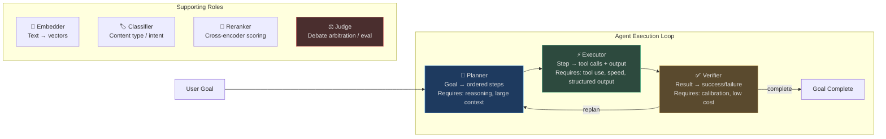
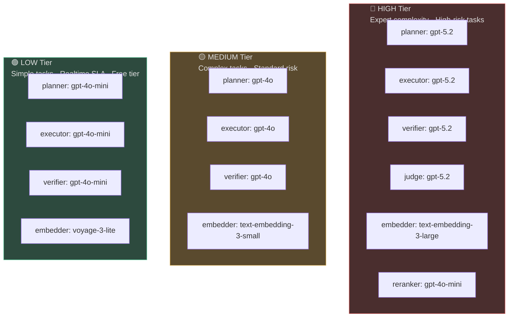
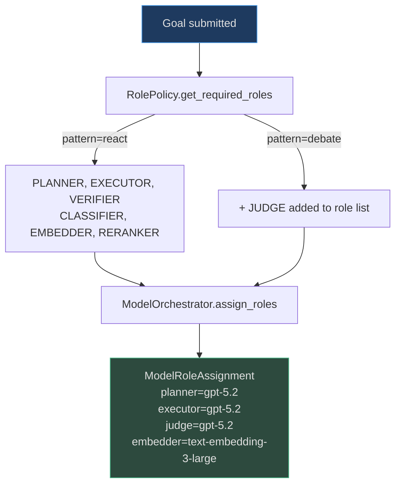
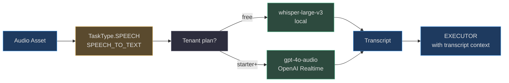

# Role-Based Model Routing

The fundamental insight behind role-based routing is that **different tasks in the agent loop have completely different requirements**. A planner needs long context and strong reasoning. An executor needs fast, reliable tool calling. A verifier needs calibrated judgment, not creativity. Using a single model for all roles either wastes money (paying Opus prices for verification) or sacrifices quality (using Haiku for complex planning).

<!-- Sources: app/ai_router/role_policy.py, app/ai_router/model_orchestrator.py, app/ai_router/registry.py, app/ai_router/models.py -->

---

## Role Definitions

### Primary Agent Roles



### Role Requirements Matrix

| Role | Context needs | Speed priority | Tool calling | Vision | Reasoning depth |
|---|---|---|---|---|---|
| PLANNER | Large (32K–200K) | Low | Optional | Optional | Very High |
| EXECUTOR | Medium (8K–32K) | High | **Required** | Conditional | Medium |
| VERIFIER | Small (4K–16K) | High | No | No | Medium |
| JUDGE | Medium (8K–32K) | Low | No | No | **Very High** |
| EMBEDDER | N/A (batch) | High | No | No | N/A |
| RERANKER | Small (2K–8K) | High | No | No | Low |
| CLASSIFIER | Very small (1K–4K) | Very High | No | No | Low |

---

## Role-to-Model Mapping: `RolePolicy`

`RolePolicy` in `app/ai_router/role_policy.py` determines which roles are **required** for a given agent pattern. `ModelOrchestrator` then maps required roles to model assignments via tier tables.

```python
# Source: app/ai_router/role_policy.py
class RolePolicy:
    def get_required_roles(self, config: "PatternConfig") -> list[AgentRole]:
        roles = [
            AgentRole.PLANNER,
            AgentRole.EXECUTOR,
            AgentRole.VERIFIER,
            AgentRole.CLASSIFIER,
            AgentRole.EMBEDDER,
        ]
        # Multi-agent debate patterns need a Judge
        if any(p in ("debate", "consensus", "peer_review")
               for p in (config.multi_agent_patterns or [])):
            roles.append(AgentRole.JUDGE)
        roles.append(AgentRole.RERANKER)
        return roles
```

---

## Tier-Based Model Assignment

`ModelOrchestrator` maintains three quality tiers mapped directly to model IDs:



The fallback map ensures provider-level resilience:
```python
_FALLBACK_MODELS = {
    "openai": "claude-3-5-sonnet",   # OpenAI down → Anthropic
    "anthropic": "gpt-4o",           # Anthropic down → OpenAI
    "google": "gpt-4o",              # Gemini down → OpenAI
}
```

---

## Capability Matrix: Built-In Model Catalog

The `BUILTIN_MODELS` catalog in `app/ai_router/registry.py` carries 11 pre-configured endpoints:

| Model | TG | Tools | Vision | Embed | Video | Struct | Compliance | Quality | Cost/1k |
|---|---|---|---|---|---|---|---|---|---|
| `claude-opus-4-5` | ✓ | ✓ | ✓ | — | — | ✓ | ✓ | 0.97 | $0.015 |
| `claude-sonnet-4-5` | ✓ | ✓ | ✓ | — | — | ✓ | ✓ | 0.92 | $0.003 |
| `claude-haiku-3-5` | ✓ | ✓ | — | — | — | — | — | 0.82 | $0.0008 |
| `gpt-5.2` | ✓ | ✓ | ✓ | — | — | ✓ | — | 0.94 | $0.005 |
| `gpt-4o-mini` | ✓ | ✓ | ✓ | — | — | — | — | 0.80 | $0.00015 |
| `text-embedding-3-large` | — | — | — | ✓ | — | — | — | 0.93 | $0.00013 |
| `gemini-2.5-pro` | ✓ | ✓ | ✓ | — | ✓ | — | — | 0.95 | $0.00125 |
| `gemini-2.0-flash` | ✓ | ✓ | ✓ | — | — | — | — | 0.85 | $0.0001 |
| `llama-3.3-70b` (Groq) | ✓ | ✓ | — | — | — | — | — | 0.86 | $0.00059 |
| `llama-3.1-8b-instant` (Groq) | ✓ | ✓ | — | — | — | — | — | 0.72 | $0.00005 |
| `voyage-3-large` | — | — | — | ✓ | — | — | — | 0.95 | $0.00018 |

**TG** = TEXT_GENERATION · **Struct** = STRUCTURED_OUTPUT · **Compliance** = compliance_ready (HIPAA/SOC2/GDPR eligible)

---

## Real-World Examples

### 1. Mixed-Model Agent Execution

**Scenario:** An enterprise analytics agent is tasked with generating a market entry report for a new product.

| Step | Role | Model assigned | Why |
|---|---|---|---|
| Decompose goal into 12 research steps | PLANNER | `claude-opus-4-5` (0.97 quality, 200K context) | Complex multi-step reasoning |
| Call web search tool, extract data | EXECUTOR | `gpt-5.2` (structured output, fast tool calling) | Reliable tool call JSON format |
| Verify data extraction correctness | VERIFIER | `claude-haiku-3-5` ($0.0008/1k, fast) | Simple pass/fail judgment |
| Score final report quality | JUDGE | `claude-opus-4-5` | Strong calibration for eval |
| Embed retrieved documents | EMBEDDER | `voyage-3-large` (0.95 quality) | Best retrieval quality |

**Cost for single run:** ~$0.23 total vs ~$0.89 if all-Opus.

### 2. Debate Agent Pattern

When the agent uses the `debate` multi-agent pattern, `RolePolicy.get_required_roles()` adds `AgentRole.JUDGE`. The ModelOrchestrator assigns the highest-quality available model (quality_score ≥ 0.90) to arbitrate between the two debating sub-agents' conflicting outputs.

**Scenario:** A financial risk assessment agent has a debate between a "bull case" sub-agent and a "bear case" sub-agent. The judge model (`claude-opus-4-5`) evaluates both positions and synthesises the final risk rating.

### 3. Multimodal Execution Role

When a task requires vision (e.g., analyzing a screenshot or processing an insurance claim image), the executor role adds `require_vision=True` to the `AIRouter.select_model()` call. This automatically filters to vision-capable models (`claude-sonnet-4-5`, `gpt-4o-mini`, `gemini-2.0-flash`) and selects the highest quality_score among them.

---

## Roles per Agent Pattern

| Pattern | Planner | Executor | Verifier | Judge | Notes |
|---|---|---|---|---|---|
| `react` (standard) | HIGH tier | MEDIUM tier | LOW tier | — | Most common |
| `tree_of_thought` | HIGH tier | HIGH tier | HIGH tier | HIGH tier | Expensive but thorough |
| `debate` | HIGH tier | MEDIUM tier | MEDIUM tier | HIGH tier | Needs strong judge |
| `reflection` | MEDIUM tier | MEDIUM tier | HIGH tier | — | Verifier elevated |
| `plan_and_execute` | HIGH tier | LOW tier | LOW tier | — | Bulk execution cheaply |

---

## Adding Custom Models

Tenants on Enterprise plans can register private endpoints:

```python
from app.ai_router.registry import model_registry
from app.ai_router.models import ModelEndpoint, ModelCapability

# Register a private fine-tuned model
model_registry.add_custom_model(
    tenant_id="acme",
    endpoint=ModelEndpoint(
        provider="openai_compatible",
        model_id="acme-legal-v2",
        display_name="ACME Legal Assistant v2",
        capabilities=[ModelCapability.TEXT_GENERATION, ModelCapability.STRUCTURED_OUTPUT],
        context_window=32000,
        cost_per_1k_input=0.002,
        quality_score=0.91,
        base_url="https://models.acme.internal/v1",
    ),
)
```

The custom model participates in routing with the same health tracking, circuit breaker, and cost attribution as built-in models.

---

## Selecting Models Programmatically

### Full AIRouter API

```python
from app.ai_router.router import AIRouter
from app.ai_router.models import TaskType

router = AIRouter()

# Standard selection
model = router.select_model(
    task_type=TaskType.PLANNING,
    tenant_id="acme",
    require_vision=False,
    require_tools=True,
    require_structured=False,
    max_cost_per_1k=0.01,       # Cap at $0.01/1k input tokens
    model_override=None,
)

# Force a specific model (for debugging or testing)
model = router.select_model(
    task_type=TaskType.PLANNING,
    tenant_id="debug",
    model_override="anthropic/claude-haiku-3-5",
)

# For embedding tasks (different capability filter)
embedding_model = router.select_model(
    task_type=TaskType.EMBEDDING,
    tenant_id="acme",
)
print(embedding_model.model_id)  # → text-embedding-3-large or voyage-3-large
```

### Checking what model is available

```python
from app.ai_router.registry import model_registry
from app.ai_router.models import ModelCapability

# List all models with vision capability
vision_models = model_registry.list_models(capability=ModelCapability.VISION)
for m in vision_models:
    print(f"{m.provider}/{m.model_id}: quality={m.quality_score}, cost=${m.cost_per_1k_input}/1k")

# Check health of a specific provider
health = model_registry.get_provider_health("anthropic")
print(f"Anthropic: healthy={health.is_healthy}, circuit_open={health.circuit_open}")
```

---

## Compliance-Ready Routing

For tenants under HIPAA, SOC2, or GDPR constraints, the router supports `require_compliance=True`:

```python
policy = ModelRoutePolicy(
    task_type=TaskType.PLANNING,
    routing_mode=RoutingMode.COMPLIANCE_REQUIRED,
    require_compliance=True,  # Filters to compliance_ready=True models
)
```

**Compliance-ready models** (`compliance_ready=True` in `BUILTIN_MODELS`):
- `claude-opus-4-5` — Anthropic BAA available for HIPAA
- `claude-sonnet-4-5` — Same as above

Non-compliance-ready models (`gpt-4o-mini`, `gemini-2.0-flash`, `groq/*`) are excluded from selection when `require_compliance=True`. This prevents accidental routing of PHI or PII to providers without appropriate data processing agreements.

---

## Role Assignment in Practice: Full Agent Execution

```python
# Source: app/ai_router/model_orchestrator.py (simplified)
from app.ai_router.model_orchestrator import ModelOrchestrator
from app.agent.pattern_config import PatternConfig, Complexity, RiskLevel

orchestrator = ModelOrchestrator()

config = PatternConfig(
    pattern="react",
    complexity=Complexity.COMPLEX,
    risk=RiskLevel.MEDIUM,
    multi_agent_patterns=[],
)

assignment = orchestrator.assign_roles(config, tenant_id="enterprise_acme")
print(f"Planner: {assignment.planner}")     # gpt-5.2
print(f"Executor: {assignment.executor}")   # gpt-5.2
print(f"Verifier: {assignment.verifier}")   # gpt-5.2
print(f"Judge: {assignment.judge}")         # gpt-5.2
print(f"Embedder: {assignment.embedder}")   # text-embedding-3-large
```

For a `free` tenant with the same config:
```python
assignment = orchestrator.assign_roles(config, tenant_id="free_user")
print(f"Planner: {assignment.planner}")     # gpt-4o-mini  (LOW tier)
print(f"Embedder: {assignment.embedder}")   # voyage-3-lite (LOW tier)
```

---

## Role Policy in Multi-Agent Patterns

When agents run multi-agent patterns (`debate`, `consensus`, `peer_review`), the `RolePolicy` adds a `JUDGE` role. This is critical because without a judge, the debate result is undefined — both sub-agents return contradictory outputs with no resolution mechanism.



### Judge model selection criteria

The `JUDGE` role has stricter selection requirements than the `VERIFIER`:
- Must have `quality_score >= 0.90` (calibrated judgment required)
- Must have `TEXT_GENERATION` capability with long context (debate transcripts can be 10K+ tokens)
- `compliance_ready=True` if the task involves regulated content
- Never routed to Groq models (fast but calibration is insufficient for arbitration)

**Cost implication:** Debates add ~1× extra LLM call at the highest quality tier. Use only when conflicting perspectives are genuinely valuable — not as a default pattern.

---

## Specialised Modality Roles — Audio, Vision, and Reranker

Beyond the four core text roles, the router handles three specialised modality roles defined in `ModelCapability` and `TaskType` (`app/ai_router/models.py`).

### Audio Model Selection (`SPEECH_TO_TEXT` / `TEXT_TO_SPEECH`)

`TaskType.SPEECH` routes to models with `ModelCapability.SPEECH_TO_TEXT`. The `ModelOrchestrator` maps the `"audio"` modality:

```python
# Source: app/ai_router/model_orchestrator.py
_MULTIMODAL_MODELS = {
    "audio": {
        "extractor": "gpt-4o-audio",   # speech-to-text transcription
        "reasoner": "gpt-5.2",           # semantic understanding of transcript
        "requires_audio": True,
    },
}
```

**Selection criteria:** Must have `ModelCapability.SPEECH_TO_TEXT`; prefer lower WER for domain terminology; multilingual audio routes to multilingual-trained models. Tenant plan: free tier → local Whisper, enterprise → cloud STT with diarisation.


<!-- Sources: app/ai_router/model_orchestrator.py:80-90, app/ai_router/models.py:SPEECH_TO_TEXT -->

**Real-World:** Call centre ingests 50K recorded calls/day → `gpt-4o-audio` transcribes each → EXECUTOR summarises + extracts issues. Routing free tenants to local Whisper saves ~$0.006/minute.

### Vision Model Selection (`VISION`)

Image and video tasks route to models with `ModelCapability.VISION`:

```python
_MULTIMODAL_MODELS = {
    "image": {"extractor": "gpt-4o",          "requires_vision": True},
    "video": {"extractor": "gemini-2.5-pro",   "requires_vision": True},
}
```

Registry includes: `claude-3-7-sonnet`, `gpt-4.1`, `gpt-4o` (all `supports_vision=True`); `gemini-2.5-pro` (video frames). Compliance-required tenants restricted to `compliance_ready=True` vision models only.

### Reranker Model Selection (`RERANK`)

The retrieval layer calls `select_model(capability=ModelCapability.RERANK)` directly. Optimise for low latency — reranker is on the critical path (adds 50–200ms).

| Reranker | Latency P99 | Cost/1K calls | MRR@10 |
|---|---|---|---|
| `ms-marco-MiniLM-L-6-v2` (local) | 50ms | $0 | 0.72 |
| `ms-marco-MiniLM-L-12-v2` (local) | 80ms | $0 | 0.77 |
| `cohere-rerank-v3.5` (cloud) | 150ms | $0.001 | 0.84 |
| `jina-reranker-v2` (cloud) | 120ms | $0.0008 | 0.82 |

Free tier always routes to local reranker (no per-call API cost). Enterprise tenants can configure `preferred_model: "cohere-rerank-v3.5"` in `ModelRoutePolicy` for higher MRR.
<!-- Sources: app/ai_router/models.py:ModelCapability.RERANK, app/ai_router/registry.py -->

---

## FAQ

**Q: Can the router select different models for the same role in different steps of the same goal?**

Yes. Each call to `select_model()` is independent. If a provider's circuit opens mid-execution, step 3 may route to a different model than steps 1–2. The `ModelRoleAssignment` from `ModelOrchestrator` is recomputed at the start of each major execution phase (plan, execute, verify), not once per goal.

**Q: What happens if no model has the required capability?**

`select_model()` returns `None`. The agent loop logs a `WARNING` and the caller is responsible for the fallback. In practice, `TEXT_GENERATION` is always available (multiple providers registered). `VIDEO_UNDERSTANDING` may return `None` if no video-capable provider is configured.

**Q: Can free tier tenants accidentally access enterprise models?**

No. `ModelRoutePolicy` for free tenants sets `max_cost_per_1k=0.0002`, which filters out all models above that price point. Even with `model_override`, the router validates the override against the tenant's `max_cost_per_1k` constraint.
