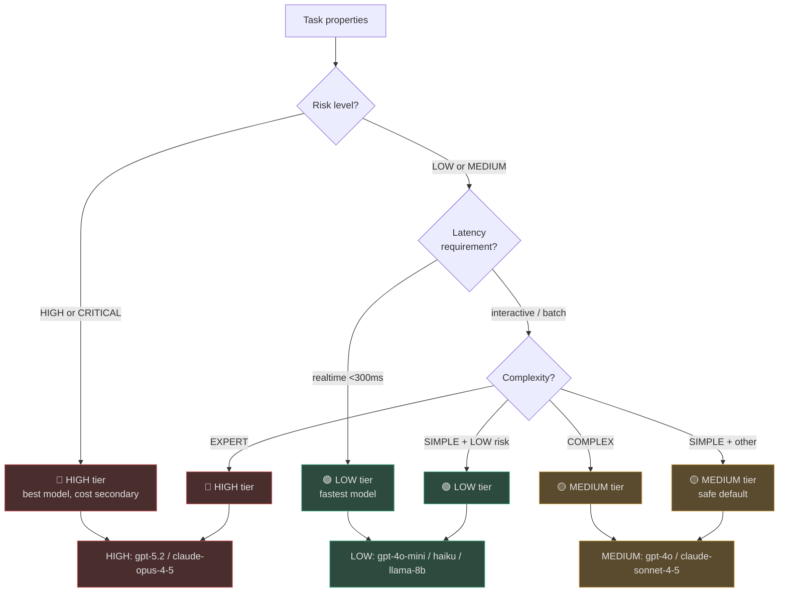
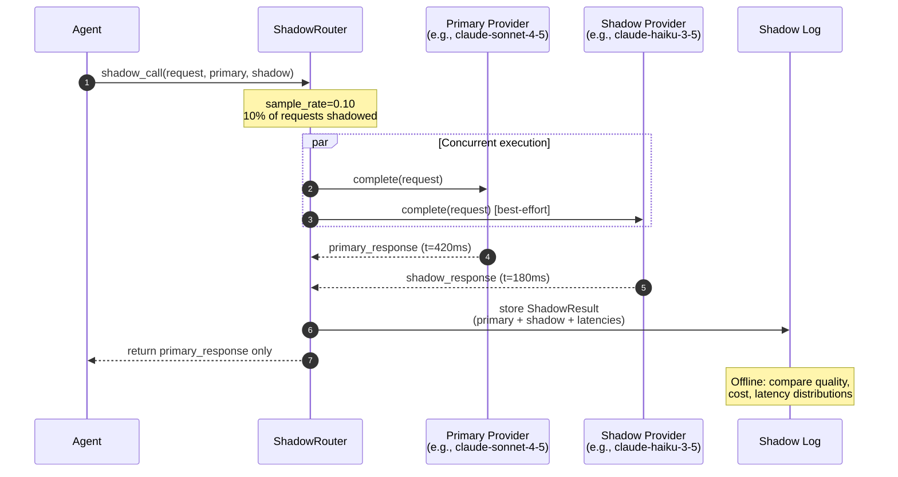
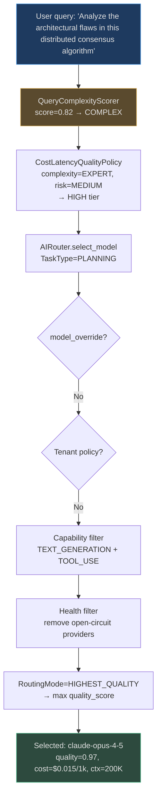

# Cost, Latency & Quality Routing

The routing system is not just about picking "the best model." It is about picking **the best model for this specific task given the current constraints** — query complexity, latency budget, cost budget, and tenant plan. This page covers the three components that make that decision: the `CostLatencyQualityPolicy`, the `QueryComplexityScorer`, and the `ShadowRouter`.

<!-- Sources: app/ai_router/cost_latency_quality_policy.py, app/ai_router/complexity_scorer.py, app/ai_router/shadow_router.py, app/ai_router/router.py -->

---

## The Routing Optimisation Function

The core routing decision resolves to a scoring function evaluated over all viable candidate models:

$$\text{score}(m) = \alpha \cdot q(m) - \beta \cdot c(m) - \gamma \cdot l(m)$$

Where:
- $q(m)$ = `model.quality_score` (0–1 scale from `BUILTIN_MODELS`)
- $c(m)$ = `model.cost_per_1k_input` (normalised to range)
- $l(m)$ = `model.avg_latency_ms` (normalised to range)
- $\alpha, \beta, \gamma$ = weights from `RoutingMode`

| `RoutingMode` | α (quality) | β (cost) | γ (latency) | Use when |
|---|---|---|---|---|
| `HIGHEST_QUALITY` | 1.0 | 0.0 | 0.0 | Default; complex tasks |
| `CHEAPEST` | 0.0 | 1.0 | 0.0 | Cost-constrained tenants |
| `FASTEST` | 0.0 | 0.0 | 1.0 | Realtime / interactive SLA |
| `COMPLIANCE_REQUIRED` | 0.5 | 0.2 | 0.3 | Regulated industries |
| `FALLBACK_CHAIN` | — | — | — | Degraded state; try sequentially |

The `AIRouter.select_model()` implements this as a single `max(candidates, key=score_fn)` or `min(candidates, key=cost_fn)` call — zero DB lookups, <1ms execution.

---

## CostLatencyQualityPolicy: Tier Selection

`CostLatencyQualityPolicy.select_tier()` maps task properties to a quality tier (`"low"`, `"medium"`, `"high"`) **before** the router is invoked. This determines which model tier the `ModelOrchestrator` assigns to each role.

```python
# Source: app/ai_router/cost_latency_quality_policy.py
def select_tier(
    self,
    complexity: Complexity,
    risk: RiskLevel,
    latency_requirement: str = "interactive",
) -> str:
    if risk in (RiskLevel.HIGH, RiskLevel.CRITICAL):
        return "high"       # Never compromise on high-risk tasks
    if latency_requirement == "realtime":
        return "low"        # Speed trumps quality for real-time
    if complexity == Complexity.EXPERT:
        return "high"
    elif complexity == Complexity.COMPLEX:
        return "medium"
    elif complexity == Complexity.SIMPLE and risk == RiskLevel.LOW:
        return "low"
    return "medium"         # Safe default
```

### Decision flowchart



---

## QueryComplexityScorer: Zero-Cost Complexity Detection

`QueryComplexityScorer` analyses a raw query string using **6 lexical features** with no LLM call — total latency <1ms.

```python
# Source: app/ai_router/complexity_scorer.py — feature weights
score = (
    0.20 * f_length        # normalised word count (max at 40 words)
    + 0.15 * f_clauses     # commas/semicolons/colons (max at 5)
    + 0.30 * f_tech        # technical term density (max at 3 terms)  ← heaviest weight
    + 0.15 * f_multi_part  # "and also", "moreover", "furthermore", etc.
    + 0.10 * f_negation    # "not", "never", "unless", "except"
    + 0.10 * f_questions   # question mark count (max at 2)
)
```

### Complexity thresholds and tier mapping

| Score range | Level | Recommended model tier | Example query |
|---|---|---|---|
| < 0.35 | `simple` | `"small"` (Haiku / 4o-mini) | `"What is the capital of France?"` |
| 0.35–0.65 | `moderate` | `"medium"` (Sonnet / GPT-4o) | `"Summarize the key risks in this contract"` |
| ≥ 0.65 | `complex` | `"large"` (Opus / GPT-5.2) | `"Analyze the distributed system architecture and identify potential race conditions in the consensus algorithm given concurrent writes from 3 replicas"` |

### Technical term detection

The scorer uses a compiled regex for ~20 technical root patterns:
```
algorithm, implement, architecture, optimize, concurrent, async, distributed,
latency, throughput, scalable, kubernetes, microservice, neural, transformer,
vector, embedding, retrieval, gradient, backprop, inference, quantize
```

A query with ≥3 technical terms scores `f_tech=1.0`, pushing it toward `complex` regardless of length.

---

## Shadow Router: Silent Model Validation

The `ShadowRouter` is a production safety mechanism for evaluating new models **without any user impact**. It fires the same request to both the primary model and a candidate model concurrently, returns only the primary response, and stores the shadow result for offline quality comparison.



### ShadowRoutingConfig

```python
# Source: app/ai_router/shadow_router.py
@dataclass
class ShadowRoutingConfig:
    enabled: bool = False
    shadow_provider_id: str = ""
    sample_rate: float = 0.1   # Shadow 10% of requests by default
```

**Key properties:**
- Shadow call failures are **silently swallowed** — the primary response is always returned cleanly
- Shadow results are kept in a circular buffer of `log_buffer_size=100` in-memory entries
- The `/shadow-log` API endpoint exposes collected results for analysis
- `sample_rate=0.1` means 10% of requests are shadowed — sufficient for statistical significance at typical production volumes

---

## Real-World Cost Analysis

### 1. Simple Query Routing Saves 60%

**Scenario:** A customer support SaaS handles 100,000 queries/day. Distribution:
- 55% simple (FAQ, status lookups): score < 0.35
- 30% moderate (account issues, troubleshooting): score 0.35–0.65
- 15% complex (technical disputes, billing escalations): score ≥ 0.65

| Routing strategy | Daily cost | Monthly cost |
|---|---|---|
| All GPT-5.2 | $500 × 100K = $500 | $15,000 |
| All Claude Sonnet | $300 × 100K = $300 | $9,000 |
| Complexity-routed | 55% × $0.03 + 30% × $0.15 + 15% × $0.50 = $0.15/query avg | $450 → **$4,500/mo** |

**Result:** Complexity routing saves ~$4,500/month (50%) vs all-Sonnet, with no quality reduction for complex queries.

### 2. Shadow Router: $200K/Year Validated Savings

**Scenario:** An enterprise platform is evaluating switching their Verifier role from `gpt-4o` ($0.005/1k) to `claude-haiku-3-5` ($0.0008/1k).

**Shadow routing experiment:** 2 weeks, 10% of verification calls shadowed.
- Primary: `gpt-4o`, Shadow: `claude-haiku-3-5`
- Volume: 500K verifications/day × 10% = 50K shadow calls/day × 14 days = 700K comparisons
- Result: Haiku agrees with GPT-4o on 94.2% of cases. Disagreements concentrated on edge cases with ambiguous tool call results.

**Decision:** Switch Verifier to Haiku with a GPT-4o fallback for low-confidence cases (confidence score < 0.7).

**Annual savings:** 500K calls/day × 365 × ($0.005 - $0.0008) / 1K tokens × 800 avg tokens = **$214,200/year**.

---

## Routing Decision Trace (Full Pipeline)



Total routing overhead: <2ms (complexity scorer + registry lookup + health check).

---

## Tuning the Complexity Scorer

The `QueryComplexityScorer` thresholds are configurable:

```python
from app.ai_router.complexity_scorer import QueryComplexityScorer

# Default thresholds
scorer = QueryComplexityScorer(
    simple_threshold=0.35,   # score < 0.35 → simple
    complex_threshold=0.65,  # score >= 0.65 → complex
)

# For a domain with more technical queries (engineering platform):
# Raise both thresholds to avoid over-routing to expensive models
scorer_conservative = QueryComplexityScorer(
    simple_threshold=0.45,   # More queries classified as simple
    complex_threshold=0.75,  # Fewer queries classified as complex
)

# Inspect feature breakdown
score = scorer.score(
    "How does the distributed consensus algorithm handle Byzantine faults?"
)
print(f"Level: {score.level}")   # complex
print(f"Score: {score.score}")   # 0.78
print(f"Features: {score.features}")
# Features: {'length': 0.35, 'clauses': 0.0, 'technical': 1.0, 'multi_part': 0.0, 'negation': 0.0, 'questions': 0.5}
```

**Threshold calibration process:**
1. Sample 1,000 production queries from your use case
2. Manually label each as `simple`, `moderate`, or `complex`
3. Measure precision/recall for each threshold pair
4. Choose threshold that minimises expensive model usage while keeping complex query quality
5. Verify with shadow routing (see above) before changing production threshold

---

## Shadow Router: Implementation Details

### Accessing shadow results

```python
from app.ai_router.shadow_router import ShadowRouter, ShadowRoutingConfig

config = ShadowRoutingConfig(
    enabled=True,
    shadow_provider_id="anthropic/claude-haiku-3-5",
    sample_rate=0.10,  # Shadow 10% of requests
)

router = ShadowRouter(config=config, log_buffer_size=500)

# After some traffic...
results = router.get_shadow_log()
for r in results[-5:]:
    print(f"Primary: {r.latency_primary_ms:.0f}ms | Shadow: {r.latency_shadow_ms:.0f}ms")
    print(f"Primary: {r.primary_response.content[:80]}")
    print(f"Shadow:  {r.shadow_response.content[:80]}")
    print()
```

### Statistical analysis of shadow results

```python
import statistics

latencies_primary = [r.latency_primary_ms for r in results if r.shadow_response]
latencies_shadow = [r.latency_shadow_ms for r in results if r.shadow_response]

print(f"Primary p50: {statistics.median(latencies_primary):.0f}ms")
print(f"Shadow p50: {statistics.median(latencies_shadow):.0f}ms")
print(f"Shadow is {statistics.median(latencies_primary)/statistics.median(latencies_shadow):.1f}× faster")

# Quality comparison requires human eval or automated eval pipeline:
# Route shadow results through EvalRunner for automated quality scoring
```

---

## Real-World Example: E-Commerce Query Classification

**Scenario:** A large e-commerce platform processes 2M customer service queries/day. Query distribution analysis:

| Query type | % of volume | Example | Complexity | Model |
|---|---|---|---|---|
| Order status | 35% | `"Where is my order #12345?"` | simple | gpt-4o-mini |
| Return policy | 25% | `"How do I return an item?"` | simple | gpt-4o-mini |
| Product comparison | 20% | `"Compare the Pro and Pro Max models"` | moderate | gpt-4o |
| Technical issue | 12% | `"My checkout keeps failing with error code 400"` | moderate | gpt-4o |
| Complex dispute | 8% | `"I was charged twice, the second charge is in dispute, account has fraud flag"` | complex | claude-opus-4-5 |

**Cost analysis with complexity routing:**

| Volume (2M/day) | Model | Daily cost |
|---|---|---|
| 1,200,000 simple | gpt-4o-mini ($0.00015/1k, avg 800 tokens) | $144 |
| 640,000 moderate | gpt-4o ($0.005/1k, avg 1,200 tokens) | $3,840 |
| 160,000 complex | claude-opus-4-5 ($0.015/1k, avg 2,000 tokens) | $4,800 |
| **Total** | | **$8,784/day** |

**Without complexity routing (all claude-opus-4-5):**
2,000,000 × 1,200 tokens avg × $0.015/1k = **$36,000/day**

**Savings: $27,216/day = $9.9M/year**
