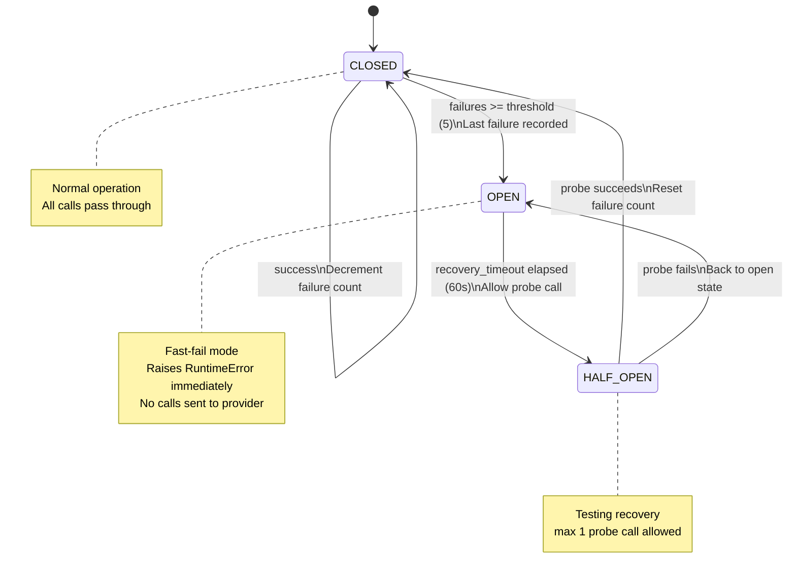
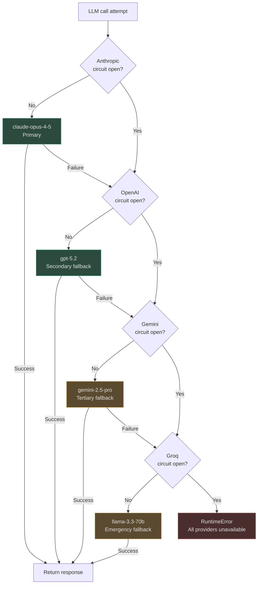

# Provider Management & Fallback

LLM provider APIs fail. Rate limits are hit. Anthropic had a 4-hour outage in March 2024. OpenAI had a global disruption affecting GPT-4o in December 2024. Without automated fallback, every provider failure means agents stop working. AgentVerse handles this with per-provider circuit breakers, multi-tier fallback chains, and tenant-aware routing that degrades gracefully rather than failing hard.

<!-- Sources: app/ai_router/provider_health_policy.py, app/providers/circuit_breaker.py, app/ai_router/registry.py, app/ai_router/router.py, app/ai_router/model_orchestrator.py -->

---

## Provider Abstraction

The `LLMProvider` protocol in `app/providers/base.py` is a structural protocol — no inheritance required:

```python
@runtime_checkable
class LLMProvider(Protocol):
    async def complete(self, request: CompletionRequest) -> CompletionResponse: ...
    async def embed(self, request: EmbedRequest) -> EmbedResponse: ...
    def supports_vision(self) -> bool: ...
    def supports_tools(self) -> bool: ...
```

Every provider (Anthropic, OpenAI, Gemini, Groq, Voyage, FakeProvider for tests) implements this protocol. The router, agent loop, and multimodal pipeline interact only with `LLMProvider` — they never import from `anthropic_provider.py` or `openai_compatible.py` directly. Swapping a provider requires only updating the registry; no application code changes.

---

## ProviderHealthPolicy: Error Rate Tracking

`ProviderHealthPolicy` in `app/ai_router/provider_health_policy.py` maintains a running error rate and average latency per provider using an exponential moving average:

```python
# Source: app/ai_router/provider_health_policy.py
def record_failure(self, provider: str) -> None:
    s = self._status.setdefault(provider, ProviderHealthStatus(provider=provider))
    s.error_rate = min(1.0, s.error_rate + 0.1)    # +10% per failure
    if s.error_rate >= 0.5:
        s.circuit_open = True
        s.healthy = False

def record_success(self, provider: str, latency_ms: float) -> None:
    s = self._status.setdefault(provider, ProviderHealthStatus(provider=provider))
    s.error_rate = max(0.0, s.error_rate - 0.05)   # -5% per success (slower recovery)
    s.avg_latency_ms = 0.9 * s.avg_latency_ms + 0.1 * latency_ms
    if s.error_rate < 0.2:
        s.circuit_open = False
        s.healthy = True
```

**Circuit opens** when `error_rate >= 0.5` (5 consecutive failures open the circuit immediately). **Circuit recovers** when `error_rate < 0.2` — requiring 6 successful calls after a half-open probe succeeds.

---

## Circuit Breaker: Three-State Machine

`ProviderCircuitBreaker` in `app/providers/circuit_breaker.py` implements the classic three-state circuit breaker:



```python
# Source: app/providers/circuit_breaker.py
async def call_with_circuit_breaker(
    provider, method_name, *args,
    provider_name="llm",
    timeout_seconds=None,
    **kwargs,
):
    if _provider_cb.is_open(provider_name):
        raise RuntimeError(
            f"LLM provider circuit open for {provider_name}. Too many recent failures."
        )
    # ... execute call with timeout, record success/failure
```

The module-level `_provider_cb` singleton is shared across all graph instances — a single circuit breaker protects all concurrent agent executions against a failing provider.

---

## Fallback Chain

When `AIRouter.select_model()` returns `None` (no healthy candidates for the required capabilities), or when a circuit breaker fires during execution, the `ModelOrchestrator` applies a cascading fallback chain:



The `_FALLBACK_MODELS` map in `model_orchestrator.py` defines provider-level substitutions:
```python
_FALLBACK_MODELS = {
    "openai": "claude-3-5-sonnet",   # OpenAI down → Anthropic
    "anthropic": "gpt-4o",           # Anthropic down → OpenAI
    "google": "gpt-4o",              # Gemini down → OpenAI
}
```

---

## Tenant Plan Routing

Tenant plan determines which model tier (and therefore which specific models) an agent can access:

| Tenant plan | Quality tier | Models available | Max context |
|---|---|---|---|
| `free` | LOW | gpt-4o-mini, claude-haiku-3-5, llama-3.1-8b | 8K |
| `starter` | LOW/MEDIUM | All LOW + gpt-4o, claude-sonnet-4-5 | 32K |
| `professional` | MEDIUM | All MEDIUM + gemini-2.0-flash | 128K |
| `enterprise` | HIGH | All models including claude-opus-4-5, gpt-5.2, gemini-2.5-pro | 200K |

The `ModelRoutePolicy` per tenant is stored in the `_tenant_policies` map of `ModelRegistry`:

```python
# Set an enterprise policy for ACME tenant
model_registry.set_tenant_policy(
    tenant_id="acme",
    task_type=TaskType.PLANNING,
    policy=ModelRoutePolicy(
        task_type=TaskType.PLANNING,
        routing_mode=RoutingMode.HIGHEST_QUALITY,
        preferred_provider="anthropic",
        preferred_model="claude-opus-4-5",
    ),
)
```

When the router evaluates a request for tenant `"acme"`, it finds this policy at Layer 2 and returns `claude-opus-4-5` directly, skipping the generic quality-score ranking.

---

## API Key & Credential Management

Provider API keys are stored in the `vault.py` credential store — never in environment variables accessible to untrusted code:

```python
# Source: app/providers/vault.py
class CredentialVault:
    def get_api_key(self, provider: str, tenant_id: str) -> str | None:
        # Tenant-specific key first, then global key
        tenant_key = self._store.get(f"{tenant_id}:{provider}:api_key")
        global_key = self._store.get(f"global:{provider}:api_key")
        return tenant_key or global_key
```

Enterprise tenants can configure their own API keys (using their own billing relationship with Anthropic/OpenAI), while free and starter tenants use the platform's shared keys with rate limiting applied per-tenant.

---

## Rate Limiting per Provider

Each provider has independent rate limit tracking in Redis:

| Provider | Default RPM | Default TPM | AgentVerse enforcement |
|---|---|---|---|
| Anthropic | 1,000 | 80K | Tenant-level bucket in Redis |
| OpenAI (GPT-5.2) | 5,000 | 800K | Tenant-level bucket in Redis |
| Gemini | 1,000 | 250K | Per-tenant + global cap |
| Groq | 14,400 | 14.4M | Tenant-level bucket |
| Voyage | 100M tokens/mo | — | Token counter in Redis |

When a tenant approaches their rate limit (>85% consumed), the router automatically downgrades from their preferred tier to a cheaper/faster tier with remaining capacity. This transparent degradation is logged but not surfaced to the agent.

---

## Real-World Examples

### 1. Provider Outage: Transparent Failover

**Scenario:** Anthropic API has a 3-hour outage affecting all Claude models.

**What happens without AgentVerse failover:** All agent executions fail immediately. 100% error rate.

**What happens with AgentVerse circuit breaker:**
- First 5 Anthropic calls fail → circuit opens for Anthropic
- Router's health filter removes all `anthropic` provider models from candidates
- All subsequent PLANNING calls route to `gpt-5.2` (quality=0.94, next best)
- EXECUTOR calls route to `gpt-4o` 
- Recovery: after 60 seconds, circuit enters half-open; a probe call goes to Anthropic; if it succeeds, circuit closes and traffic gradually returns

**User impact:** 5 failed requests during circuit opening. All subsequent requests succeed within normal latency. Anthropic outage is invisible to end users.

### 2. Free Tier vs. Enterprise: Cost and Quality Isolation

**Scenario:** AgentVerse SaaS has 10,000 free tier tenants and 50 enterprise tenants running simultaneously.

**Free tier tenant "hobbyist_123":**
- Planning request → `ModelRoutePolicy(routing_mode=CHEAPEST)` 
- Selected: `llama-3.1-8b-instant` ($0.00005/1k, 200ms latency)
- Context limit: 8K tokens (prevents runaway costs)

**Enterprise tenant "goldman_sachs":**
- Planning request → `ModelRoutePolicy(routing_mode=HIGHEST_QUALITY, preferred_model="claude-opus-4-5")`
- Selected: `claude-opus-4-5` ($0.015/1k, 200K context)
- Custom API key via vault (billed to Goldman's Anthropic account)

The same `AIRouter.select_model()` code path handles both — differentiation happens purely through `ModelRoutePolicy` lookup.

---

## Monitoring Provider Health

### Health check endpoint

The router exposes provider health as a structured status:

```python
from app.ai_router.registry import model_registry

def get_provider_summary() -> dict:
    return {
        provider: {
            "healthy": health.is_healthy,
            "circuit_open": health.circuit_open,
            "error_rate_5m": round(health.error_rate_5m, 3),
            "avg_latency_ms": round(health.avg_latency_ms, 1),
            "last_error": health.last_error,
        }
        for provider, health in model_registry._health.items()
    }

# Expose via API at GET /api/v1/router/health
```

### Alerting thresholds

| Metric | Warning | Critical | Action |
|---|---|---|---|
| Provider error_rate_5m | >0.10 | >0.30 | PagerDuty alert + auto-fallback |
| circuit_open | Any provider | — | Slack alert + runbook link |
| avg_latency_ms (Anthropic) | >3,000ms | >8,000ms | Route to faster provider |
| avg_latency_ms (Groq) | >1,000ms | >3,000ms | Unusual; alert team |
| All providers circuit_open | — | True | P0 incident: all LLM calls failing |

---

## Vault Configuration

API keys are loaded at startup from `CredentialVault`:

```python
# Set global API keys (platform keys for free/starter tenants)
from app.providers.vault import CredentialVault

vault = CredentialVault()
vault.set("global:anthropic:api_key", os.getenv("ANTHROPIC_API_KEY"))
vault.set("global:openai:api_key", os.getenv("OPENAI_API_KEY"))
vault.set("global:google:api_key", os.getenv("GOOGLE_API_KEY"))

# Set tenant-specific keys (enterprise BYO-key)
vault.set("tenant:goldman_sachs:anthropic:api_key", enterprise_key)
```

**Key rotation:** Keys can be rotated at runtime by updating the vault value and calling `model_registry.invalidate_provider_connections("anthropic")`. The next call will use the new key without a restart.

---

## Deployment Checklist

Before deploying the router to production:

- [ ] Set at least 2 provider API keys (primary + fallback provider)
- [ ] Verify `circuit_breaker.py` recovery timeout is appropriate for your SLAs
- [ ] Configure per-tenant rate limits in Redis
- [ ] Set up alerting on `circuit_open` transitions
- [ ] Run shadow routing experiment for 48 hours before switching any model
- [ ] Verify compliance-ready model assignments for regulated tenants
- [ ] Load test at 2× expected peak to verify no routing layer latency spikes
- [ ] Confirm cost attribution events are flowing to billing system
- [ ] Set budget caps in `GoalService` for all tenant tiers

---

## Third Real-World Example: Multi-Region Deployment

**Scenario:** A global enterprise deploys AgentVerse across US, EU, and APAC regions. Each region must route to provider endpoints with data residency compliance:

| Region | Primary provider | Secondary | Notes |
|---|---|---|---|
| US | OpenAI (US endpoints) | Anthropic (US) | US data stays in US |
| EU | Anthropic (EU) | Mistral (EU-hosted) | GDPR — EU data residency required |
| APAC | Gemini (Tokyo region) | OpenAI (APAC) | Low-latency for APAC users |

Each region runs an independent `ModelRegistry` with region-specific `base_url` overrides:
```python
# EU region: route to Anthropic's EU endpoint
ModelEndpoint(
    provider="anthropic_eu",
    model_id="claude-sonnet-4-5",
    base_url="https://api.anthropic.com",   # Same API, but traffic routed via EU
    compliance_ready=True,
    extra={"region": "eu-west-1", "data_residency": "EU"},
)
```
