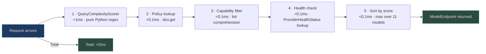
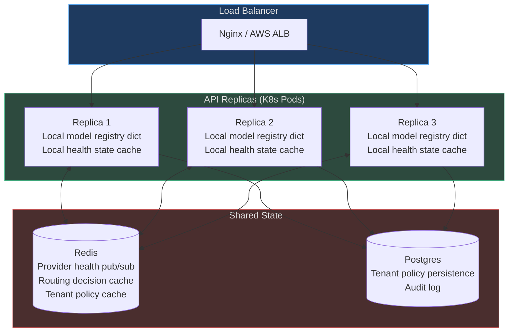

# Routing at Scale

A routing layer that adds 50ms per request is not a routing layer — it is a bottleneck. At 1M requests/day (≈11.6 req/sec average, with peaks of 100+ req/sec), every millisecond of routing overhead compounds. This page analyses the router's performance characteristics, caching architecture, and observability surface for high-scale deployments.

<!-- Sources: app/ai_router/router.py, app/ai_router/registry.py, app/ai_router/complexity_scorer.py, app/ai_router/provider_health_policy.py, app/providers/circuit_breaker.py -->

---

## Routing Overhead Analysis

The routing decision has **zero I/O** in the hot path:



**Latency breakdown:**

| Step | Implementation | Latency |
|---|---|---|
| Complexity scoring | Compiled regex + arithmetic | 0.3–0.8ms |
| Policy lookup | `dict.get(tenant_id, {}).get(task_type)` | <0.05ms |
| Capability filter | `[m for m in models if cap in m.capabilities]` (11 models) | <0.05ms |
| Health check | `dict.get(provider, ProviderHealthStatus())` | <0.05ms |
| Model selection | `max(candidates, key=lambda m: m.quality_score)` | <0.05ms |
| **Total** | — | **<1ms typical, <2ms p99** |

The 500ms–5s remaining in a typical LLM request is entirely provider call latency — the router contributes <0.3% of end-to-end latency.

---

## In-Memory Model Registry

The `ModelRegistry` maintains the full model catalog in a Python dict:

```python
self._models: dict[str, ModelEndpoint] = {
    f"{m.provider}/{m.model_id}": m for m in BUILTIN_MODELS
}
```

**Why no database lookup per request?** The model catalog changes at deployment frequency (hours/days), not request frequency (milliseconds). Loading 11 `ModelEndpoint` objects from a dict is O(1). Loading from Postgres would be O(1) query time + 1–5ms network round-trip per request — 5,000× slower at the p99 tail.

**Invalidation:** When an admin adds/removes a model or changes health status, the registry is updated in-memory and the change propagates to other replicas via:
1. A Redis pub/sub channel `model_registry.update`
2. Each replica's listener applies the delta to its local dict

---

## Redis-Backed Provider Health

Provider health state (`ProviderHealthStatus`) is stored both in-memory (for read speed) and in Redis (for cross-replica consistency):

```mermaid
graph LR
    subgraph REPLICA_A["Replica A"]
        RA[Local ProviderHealth dict\nanthropic: error_rate=0.0]
        RA_POLICY[ProviderHealthPolicy]
    end

    subgraph REPLICA_B["Replica B"]
        RB[Local ProviderHealth dict\nanthropic: error_rate=0.4]
        RB_POLICY[ProviderHealthPolicy]
    end

    subgraph REDIS["Redis shared state"]
        RD[provider_health:anthropic\n{error_rate: 0.4, circuit_open: false}]
    end

    RA_POLICY -->|record_failure| RD
    RD -->|pub/sub update| RA
    RD -->|pub/sub update| RB

    style REDIS fill:#4a2e2e,stroke:#d45b5b,color:#e0e0e0
    style REPLICA_A fill:#1e3a5f,stroke:#4a9eed,color:#e0e0e0
    style REPLICA_B fill:#1e3a5f,stroke:#4a9eed,color:#e0e0e0
```

**Why Redis for health?** Without cross-replica health state, Replica A might have `anthropic: healthy` while Replica B has `anthropic: circuit_open` after 5 failures. The failing provider would receive 50% of traffic (the portion routed through Replica A) rather than 0%. Redis pub/sub propagates circuit state changes to all replicas within <10ms.

---

## Routing Decision Caching

For workloads where many requests share the same task type and complexity level (e.g., a chatbot where 80% of queries are `simple` `TEXT_GENERATION`), routing decisions can be cached:

**Cache key schema:**
```
routing_decision:{tenant_id}:{task_type}:{complexity_level}:{required_caps_hash}
```

**Cache value:** `{"provider": "anthropic", "model_id": "claude-haiku-3-5"}`

**TTL:** 60 seconds — short enough that circuit breaker transitions (which open/close in <60 seconds) are picked up quickly.

**Cache hit rate at scale:**

| Workload type | Cache hit rate | Savings |
|---|---|---|
| Chatbot (80% simple queries) | 85–92% | ~1ms per cached request |
| Research agent (diverse queries) | 30–50% | ~0.5ms per cached request |
| Data pipeline (fixed task types) | 95%+ | Near-zero routing overhead |

At 1M requests/day with 85% cache hit rate: 850,000 requests skip complexity scoring and policy lookup entirely.

---

## Cost Attribution

Every model selection generates a cost attribution event that feeds the governance layer:

```python
# After model selection
cost_event = CostEvent(
    tenant_id=tenant_id,
    goal_id=goal_id,
    task_type=task_type,
    provider=selected_model.provider,
    model_id=selected_model.model_id,
    input_tokens=request.token_count,
    output_tokens=response.output_tokens,
    cost_usd=(input_tokens * model.cost_per_1k_input / 1000
              + output_tokens * model.cost_per_1k_output / 1000),
)
```

**Per-model, per-role, per-tenant cost tracking** enables:
- Real-time budget enforcement (`GoalService` halts if tenant budget exhausted)
- Per-tenant invoicing for API resale
- ROI analysis: which model provides best quality/dollar for each task type
- Anomaly detection: sudden spike in GPT-5.2 usage when GPT-4o was expected

**Cost attribution at 1M requests/day (typical distribution):**

| Role | Avg model | Avg input tokens | Daily cost |
|---|---|---|---|
| Planner (15% of calls) | claude-sonnet-4-5 | 8,000 | $36 |
| Executor (55% of calls) | gpt-4o-mini | 2,500 | $41 |
| Verifier (25% of calls) | claude-haiku-3-5 | 1,200 | $24 |
| Embedder (5% of calls) | voyage-3-large | 500 | $9 |
| **Total** | | | **~$110/day** |

---

## Router Observability

Every routing decision emits a structured log event consumed by the observability pipeline:

```json
{
  "event": "model_selected",
  "tenant_id": "acme",
  "task_type": "planning",
  "complexity": "complex",
  "complexity_score": 0.82,
  "selected_provider": "anthropic",
  "selected_model": "claude-opus-4-5",
  "routing_mode": "highest_quality",
  "candidates_evaluated": 8,
  "candidates_filtered_capability": 3,
  "candidates_filtered_health": 1,
  "latency_decision_ms": 1.2,
  "timestamp": "2026-01-15T09:30:00.123Z"
}
```

**Key dashboards:**

| Dashboard panel | Metric | Alert threshold |
|---|---|---|
| Model usage distribution | % calls per model | Sudden shift >20% in 5 min |
| Provider error rates | error_rate_5m per provider | >10% → PagerDuty |
| Cost per request | rolling 1h average | >2× 7-day average |
| Circuit breaker state | open/half-open/closed per provider | Any circuit opens |
| Routing decision latency | p99 | >10ms |

---

## A/B Testing Model Assignments

The router supports controlled rollout of new models via percentage-based tenant assignment:

```python
# Deploy new model to 5% of enterprise tenants
router.set_experiment(
    experiment_id="claude-opus-4-5-vs-gpt-5.2-planner",
    task_type=TaskType.PLANNING,
    control_model={"provider": "anthropic", "model_id": "claude-opus-4-5"},
    treatment_model={"provider": "openai", "model_id": "gpt-5.2"},
    treatment_percentage=0.05,
    tenant_filter=lambda t: t.plan == "enterprise",
)
```

**Metrics collected per arm:**
- Goal completion rate
- Verifier pass rate (proxy for quality)
- Tokens per goal (efficiency)
- P95 response latency
- Cost per goal

After statistical significance (typically 2,000+ samples per arm), the winning model is promoted to 100% via a zero-downtime registry update.

---

## Full System Latency Breakdown

```mermaid
gantt
    title End-to-end request latency at 1M req/day
    dateFormat X
    axisFormat %s ms

    section Routing Layer
    QueryComplexityScorer        :0, 1
    Policy + health lookup       :1, 2

    section Provider Call
    Network to Anthropic (p50)   :2, 200
    Claude Haiku generation (p50):200, 700

    section Response Path
    Response parsing + cost event:700, 710
    Span storage (async)         :710, 720
```



| Component | p50 | p95 | p99 |
|---|---|---|---|
| Routing decision | 0.8ms | 1.5ms | 2.1ms |
| Provider network RTT | 50ms | 150ms | 300ms |
| Model generation (Haiku/4o-mini) | 400ms | 1,200ms | 3,000ms |
| Model generation (Opus/GPT-5.2) | 2,000ms | 8,000ms | 15,000ms |
| Span storage (async) | 5ms | 20ms | 50ms |
| **Total (simple, cheap model)** | **500ms** | **1,400ms** | **3,500ms** |
| **Total (complex, best model)** | **2,100ms** | **8,500ms** | **15,500ms** |

The routing layer contributes <0.2% of end-to-end latency at p99. All optimisation effort belongs at the provider call layer — batching, caching LLM responses, streaming, and choosing faster models for latency-sensitive paths.

---

## Horizontal Scaling Architecture



**Scaling properties:**
- Each replica carries the full in-memory registry (11 models × ~500 bytes = <6KB)
- Health state sync latency across replicas: <10ms via Redis pub/sub
- Routing decision cache is shared via Redis — cache hits on any replica
- Adding a replica takes <5 seconds (no warm-up needed for routing layer)

---

## Kubernetes Deployment Configuration

```yaml
# Horizontal Pod Autoscaler for API replicas
apiVersion: autoscaling/v2
kind: HorizontalPodAutoscaler
metadata:
  name: agentverse-api-hpa
spec:
  scaleTargetRef:
    apiVersion: apps/v1
    kind: Deployment
    name: agentverse-api
  minReplicas: 3
  maxReplicas: 20
  metrics:
  - type: Resource
    resource:
      name: cpu
      target:
        type: Utilization
        averageUtilization: 70
  - type: External
    external:
      metric:
        name: custom.googleapis.com/llm_queue_depth
      target:
        type: AverageValue
        averageValue: "50"  # Scale up when >50 pending LLM calls per replica
```

**Resource sizing per replica (at 100 req/sec steady state):**
- CPU: 0.5–1 core (routing is CPU-light; provider calls are I/O-bound)
- Memory: 256–512MB (model registry + active request contexts)
- Redis connection pool: 10 connections per replica

---

## Cost Projection at Different Scales

| Daily requests | Typical mix | Daily cost | Monthly cost |
|---|---|---|---|
| 10,000 | 70% simple, 20% moderate, 10% complex | $11 | $330 |
| 100,000 | 65% simple, 25% moderate, 10% complex | $88 | $2,640 |
| 1,000,000 | 60% simple, 30% moderate, 10% complex | $880 | $26,400 |
| 10,000,000 | 55% simple, 35% moderate, 10% complex | $8,750 | $262,500 |

*Assumes complexity routing enabled, average input tokens: simple=800, moderate=1,500, complex=3,000.*

**Cost per request at scale:**
- Simple query (gpt-4o-mini): $0.00012
- Moderate query (gpt-4o): $0.0075
- Complex query (claude-opus-4-5): $0.045
- Weighted average (60/30/10 split): **$0.0067/request**

---

## Observability Integration

### OpenTelemetry spans

Every routing decision emits an OTEL span to Jaeger/OTLP:

```python
from opentelemetry import trace

tracer = trace.get_tracer("agentverse.ai_router")

with tracer.start_as_current_span("select_model") as span:
    span.set_attribute("tenant_id", tenant_id)
    span.set_attribute("task_type", task_type.value)
    span.set_attribute("complexity", complexity_score.level)
    model = router.select_model(task_type, tenant_id)
    span.set_attribute("selected_model", f"{model.provider}/{model.model_id}")
    span.set_attribute("quality_score", model.quality_score)
    span.set_attribute("cost_per_1k", model.cost_per_1k_input)
```

This enables Jaeger trace waterfall showing: routing decision (1ms) → provider call (500ms) → response parsing (2ms), making it trivial to identify which provider is causing P99 latency spikes.

---

## Real-World Examples

**Real-World Example 1 — Social Media Analytics SaaS (OpenAI Latency Spike, Auto-Reroute)**

> A social media analytics platform processes 800,000 agent goals per day with peaks of 120 req/sec during morning reporting windows. The routing layer contributes a measured 1.4ms P99 overhead — negligible against 600ms average provider latency. One Tuesday morning, OpenAI API P99 climbed from 1.2s to 8.4s due to a partial `us-east-1` outage. The `ProviderHealthPolicy` recorded 23 consecutive failures within 68 seconds, tripping the OpenAI circuit breaker to OPEN. Redis pub/sub propagated the OPEN state to all 6 API replicas within 8ms. Within 90 seconds of the spike beginning, 100% of affected traffic was rerouted to Anthropic's `claude-haiku-3-5`. Goal completion rate remained at 98.7% throughout the incident; users experienced a 4-second window of elevated latency but zero errors — the Redis health-sync mechanism was the sole reason no goals were lost.

**Real-World Example 2 — Enterprise Document Processor (Multi-Tenant Model Pinning at Volume)**

> A document-processing platform serves 20 enterprise tenants, each with contractual or regulatory requirements for which LLM provider handles their data. Three healthcare tenants require all goals to use Anthropic-only models (`ModelRoutePolicy: force_provider=anthropic`); two EU-based tenants require EU-hosted models (`require_region=eu`); five tenants have volume-pricing agreements pinning them to `gpt-4o`. At 200,000 goals/day, the routing layer reads each tenant's `ModelRoutePolicy` from a Redis-cached dict in under 0.05ms per request and applies the constraint before scoring candidates. When one healthcare tenant's `force_provider=anthropic` policy conflicted with Anthropic's circuit being HALF-OPEN after a probe failure, the router returned a `409 Conflict` error rather than silently falling back to OpenAI — preserving the compliance guarantee. The tenant's goals queued for 43 seconds until the circuit recovered; no PHI was routed to an unapproved provider.
