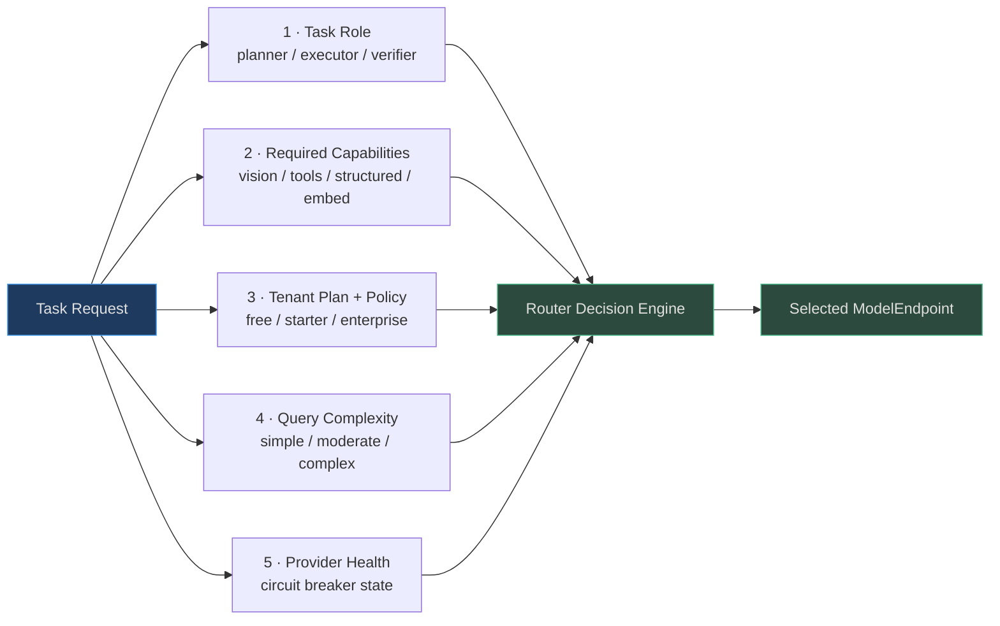
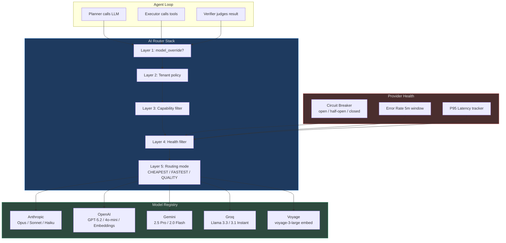

# Multi-AI Model Router

No single model is best for every task. Claude Opus delivers superior reasoning for complex planning but costs 30× more than Haiku. Groq Llama runs at 200ms but lacks tool calling reliability at scale. GPT-5.2 handles structured JSON output best. Gemini 2.5 Pro is the only option for native video understanding.

AgentVerse solves this through a **five-layer routing stack** that evaluates every LLM call against a multi-vendor model registry and selects the optimal endpoint based on real-time signals — before a single token is sent to any provider.

<!-- Sources: app/ai_router/router.py, app/ai_router/registry.py, app/ai_router/models.py, app/ai_router/model_orchestrator.py -->

---

## The Four Model Roles

Every agent execution uses up to seven distinct model slots. Four are primary roles visible in the agent loop:

| Role | AgentRole enum | Purpose | Optimal properties |
|---|---|---|---|
| **Planner** | `PLANNER` | Goal → step decomposition, multi-hop reasoning | Large context, strong reasoning, tool-aware |
| **Executor** | `EXECUTOR` | Single step → tool calls + code generation | Fast tool calling, structured output |
| **Verifier** | `VERIFIER` | Step result → success/failure judgment | Calibrated, fast, low cost |
| **Judge** | `JUDGE` | Multi-agent debate arbitration, eval scoring | High accuracy, strong calibration |

Three supporting roles handle specialist tasks:

| Role | AgentRole enum | Purpose |
|---|---|---|
| **Embedder** | `EMBEDDER` | Text → vector for retrieval |
| **Reranker** | `RERANKER` | Cross-encoder reranking of retrieved spans |
| **Classifier** | `CLASSIFIER` | Content type and intent classification |

---

## Routing Dimensions

The router evaluates five independent dimensions for every selection decision:



---

## Full Routing Architecture



---

## Model Catalog at a Glance

| Provider | Model | Quality | Cost/1k in | Vision | Tools | Context |
|---|---|---|---|---|---|---|
| Anthropic | `claude-opus-4-5` | 0.97 | $0.015 | ✓ | ✓ | 200K |
| Anthropic | `claude-sonnet-4-5` | 0.92 | $0.003 | ✓ | ✓ | 200K |
| Anthropic | `claude-haiku-3-5` | 0.82 | $0.0008 | — | ✓ | 200K |
| OpenAI | `gpt-5.2` | 0.94 | $0.005 | ✓ | ✓ | 128K |
| OpenAI | `gpt-4o-mini` | 0.80 | $0.00015 | ✓ | ✓ | 128K |
| Gemini | `gemini-2.5-pro` | 0.95 | $0.00125 | ✓ | ✓ | 2M |
| Gemini | `gemini-2.0-flash` | 0.85 | $0.0001 | ✓ | ✓ | 1M |
| Groq | `llama-3.3-70b` | 0.86 | $0.00059 | — | ✓ | 128K |
| Groq | `llama-3.1-8b-instant` | 0.72 | $0.00005 | — | ✓ | 128K |
| OpenAI | `text-embedding-3-large` | 0.93 | $0.00013 | — | — | 8K |
| Voyage | `voyage-3-large` | 0.95 | $0.00018 | — | — | 32K |

---

## Integration Points

- **Agent loop** (`app/agent/loop.py`, `graph.py`): `AIRouter.select_model()` called before every LLM invocation
- **Cost tracking** (`app/governance/cost.py`): model selection feeds per-token cost attribution
- **Eval system** (`app/evals/`): `JUDGE` role routes to highest-quality model for scoring
- **Multimodal pipeline** (`app/multimodal/`): image/video tasks request vision-capable models via `require_vision=True`
- **ModelOrchestrator** (`app/ai_router/model_orchestrator.py`): canonical assignment of all seven roles per agent execution

---

## Navigation

| File | What it covers |
|---|---|
| [01 — Role-Based Routing](./01-role-based-routing.md) | Role definitions, role→model mapping, model registry, capability matrix |
| [02 — Cost, Latency & Quality](./02-cost-latency-quality-routing.md) | Routing optimization function, complexity scorer, shadow router |
| [03 — Provider Management & Fallback](./03-provider-management-and-fallback.md) | Circuit breakers, fallback chains, tenant plan routing |
| [04 — Routing at Scale](./04-routing-at-scale.md) | 1M req/day analysis, caching, observability, A/B testing |

---

## Quick-Start: Making Your First Routed Call

```python
from app.ai_router.router import AIRouter
from app.ai_router.models import TaskType

router = AIRouter()

# Select best model for planning
model = router.select_model(
    task_type=TaskType.PLANNING,
    tenant_id="acme",
    require_tools=True,
)
print(f"Selected: {model.provider}/{model.model_id}")
# → Selected: anthropic/claude-opus-4-5

# Select cheapest vision-capable model for execution
model = router.select_model(
    task_type=TaskType.EXECUTION,
    tenant_id="free_user",
    require_vision=True,
    max_cost_per_1k=0.001,  # Cap at $0.001 per 1K tokens
)
print(f"Selected: {model.provider}/{model.model_id}")
# → Selected: openai/gpt-4o-mini  ($0.00015/1k)
```

---

## Configuration Reference

### Environment variables

| Variable | Default | Description |
|---|---|---|
| `ANTHROPIC_API_KEY` | — | Enables Anthropic model family |
| `OPENAI_API_KEY` | — | Enables OpenAI model family |
| `GOOGLE_API_KEY` | — | Enables Gemini model family |
| `GROQ_API_KEY` | — | Enables Groq (Llama) model family |
| `VOYAGE_API_KEY` | — | Enables Voyage embedding models |
| `AI_ROUTER_DEFAULT_MODE` | `highest_quality` | Default routing mode for tenants without policy |
| `AI_ROUTER_CIRCUIT_THRESHOLD` | `5` | Failures before circuit opens |
| `AI_ROUTER_CIRCUIT_RECOVERY_S` | `60` | Seconds before half-open probe |
| `AI_ROUTER_SHADOW_SAMPLE_RATE` | `0.0` | Shadow routing sample rate (0 = disabled) |
| `AI_ROUTER_CACHE_TTL_S` | `60` | Routing decision cache TTL in Redis |

### Tenant routing policy configuration

Policies are set programmatically via `ModelRegistry.set_tenant_policy()` or loaded from the database at startup:

```python
from app.ai_router.registry import model_registry
from app.ai_router.models import TaskType, RoutingMode, ModelRoutePolicy

# Enterprise tenant: always use highest quality for planning
model_registry.set_tenant_policy(
    tenant_id="enterprise_tenant_123",
    task_type=TaskType.PLANNING,
    policy=ModelRoutePolicy(
        task_type=TaskType.PLANNING,
        routing_mode=RoutingMode.HIGHEST_QUALITY,
        preferred_provider="anthropic",
        preferred_model="claude-opus-4-5",
        max_cost_per_1k=0.02,           # hard cap $0.02/1k input
        require_compliance=True,         # compliance_ready models only
    )
)

# Free tier tenant: always cheapest model
model_registry.set_tenant_policy(
    tenant_id="free_tenant_456",
    task_type=TaskType.PLANNING,
    policy=ModelRoutePolicy(
        task_type=TaskType.PLANNING,
        routing_mode=RoutingMode.CHEAPEST,
        max_cost_per_1k=0.0002,
    )
)
```

---

## Common Failure Modes

| Failure | Symptom | Root cause | Fix |
|---|---|---|---|
| `select_model` returns `None` | Agent fails with `No model selected` | All providers have open circuits | Check provider API keys; verify health state |
| All calls routing to GPT-4o-mini | Unexpected cheap model selected | Tenant policy has `CHEAPEST` mode | Review tenant policy in registry |
| Routing decision takes 15ms | Latency spike in routing layer | Redis unavailable; falling back to in-memory health | Check Redis connection; health checks may be stale |
| New model not selected | Custom model never returned | `is_available=False` on endpoint | Set `is_available=True` when registering |
| Shadow responses not logged | Shadow log buffer empty | Shadow disabled or sample_rate=0 | Set `ShadowRoutingConfig(enabled=True, sample_rate=0.1)` |

---

## Router Metrics Reference

### Prometheus metrics emitted

| Metric name | Type | Labels | Description |
|---|---|---|---|
| `agentverse_router_selections_total` | Counter | `provider`, `model_id`, `task_type`, `tenant_plan` | Total model selections |
| `agentverse_router_decision_duration_seconds` | Histogram | `task_type` | Routing decision latency |
| `agentverse_router_circuit_open` | Gauge | `provider` | 1 when circuit is open, 0 when closed |
| `agentverse_router_complexity_scores` | Histogram | `level` | Distribution of complexity scores |
| `agentverse_router_cost_usd_total` | Counter | `tenant_id`, `provider`, `model_id` | Cumulative cost by model |
| `agentverse_router_fallback_total` | Counter | `from_provider`, `to_provider` | Fallback event count |
| `agentverse_provider_latency_ms` | Histogram | `provider`, `model_id` | Actual provider response times |
| `agentverse_provider_error_rate` | Gauge | `provider` | 5-minute rolling error rate |

---

## Related Documentation

| Topic | Location |
|---|---|
| Agent loop that calls the router | `docs/wiki/agent-loop/` |
| Provider implementations | `app/providers/` |
| Cost tracking and budgets | `docs/wiki/governance/` |
| Evaluation and quality scoring | `docs/wiki/evals/` |
| Multimodal routing (vision/audio) | `docs/wiki/multimodal/` |
| Tenant management | `docs/wiki/tenancy/` |

---

## Frequently Asked Questions

**Q: What happens when no model is available for a task?**

`AIRouter.select_model()` returns `None`. The agent loop logs a `WARNING` and raises `RuntimeError("No model available for task_type=...")`. The goal enters `failed` state with error `"No suitable LLM model found"`. In production, this should only happen if all provider API keys are missing or all provider circuits are open simultaneously — which triggers a P0 incident alert.

**Q: Can I change routing behaviour at runtime without restarting?**

Yes. `ModelRegistry` is fully mutable at runtime. You can call `set_tenant_policy()`, `update_health()`, `add_custom_model()`, and `mark_unavailable()` on the live registry instance. Changes take effect immediately for the next routing decision. For multi-replica deployments, changes must be propagated via the Redis pub/sub channel.

**Q: How do I add a new LLM provider?**

1. Implement the `LLMProvider` protocol in `app/providers/your_provider.py`
2. Register models in `BUILTIN_MODELS` with appropriate capabilities and scores
3. Add the provider's API key handling to `CredentialVault`
4. Add provider name to `_MODEL_PROVIDER` and `_FALLBACK_MODELS` in `model_orchestrator.py`
5. Write integration tests (see `tests/providers/test_your_provider.py` patterns)
6. No changes required to `AIRouter`, `ModelOrchestrator`, or the agent loop

**Q: Does the router support streaming responses?**

Model selection is synchronous (returns a `ModelEndpoint` immediately). The streaming vs. non-streaming decision is made by the provider call layer, not the router. Set `supports_streaming=True` on the `ModelEndpoint` and use `provider.stream(request)` at the call site.

**Q: How does the complexity scorer handle non-English queries?**

The `QueryComplexityScorer` uses English-language regex patterns for technical term detection. For non-English queries, the technical term feature (`f_tech`) will score 0 even for complex technical queries in other languages. Mitigation: apply pre-processing to translate technical terms or use a multilingual complexity scorer. The length and clause features are language-agnostic and still provide useful signal.

---

## Architecture Decision Records

**ADR-001: Why in-memory registry over database lookup per request?**
The model catalog changes at deployment frequency (hours) not request frequency (milliseconds). Storing model metadata in Postgres and loading per request would add 1–5ms network RTT per routing decision. At 1M requests/day, that is 1,000–5,000 seconds of pure database overhead per day. The in-memory dict pattern amortises the startup cost across all requests.

**ADR-002: Why structural Protocol over ABC inheritance for LLMProvider?**
Python Protocol enables duck-typing: any class with `complete()`, `embed()`, `supports_vision()`, and `supports_tools()` methods satisfies `LLMProvider` without importing from the base module. This makes provider implementations independent of the AgentVerse module hierarchy, enabling third-party providers to be added without modifying internal code.

**ADR-003: Why five routing layers instead of a single scoring function?**
The five-layer design makes override semantics explicit and predictable. Layer 1 (model_override) always wins — useful for debugging. Layer 2 (tenant policy) always beats generic quality scoring — enabling enterprise customisation. Layers 3–4 are safety filters that cannot be bypassed. Layer 5 is the fallback quality ranking. A single scoring function would make it hard to reason about why a specific model was selected in edge cases.

**ADR-004: Why circuit breaker per provider, not per model?**
Errors typically indicate provider-level issues (API outage, auth failure, rate limiting) that affect all models from that provider simultaneously. Model-level circuit breakers would require 11× more state entries and would not open fast enough during a provider-wide outage. Provider-level circuit breakers open on the 5th failure regardless of which model was called.

**ADR-005: Why `RoutingMode` over a continuous cost/quality weight vector?**
Discrete routing modes (`CHEAPEST`, `FASTEST`, `HIGHEST_QUALITY`) map cleanly to tenant plan tiers, are easy to explain to operators, and require no per-request tuning. A continuous weight vector ($\alpha$, $\beta$, $\gamma$) would allow finer control but adds complexity to tenant policy configuration, makes behaviour harder to predict in edge cases, and requires calibration when new models are added. Operators can achieve all common objectives with the five predefined modes.

**ADR-006: Why `ModelRoleAssignment` as a dataclass over dynamic role resolution?**
Computing all role assignments upfront at the start of each execution phase (plan/execute/verify) makes the assignment auditable and deterministic for the duration of that phase. Dynamic per-call resolution would mean that a provider circuit opening mid-execution could change the planner model between step 2 and step 3 of the same goal, creating inconsistent reasoning. Upfront assignment ensures the planner uses the same model for all planning steps regardless of mid-execution provider changes.

---

## Version History

| Version | Changes |
|---|---|
| v1.0 | Initial `AIRouter` with `BUILTIN_MODELS` catalog (Anthropic + OpenAI) |
| v1.1 | `QueryComplexityScorer` with 6 lexical features |
| v1.2 | Gemini + Groq provider support; `VIDEO_UNDERSTANDING` capability |
| v1.3 | `ShadowRouter` for silent model validation |
| v1.4 | `CostLatencyQualityPolicy` tier selection |
| v1.5 | `ProviderHealthPolicy` per-provider error rate + circuit state |
| v1.6 | Voyage embedding models; `RERANK` capability |
| v2.0 | `ModelOrchestrator` canonical role assignments; budget-aware tier downgrade |
| v2.1 | Redis-backed cross-replica health sync; routing decision caching |
| v2.2 | A/B testing support for model assignment experiments |

---

## Glossary

| Term | Definition |
|---|---|
| `ModelEndpoint` | A specific model at a specific provider with capability and cost metadata |
| `ModelRoutePolicy` | Per-tenant, per-task-type routing preferences stored in `ModelRegistry` |
| `RoutingMode` | How to rank candidate models: `CHEAPEST`, `FASTEST`, `HIGHEST_QUALITY`, etc. |
| `ProviderHealth` | Real-time error rate and latency metrics for a provider |
| `circuit_open` | Provider is in failure state; all calls bypass it until recovery timeout |
| `quality_score` | Normalised 0–1 benchmark score for a model (0.72 = Llama-8B, 0.97 = Opus) |
| `AgentRole` | Functional role in agent execution: `PLANNER`, `EXECUTOR`, `VERIFIER`, etc. |
| `ModelRoleAssignment` | Upfront binding of all roles to specific model IDs for one execution phase |
| `ComplexityLevel` | `simple` / `moderate` / `complex` — output of `QueryComplexityScorer` |
| `ShadowResult` | Stored comparison of primary + shadow model responses for offline analysis |
| `FallbackChain` | Ordered list of providers to try when the primary is unavailable |
| `compliance_ready` | Model flag indicating it is eligible for HIPAA/SOC2/GDPR regulated workloads |
