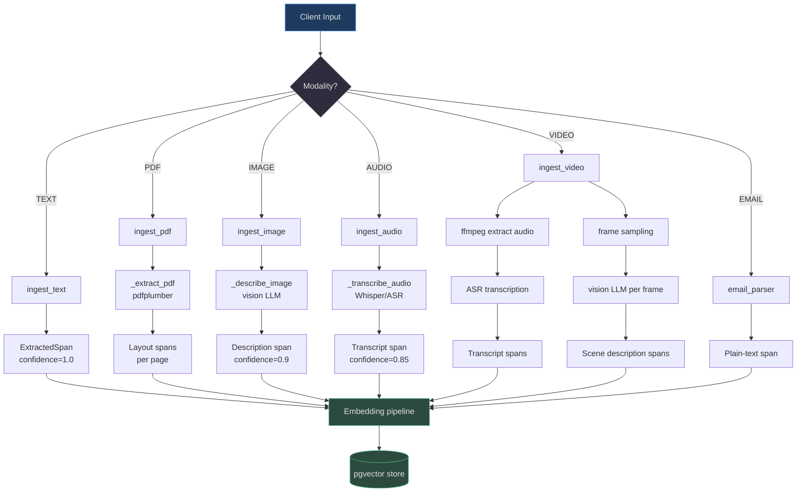
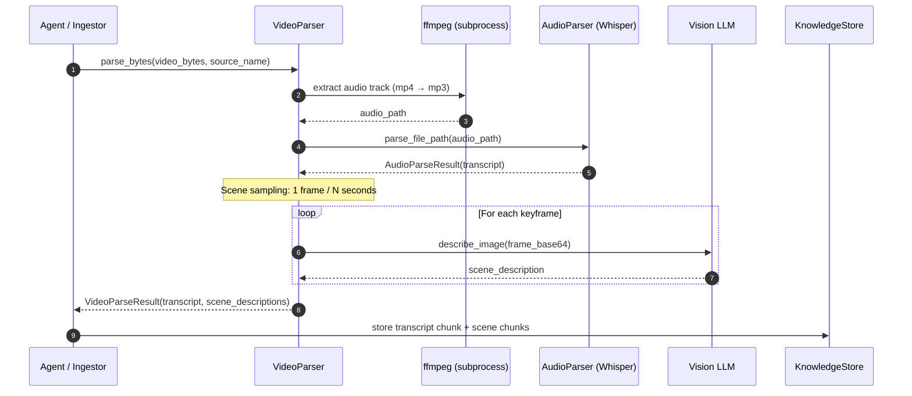
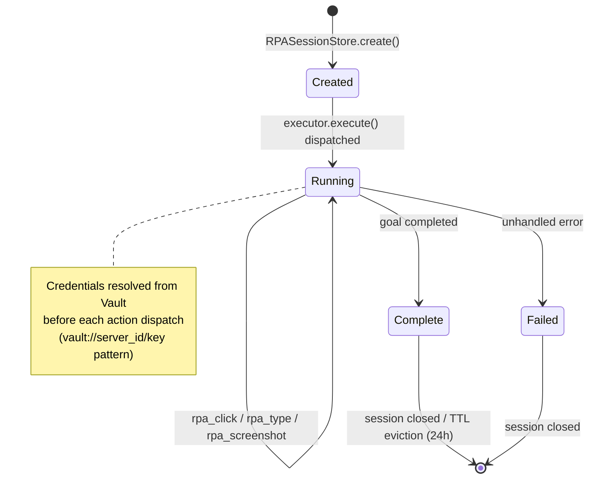
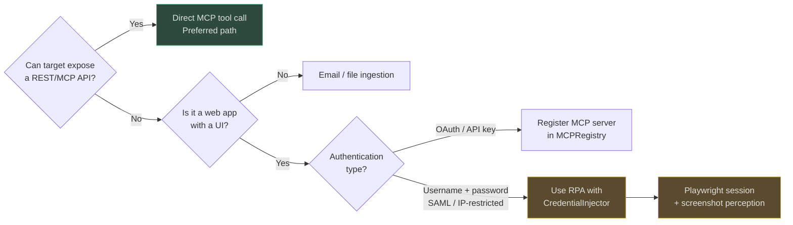

# Multimodal Processing & RPA

AgentVerse is not limited to text. It processes **eight distinct content modalities** through a unified pipeline that normalises every source into `ExtractedSpan` objects before embedding and retrieval.

## At a Glance

| Modality | Entry Point | Parser | Output Type | Embedding |
|---|---|---|---|---|
| `TEXT` | `ingest_text()` | built-in | plain spans | text embedder |
| `PDF` | `ingest_pdf()` | `pdfplumber` | layout-aware spans | text embedder |
| `IMAGE` | `ingest_image()` | vision LLM (OCR + description) | description span | text embedder |
| `AUDIO` | `ingest_audio()` | Whisper / ASR | transcript span | text embedder |
| `VIDEO` | `ingest_video()` | ffmpeg → audio → ASR + frame analysis | transcript + scene spans | text embedder |
| `EMAIL` | email parser | RFC-5322 + HTML strip | plain-text span | text embedder |
| `HTML/DOM` | web ingestor | DOM chunker | dom span | text embedder |
| `SCREENSHOT` | RPA → perception | vision LLM | UI description span | text embedder |

---

## 1. Multimodal Processing Pipeline

All modalities funnel through `MultimodalPipeline`, which routes by content type and wraps every interaction in an `AssetIngestionJob` status machine (`pending → processing → completed | failed`).


<!-- Sources: app/multimodal/pipeline.py:1-100, app/multimodal/models.py:1-48 -->

### Core Data Models

[`ExtractedSpan`](https://github.com/harsh786/agent-verse/blob/main/agent-verse-backend/app/multimodal/models.py#L18-L32) carries every piece of extracted content with provenance metadata:

```python
# Source: app/multimodal/models.py:18-32
@dataclass
class ExtractedSpan:
    content: str
    modality: Modality
    source_page: int | None = None
    source_frame: int | None = None
    timestamp_start: float | None = None
    timestamp_end: float | None = None
    bounding_box: dict[str, float] | None = None   # {x, y, width, height} 0-1
    confidence: float = 1.0
    language: str | None = None
```

[`AssetIngestionJob`](https://github.com/harsh786/agent-verse/blob/main/agent-verse-backend/app/multimodal/models.py#L35-L48) tracks the lifecycle of each ingestion request. Status transitions: `pending → processing → completed | failed`.

---

## 2. Video Processing Pipeline

Video is the most complex modality — it is two signals (audio + frames) that must be temporally aligned before embedding.


<!-- Sources: app/ingestion/parsers/video_parser.py:1-75, app/ingestion/parsers/audio_parser.py -->

The [`VideoParser`](https://github.com/harsh786/agent-verse/blob/main/agent-verse-backend/app/ingestion/parsers/video_parser.py#L40-L75) uses `ffmpeg` as an external subprocess (`timeout=120s`) for audio extraction, then delegates to `AudioParser` for transcription.

`VideoParseResult.to_chunks()` produces **two chunk types** in the same document:
- `chunk_type: "transcript"` — the full spoken-word content
- `chunk_type: "scene_description"` — one per visual scene

---

## 3. RPA Session Lifecycle

Robotic Process Automation (RPA) handles web content that cannot be accessed via direct API — forms, JavaScript-rendered pages, legacy portals.


<!-- Sources: app/rpa/session.py:1-100, app/rpa/executor.py:1-100, app/rpa/credential_injector.py:1-75 -->

### Session Storage

[`RPASessionStore`](https://github.com/harsh786/agent-verse/blob/main/agent-verse-backend/app/rpa/session.py#L38-L100) uses two Redis key patterns:

| Redis Key | Type | TTL | Purpose |
|---|---|---|---|
| `rpa_session:{session_id}` | JSON string | 24 h | Session state |
| `rpa_tenant_sessions:{tenant_id}` | Redis Set | 48 h | Per-tenant session index |

Falls back to an in-process dict when Redis is unavailable (dev / test).

### RPA Tool Inventory

[`RPA_TOOLS`](https://github.com/harsh786/agent-verse/blob/main/agent-verse-backend/app/rpa/tools.py#L8-L100) exposes 8+ tools with risk classifications:

| Tool | Risk | Description |
|---|---|---|
| `rpa_open_url` | `low` | Navigate to URL |
| `rpa_click` | `high` | Click element by selector or text |
| `rpa_type` | `high` | Type into element (CSS selector) |
| `rpa_extract_text` | `read` | Extract text from page/selector |
| `rpa_screenshot` | `read` | Capture screenshot artifact |
| `rpa_wait_for_text` | `read` | Poll until text appears |
| `rpa_select_option` | `high` | Select `<select>` dropdown value |
| `rpa_upload_file` | `high` | Upload file to `input[type=file]` |

`high`-risk tools trigger the HITL approval gateway before execution.

### Credential Injection

[`CredentialInjector`](https://github.com/harsh786/agent-verse/blob/main/agent-verse-backend/app/rpa/credential_injector.py#L15-L75) resolves `vault://` prefixed references in RPA arguments **before** dispatching to Playwright:

```
rpa_type(selector="#password", text="vault://my-portal/admin_password")
                              ↓  CredentialInjector.resolve_arguments()
rpa_type(selector="#password", text="s3cret!")   ← plaintext never in agent plan
```

Resolution order:
1. Tenant-scoped secret store (Redis-encrypted)
2. Provider vault (`app.providers.vault`)
3. Return original `vault://` reference with warning (never raise — RPA must continue)

---

## 4. When to Use RPA vs Direct API


<!-- Sources: app/rpa/executor.py:1-100, app/mcp/registry.py:1-80 -->

**Rule of thumb:** RPA is the _last resort_. Every RPA step adds latency (~1–5 s per action), is fragile to UI changes, and requires storing session cookies. Prefer direct API/MCP connectors.

---

## 5. Modality Support Matrix

| Content Type | Parser File | Key Library | Chunk Strategy | Confidence |
|---|---|---|---|---|
| Plain text | `pipeline.py` | built-in | `SemanticChunker` | 1.00 |
| PDF | `pipeline.py` | `pdfplumber` | `PDFLayoutChunker` | 0.90 |
| Image | `vision_parser.py` | vision LLM | single span | 0.90 |
| Audio | `audio_parser.py` | Whisper / openai-whisper | `TimestampChunker` | 0.85 |
| Video | `video_parser.py` | ffmpeg + ASR + vision | `SceneChunker` + transcript | 0.82 |
| Email | `email_parser.py` | `email` stdlib | `SemanticChunker` | 0.95 |
| HTML | DOM parser | `BeautifulSoup` | `DOMChunker` | 0.88 |
| Screenshot/RPA | perception | vision LLM | single span | 0.80 |

---

## Related Pages

| Page | Relevance |
|---|---|
| [Chunking Strategies](chunking-strategies.md) | How `ExtractedSpan` content is split for embedding |
| [AI Model Router](ai-model-router.md) | Which vision/ASR model handles each modality |
| [Platform Workflows](platform-workflows.md) | How ingestion integrates with goal execution |
| [Hallucination Handling](hallucination-handling.md) | Grounding checks applied after retrieval |
