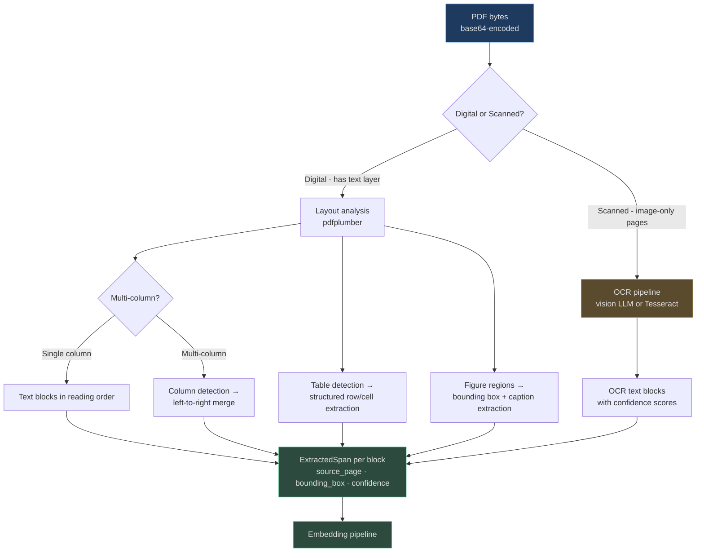
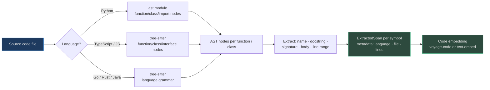

# Text, PDF & Code Processing

The majority of enterprise knowledge lives in documents: contracts, reports, runbooks, codebases. This page covers how AgentVerse turns opaque file formats into structured, citation-ready spans that agents can retrieve with page-level precision.

<!-- Sources: app/multimodal/pipeline.py, app/ingestion/modality_pipeline.py, app/multimodal/models.py -->

---

## Plain Text & Markdown

Text ingestion is the simplest path. `MultimodalPipeline.ingest_text()` wraps the content in a single `ExtractedSpan` with `confidence=1.0` and no parser overhead.

**What happens to Markdown and HTML?**

| Input format | Processing |
|---|---|
| Plain `.txt` | Direct span, no transformation |
| Markdown `.md` | Heading-aware chunking preserves H1/H2 boundaries as natural splits |
| HTML | DOM-text extraction strips tags; `<table>` elements converted to pipe-delimited text |
| RTF | Converted to plain text via rtf parser; style metadata discarded |

**Encoding handling.** The pipeline detects encoding using `chardet` before parsing:
- UTF-8 (primary): passes through unchanged
- Latin-1 / ISO-8859-1: common in legacy European documents
- GB2312 / Big5: Chinese documents from older Windows systems
- Windows-1256: Arabic documents with right-to-left rendering
- After normalisation, all spans are stored as UTF-8 regardless of source encoding

---

## PDF Processing

PDFs are the most common enterprise format and the most structurally complex. A single PDF may combine multi-column layout, embedded images, scanned pages, mathematical notation, and form fields.



### Key extraction properties

Every PDF span carries `source_page` (1-indexed) so agents can provide page citations:
```python
# ExtractedSpan from a PDF at page 47
ExtractedSpan(
    content="The Licensee shall not sublicense the Software...",
    modality=Modality.PDF,
    source_page=47,
    bounding_box={"x": 0.05, "y": 0.32, "width": 0.9, "height": 0.08},
    confidence=0.98,
    language="en",
)
```

### ModalityPipeline configuration

`ModalityPipeline.select_pipeline(ContentType.PDF)` returns:
- **chunker_strategy**: `"layout"` — respects page boundaries and visual layout zones
- **embedding_modality**: `"text"` — text embedder after extraction
- **requires_vision**: `False` for digital PDFs, `True` for scanned

---

## Real-World Examples

### Legal Contract Parsing
**Scenario:** A Fortune 500 legal team uploads 500-page merger agreement PDFs. The firm's lawyers need to quickly locate every clause related to indemnification, governing law, and termination.

**Without multimodal ingestion:** Lawyers manually search with Ctrl+F across 30 documents.

**With AgentVerse:** Each PDF is parsed into per-clause spans with page citation. Hybrid vector + trigram retrieval surfaces `"termination for material breach"` across all 30 documents in <200ms, each result citing `[Exhibit A, page 47, column 2]`.

**At scale:** 200 contracts/day × 300 pages average = 60,000 pages/day → processed by a Celery worker pool in ~15 minutes with 4 workers, each handling ~250 pages/min with `pdfplumber`.

### Financial Report Analysis
**Scenario:** An investment bank ingests 10-K filings from 500 public companies quarterly.

**Processing:** Each filing averages 180 pages. Tables (balance sheets, income statements) are extracted as structured row/cell spans. Charts become figure spans with LLM-generated captions. The annual batch of 500 × 180 = 90,000 pages processes overnight across 20 workers.

---

## DOCX / Word Processing

DOCX files use XML under the ZIP wrapper. The ingestion pipeline:

1. Unzips the `.docx` and parses `word/document.xml`
2. Extracts heading hierarchy (H1–H6) as natural chunk boundaries
3. Extracts tables → per-cell spans with row/column metadata
4. Extracts embedded images → routed through the vision pipeline
5. Ignores revision history (tracked changes) — only the final document state is indexed

`ModalityPipeline` configuration for DOCX: `chunker_strategy="heading"`, ensuring agent retrieval returns full heading-to-heading sections rather than mid-paragraph splits.

---

## Source Code Processing

Code receives specialised treatment because semantic search over code requires **syntactic awareness**, not just token overlap.



`ModalityPipeline.select_pipeline(ContentType.CODE)` returns:
- **chunker_strategy**: `"ast"` — one span per top-level declaration
- **embedding_modality**: `"code"` — code-optimised embedding space

### Real-World: GitHub Repository Indexing

**Scenario:** A dev-tools company indexes 50,000 lines of Python across 400 files so engineers can ask natural-language questions about their codebase.

**Extraction:** 3,200 functions + 480 classes = 3,680 AST-level spans. Each span includes the function signature and docstring for semantic matching, plus the full body for completeness.

**Result:** `"find all functions that handle authentication token refresh"` returns 6 relevant spans across 3 files in <100ms. Engineers no longer grep through the codebase manually.

---

## At Scale: 1M Documents/Day

| Stage | Throughput | Workers | Latency |
|---|---|---|---|
| PDF layout parsing | 250 pages/sec/worker | 40 | ~11 hours for 1M pages |
| Digital text extraction | 1,000 docs/sec/worker | 4 | ~4 minutes for 1M docs |
| Code AST parsing | 500 files/sec/worker | 8 | ~4 minutes for 1M files |
| Embedding (batch of 2048) | 15,000 spans/sec | — | parallel with parsing |

**Distributed architecture:**
- Celery workers pull from per-plan queues (`docs.enterprise`, `docs.free`)
- PDF binary assets stored in MinIO/S3; spans only go to Postgres
- Failed jobs retry with exponential backoff (3 attempts, 30s / 2m / 10m)
- Progress tracked via `AssetIngestionJob` status, pollable by clients

### Estimated cost at 1M PDFs/day (avg 50 pages each)

| Resource | Unit cost | Daily volume | Daily cost |
|---|---|---|---|
| Text extraction (CPU) | $0.01/1K pages | 50M pages | $500 |
| Vision LLM (scanned pages, 20%) | $0.003/page | 10M pages | $30,000 |
| Embedding (50 spans/page avg) | $0.00013/1K tokens | 2.5B tokens | $325 |
| Storage (pgvector spans) | $0.10/GB/mo | ~5GB/day spans | $15/day |

> Scanned PDF OCR via vision LLM is the dominant cost. Organisations with large scanned archives should evaluate Tesseract as a cheaper (but lower-accuracy) alternative for non-critical documents.

---

## Chunking Strategy Deep-Dive

The `ModalityPipeline` assigns a `chunker_strategy` to each content type. This determines how extracted text is split into `ExtractedSpan` objects before embedding.

| Strategy | Content types | Split boundary | Target span size |
|---|---|---|---|
| `semantic` | Plain text, HTML | Paragraph / sentence boundary | 300–800 tokens |
| `layout` | PDF | Page + visual zone boundary | Per page section |
| `heading` | DOCX, Markdown | H1–H4 heading | Full heading section |
| `ast` | Source code | Function / class declaration | One top-level symbol |
| `timestamp` | Audio, Video | N-second window (default 30s) | ~150–300 tokens |
| `scene` | Video | Scene change detection | Per scene |
| `region` | Image, Screenshot | Visual region (text + figure + table) | Per bounding box |
| `row_group` | CSV, TSV | N rows per span (default 50) | Configurable |

### Why chunk size matters for retrieval

Too small: retrieved span lacks context; agent gets `"$4.2M"` without knowing it is Q4 revenue.
Too large: embedding vector averages over too much content; semantically specific query gets diluted match.

**Recommended sizes by use case:**

| Use case | Recommended span size | Reasoning |
|---|---|---|
| Legal clause retrieval | 200–400 tokens | One clause = one retrievable unit |
| Code function search | Full function body | AST boundary is natural unit |
| Meeting transcript Q&A | 30-second windows | Maps to conversational turn length |
| Financial data tables | One table row-group | Preserves row relationships |
| Technical documentation | Paragraph boundary | Answers are paragraph-sized |

---

## Configuration Options

### PDF parser configuration

```python
from app.ingestion.modality_pipeline import ModalityPipeline
from app.ingestion.content_classifier import ContentType

pipeline = ModalityPipeline()
result = pipeline.select_pipeline(ContentType.PDF)

# Result properties:
# result.chunker_strategy = "layout"
# result.embedding_modality = "text"
# result.requires_vision = False  (True for scanned PDFs)
# result.requires_transcription = False
```

### Code parser language support

```python
# Supported languages and their AST strategies:
CODE_LANGUAGES = {
    "python": {
        "parser": "stdlib.ast",
        "extract": ["FunctionDef", "AsyncFunctionDef", "ClassDef"],
        "include_docstrings": True,
        "line_numbers": True,
    },
    "typescript": {
        "parser": "tree-sitter-typescript",
        "extract": ["function_declaration", "class_declaration", "interface_declaration"],
        "include_jsdoc": True,
    },
    "go": {
        "parser": "tree-sitter-go",
        "extract": ["function_declaration", "method_declaration", "type_declaration"],
    },
    "java": {
        "parser": "tree-sitter-java",
        "extract": ["method_declaration", "class_declaration", "interface_declaration"],
    },
}
```

---

## Additional Real-World Example: Regulatory Filing Processing

**Scenario:** A pharmaceutical company must process 10-K filings, FDA submissions (average 2,000 pages), and clinical trial protocols (average 800 pages) for their regulatory intelligence system.

**Document characteristics:**
- Mixed digital and scanned pages (trial protocols from 1990s are scanned)
- Complex tables with footnotes spanning multiple pages
- Section numbering schemes (`21 CFR 312.32(c)(1)(i)` as a citation target)
- Foreign language summaries (Japanese, German, French) in same document

**Processing pipeline configured:**
1. Digital pages → layout parser → per-section spans with regulatory citation metadata
2. Scanned pages → vision LLM OCR → spans with lower confidence (0.75–0.90)
3. Foreign language sections → language detection → `span.language` set to `"ja"`, `"de"`, `"fr"`
4. Tables → structured JSON spans with row/column metadata preserved

**Query example:** `"What adverse events were reported in the phase 2 trial that led to protocol amendments?"` → Retrieves 4 spans across 3 documents, each with regulatory citation (`Clinical Protocol v2.3, Section 8.4, page 47`).

**Volume:** 500 documents/quarter × 1,500 avg pages = 750,000 pages/quarter, processed in 48-hour batch with 20 workers.

---

## Encoding Detection and Language Handling

International documents introduce encoding complexity that must be resolved before any text processing can begin:

```python
import chardet

def detect_and_decode(raw_bytes: bytes) -> tuple[str, str]:
    """
    Returns (decoded_text, encoding_name).
    Falls back to UTF-8 with replacement characters on detection failure.
    """
    detection = chardet.detect(raw_bytes)
    encoding = detection.get("encoding") or "utf-8"
    confidence = detection.get("confidence", 0)

    if confidence < 0.7:
        # Low confidence: try common fallbacks
        for fallback in ["utf-8", "latin-1", "cp1252"]:
            try:
                return raw_bytes.decode(fallback), fallback
            except UnicodeDecodeError:
                continue

    return raw_bytes.decode(encoding, errors="replace"), encoding
```

**Language detection** for span metadata uses `langdetect` or `fasttext`:

| Language | ISO code | Common in |
|---|---|---|
| English | `en` | Default |
| German | `de` | EU regulatory, automotive docs |
| Japanese | `ja` | APAC enterprise, pharma submissions |
| French | `fr` | EU regulatory, international contracts |
| Simplified Chinese | `zh-cn` | APAC corporate docs |
| Arabic | `ar` | MENA financial documents |
| Spanish | `es` | LATAM enterprise contracts |

The detected language is stored in `ExtractedSpan.language` and used by the retrieval system to route language-specific queries to language-appropriate embeddings.

---

## Related Documentation

| Topic | Link |
|---|---|
| Visual content from PDF (images, charts) | [02 — Visual Modalities](./02-visual-modalities.md) |
| Full multimodal pipeline overview | [README](./README.md) |
| RAG retrieval over extracted spans | `docs/wiki/rag/` |
| Knowledge store indexing | `app/knowledge/store.py` |

---

## Frequently Asked Questions

**Q: What is the maximum PDF size that can be processed synchronously?**

The pipeline accepts any size synchronously, but PDFs larger than 50MB or 200 pages should be submitted as async Celery jobs to avoid HTTP request timeouts. Use the `/api/v1/knowledge/ingest-async` endpoint which returns a `job_id` for polling.

**Q: Can the DOCX parser handle tracked changes (revision marks)?**

No. The parser reads the final document state from `word/document.xml` and ignores tracked changes (`w:ins`, `w:del` elements). If you need to ingest the revision history (e.g., legal contract negotiation history), export each version to a separate DOCX and ingest independently with a `collection_id` prefix like `contract-v1-`, `contract-v2-`.

**Q: How does AST chunking handle nested functions and inner classes?**

The code parser extracts top-level declarations by default. Nested functions/classes are included in the parent span's body. If nested functions have independent semantic meaning (common in large Python codebases), set `chunk_nested=True` to create separate spans for each callable regardless of nesting depth. This increases span count but improves retrieval precision for deeply nested utility functions.

**Q: Is there a way to ingest structured data (SQL databases, JSON, CSV)?**

- **CSV/TSV:** Supported via `ModalityPipeline` with `chunker_strategy="row_group"`. Default 50 rows per span.
- **JSON:** Treated as plain text. Pre-process to flatten nested JSON to key-value pairs before ingestion for better retrieval.
- **SQL database tables:** No direct connector. Export table rows to CSV and ingest via the CSV pipeline, or use `ingest_text()` with structured table summaries generated by a pre-processing step.
