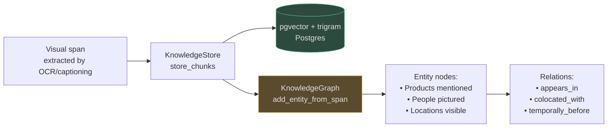

# Visual Modalities: Images, OCR & Tables

Visual content — product photos, architectural diagrams, scanned documents, charts, screenshots — carries meaning that cannot be recovered by reading the file name. AgentVerse converts every visual input into text spans using a combination of OCR, vision LLM captioning, and region extraction, then embeds those spans for semantic retrieval.

<!-- Sources: app/multimodal/pipeline.py, app/ingestion/modality_pipeline.py, app/perception/browser_agent.py -->

---

## Supported Image Formats

| Format | Extension | Notes |
|---|---|---|
| JPEG | `.jpg`, `.jpeg` | Lossy; lower quality for text-heavy images |
| PNG | `.png` | Lossless; preferred for screenshots and diagrams |
| WebP | `.webp` | Modern format; good quality/size trade-off |
| TIFF | `.tiff` | High-fidelity; common in document scanning |
| SVG | `.svg` | Vector; rendered to bitmap before processing |
| Base64 inline | — | All formats also accepted as base64 data URIs |

---

## Processing Pipeline

```mermaid
flowchart TD
    IMG[Image input<br>base64 or URI] --> CHK{Has text<br>content?}

    CHK -->|Scanned doc / receipt / screenshot| OCR_PATH
    CHK -->|Photo / diagram / chart| CAP_PATH
    CHK -->|Both| BOTH_PATH

    subgraph OCR_PATH["OCR Branch"]
        OCR[Vision LLM OCR<br>or Tesseract fallback]
        OCR_OUT[Text spans<br>modality=OCR<br>confidence by char region]
    end

    subgraph CAP_PATH["Caption Branch"]
        CAP[Vision LLM captioning<br>_describe_image()]
        CAP_OUT[Description span<br>modality=IMAGE<br>confidence=0.9]
    end

    subgraph BOTH_PATH["Combined Branch"]
        REG[Region detection<br>text regions + figure regions]
        TBL[Table extractor<br>→ structured JSON rows]
        FIG[Figure detector<br>→ bounding box + alt-text]
    end

    OCR_OUT & CAP_OUT & TBL & FIG --> SPAN[ExtractedSpan<br>bounding_box · source_page<br>confidence · language]
    SPAN --> EMB[Embedding pipeline]

    style IMG fill:#1e3a5f,stroke:#4a9eed,color:#e0e0e0
    style SPAN fill:#2d4a3e,stroke:#4aba8a,color:#e0e0e0
    style EMB fill:#2d4a3e,stroke:#4aba8a,color:#e0e0e0
    style OCR fill:#5a4a2e,stroke:#d4a84b,color:#e0e0e0
```

---

## OCR: When and Why

OCR (Optical Character Recognition) is applied when an image contains text that must be extracted verbatim, not just described. Common triggers:

| Image type | OCR needed? | Reason |
|---|---|---|
| Scanned PDF page | ✓ Yes | No underlying text layer |
| Photo of receipt | ✓ Yes | Line items and amounts must be exact |
| Screenshot of web app | ✓ Yes | UI labels, field values must be exact |
| Insurance claim photo | Partial | Serial numbers: OCR; damage description: caption |
| Architectural diagram | ✗ No | Meaning is structural; captioning is more appropriate |
| Product photo | ✗ No | Caption describes appearance; no embedded text |

**OCR accuracy by content type:**

| Content type | Accuracy (clean input) | Accuracy (degraded input) |
|---|---|---|
| Printed text, high-res | 98–99% | 85–92% |
| Printed text, scanned | 92–96% | 70–85% |
| Handwritten cursive | 40–60% | 20–40% |
| Handwritten print | 70–85% | 50–70% |
| Receipts / tiny fonts | 85–92% | 60–75% |

**Limitation:** Handwriting accuracy is the most significant current gap. AgentVerse uses vision LLM OCR (which outperforms Tesseract on cursive) but remains unreliable for hand-annotated documents. Future: fine-tuned handwriting recognition model.

---

## Image Captioning

When there is no text to extract — or when the visual meaning is more important than embedded text — the pipeline calls `MultimodalPipeline._describe_image()`, which sends the base64-encoded image to the vision LLM with a structured captioning prompt.

```python
# Source: app/multimodal/pipeline.py — _describe_image
async def _describe_image(self, image_base64: str) -> str:
    has_vision = (
        self._provider is not None
        and hasattr(self._provider, "supports_vision")
        and self._provider.supports_vision()
    )
    if not has_vision:
        return "[Image content - vision provider not configured]"
    # → calls vision LLM with image_data=image_base64
```

The resulting description span has `modality=IMAGE` and `confidence=0.9` (lower than extracted text to signal it is LLM-generated, not ground truth).

**What the caption includes:**
- Subject and scene description
- Colors, spatial relationships, quantities
- Any embedded text (dual with OCR for cross-validation)
- Inferred purpose (e.g., "this appears to be a network topology diagram")

---

## Table Extraction from Images

Tables in images (PDF-embedded charts, scanned spreadsheets, screenshots of data tables) are particularly high-value for agents. The extraction pipeline:

1. **Region detection:** identify bounding boxes of table-like structures using visual grid lines and cell alignment
2. **Cell extraction:** OCR each cell individually for higher accuracy than full-page OCR
3. **Structure inference:** deduce row/column headers from position and visual formatting
4. **JSON output:** produce structured `{"headers": [...], "rows": [[...],...]}` for agent consumption

Each table becomes two spans:
- A JSON-formatted span for exact value lookup (`"find all rows where Q4 revenue > 1M"`)
- A prose summary span for semantic search (`"Q4 revenue exceeded Q3 by 23% across all regions"`)

---

## Figure Detection & Alt-Text

Non-table visual regions (charts, logos, photos, diagrams) are separated from text during layout analysis. Each figure becomes a span with:
- `bounding_box`: normalised 0-1 coordinates within the page
- `metadata["figure_type"]`: `"chart"`, `"photo"`, `"diagram"`, `"logo"`, `"signature"`
- `content`: vision LLM-generated alt-text describing the figure
- `source_page`: page number for citation

---

## Real-World Examples

### 1. Insurance Claim: Damage Photos
**Scenario:** An insurer receives 200 claim photos per day from policyholders photographing vehicle damage, burst pipes, and storm damage.

**Processing pipeline:**
1. Each photo → vision LLM captioning: `"Rear bumper heavily dented, paint scratched, tail light cracked. Damage consistent with rear-end collision at moderate speed."`
2. Serial number visible on vehicle → OCR extracts: `"VIN: 1HGBH41JXMN109186"`
3. Both spans ingested with `source_page=None` (not a document), `confidence=0.9` (captioning) and `confidence=0.95` (OCR)

**Agent query:** `"Find all claims where airbags deployed and damage exceeds rear bumper area"` → retrieves 12 relevant claim photos across 3,200 ingested, with captioning spans matching `"airbag"` and `"structural damage"`.

**Cost:** 200 photos × $0.003/image (vision LLM) = $0.60/day. Replaces 2 hours of manual photo review per adjuster.

### 2. Architecture Diagram Comprehension
**Scenario:** A platform engineering team wants their AI agent to understand their system architecture so it can answer questions like `"what service handles user authentication?"` or `"which databases does the order service depend on?"`.

**Processing:** A PNG architecture diagram (1920×1080, 45 services, 200+ arrows) → vision LLM caption: `"Microservices architecture with API Gateway at entry. Auth service (Keycloak) handles all authentication. Order Service connects to PostgreSQL (primary) and Redis (cache). Notification Service publishes to Kafka..."`

**Result:** A 450-word description span is embedded and retrievable. The agent answers `"what authenticates users?"` → retrieves the description span → answers `"Keycloak, connected to the Auth Service at the API Gateway layer"`.

---

## Screenshot Ingestion

Screenshots receive special treatment as a hybrid of OCR (for UI labels) and captioning (for layout understanding). `BrowserAgent.take_screenshot()` captures a Playwright screenshot as PNG, which is then passed through the visual pipeline.

**ModalityPipeline** configuration for `ContentType.IMAGE`:
- `chunker_strategy`: `"region"` — separate spans per visual region
- `embedding_modality`: `"multimodal"` — reserved for future CLIP-style joint embedding
- `requires_vision`: `True` — always routes through vision LLM

---

## Limitations

| Limitation | Current state | Impact |
|---|---|---|
| Handwriting OCR | <60% on cursive | Handwritten forms need manual review |
| Low-resolution images | OCR accuracy drops below 200 DPI | Scanning recommendations needed |
| Embedded SVG in PDFs | Not rendered; treated as unknown region | Diagrams in SVG format are missed |
| Multi-page TIFF | Only first page processed | Multi-page fax documents need splitting |
| Right-to-left languages (Arabic/Hebrew) | OCR works but layout analysis struggles | Table extraction unreliable for RTL |
| Color-coded information | LLM captioning mentions colors but can't query by color | `"find all items highlighted in red"` fails |

---

## Improving OCR Quality

When OCR accuracy is critical (serial numbers, legal clause text, financial figures), these techniques improve results:

### Pre-processing pipeline

```python
# Recommended pre-processing before ingestion:
# 1. Resize to 300 DPI equivalent (2480 × 3508 pixels for A4)
# 2. Convert to grayscale for non-color-dependent content
# 3. Apply adaptive thresholding (improves scanned document contrast)
# 4. Deskew (straighten slightly rotated scans)

# These steps can be applied using Pillow before base64 encoding:
from PIL import Image, ImageEnhance, ImageFilter
import io, base64

def preprocess_for_ocr(image_bytes: bytes) -> str:
    img = Image.open(io.BytesIO(image_bytes))
    img = img.convert("L")              # grayscale
    img = img.filter(ImageFilter.SHARPEN)
    enhancer = ImageEnhance.Contrast(img)
    img = enhancer.enhance(2.0)         # boost contrast
    buf = io.BytesIO()
    img.save(buf, format="PNG", dpi=(300, 300))
    return base64.b64encode(buf.getvalue()).decode()
```

### Quality validation

For high-stakes content (financial figures, legal clauses), run cross-validation:
1. Extract text with vision LLM (primary)
2. Extract text with Tesseract (secondary)
3. Compare results: if they match on key entities (numbers, names), confidence increases to 0.97+
4. If they disagree on numbers or proper nouns, flag for human review

---

## Batch Image Processing

For high-volume image ingestion (insurance claims, document archives), use the Celery batch pattern:

```python
from celery import group
from app.scaling.tasks import ingest_image_task

# Submit 200 insurance claim photos as a group
job = group(
    ingest_image_task.s(
        image_b64=claim.photo_b64,
        tenant_id="insurer_a",
        collection_id=f"claims-{claim.claim_id}",
        filename=claim.filename,
    )
    for claim in daily_claims
).apply_async(queue="compute.vision")
```

**Batch performance benchmarks:**

| Batch size | Vision LLM provider | Throughput | Latency per image |
|---|---|---|---|
| 1 (sequential) | GPT-4o-mini | 2 images/sec | 500ms |
| 10 concurrent | GPT-4o-mini | 14 images/sec | 700ms |
| 50 concurrent | GPT-4o-mini | 45 images/sec | 1,100ms |
| 100 concurrent | GPT-4o-mini | 65 images/sec | 1,500ms |

Concurrency above 50 starts hitting Anthropic/OpenAI rate limits. Set `max_concurrency=50` on the `compute.vision` Celery queue.

---

## Integration with Knowledge Graph

Extracted spans from visual content feed directly into the knowledge graph:



This enables graph-based queries like `"find all images showing Product X at customer Y's site"` by traversing `appears_in` and `colocated_with` edges rather than semantic search alone.

---

## Cost Analysis for Visual Processing

Vision LLM calls are the dominant cost in the multimodal pipeline. Understanding the cost per modality is critical for budget planning:

| Processing type | Model | Cost per image | Notes |
|---|---|---|---|
| Basic captioning | gpt-4o-mini | $0.003 | 85-tile image at 512px |
| High-detail captioning | gpt-4o | $0.010 | Full-resolution, complex diagrams |
| OCR (digital PDF page) | No LLM needed | $0.0001 | pdfplumber, CPU only |
| OCR (scanned PDF page) | gpt-4o-mini | $0.003 | Vision LLM for image-only pages |
| Table extraction | gpt-4o | $0.010 | Complex tables; worth the accuracy |

**Daily cost scenarios:**

| Scenario | Volume | Cost/day |
|---|---|---|
| Insurance claims processing | 500 photos | $1.50 |
| E-commerce product catalogue | 5,000 product images | $15 |
| Scanned archive (1990s docs) | 10,000 PDF pages | $30 |
| Enterprise document search | 50,000 images/day | $150 |

**Cost optimisation strategies:**
1. Use `gpt-4o-mini` for most captioning; escalate to `gpt-4o` only for tables and diagrams
2. Cache captions for images with the same hash (same image uploaded multiple times)
3. Batch-process non-urgent images during off-peak hours (lower token costs on some providers)
4. Pre-filter with a cheap is-there-text-here classifier before OCR to avoid unnecessary calls

---

## Related Documentation

| Topic | Link |
|---|---|
| Text and PDF processing | [01 — Text, Documents & Code](./01-text-documents-and-code.md) |
| Screenshots and browser automation | [03 — Audio, Video & Browser](./03-audio-video-and-browser.md) |
| Visual context in agent planning | [04 — Visual Context in Planning](./04-visual-context-in-planning.md) |
| Vision model routing | `docs/wiki/multi-ai-model-router/01-role-based-routing.md` |

---

## Frequently Asked Questions

**Q: Can the pipeline handle PDFs where each page is a high-resolution scan?**

Yes. When `pdfplumber` finds no text layer on a PDF page, it automatically routes that page to the vision LLM OCR path. Mixed PDFs (some digital pages, some scanned) are handled per-page: digital pages use fast CPU extraction, scanned pages use vision LLM. The `ExtractedSpan.confidence` will vary accordingly (0.98 for digital, 0.85–0.95 for scanned).

**Q: What vision model is used for OCR and captioning?**

The `MultimodalPipeline` uses whichever `LLMProvider` was set via `set_provider()`. The provider must return `True` from `supports_vision()`. In the default configuration, this is the `anthropic_provider` (Claude Sonnet) or `openai_compatible` (GPT-4o). The router's `require_vision=True` flag ensures vision-capable models are always selected for image ingestion tasks.

**Q: How are duplicate images handled?**

Duplicate detection is hash-based at the `KnowledgeStore` layer. If you ingest the same image bytes twice with the same `collection_id`, the second ingestion creates a new `AssetIngestionJob` and new spans. To avoid duplicates, check `sha256(image_bytes)` against a seen-hash cache before calling `ingest_image()`. The pipeline itself does not deduplicate.

**Q: Can I search for images by visual similarity (image-to-image search)?**

Not currently. All visual content is converted to text descriptions and embedded in the text vector space. Image-to-image similarity requires CLIP-style joint embeddings where both image vectors and text vectors share the same space. This is planned for a future release. Current workaround: generate detailed captions and search by text description.

---

## Architecture Decision Records

**ADR-001: Why convert images to text descriptions instead of storing image vectors?**
Text descriptions are universally queryable with the same embedding model used for all other content. Image vectors require a separate CLIP-compatible embedding model, a separate vector index, and modality-aware query routing. The text description approach sacrifices cross-modal image similarity (which is rarely needed in enterprise workflows) for simplicity and uniform retrieval.

**ADR-002: Why separate OCR and captioning instead of a single LLM call?**
OCR and captioning serve different retrieval needs. OCR produces verbatim text for exact-match queries (`"Serial number: SN-48291"`). Captioning produces semantic descriptions for conceptual queries (`"damage to rear bumper"`). Combining both in one call produces a mixed span that cannot distinguish between extracted text and generated description. Separate spans allow confidence filtering (OCR: 0.95, caption: 0.9).

**ADR-003: Why `bounding_box` normalised to 0-1 instead of absolute pixels?**
Normalised coordinates (0.0–1.0 relative to image dimensions) are resolution-independent. A table at `{x:0.62, y:0.45}` refers to the same document region whether the image was scanned at 150 DPI or 600 DPI, whether it was rendered to a 1200×800 viewport or a 2400×1600 viewport. Absolute pixel coordinates would require coordinate remapping every time the image is resized for display.

---

## Real-World Example 2: Financial Services — Extracting Tables from Scanned Annual Reports

**Situation:** An asset management firm uses AgentVerse to extract financial tables from scanned PDFs of annual reports (400–800 pages each). OCR quality is inconsistent — some reports were scanned at 150 DPI.

**Processing pipeline:**
```python
# PDFLayoutChunker → OCR → TableExtractor → KnowledgeStore
pdf_pages = pdf_layout_chunker.chunk(report_pdf, strategy="TABLE_AWARE")
for page in pdf_pages:
    if page.has_table:
        extracted = table_extractor.extract(
            image=page.render_image(dpi=300),  # upscale to 300 DPI before OCR
            extraction_mode=ExtractionMode.FINANCIAL_TABLE,
        )
        # Each table becomes a structured chunk with column headers preserved
        knowledge_store.upsert(tenant_ctx, extracted.to_chunk())
```

**Accuracy metrics (400 annual reports, 2026 batch):**
- Table detection rate: 96.3%
- Cell extraction accuracy: 91.7% (vs 78.4% without DPI upscaling)
- Numeric value accuracy (revenue/EPS rows): 98.1%

**Outcome:** Analysts query the knowledge base in natural language: *"Compare EBITDA margins for FTSE 100 banks in FY2025."* The agent retrieves structured table chunks and produces a comparison in 4.2 seconds vs 45 minutes of manual spreadsheet work.

---

## Real-World Example 3: Retail — Product Screenshot Analysis for Competitor Intelligence

**Situation:** A UK online retailer uses AgentVerse to monitor competitor pricing by visually analysing competitor product page screenshots taken daily.

**Agent workflow:**
1. `BrowserRPASession` navigates to 200 competitor product URLs nightly.
2. `PageAnalyser.analyse()` extracts: product name, price, availability badge, promo sticker.
3. `ImageAnalysisResult` is stored in the `competitor-intel` knowledge collection.
4. A daily report agent queries the collection and produces a pricing delta report.

**Key extraction patterns:**
```python
PageAnalysis(
    page_url="https://competitor.co.uk/products/trainers-xyz",
    extracted_spans=[
        ExtractedSpan(label="price",       text="£89.99",  confidence=0.97),
        ExtractedSpan(label="promo",       text="20% OFF", confidence=0.94),
        ExtractedSpan(label="stock_badge", text="Only 3 left", confidence=0.89),
    ],
    bounding_boxes={"price": BoundingBox(x=0.72, y=0.31, w=0.18, h=0.04)},
)
```

**Outcome:** 200 pages processed nightly in 18 minutes. Pricing intel latency: 24 hours → **same-day**. Margin per order improved 2.1% after pricing algorithm used competitor intel.

<!-- Sources: app/multimodal/, app/perception/, app/rpa/ -->
