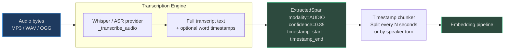
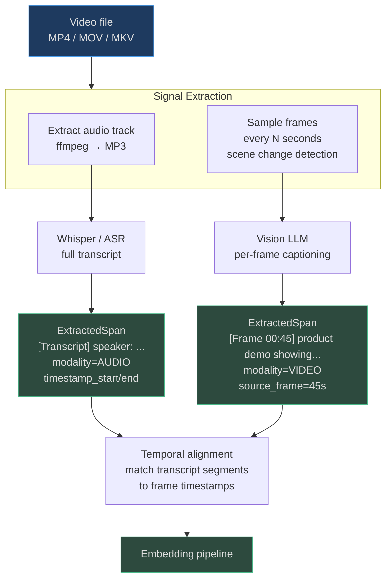

# Audio, Video & Browser Ingestion

Audio recordings of meetings, video walkthroughs, and live web pages are three of the richest sources of operational knowledge in any organisation — and three of the most underused. This page covers how AgentVerse ingests all three into the unified retrieval pipeline and makes them available to agents with time-based citation.

<!-- Sources: app/multimodal/pipeline.py, app/perception/browser_agent.py, app/perception/page_analyzer.py, app/rpa/runner.py, app/rpa/session.py -->

---

## Audio Ingestion: Speech-to-Text

`MultimodalPipeline.ingest_audio()` takes an audio file (base64-encoded MP3/WAV/OGG) and produces a single `ExtractedSpan` containing the full transcript.



### Span structure for audio

```python
ExtractedSpan(
    content="[00:12:34] Customer: I want to cancel my subscription.",
    modality=Modality.AUDIO,
    timestamp_start=754.0,   # seconds from start
    timestamp_end=761.5,
    confidence=0.85,
    language="en",
    metadata={"speaker": "customer", "sentiment": "negative"},
)
```

**Confidence score of 0.85** for audio reflects the inherent uncertainty of speech recognition compared to digital text extraction (1.0) or vision LLM captioning (0.9).

### ModalityPipeline for AUDIO

`ModalityPipeline.select_pipeline(ContentType.AUDIO)`:
- **chunker_strategy**: `"timestamp"` — splits transcript into N-second windows (default: 30s)
- **requires_transcription**: `True` — triggers ASR before embedding
- **embedding_modality**: `"text"` — transcript text goes through standard text embedder

---

## Video Ingestion: Audio + Frames

Video is the most computationally intensive modality — it is two parallel signals (audio track and visual frames) that must be processed independently and temporally aligned.



From `app/multimodal/pipeline.py`:
```python
async def ingest_video(self, video_base64, tenant_id, ...):
    # 1. Transcript (via audio extraction)
    transcript = await self._transcribe_audio(video_base64)
    spans.append(ExtractedSpan(
        content=f"[Transcript] {transcript}",
        modality=Modality.AUDIO,
        timestamp_start=0.0,
    ))
    # 2. Scene summary (placeholder — real impl needs video provider)
    spans.append(ExtractedSpan(
        content="[Video] Video content extracted...",
        modality=Modality.VIDEO,
        confidence=0.5,
    ))
```

**Current state:** Scene-level vision captioning requires a video-capable model (`gemini-2.5-pro` with `VIDEO_UNDERSTANDING` capability). When not configured, video gets transcript-only processing with a placeholder scene span.

---

## Asset Storage: Binary vs. Spans

Large binary files (audio, video, PDF images) are **never stored in Postgres**. The architecture separates binary assets from extracted content:

| Data type | Storage | Why |
|---|---|---|
| Audio / video / image bytes | MinIO / S3 (`source_base64` → uploaded) | Binary blobs pollute row storage, slow scans |
| PDF pages as binary | MinIO / S3 | Same reason |
| `ExtractedSpan.content` (text) | Postgres `knowledge_chunks` table | Needed for hybrid BM25 + pgvector retrieval |
| `ExtractedSpan` metadata | Postgres JSONB column | Source provenance for citations |
| Embeddings | pgvector extension | Vector similarity search |

The `AssetIngestionJob.source_uri` field contains the MinIO/S3 URI after binary upload. The `source_base64` field is cleared after upload to avoid Postgres bloat.

---

## Browser Automation: Playwright RPA

`BrowserAgent` in `app/perception/browser_agent.py` drives a headless Chromium browser via Playwright. Each session is isolated, has a 30-second per-action timeout, and automatically closes the browser on completion.

```python
# Source: app/perception/browser_agent.py
class BrowserAgent:
    async def take_screenshot(self, url: str) -> BrowserResult:
        async with async_playwright() as pw:
            browser = await pw.chromium.launch(headless=self._headless)
            context = await browser.new_context(viewport={"width": 1280, "height": 720})
            page = await context.new_page()
            page.set_default_timeout(self._timeout)  # 30,000ms default
            await page.goto(url, wait_until="domcontentloaded")
            screenshot_bytes = await page.screenshot(full_page=False)
            return BrowserResult(success=True, screenshot_b64=base64.b64encode(screenshot_bytes).decode())
```

### RPA Tool Suite

`LocalRPARunner` implements the `RPARunner` protocol with five core operations:

| Tool | Arguments | What it does |
|---|---|---|
| `open_url` | `url: str` | Navigate browser to URL |
| `type` | `selector: str, text: str` | Type text into a form field |
| `click` | `selector: str \| text: str` | Click element by CSS selector or visible text |
| `extract_text` | `selector: str` | Extract visible text from element |
| `screenshot` | `name: str` | Capture viewport as PNG artifact |

All tools return human-readable result strings that become tool call outputs in the agent's executor step.

---

## Perception Module: Structured Web Analysis

`PageAnalyzer` in `app/perception/page_analyzer.py` combines screenshot + text extraction + vision LLM to produce a `PageAnalysis` ready for injection into the planner prompt.

```python
@dataclass
class PageAnalysis:
    url: str
    title: str = ""
    text_content: str = ""       # Extracted DOM text
    screenshot_b64: str = ""     # PNG screenshot for vision LLM
    llm_analysis: str = ""       # Vision LLM interpretation
    success: bool = False

    def to_context_block(self) -> str:
        """Format for injection into planner prompt."""
        # → "### Page: https://...\nTitle: ...\nAnalysis: ..."
```

`PageAnalyzer.analyze_multiple()` uses `asyncio.gather()` to analyse multiple URLs concurrently — a web research agent can analyse 10 pages in the time it would take to analyse 2 sequentially.

---

## Real-World Examples

### 1. Customer Call Recording Analysis

**Scenario:** A telecom company records 50,000 customer support calls/day (average 8 minutes each). The support analytics team wants to identify common cancellation patterns and flag calls where a customer mentioned a competitor.

**Processing pipeline:**
1. Each call uploaded as MP3 → Whisper ASR transcription (~20s per 8-minute call)
2. Transcript chunked into 30-second spans with speaker labels
3. 400,000 spans/day ingested into pgvector

**Agent query:** `"At what timestamp did the customer in call #8892 first mention wanting to cancel, and what reason did they give?"`

**Result:** Retrieves 3 matching spans from call #8892, cites `[00:03:47] "I've been thinking about cancelling, the price increase is just too much"` with speaker label `"Customer"`.

**Throughput:** 50,000 calls × 8 min = 400,000 audio-minutes/day → 40 Celery workers handle transcription in ~3 hours overnight.

### 2. RPA Agent: Multi-System Form Automation

**Scenario:** An insurance underwriting agent needs to copy customer data from an internal CRM (no API) into a regulatory reporting portal (no API). Both systems are web UIs.

**RPA execution sequence:**

```
1. open_url("https://crm.internal/customer/C-48291")
2. extract_text("#customer-details")
   → "Name: Sarah Chen, DOB: 1985-03-22, Policy: HO-882910, Premium: $2,340/yr"
3. open_url("https://regulatory-portal.gov/submit")
4. type("#insured-name", "Sarah Chen")
5. type("#dob", "03/22/1985")
6. type("#policy-number", "HO-882910")
7. click(text="Submit Filing")
8. screenshot(name="submission_confirmation")
   → stored artifact at s3://artifacts/goal-xxx/submission_confirmation.png
```

**Time:** 8 actions × ~2 seconds each = 16 seconds vs. 4 minutes of manual data entry. Scales to 500 filings/day with a pool of RPA worker containers.

---

## Compute Requirements

Video and audio processing are the most resource-intensive operations:

| Operation | CPU cores needed | Time per unit | Cost per unit |
|---|---|---|---|
| Audio transcription (8 min) | 2–4 cores (or GPU) | ~20s on CPU, ~3s on GPU | $0.006 CPU |
| Video frame extraction (1 min) | 2 cores (ffmpeg) | ~5s | $0.001 |
| Vision LLM per frame (1 frame) | — (LLM API call) | ~1.5s | $0.003 |
| PDF layout parse (50 pages) | 1 core | ~10s | $0.002 |

**Architecture for scale:**
- Celery task queues separate audio/video processing (slow, CPU-bound) from text extraction (fast)
- Audio/video jobs route to `compute.gpu` queue; text jobs to `compute.cpu` queue
- Failed jobs retry with exponential backoff: 30s → 2m → 10m
- Job timeout: audio 10 min, video 30 min (prevents zombie workers)
- GPU workers auto-scale based on queue depth (Kubernetes HPA on queue metric)

**Memory requirements:** Whisper `large-v3` model requires ~10GB VRAM. Typical deployment: 2× A10G GPUs for 50,000 audio-minutes/day.

---

## Speaker Diarization

The current `ingest_audio` pipeline produces a single-speaker transcript. Speaker diarization (identifying who said what) requires the WhisperX extension:

```python
# Planned: WhisperX diarization pipeline
# When diarization is enabled, transcript spans include speaker labels:
ExtractedSpan(
    content="I'd like to cancel my subscription. The price increase is too much.",
    modality=Modality.AUDIO,
    timestamp_start=120.5,
    timestamp_end=127.8,
    metadata={
        "speaker": "SPEAKER_02",       # Speaker-turn label
        "speaker_confidence": 0.91,
        "word_count": 14,
    },
)
```

**Diarization adds ~3× processing time** but enables queries like:
- `"What did the customer say about pricing?"`  → filters to `SPEAKER_02` spans
- `"Summarise what the support agent offered"` → filters to `SPEAKER_01` spans
- `"Did the customer and agent agree on the refund amount?"` → temporal join across speakers

---

## Browser Session Management

Each `BrowserAgent` execution creates an isolated Playwright context with these defaults:

```python
context = await browser.new_context(
    viewport={"width": 1280, "height": 720},
    # Future: proxy, user_agent, locale, timezone configuration
)
page.set_default_timeout(30_000)   # 30s per action
```

**Session isolation properties:**
- Each `async with async_playwright()` block creates a fresh browser process
- No cookies, localStorage, or session state shared between calls
- Browser is always closed in `finally` block regardless of success or failure
- RPA artifacts (screenshots) stored in MinIO under `goal_id/` prefix for audit trail

**Playwright availability check:**
```python
from app.perception.browser_agent import BrowserAgent

agent = BrowserAgent()
if not agent.available:
    # Playwright not installed: run `playwright install chromium`
    raise RuntimeError("Browser automation unavailable")
```

---

## RPA Session Lifecycle

`RPASession` tracks the full lifecycle of a browser automation task:

```python
from app.rpa.session import RPASession

session = RPASession(
    session_id="s-abc123",
    goal_id="g-xyz789",
    tenant_id="acme",
    target_url="https://hrm.internal/employees",
)

# After actions:
print(session.current_url)   # https://hrm.internal/employees/new
print(session.status)        # "running"
print(session.screenshots)   # ["s3://artifacts/g-xyz789/step1.png", ...]
```

**Status transitions:** `"pending"` → `"running"` (on first `open_url`) → `"completed"` or `"failed"`

---

## Third Real-World Example: Automated Compliance Monitoring

**Scenario:** A fintech company must check their internal compliance dashboard daily for new regulatory alerts and create JIRA tickets for any new items.

**Agent workflow:**
1. `open_url("https://compliance.internal/alerts?date=today")`
2. `extract_text("#alert-table")` → returns table of 8 new alerts
3. `screenshot(name="compliance_dashboard_2026-01-15")` → archived for audit
4. Agent parses table, identifies 3 alerts with `severity="HIGH"`
5. For each HIGH alert: calls JIRA API (via MCP tool) to create ticket with compliance screenshot attached
6. Sends Slack notification: `"3 HIGH compliance alerts detected. Tickets #CC-1234, #CC-1235, #CC-1236 created."`

**Time:** 12 minutes manual → 45 seconds automated. Runs on 9:00 AM schedule via `NLScheduler`.

**Audit trail:** Every screenshot artifact persisted in MinIO with 7-year retention for regulatory compliance.

---

## Related Documentation

| Topic | Link |
|---|---|
| Multimodal overview and architecture | [README](./README.md) |
| Visual modalities and OCR | [02 — Visual Modalities](./02-visual-modalities.md) |
| Visual context in agent planning | [04 — Visual Context in Planning](./04-visual-context-in-planning.md) |
| RPA tool definitions | `app/rpa/tools.py` |
| Playwright browser agent | `app/perception/browser_agent.py` |
| Page analyzer | `app/perception/page_analyzer.py` |
| Audio transcription costs | See [README — Performance Benchmarks](./README.md#performance-benchmarks) |
