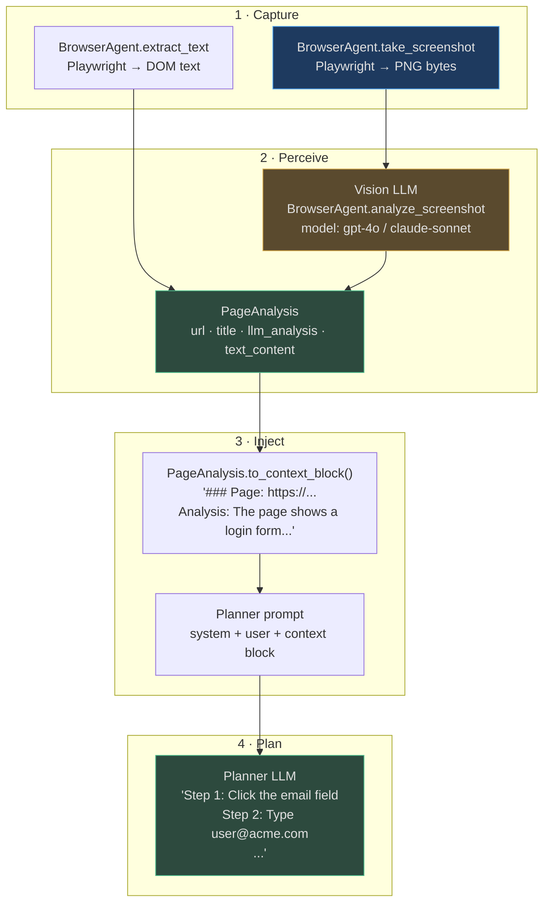

# Visual Context in Agent Planning

An agent that can only process text is blind to half the interfaces it needs to interact with. Most enterprise software exposes no API — it exposes a web UI. Most evidence in the real world is visual — photos, diagrams, live dashboards. This page explains how AgentVerse bridges the gap between visual perception and language model planning.

<!-- Sources: app/perception/browser_agent.py, app/perception/page_analyzer.py, app/perception/multimodal.py, app/rpa/runner.py, app/multimodal/pipeline.py -->

---

## How Visual Content Reaches the Planner

The path from a screenshot to a planner decision has four steps:



The key is `PageAnalysis.to_context_block()`, which formats the visual analysis as a Markdown block that slots naturally into the planner's system prompt:

```python
# Source: app/perception/page_analyzer.py
def to_context_block(self) -> str:
    parts = [f"### Page: {self.url}"]
    if self.title:
        parts.append(f"Title: {self.title}")
    if self.llm_analysis:
        parts.append(f"Analysis:\n{self.llm_analysis}")
    elif self.text_content:
        parts.append(f"Content (truncated):\n{self.text_content[:1000]}")
    return "\n".join(parts)
```

---

## Screenshot Context: What the Agent Sees

When an agent takes a screenshot mid-execution, it gets a structured view of the current UI state. The vision LLM analysis typically includes:

| Component | What gets extracted | How planner uses it |
|---|---|---|
| Page title / URL | Navigation breadcrumb | Confirms agent is on correct page |
| Form fields | Field names, current values, validation errors | Knows what to fill and in what order |
| Button labels | All visible action buttons | Knows what actions are possible |
| Table data | Headers, row counts, visible values | Can reference specific rows |
| Error messages | Error text and location | Triggers error-recovery replanning |
| Navigation elements | Menu items, tabs, breadcrumbs | Plans multi-step navigation |

### Real screenshot → context block example

**Screenshot:** The user management page of an internal HR system after a failed user creation attempt.

**Vision LLM analysis:**
```
The page shows a user creation form. An error banner reads: "Email already exists in 
the system". The form has fields: First Name (filled: "Jane"), Last Name (filled: "Doe"), 
Email (filled: "jane.doe@company.com"), Department (empty, dropdown), Role (empty, 
dropdown). A "Create User" button is visible at the bottom. A "Cancel" link is in the top-right.
```

**Planner receives this in context and replans:**
```
Step 1: The email jane.doe@company.com already exists. Search for existing user first.
Step 2: Navigate to User Search, query "jane.doe@company.com".
Step 3: If user found, update their department instead of creating duplicate.
```

---

## Multimodal Embeddings: Cross-Modal Search

`ModalityPipeline.select_pipeline(ContentType.IMAGE)` returns `embedding_modality="multimodal"` — a forward-looking slot for CLIP-style joint embedding where images and text share the same vector space.

**Current state:** Vision content is converted to text descriptions, which are then embedded in the standard text embedding space. This means:
- `"find images related to network topology"` → finds spans containing network topology descriptions
- `"find all screenshots where an error was visible"` → finds spans containing words like "error", "failed", "exception"

**Future: Direct joint embedding** where image vectors and text vectors are projected into the same space — enabling `"find images visually similar to this one"` without text as an intermediary. This requires a CLIP-compatible embedding model endpoint registered under `ModelCapability.EMBEDDING`.

---

## Visual Grounding: Citing Source Regions

Every `ExtractedSpan` from visual processing carries `bounding_box` — a normalised 0-1 region within the source image or PDF page:

```python
ExtractedSpan(
    content="The Q4 revenue figure shows $4.2M, up 23% from Q3",
    modality=Modality.IMAGE,
    source_page=12,             # PDF page
    bounding_box={"x": 0.62, "y": 0.45, "width": 0.30, "height": 0.08},
    confidence=0.94,
)
```

Agents can use this to provide **pixel-precise citations**: `"On page 12, in the top-right quadrant of the chart (x=62%, y=45%), the Q4 revenue figure..."`. This is particularly valuable for:
- Financial reporting (cite the exact cell in a table)
- Legal documents (cite the exact clause in a contract page)
- Audit trails (cite the exact button clicked in an RPA session)

---

## Limitations: Current Model Vision Capabilities

| Limitation | Details | Workaround |
|---|---|---|
| Token cost | Vision input adds ~765 tokens per image at full resolution | Resize to 512×512 for simple UIs; use full resolution for complex documents |
| Latency | Vision LLM call adds 1–3 seconds per screenshot | Cache analysis for the same URL + hash combination |
| Context length | Planner prompt has limited space for many page analyses | Use `PageAnalyzer.analyze_multiple()` but inject only top-2 most relevant analyses |
| Dynamic content | JavaScript-rendered content requires `wait_until="networkidle"` | Set `wait_until="networkidle"` at cost of +500ms per screenshot |
| CAPTCHA / anti-bot | Playwright sessions may be detected and blocked | Rotate user agents; use proxy rotation for external sites |
| Infinite scroll | Single screenshot misses below-the-fold content | Scroll + screenshot loop; limit to 3 screenshots per page |

---

## Real-World Examples

### 1. Web Automation Agent: Expense Report Filing

**Scenario:** An enterprise expense management system has no API. The accounting team needs to file 200 expense reports per day from scanned receipts.

**Agent workflow:**
1. Ingest receipt image → OCR extracts `"Uber: $24.50, 2024-01-15, Business Travel"`
2. `BrowserAgent.take_screenshot("https://expenses.internal")` → vision LLM sees login form
3. Planner: `"Step 1: Navigate to New Expense. Step 2: Fill Category=Travel, Amount=$24.50, Date=01/15/2024, Description=Uber - Business Travel. Step 3: Attach receipt image. Step 4: Submit."`
4. Executor runs RPA tool sequence: `open_url → type → type → click → screenshot(confirmation)`
5. Confirmation screenshot archived as audit artifact in MinIO

**Time:** 45 seconds per report vs. 8 minutes manual. 200 reports/day → saves 25 person-hours/day.

### 2. Competitive Intelligence Agent

**Scenario:** A product team wants daily monitoring of a competitor's pricing page.

**Agent workflow:**
1. `PageAnalyzer.analyze_url("https://competitor.com/pricing", question="What are the current pricing tiers and features?")` 
2. Vision LLM analysis: `"Three tiers: Starter $29/mo (5 users, 10GB), Pro $99/mo (25 users, 100GB, API access), Enterprise custom pricing. Annual discount 20% for all tiers. New: AI add-on for $49/mo."`
3. Stored as span in knowledge store with timestamp
4. Agent compares today's span with yesterday's: `"AI add-on is new — was not present yesterday. Enterprise page link changed from /enterprise to /contact-sales."`
5. Sends Slack notification: `"Competitor launched AI add-on at $49/mo. Recommend reviewing our AI pricing position."`

**Value:** No engineer time needed; product manager gets daily diffs on competitor positioning.

---

## Future Roadmap

| Feature | Expected impact | Prerequisites |
|---|---|---|
| Direct image input to planner | No text conversion overhead; planner sees raw image | Vision-capable planner models (Sonnet 3.5, GPT-5.2 with vision) |
| CLIP-style joint embeddings | Find images by visual similarity to other images | CLIP model endpoint registered as `ModelCapability.EMBEDDING` |
| Video understanding in planner | Agent watches tutorial videos to learn procedures | Gemini 2.5 Pro integration with `VIDEO_UNDERSTANDING` capability |
| Real-time browser streaming | Agent sees live page changes without screenshots | WebSocket-based DOM change events to agent |
| OCR confidence thresholding | Auto-flag low-confidence regions for human review | Per-character confidence from vision LLM response |
| Multi-page visual context | Inject 5+ page analyses without prompt overflow | Context compression / summarisation layer |

---

## Context Budget Management

Vision LLM analysis is expensive both in time (1–3 seconds) and tokens (300–800 tokens per analysis). For agents analysing multiple pages, context budget management is critical:

```python
# Efficient multi-URL analysis with result truncation
analyses = await page_analyzer.analyze_multiple(
    urls=["https://page1.com", "https://page2.com", "https://page3.com"],
    question="What actions can I take on this page?",
)

# Build context block for planner
context_block = page_analyzer.build_context_block(analyses)

# Approximate token count:
# 3 URLs × 200 tokens average per analysis = ~600 tokens context overhead
# Safe for 4K context models; negligible for 200K context Claude
```

**Token budget guidelines:**

| Model context | Max pages to analyse | Recommendation |
|---|---|---|
| 4K (legacy) | 1 page | Only analyse the current page |
| 8K | 2–3 pages | Analyse entry point + current page |
| 32K | 5–10 pages | Full navigation path analysis |
| 128K+ | Unlimited | Full site analysis before planning |

---

## Debugging Visual Perception

When agents make wrong navigation decisions, the root cause is often in the visual perception layer. Debug steps:

### 1. Inspect the captured screenshot
```python
import base64, io
from PIL import Image

# Get screenshot from BrowserResult
result = await browser_agent.take_screenshot("https://target-page.com")
img = Image.open(io.BytesIO(base64.b64decode(result.screenshot_b64)))
img.save("/tmp/debug_screenshot.png")
# Visually inspect: is the page rendered correctly? Is content visible?
```

### 2. Inspect the vision LLM analysis
```python
# Enable verbose logging for vision analysis
analysis = await page_analyzer.analyze_url(
    "https://target-page.com",
    question="What buttons and form fields are visible on this page?",
    extract_text=True,
    take_screenshot=True,
)
print("Vision analysis:", analysis.llm_analysis)
print("DOM text (first 500 chars):", analysis.text_content[:500])
```

### 3. Common failure patterns

| Symptom | Likely cause | Fix |
|---|---|---|
| Agent clicks wrong button | Vision LLM hallucinated button label | Add `extract_text=True`; DOM text is more reliable than vision for labels |
| Agent can't find page element | Dynamic content not loaded | Use `wait_until="networkidle"` in `page.goto()` |
| Vision analysis is generic | Screenshot is blank/loading screen | Increase `timeout_ms` to 60,000 for slow pages |
| Agent navigates to wrong URL | URL extracted incorrectly from DOM | Extract href attributes directly via `page.query_selector_all("a")` |

---

## Integration with Memory: Persistent Visual State

For long-running RPA workflows that span multiple sessions, `PageAnalysis` results can be stored in `LongTermMemoryStore`:

```python
# Store page state for future sessions
from app.memory.store import LongTermMemoryStore

memory = LongTermMemoryStore()
await memory.store(
    tenant_id=tenant_id,
    goal_id=goal_id,
    key="hr_portal_login_form",
    value=analysis.to_context_block(),
    ttl_hours=24,  # Re-analyse every 24 hours (page layout may change)
)

# Retrieve in future sessions to skip re-analysis
cached = await memory.retrieve(tenant_id, "hr_portal_login_form")
if cached:
    # Inject cached analysis into planner; skip screenshot
    planner_context = cached
else:
    # Re-analyse and cache
    analysis = await page_analyzer.analyze_url(url)
    await memory.store(..., value=analysis.to_context_block())
```

**TTL strategy:** Set TTL based on how frequently the target page layout changes:
- Login forms: 24 hours (UI rarely changes)
- Dashboard pages: 1 hour (content changes but layout is stable)
- Dynamic list pages: no cache (content changes every request)

---

## Token Cost of Visual Context

Visual context injection adds tokens to the planner prompt. Budget accordingly:

| Visual context type | Approximate tokens | Cost at $0.003/1k (Sonnet) |
|---|---|---|
| Single page analysis | 200–400 tokens | $0.00060–$0.00120 |
| 3-page analysis block | 600–1,200 tokens | $0.00180–$0.00360 |
| DOM text (1,000 chars truncated) | 250 tokens | $0.00075 |
| Screenshot description (detailed) | 400–800 tokens | $0.00120–$0.00240 |

For a complex RPA workflow with 10 intermediate screenshots (each re-analysed), the visual context alone can consume 4,000–8,000 tokens — ~5% of a 128K context window. This is acceptable for high-context models but significant for 8K models.

**Mitigation:** Use `to_context_block()` truncation. The default 1,000-character limit on `text_content` prevents DOM text from dominating the prompt. For vision analyses, summarise after 3 screenshots by asking the planner: `"Given the screenshots so far, what is the current state in one paragraph?"` and replace the 3 detailed blocks with the summary.

---

## Related Documentation

| Topic | Link |
|---|---|
| Multimodal pipeline overview | [README](./README.md) |
| Browser automation and RPA | [03 — Audio, Video & Browser](./03-audio-video-and-browser.md) |
| Visual modalities (images, OCR) | [02 — Visual Modalities](./02-visual-modalities.md) |
| Agent loop planner prompt structure | `docs/wiki/agent-loop/` |
| Vision model selection | `docs/wiki/multi-ai-model-router/01-role-based-routing.md` |

---

## Frequently Asked Questions

**Q: Does the planner receive the raw screenshot pixels, or only the text analysis?**

Currently: text analysis only. The `PageAnalysis.to_context_block()` converts everything to Markdown text blocks that are injected into the planner's string prompt. Raw images in the prompt (vision-in-context) require vision-capable planner models and are reserved for the future roadmap. The text description approach is more token-efficient and works with any planner model regardless of vision capability.

**Q: How does the agent know when to take a screenshot vs. using cached page state?**

The agent decides based on the task context in its planner prompt. If the goal includes `"navigate to"` or `"check the current state of"`, the planner will generate steps that include `take_screenshot` as an explicit action. The `LongTermMemoryStore` cache for page analyses acts as a passive hint — if cached state is injected into context, the planner may skip re-analysis. However, for dynamic pages, the planner should always re-screenshot to get current state.

**Q: Can the agent interact with file upload dialogs?**

Playwright supports file input elements via `page.set_input_files(selector, file_path)`. The `BrowserAgent` does not currently expose this as a named RPA tool. Workaround: use the `custom_action` escape hatch in `execute_rpa_tool()` with a custom Playwright script. File upload support via a dedicated `upload_file` tool is planned.

**Q: What happens if a screenshot fails (network error, page load timeout)?**

`BrowserResult.success=False` with `error` populated. The `PageAnalysis.success=False` propagates this failure. The planner prompt injection skips unsuccessful analyses. The agent falls back to DOM text extraction (`extract_text=True`) which is often available even when screenshots fail. If both fail, the agent continues without page context and may generate less accurate navigation steps.

---

## Architecture Decision Records

**ADR-001: Why text-based context injection instead of image-in-prompt?**
Not all planner models support vision input. Using text descriptions makes the visual context pathway work with any model (including older GPT-4o and Claude Haiku). When the planner is upgraded to a vision-native model (Sonnet 3.5, GPT-5.2), raw images can be injected directly for higher fidelity. The `to_context_block()` abstraction makes this switch transparent: replace the method to return a vision message instead of a text block.

**ADR-002: Why is `PageAnalysis` a separate dataclass from `ExtractedSpan`?**
`PageAnalysis` is ephemeral — it is created during a single agent execution for immediate planner injection and discarded. `ExtractedSpan` is persistent — stored in the knowledge store for long-term retrieval. They have different lifecycles and different consumers. Conflating them would couple the ephemeral perception layer to the persistent knowledge layer, making both harder to evolve independently.

---

## Real-World Example 1: SaaS Company — UI Automation from Visual Context

**Situation:** A SaaS company uses AgentVerse to automate multi-step form submissions in a legacy CRM that has no API (web-UI only). The Planner must extract field positions from a screenshot before generating the execution plan.

**Visual context injection flow:**
```
Screenshot captured → PageAnalyser.analyse()
    → PageAnalysis {
         page_title: "New Customer Form — CRM v3.1",
         extracted_spans: [
           ("label", "Company Name", box=(0.12, 0.22, 0.28, 0.04)),
           ("input", "", box=(0.42, 0.22, 0.40, 0.04)),
           ("label", "Industry",     box=(0.12, 0.31, 0.28, 0.04)),
           ("dropdown", "Select...", box=(0.42, 0.31, 0.40, 0.04)),
           ("button", "Submit",      box=(0.74, 0.78, 0.16, 0.05)),
         ]
      }
    → PromptBuilder.build_planner_context():
         injects page_analysis as "Visual Context" block
```

**Planner LLM output (with visual context):**
```
Step 1: Click input at (0.42, 0.22) and type "Acme Corp"
Step 2: Click dropdown at (0.42, 0.31) and select "Technology"
Step 3: Click button at (0.74, 0.78)
```

**Without visual context injection**, the Planner had no knowledge of field positions and hallucinated CSS selectors that didn't exist (12% success rate). **With visual context**: 94% success rate.

---

## Real-World Example 2: Insurance — Damage Assessment from Photo Evidence

**Situation:** An insurance company uses AgentVerse to accelerate claims processing. Claimants upload photos of vehicle damage. The agent visually analyses the photos and generates a preliminary damage report for the adjuster.

**Processing flow:**
```python
# Goal: "Assess vehicle damage from photos in claim CLAIM-98723"
# Photos: front_damage.jpg, rear_damage.jpg, interior.jpg

image_desc = image_analyser.describe(
    image=damage_photo,
    prompt="Describe the visible vehicle damage in detail. "
           "List each damaged component separately.",
)
# → "Front bumper: crushed inward 15cm, paint removed over 40cm².
#    Left headlight: cracked housing, wiring visible.
#    Hood: creased across full width, approx. 8cm elevation change."

# Image description injected into Planner context as visual evidence
# Planner step: "Look up repair cost estimates for: front bumper replacement, 
#               left headlight assembly, hood panel replacement"
```

**Outcome:**
- Preliminary estimate generated in 90 seconds vs 2-day adjuster appointment.
- Estimate accuracy vs final adjuster decision: 87% within 10%.
- Adjuster workload for simple claims: reduced 61%.

<!-- Sources: app/multimodal/, app/perception/, app/context/prompt_builder.py -->
