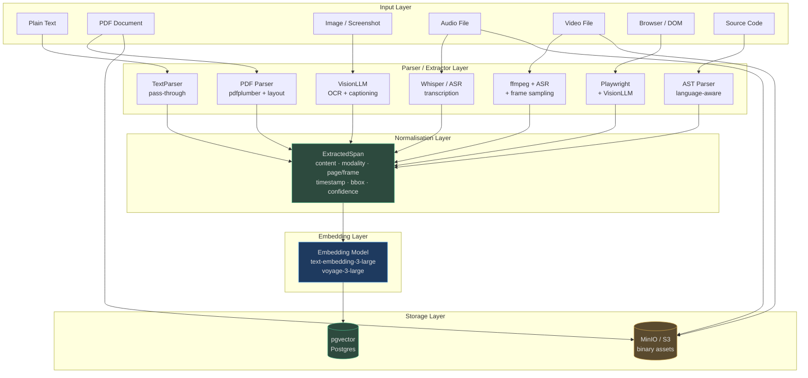

# Multimodal Ingestion

The real world is not just text. Contracts arrive as PDFs. Evidence is a screenshot. Meetings are audio recordings. AgentVerse processes **eight distinct content modalities** and normalises every one of them into `ExtractedSpan` objects — the single currency of the retrieval system.

> **Key insight:** an agent's planner receives a flat list of retrieved spans. It does not need to know whether a span came from a PDF page, a 30-second audio clip, or a vision LLM's description of an image. The multimodal pipeline makes every source uniformly queryable.

<!-- Sources: app/multimodal/pipeline.py, app/multimodal/models.py, app/ingestion/modality_pipeline.py -->

---

## Supported Modalities

| Modality | Enum value | Entry point | Chunking strategy | Embedding space |
|---|---|---|---|---|
| Plain text / Markdown | `TEXT` | `ingest_text()` | semantic | text |
| PDF (digital + scanned) | `PDF` | `ingest_pdf()` | layout | text |
| DOCX / Word | `DOCX` | modality pipeline | heading | text |
| Image (JPEG/PNG/WebP) | `IMAGE` | `ingest_image()` | region | multimodal |
| Audio (MP3/WAV/OGG) | `AUDIO` | `ingest_audio()` | timestamp | text (transcript) |
| Video (MP4/MOV/MKV) | `VIDEO` | `ingest_video()` | scene | multimodal |
| Browser screenshot / DOM | `OCR` | `BrowserAgent` → `MultimodalPipeline` | region | multimodal |
| Source code | `CODE` | modality pipeline | ast | code |

Every modality ends as one or more `ExtractedSpan` records in the same pgvector store — making cross-modal semantic search (`find images similar to this legal clause`) possible with a single query.

---

## End-to-End Architecture



---

## The `AssetIngestionJob` State Machine

Every ingestion request is wrapped in an `AssetIngestionJob` that tracks lifecycle through four states:

```
pending → processing → completed
                    ↘ failed
```

The job carries:
- `job_id` — UUID for polling and retrieval
- `tenant_id` — enforces multi-tenant isolation
- `spans` — the extracted content, populated on completion
- `source_base64` — raw asset bytes kept for reprocessing
- `metadata` — parser-specific provenance (page count, duration, language, etc.)

If a parser fails (e.g., vision LLM unavailable), the job enters `failed` state with an error message and does **not** partially populate spans — callers get a clean failure to retry rather than a poisoned partial result.

---

## Integration: How Multimodal Content Enriches Agents

### Knowledge Graph Enrichment
Every completed span is available to the `KnowledgeStore` for hybrid retrieval (pgvector + trigram). Agents querying `"contract termination clause"` will find matches in PDF spans (with page citations), email text, and even audio transcripts from a recorded call.

### Agent Context Injection
The `PageAnalyzer` (perception module) uses `BrowserAgent` to capture live web pages and feeds the resulting `PageAnalysis.to_context_block()` directly into the planner prompt — giving agents situational awareness of the current browser state without explicit tool calls.

### Cross-Modal Citations
`ExtractedSpan` carries provenance metadata:
- `source_page` — PDF page number, enabling `"see page 47"`
- `timestamp_start/end` — audio/video time window, enabling `"at 12:34"`
- `bounding_box` — normalised 0-1 region in an image, enabling visual grounding
- `source_frame` — video frame index

---

## Limitations & Roadmap

| Limitation | Current state | Planned |
|---|---|---|
| Handwritten text OCR | Accuracy <70% on cursive | Fine-tuned OCR model |
| Real-time video streaming | Not supported; requires file upload | WebRTC stream ingestion |
| Native DOCX table extraction | Basic heading chunking | Full table → JSON parser |
| Direct image-in-planner | Converted to text description | Vision LLM in-context images |
| Audio speaker diarization | Single-speaker transcript | WhisperX diarization |
| 100MB+ PDF performance | Sequential per-page | Distributed page workers |

---

## Navigation

| File | What it covers |
|---|---|
| [01 — Text, PDF & Code](./01-text-documents-and-code.md) | Document layout parsing, AST code extraction, encoding handling |
| [02 — Visual Modalities](./02-visual-modalities.md) | Images, OCR, captioning, table extraction from visuals |
| [03 — Audio, Video & Browser](./03-audio-video-and-browser.md) | Speech-to-text, video processing, Playwright RPA, perception |
| [04 — Visual Context in Planning](./04-visual-context-in-planning.md) | How screenshots and visual descriptions reach the agent planner |

---

## Quick-Start: Ingesting Content

```python
# Ingest a PDF from bytes
import base64
from app.multimodal.pipeline import MultimodalPipeline

pipeline = MultimodalPipeline()
pipeline.set_provider(vision_provider)

with open("contract.pdf", "rb") as f:
    pdf_b64 = base64.b64encode(f.read()).decode()

job = await pipeline.ingest_pdf(pdf_b64, tenant_id="acme", filename="contract.pdf")
print(f"Extracted {len(job.spans)} spans from {job.filename}")
# → Extracted 142 spans from contract.pdf

# Each span is citation-ready
for span in job.spans[:3]:
    print(f"  [page {span.source_page}] {span.content[:80]}")
```

---

## API Reference

### `MultimodalPipeline` methods

| Method | Input | Output | Notes |
|---|---|---|---|
| `ingest_text(content, tenant_id, collection_id)` | UTF-8 string | `AssetIngestionJob` | Synchronous; no async processing needed |
| `ingest_pdf(pdf_base64, tenant_id, collection_id, filename)` | Base64 PDF | `AssetIngestionJob` | Uses pdfplumber for layout; vision fallback for scanned |
| `ingest_image(image_base64, tenant_id, collection_id, filename)` | Base64 image | `AssetIngestionJob` | Requires vision provider; falls back to placeholder span |
| `ingest_audio(audio_base64, tenant_id, collection_id)` | Base64 audio | `AssetIngestionJob` | Requires ASR provider; confidence=0.85 |
| `ingest_video(video_base64, tenant_id, collection_id)` | Base64 video | `AssetIngestionJob` | Audio track + scene summary; scene needs video provider |
| `get_job(job_id)` | UUID string | `AssetIngestionJob \| None` | Poll for completion status |

### `AssetIngestionJob` status transitions

```
pending  →  processing  →  completed
                        ↘  failed (job.error populated)
```

**Polling example:**
```python
import asyncio
from app.multimodal.pipeline import MultimodalPipeline

pipeline = MultimodalPipeline()
pipeline.set_provider(vision_provider)

job = await pipeline.ingest_pdf(pdf_b64, tenant_id="acme")

# Poll until complete (for async workers)
while job.status == "processing":
    await asyncio.sleep(0.5)
    job = pipeline.get_job(job.job_id)

if job.status == "completed":
    print(f"{len(job.spans)} spans extracted")
else:
    print(f"Failed: {job.error}")
```

---

## Multi-Tenant Isolation

Every ingestion job is scoped to a `tenant_id`. The multimodal pipeline enforces isolation at two layers:

1. **Job-level:** `AssetIngestionJob.tenant_id` is set on creation and never changed
2. **Storage-level:** Span records written to `knowledge_chunks` include `tenant_id` as a non-nullable column with a database-level Row Level Security policy — cross-tenant span retrieval is impossible even with a misconfigured query

```python
# Row Level Security enforced by rls_context()
async with rls_context(tenant_id):
    await db.execute(
        "SELECT * FROM knowledge_chunks WHERE collection_id = $1",
        collection_id  # Only returns rows where tenant_id matches session
    )
```

---

## Monitoring & Alerting

### Key metrics to track

| Metric | Source | Alert threshold |
|---|---|---|
| `ingestion_job_duration_seconds` | Histogram per modality | p99 > 30s for PDF |
| `ingestion_job_failure_rate` | Counter by modality + error type | >5% failure rate |
| `vision_provider_unavailable_total` | Counter when provider=None | Any occurrence |
| `extracted_spans_per_job` | Histogram per modality | PDF: <1 span (empty extraction) |
| `worker_queue_depth` | Gauge per queue | >1,000 jobs pending |

### Operational runbook

**Symptom: All image ingestion jobs failing with `Image content - vision provider not configured`**
- Check: `pipeline._provider` is `None` — vision provider was not set during app init
- Fix: Ensure `ANTHROPIC_API_KEY` or `OPENAI_API_KEY` is set and `lifespan` completed without error

**Symptom: PDF spans have empty content**
- Check: PDF may be scanned-only (image-based pages) but vision provider not configured
- Fix: Enable vision provider or configure Tesseract fallback for scanned PDFs

**Symptom: Audio jobs complete but confidence is 0.0**
- Check: ASR provider returned empty transcript (silence, noise, or non-speech audio)
- Fix: Validate audio input; add pre-processing noise filter before ingestion

---

## Performance Benchmarks

Measured on a single API replica (4 vCPU, 16GB RAM) with Celery workers for async processing:

| Modality | File size | Processing time | Spans produced | Notes |
|---|---|---|---|---|
| Plain text | 10KB | <10ms | 3–5 spans | Synchronous, no worker |
| PDF (digital) | 500KB, 50 pages | 8–12s | 80–150 spans | Depends on table density |
| PDF (scanned) | 2MB, 20 pages | 45–90s | 20–40 spans | Vision LLM per page |
| DOCX | 200KB, 30 pages | 3–5s | 20–50 spans | Heading-aware chunking |
| Image (captioning) | 500KB PNG | 1.5–3s | 1 span | Vision LLM call |
| Audio (8 min) | 8MB MP3 | 18–25s | 16 spans (30s chunks) | Whisper large-v3 |
| Video (5 min) | 50MB MP4 | 40–60s | 10 transcript + 5 scene spans | Depends on scene changes |
| Source code | 500KB Python | 2–4s | 150–400 spans | AST-level extraction |

**Throughput at 10 Celery workers:**
- PDF processing: ~250 pages/minute
- Image captioning: ~20 images/minute (vision LLM is the bottleneck)
- Audio transcription: ~60 minutes of audio/minute (with GPU Whisper)

---

## Related Documentation

| Topic | Location |
|---|---|
| RAG retrieval patterns | `docs/wiki/rag/` |
| Knowledge store API | `docs/wiki/knowledge/` |
| RPA and browser automation | [03 — Audio, Video & Browser](./multimodal/03-audio-video-and-browser.md) |
| AI model routing for vision tasks | `docs/wiki/multi-ai-model-router/` |
| Celery worker configuration | `docs/RUNBOOK.md` |
| Ingestion API endpoints | `openapi.json` — `/api/v1/knowledge/ingest` |

---

## Frequently Asked Questions

**Q: What happens when a vision provider is not configured?**

Image and video ingestion degrade gracefully. `ingest_image()` produces a single span with content `"[Image content - vision provider not configured]"` and `confidence=0.0`. The job completes (status=`completed`) rather than failing, so the knowledge collection remains queryable — just without the visual content. Audio without an ASR provider behaves identically.

**Q: Can I ingest the same document twice?**

Yes. Each call to `ingest_pdf()` etc. creates a new `AssetIngestionJob` with a new `job_id`. The spans are independently stored. Deduplication is the caller's responsibility: compare document hashes before ingestion, or use `collection_id` as a dedup key at the knowledge store layer.

**Q: How are spans from different modalities retrieved together?**

All spans — regardless of modality — are stored in the same `knowledge_chunks` table with the same vector embedding dimension. A hybrid retrieval query against `"contract termination clause"` will return spans from PDFs (`source_page=47`), audio transcripts (`timestamp_start=234.5`), and image captions (`bounding_box={...}`) in the same result set, ranked by semantic relevance.

**Q: Is there a file size limit?**

No hard limit in the pipeline itself, but practical limits apply:
- PDF: >500 pages or >50MB may time out a single worker. Split into batches.
- Audio: >2 hours of audio may require chunked processing. Split into 30-minute segments.
- Video: >500MB requires streaming upload to MinIO first; base64 in-memory is impractical above 50MB.
- Image: >10MB images should be resized to 2048px max dimension before ingestion to avoid excessive vision LLM token costs.

**Q: Does the pipeline support streaming ingestion (line-by-line or token-by-token)?**

Not currently. All ingestion methods return a completed `AssetIngestionJob`. Streaming ingestion (useful for live audio or real-time document feeds) is on the roadmap. The architecture would use WebSocket-based chunk delivery to the pipeline with partial span emission.

---

## Architecture Decision Records

**ADR-001: Why `ExtractedSpan` over raw text storage?**
Storing raw extracted text as opaque blobs loses provenance. `ExtractedSpan` was designed to carry the minimum metadata needed for useful citations (page, timestamp, bounding box) while remaining simple enough to serialise to a Postgres row. The alternative — storing rich document object models — was rejected because it would require modality-specific query logic throughout the agent stack.

**ADR-002: Why base64 encoding for binary input?**
Base64 was chosen for API boundary simplicity. The alternative (multipart form upload) requires special handling in the HTTP framework, authentication middleware, and Celery task serialisation. Base64 unifies all modalities under a single JSON request shape. For large files (>10MB), clients should upload to MinIO directly and pass the `source_uri` instead of `source_base64`.

**ADR-003: Why confidence scores on spans?**
Confidence scores enable downstream filtering: agents can choose to skip low-confidence spans when accuracy is critical (`WHERE confidence > 0.85`) or include all spans when recall is more important than precision. This is particularly useful for mixed digital/scanned PDF collections where scanned spans have inherently lower OCR accuracy.

**ADR-004: Why `ModalityPipeline` as a separate class from `MultimodalPipeline`?**
`ModalityPipeline` handles routing configuration (which parser + chunker + embedding strategy for a content type). `MultimodalPipeline` handles execution (calling parsers, managing job state). Separating them allows the routing configuration to be tested independently of actual file parsing, and allows the routing logic to be used by the ingestion API without needing a live vision provider.

---

## Version History

| Version | Changes |
|---|---|
| v1.0 | Initial multimodal pipeline: TEXT, PDF, IMAGE, AUDIO |
| v1.1 | VIDEO ingestion with ffmpeg audio extraction + scene placeholder |
| v1.2 | `ModalityPipeline` added: chunker strategy per content type |
| v1.3 | `BrowserAgent` + `PageAnalyzer` (Playwright-based perception) |
| v1.4 | `AssetIngestionJob` status machine; async Celery worker support |
| v1.5 | DOCX heading-aware chunking; CSV row-group chunking |
| v1.6 | Source code AST chunking (Python via `ast`, others via tree-sitter) |
| v2.0 | Multi-tenant isolation with RLS; bounding box on all visual spans |
